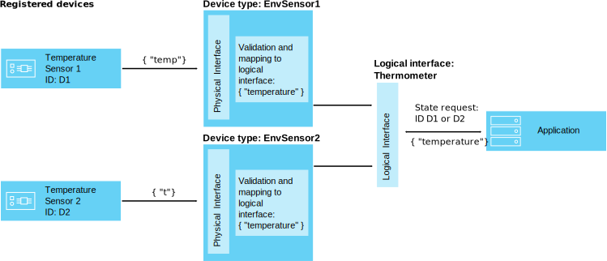
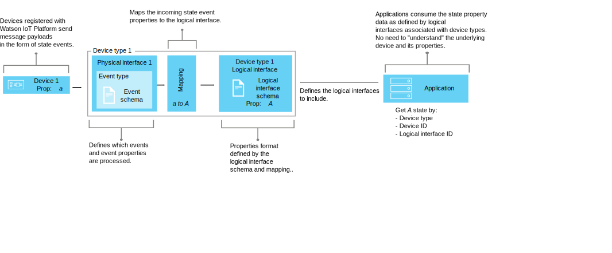

---

copyright:
  years: 2016, 2017
lastupdated: "2017-07-11"

---

{:new_window: target="\_blank"}
{:shortdesc: .shortdesc}
{:screen: .screen}
{:codeblock: .codeblock}
{:pre: .pre}


# Understanding data management
{: #definitions_resources}
You might have a number of different devices that you want to connect to {{site.data.keyword.iot_full}}, and these devices might publish data in different formats. By using the data management feature, you can normalize and transform the data output from your devices into a single logical view that can be easily consumed by your applications. By using a single logical view, you remove the need to code your applications to understand the different data formats that are output by each device. 
{: shortdesc}

## Overview

Use the data management feature to create shared abstractions of devices (device twins), to improve reuse and maintenance and to manage the complexities of an IoT ecosystem while keeping the application insulated from data change. 

Applications can access the current state of a device on request by using an HTTP API, or by subscribing to a topic string. The state consists of a set of state properties that are defined by a logical interface. If the state of a device changes as a result of an event being published to {{site.data.keyword.iot_short_notm}}, the values of these properties are updated and stored in {{site.data.keyword.iot_short_notm}}.

By using the data management feature, you can achieve the following benefits:
- Map state properties to event message data
- Define the data structure that you prefer
- Define more than one representation or view of the device state
- Subscribe to device states or query them at any time through an HTTP API

Some common use cases for implementing the data management feature include:
- Providing your application developers consistent interfaces to access event-driven device data in a REST-like manner
- Normalizing data from devices of different makes or models that publish data in different formats
- Modifying and converting data formats to fit your application model

## Example: Mapping heterogeneous temperature sensors to a logical interface
{: #device-type-example}
To start using the data management feature, you need to define a number of resources which are described in the following sections. 

The following example shows how these resources can fit together to enable applications to access homogeneous temperature state data in one format, regardless of the device event message payload format. TemperatureSensor1 publishes a Celsius temperature reading of `{ "t" : 34.5 }` to {{site.data.keyword.iot_short_notm}}. TemperatureSensor2 publishes a Fahrenheit temperature reading of `{ "temp" : 72.55 }`. Each temperature sensor is associated with its own [device type](../reference/device_model.html#id_and_device_types). The temperature readings are published as separate events.

Use the {{site.data.keyword.iot_short_notm}} data management feature to help you to configure this solution by normalizing and transforming your device data. 



As part of the data flow, you can perform calculations on incoming data to normalize these readings into a consistent form for processing. This means that you do not need to write your application to understand or convert different temperature scales. The application receives a single, normalized state and uses the **temperature** state property instead of the device specific **t** and **temp** properties.

 To configure this solution, you need to define the following information:

-	The structure of the inbound temperature event, "t" and "temp", from each device type.  
-	The property, "temperature", that you want to record. The "temperature" property defines the logical structure of the device state that  can be consumed by your applications.
-	How you want to map the properties "t" and "temp" of the inbound event to the property "temperature".

You can define the required information by configuring the following resources that exist within {{site.data.keyword.iot_short_notm}}:

-	Physical interface, event type, and event schema resource, which define the structure of the inbound events "t" and "temp".
-	Logical interface and logical schema resource, which define the logical structure of the device state "temperature" that you want to generate.
-	A mappings resource which defines how you want to map the properties "t" and "temp" to the property "temperature".

For a detailed end-to-end scenario that describes this example, see the [Step-by-step guide: A detailed example about how to work with devices through a common interface](ga_im_index_scenario.html).

More detailed information about these resources is provided in the "Defining your resources" section.


## Defining your resources
{: #definitions_resources}

The following diagram illustrates the logical mapping between devices and applications on {{site.data.keyword.iot_short_notm}} when using the data management feature.



### Concepts
{: #concepts}
The following table describes the concept of events, properties and state, which are referred to in the previous diagram.

Concepts                        | Description       
------------- | ------------- | -------------  
Event | Events are the mechanism by which devices publish data to {{site.data.keyword.iot_short_notm}}. The device controls the content of the event and assigns a name for each event that it sends.
Property | Data carrying part of a device event payload.
State | The latest representation of the state of the physical device, which can include all properties that have been mapped across from multiple inbound events.

### Data management resources
{: #resources}

You can manage resources by using REST APIs. For information about the REST APIs, see the [{{site.data.keyword.iot_short_notm}} HTTP REST API](https://docs.internetofthings.ibmcloud.com/apis/swagger/v0002/state-mgmt.html) documentation.

Type Resources                        | Description       
------------- | ------------- | -------------  
Event type                         | Use the event type resource to model an event that is published by a device. An event type must reference an event schema resource. The schema resource defines the structure of the event that is published. </br>**Important:** Inbound events that are used in a logical interface must be in JSON format.   
Device type                         |  Use the device type resource to group devices that share characteristics or behaviors. In data management, the device type is extended to include one physical interface for a device and one or more logical interfaces that are used to retrieve the device state. </br>For more information, see the "Identifiers and device types" section in the [Device Model](../reference/device_model.html#id_and_device_types) topic.
Schema resources                         |  Use schema resources to define the structure of either an event or device state. The following [JSON Schemas ](http://json-schema.org/){:new_window} are used: <ul><li>A schema that is associated with an event type. This schema is used to define the structure of the event that is published to {{site.data.keyword.iot_short_notm}} by a device. These schemas are referred to as event schemas. <li>A schema that is associated with a logical interface. This schema is used to define the structure of the device state that is stored on {{site.data.keyword.iot_short_notm}}. These schemas are referred to as logical interface schemas</ul>.  

Interface resources                        | Description       
------------- | ------------- | -------------  
Logical interface | A programmatic construct that your applications can connect to or subscribe to to see the state of a device. A logical interface is used to define the normalized view onto the device state in {{site.data.keyword.iot_short_notm}}. A logical interface must be associated with a logical interface schema. The state is updated in response to inbound device events. 
Physical interface                         | A physical interface is used to model the interface between a physical device and {{site.data.keyword.iot_short_notm}}. Event types can be associated with physical interface.  

Instance resources                        | Description       
------------- | ------------- | -------------  
Device                         | A device represents an asset, system, or component that is registered with {{site.data.keyword.iot_short_notm}} and sends IoT data in the form of events.  

Supporting resources                        | Description       
------------- | ------------- | -------------  
Mappings                         | Use mappings to define how properties that are associated with inbound events are mapped to properties that are defined on a logical interface. </br>**Important:** At least one logical interface must be associated with a device type before any mappings can be defined.

## Supported mapping expression language
{: #mapping_expression}

The expression language that can be used when defining mappings is a subset of [JSONata ](http://docs.jsonata.org/index.html){:new_window}.

The following subset of JSONata operators are supported: 

Type of operator                   | Supported operators     | Notes   
------------- | ------------- | -------------
Arithmetic | *+* - / * % | The % operator returns the remainder
Comparison | < <= > >= != = | The equality operator is = , as it is in JSONata
Boolean | *in*, *and*, *not* | The boolean constants are *true* or *false*
Conditional ternary | ? | The ? operator evaluates one of two alternative expressions based on the result of a test condition. The operator takes the following form *expression*  ? *value_if_true* : *value_if_false*
String | & | The & operator joins the string values of the operands into a single resultant string
Other | . | The dot operator is used for object access with a literal key, for example $event.object.hh. *Note:* The expression on the left hand side is constrained to a specific item, either in the event ($event) or the state ($state).   
 

The following subset of JSONata functions are supported: 

Type of function                   |Function                   | Description
------------- | ------------- | ------------- 
String | $substr(string, start_index, end_index) | String substring
String | $string(arg) | Casts the argument to a string value
Numeric | $number(arg) | Casts the argument to a numeric value, if possible
Boolean | $exists(expression) | Returns true if the property in the expression exists, false otherwise

Notes: 
- Use Parenthesis ( ) for expression grouping and to alter operator precedence
- Use single quotes to surround property names that contain spaces, for example $event.object.'a b' 

## Naming restrictions for resources
{: #naming_restrictions}
Schemas, event types, and logical and physical interfaces have the following naming restrictions:
- The name must be between 1 - 128 characters 
- The name must consist of unicode characters 
- Valid special characters are space, hyphen ( - ), underscore ( _ ), period ( . )
- The name cannot consist only of spaces

## Creating, updating, activating, and deactivating your resources
{: #draft_active_resources}

There can be two versions of a resource; a draft version and an active version. When you create a resource, that resource is created as a draft version. 
{: shortdesc}

The draft version is a working copy of your resource that you can query, update and delete directly by using APIs. Create an active version of a draft resource by activating either a draft device type or a draft logical interface. You can activate only a draft device type or a draft logical interface resource. To activate other resources, for example schemas, you must activate a draft device type or draft logical interface that references the resource that you want to activate.

To differentiate between draft and active resources when using REST APIs, the prefix *draft/* is used to identify resources that are in a draft state.

The following example retrieves metadata for a draft schema definition by using a specified id:

```
GET /api/v0002/draft/schemas/{schemaId}
```
The following example retrieves metadata for an active schema definition by using a specified id:
```
GET /api/v0002/schemas/{schemaId}
```
*Note:* The identifier is the same for the draft and active version of a given resource.


- Activating a resource
{: #activate_resources}  

Use the **activate-configuration** operation to validate and activate the configuration that is associated with a device type. This configuration includes your draft schemas, event types, physical interfaces, logical interfaces, and mappings. The **activate-configuration** operation must be performed on the draft version of a logical interface or device type.

The following example shows a PATCH request where an **activate-configuration** operation is performed on a draft version of a device type:
```
PATCH /api/v0002/draft/device/types/TemperatureSensor
```
where the payload of the PATCH body contains the following content:
```
  {
    "operation": "activate-configuration"
  }
```
- List differences
{: #list_differences}  

Use the **list-differences** operation to return a list of any differences between the active and draft configuration for a logical interface or device type resource. The **list-differences** operation must be performed on the draft version of a logical interface or device type. The following example shows a PATCH request where a **list-differences** operation is performed on a draft version of a device type:
```
PATCH /api/v0002/draft/device/types/TemperatureSensor
```
where the payload of the PATCH body contains the following content:
```
  {
    "operation": "list-differences"
  }
```


- Deactivating a resource  
{: #deactivate_resources}  

Use the **deactivate-configuration** operation to remove the active configuration that is associated with a resource. The deactivate-configuration operation can be performed only on the active version of a logical interface and device type. The following example shows a PATCH request where a **deactivate-configuration** operation is performed on an active version of a device type:
```
PATCH /api/v0002/device/types/TemperatureSensor
```
where the payload of the PATCH body contains the following content:
```
  {
    "operation": "deactivate-configuration"
  }
```
*Notes:*
- An active resource is read only. You can filter and sort draft and active resources by using query parameters.
- You cannot delete a device type if there are device instances associated with that device type. The state of the device is cleared when the device instance is deleted. 
- You can activate only logical interfaces and device types directly by using APIs. Other resources, for example schemas, physical interfaces, and event types are activated if they are referenced by a logical interface or device type that is made active.  
- The **activate-configuration** operation must be performed on a draft version of a logical interface that is associated with a device type, or on the device type itself. The **activate-configuration** operation checks that the resource configuration is valid before activating the resource. Once activation is successfully completed, state is generated for each device instance of the device type.

## Troubleshooting your configuration
{: #troubleshooting}
If your activation fails, check that all the required configuration for a given device type is provided. The following configuration must be provided and associated with a device type:
  - A physical interface that is associated with at least one event
  - At least one logical interface
  - Mappings for at least one of the associated logical interfaces

You can also perform a **validate-configuration** operation on a draft version of the device type or logical interface resource to ensure that the associated metadata is valid. If the metadata is invalid, a list of issues is returned in the body of the response.  

The following example shows a PATCH request where a **validate-configuration** operation is performed on a draft version of a device type that is called "TemperatureSensor":  
```
PATCH /api/v0002/draft/device/types/TemperatureSensor
```
where the payload of the PATCH body contains the following content:
```
  {
    "operation": "validate-configuration"
  }
```  
The following example shows an unsuccessful response to the PATCH request:  
```
{
"message": "CUDIM0303I: State update configuration for Device Type 'TemperatureSensor' is not valid.",
"details": {
  "id": "CUDIM0303I",
  "properties": [
    "Device Type",
    "TemperatureSensor"
  ]
},
"failures": [
  {
    "message": "CUDVS0301E: The device type 'TemperatureSensor' does not have any mappings defined for it",
    "details": {
      "id": "CUDVS0301E",
      "properties": [
        "TemperatureSensor"
      ]
    }
  }
]
}
```  
The following example shows a successful response to the PATCH request:  
```  
{
"message": "CUDIM0303I: State update configuration for Device Type 'TemperatureSensor' is valid.",
"details": {
  "id": "CUDIM0303I",
  "properties": [
    "Device Type",
    "TemperatureSensor"
  ]
},
"failures": []
}
```  
If all the required resources are associated with a device type, check that the property mappings are valid. The following examples show possible errors that might occur:

  - An expression references a property on an event that is not defined by the event schema
  - An expression references a property on the state that is not defined by the logical interface schema
  - A mapping is defined for a property that is not defined by the logical interface schema


You can refer to the following error log to help you to diagnose run time errors:
```
iot-2/type/${typeId}/id/${devieId}/err/data
```
