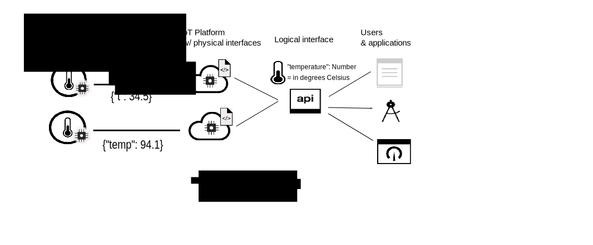

---

copyright:
years: 2017, 2018
lastupdated: "2018-08-28"

---

{:new_window: target="\_blank"}
{:shortdesc: .shortdesc}
{:screen: .screen}
{:codeblock: .codeblock}
{:pre: .pre}

# Introduction to data management
{: #device_twins}

<!--An unprecedented number of devices and sensors exist in the modern world. Connected devices generate vast amounts of digital data at extraordinary speeds. Such volumes of data represent great opportunities but also challenges, in terms of how big data can be processed, analyzed and presented to help to deliver insights and drive transformation.-->

Devices might provide similar data output, but vary in make, model and version and can output data in different formats. For example, a device with a temperature sensor in an office might report temperature in degrees Fahrenheit or in degrees Celsius. It is not efficient to configure applications to be able to consume data in all these formats; instead the data needs to be collected, transformed and normalized to create a single logical model so that an application can interact with the different devices in the same way. 

The data management component of {{site.data.keyword.iot_short_notm}} includes a device twin feature and an asset twin feature. The device twin feature enables you to take advantage of the collection, transformation and normalization of different formats of device data into a single logical model. The asset twin feature enables you to group different devices together to create a Thing, which is a higher value asset-based data structure. You can even group Things together to create new Things. An application can interact with the logical model, regardless of the data format that is used by the individual devices or Things. 

For example, a group of temperature, humidity and ambient light reporting devices can be aggregated into a "Room" Thing to represent the comfort level within a specific office. A number of "Room" Things can be aggregated into a "Floor" Thing to represent all offices on a specific level, and a number of "Floor" Things can be aggregated into a "Building" Thing. By using a Thing abstraction, your application is decoupled from the specifics of how the devices are connected, the format in which the devices publish event data, and how the data is combined.
{: shortdesc}

## Device twins

A device twin is a cloud-based digital representation of a physical device that is connected to {{site.data.keyword.iot_short_notm}}. A device twin represents a logical model of the events that are published by a device. Once defined and instantiated, the device twin provides a consistent means of interacting with a device in a REST-like manner, regardless of whether the device is online or offline. The properties of a device, including information about the current state of the device (device state), can be retrieved with an HTTP request, or by subscribing to an IoT topic.

Device twins can help you:
- Provide your application developers with consistent interfaces to access event-driven device data in a REST-like manner.
- Access the state of a device.
- Normalize data from devices of different makes or models that publish data in different formats.
- Filter out unneeded data.

To create a device twin, you need to define the following resources in {{site.data.keyword.iot_short_notm}}:
- The structure of the events that are sent by your device.  
The structure of an inbound event is defined in the physical interface, event type, and event schema resources. 
- The properties that you want to record.  
These properties define the logical structure of the device state that can be consumed by your applications. The properties are defined in the logical interface and logical schema resources.  
- The mapping of physical interface events onto the logical interface properties.  
Use the mappings resource to map events to properties.

The following diagram shows two different temperature devices at separate locations. One device reports device data in degrees Celsius and the other reports data in degrees Fahrenheit. The data is sent to {{site.data.keyword.iot_short_notm}} in the "t" and "temp" temperature formats. {{site.data.keyword.iot_short_notm}} automatically transforms the degrees Fahrenheit into degrees Celsius. The "t" and "temp" temperature formats are normalized into the "temperature" logical format. The application can query the state of either device by accessing the value for the "temperature" parameter. 

## Asset twins (Things)

Asset twins let you take the concept of device twins one step further. An asset twin enables the aggregation of devices into a single entity called a Thing.  A Thing, or asset twin, is a similar concept to device twin, but the asset twin represents a group of devices as a single logical model. You can even aggregate Things to form higher levels of abstraction. For example, a "Room" Thing might aggregate the following devices:

- A device with a temperature sensor (thermometer)
- A device with a humidity sensor (hygrometer)

An "Floor" Thing might then aggregate multiple "Room" Things. 

The structure of a Thing is defined by using a JSON-Schema. The schema references the logical interfaces of the aggregated devices or Things. The properties of a Thing, including information about the current state of the Thing, can be retrieved by using an HTTP request, or by subscribing to an IoT topic.

Asset twins can help you:
 
- Aggregate multiple device twins or Things to define new Things.
- Access the state of a Thing.
- Manage assets without being exposed to the individual instrumentation of them.
- Filter out unneeded data.
- Normalize Thing interfaces to decouple your applications from the complexities of how specific Things are constructed.

To create an asset twin, you need to define the following resources in {{site.data.keyword.iot_short_notm}}:

- The structure of the Thing.  
The structure of the Thing is defined by the Thing schema which specifies the aggregated devices or Things.
- The structure of the desired Thing state which is made up of the properties that you want to record.  
These properties define the logical structure of the Thing state that can be consumed by your applications. The properties are defined in the logical interface and logical schema resources.  
- How the Thing interface maps onto the logical interface properties.  
Use the mappings resource to map events to properties.

The following diagram shows temperature and humidity sensors on different devices that are publishing temperature and humidity event data to {{site.data.keyword.iot_short_notm}}. Two device twins, each representing a physical device, have associated logical interfaces and are created in {{site.data.keyword.iot_short_notm}}. The data that is published from the temperature device is mapped to the "IThermometer" logical interface. The data that is published from the humidity device is mapped to the "IHygrometer" logical interface. The logical interfaces are aggregated into a *Room* Thing type with an "IRoom" logical interface. The "IRoom" logical interface defines temperature and humidity properties and enables you to create your own logical model by aggregating devices into a single Thing with which your application can interact.  

**Important:** The {{site.data.keyword.iot_short_notm}} Thing feature is available only as part of a limited beta program. Future updates might include changes that are incompatible with the current version of this feature. Try it out and [let us know what you think ](https://developer.ibm.com/answers/smart-spaces/17/internet-of-things.html){: new_window}.

For more information about defining and configuring key information and resources, see [Understanding data management](ga_im_definitions.html). 

## Next steps

- Create your own device twin in {{site.data.keyword.iot_short_notm}}. For more information, see the [Getting started with Data Management by using the Web interface](im_ui_flow.html) documentation. 
- Create a device twin and asset twin by using REST APIs. For more information, see the [Getting started with data management](../information_management/getting_started_things.html) documentation.  
- Create rules that are triggered when event data that matches a specified condition, or set of conditions, is received by {{site.data.keyword.iot_short_notm}}. For more information, see the [Embedded rules](../information_management/im_rules.html) beta documentation.

For more detailed information about each of the steps outlined in the *Getting started with data management* documentation, see the example scenarios that are documented in the following topics: 

- [Step-by-step guide 1: A detailed example about how to work with devices through a common interface](ga_im_index_scenario.html#scenario) 
- [Step-by-step guide 2: A detailed example about how to work with Things through a common interface](../information_management/im_index_scenario_thing.html#scenario) 

