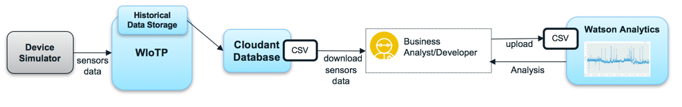
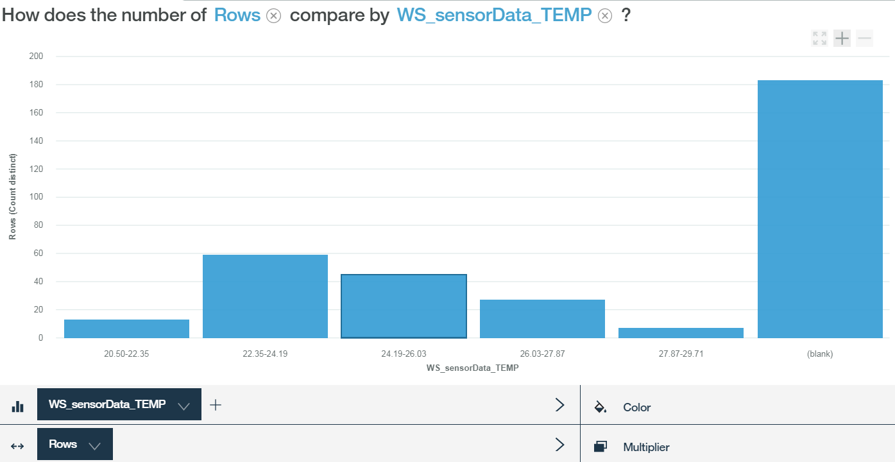

---

copyright:
  years: 2017
lastupdated: "2017-09-06"
---

---

{:new_window: target="blank"}
{:shortdesc: .shortdesc}
{:screen: .screen}
{:codeblock: .codeblock}
{:pre: .pre}


# Analyzing data by using Watson Analytics
{: #WA_integration}  

You can use {{site.data.keyword.iot_full}} with Watson Analytics (WA) to visualize and learn about the data that is sent from devices that are connected to the platform.
{: shortdesc}

## Overview and goals

This guide walks you, step-by-step, through the process of visualizing {{site.data.keyword.iot_short_notm}} device event data by using Watson Analytics (WA) as an analysis tool.

The device data that is sent to {{site.data.keyword.iot_short_notm}} can be collected and stored in {{site.data.keyword.Bluemix}} using the {{site.data.keyword.cloudantfull}} NoSQL DB service. To collect the data, you must first connect {{site.data.keyword.iot_short_notm}} to the {{site.data.keyword.cloudant_short_notm}} service. After data is collected, export the data to a CSV file. You upload this file to WA where you can visualize and analyze the device data. Device data is stored in {{site.data.keyword.cloudant_short_notm}} daily, weekly, or monthly databases depending on the bucket interval that is configured.



As part of this guide you will learn:

 - How to configure the platform data storage so that the Cloudant NoSQL DB is used as the historian service.
 - How to use the Weather Sensors simulator to generate data to be used by the platform.
 - How to export the data and then import it to WA to analyze data.


## Prerequisites

To complete these steps you must have access to [{{site.data.keyword.iot_short_notm}} ](https://console.bluemix.net/catalog/services/internet-of-things-platform){: new_window} with [Cloudant NoSQL DB ](https://console.bluemix.net/catalog/services/cloudant-nosql-db
){: new_window}, and access to [Watson Analytics ](https://www.ibm.com/watson-analytics){: new_window}.


## Step 1. Set up the simulator
{: #WA_sensor_data}

In order to conduct a meaningful analysis, you must have meaningful data. You can simulate real sensor data to learn about how the Watson IoT Platform device data can be analyzed using Watson Analytics. This step provides instructions for setting up the simulator. This step also provides instructions for [downloading a pre-made CSV sample file with data](#WA_sensor_premade), if you do not want to use the simulator.


### Setting up the Weather Sensors simulator

To simulate real sensor data events against your organizations by using the Weather Sensors simulator, you must first set up the simulator:

1. [Generate the apikey and token that are required to run the simulator. ](https://console.bluemix.net/docs/services/IoT/platform_authorization.html#api-key){: new_window}
2. Click this button to deploy the Weather Sensors simulator web app and follow the detailed steps:
   [](https://bluemix.net/deploy?repository=https://github.com/ibm-watson-iot/guide-weathersensors-simulator)

   For more information about the Weather Sensors, see [the Weather Sensors simulator guide ](https://github.com/ibm-watson-iot/guide-weathersensors-simulator){: new_window}.
3. Proceed to [Step 2. Configure database connector](#WA_config_db).


### Using sensor data from a pre-made sample CSV file
{: #WA_sensor_premade}

To simulate real sensor data events against your organizations by using a pre-made CSV file:

1. [Download the Cloudant CSV file ](https://github.com/ibm-watson-iot/guide-weathersensors-simulator/releases/download/v1.0/cloudant.csv){: new_window}.
2. Proceed to [Step 5. Set up WA and visualize data](#WA_import_data).


## Step 2. Configure database connector
{: #WA_config_db}

To use {{site.data.keyword.cloudant_short_notm}} with Watson Analytics, you must configure the platform data storage so that the Cloudant NoSQL DB is used as the historian service.

1. On the {{site.data.keyword.cloudant_short_notm}} dashboard, click **Extensions** in the navigation bar.
2. Under **Historical Data Storage**, click **Setup**. The **Configure Historical Data Storage** section lists all of the Cloudant NoSQL DB services that are available within the same Bluemix space as the {{site.data.keyword.cloudant_short_notm}}.
3. Select the Cloudant NoSQL DB service that you want to connect.
4. Specify the following Cloudant NoSQL DB configuration options:
  - Bucket interval = Day
  - Time zone = UTC
  - Database name = default
5. Click **Done** and confirm authorization for the connection to Cloudant Service. Ensure that popups are enabled in your browser in order have access to the confirmation window. When you have successfully configured the Cloudant NoSQL DB, the Historical Data Storage status is changed to configured and the device data is stored in {{site.data.keyword.cloudant_short_notm}} NoSQL DB.
6. Proceed to [Step 3. Run the simulator](#run_simulator).


## Step 3. Run the simulator
{: #run_simulator}

The simulator publishes real weather sensors data, from 17 weather stations located in the Haifa area, into your {{site.data.keyword.iot_short_notm}} organization.

1. Navigate to the simulator.
2. Enter the the following details:
   - Watson IoT Platform organization
   - API key
   - authentication token

3. Click **Run Simulator**. The data will take a few minutes to generate.
4. Go to the Watson IoT platform while the simulator is running and verify that devices were created and that events are coming to these devices. 
5. Proceed to [Step 4. Export Cloudant database](#WA_export_csv).


## Step 4. Export Cloudant database
{: #WA_export_csv}

When you configure a {{site.data.keyword.cloudant_short_notm}} NoSQL DB to store device data, three databases are automatically created by the connector. One database is created for the current bucket interval, one for the upcoming interval, and one for the configuration database. When the end of the interval is reached, the device data is stored in the bucket database for the new interval, and a new database is created for the subsequent bucket.

The Historical Data Storage extension feature in {{site.data.keyword.cloudant_short_notm}} creates a design document in Cloudant called “iotp”. This document has a “list” function called “csv” that can be used to export device events, stored as documents in Cloudant, to CSV format. Only events in JSON format are sent to the CSV file. This design document is propagated automatically to every new database for the upcoming bucket intervals.

The CSV file contains information about the device event metadata and its payload. The following list shows examples of event metadata:
 -	DeviceId
 -	DeviceType
 - 	EventType
 - 	Timestamp in ISO 8601 format

The csv list function divides the original timestamp into two new separate Time and Date fields. In addition to metadata, the CSV list function includes the data attributes of the device payload. This payload is displayed in the Cloudant document under the “data” key. Documents that are generated by the Weather Sensors simulator have a structure similar to the following example:

```
{"deviceType": "WS",
  "deviceId": "Old-Market",
  "eventType": "sensorData",
  "format": "json",
  "timestamp": "2017-08-09T16:28:14.666Z",
  "data": { "NO2": 3.2, … }}
```

In the resulting CSV file, all payload attributes are represented as columns, and they are prepended with:

```
<deviceType>_<eventType>_  
```

In the example above, a column named WS_sensorData_NO2 is added to the CSV file.

To export the Cloudant database to CSV format:  

1. Log in to Cloudant NoSQL DB.
2. Select a database to be exported.
3. Open the selected database.
4. Open a new tab in the browser and type the following URL:
   ```
   https://{cloudant service id}-bluemix.cloudant.com/{dbName}/_design/iotp/_list/csv/by-date?include_docs=true
```
   The Cloudant service ID and dbName must be changed according to your Cloudant service ID and the selected database name. The cloudant service ID can be copied from the Cloudant management dashboard URL.

   **Example:**
   ```
   https://ccf73725-b617-4f3e-8a7e-f5fb09569af4-bluemix.cloudant.com/iotp_115ccv_default_2017-08-23/_design/iotp/_list/csv/by-date?include_docs=true
   ```

   In this example, the data will be sorted by timestamp as the by-date view is used to invoke the list function. You also can filter data using Cloudant views native filter feature by changing the view that is used in the URL and applying the startkey and endkey attributes.

   **Example:**
   ```
   https://{cloudant service id}-bluemix.cloudant.com/{dbName}/_design/iotp/_list/csv/by-deviceType?include_docs=true&startkey='WS'&endkey='WS'
   ```
   In this example, the deviceType view is used to generate the csv and only documents with deviceType=WS are included in the downloaded file. To select documents within a specific time frame, use the by-date view and use the following query url (replacing the timestamps for the desired range):
   ```
   https://{cloudant service id}-bluemix.cloudant.com/{dbName}/_design/iotp/_list/csv/by-date?statkey="2017-08-29T12:25:50.995Z"&endkey="2017-08-29T12:25:51.514Z"
   ```
5. Provide Cloudant credentials if necessary  and download the CSV file. The file name is generated according to the view that is defined in the URL. For example, the file name could be by-date.csv or by-deviceType.csv.
6. Proceed to [Step 5. Set up WA and visualize data](#WA_import_data).


## Step 5. Set up WA and visualize data
{: #WA_import_data}

To set up WA and start visualizing data:

1. Log in to WA at: https://watson.analytics.ibmcloud.com.
2. On the WA home page, select **Data**.
3. Click **Local File** import your local CSV file. The CSV file name depends on the view that you used to export the data (for example, by-deviceType or by-date.)
4. Select the CSV data asset that you uploaded.
5. In the **Ask a question about your data** field, ask a question using natural language.
5. Open the visualization suggestion that best matches your question. You can manually revise the suggestion.
7. Save the visualization.


## Examples of visualizing data by using WA
{: #WA_visualize}

This section shows examples of analyzing data by using WA as an analysis tool.

**Note:** These examples are meant to give you an idea of what to expect when you perform your own visualizations. The results in the examples that are shown here might differ from the results that you see when you perform these visualizations with the sample data, due, for example, to the data being gathered at different dates and times.

### Visualizing device health

In this section we learn about the population of IoT devices and answer questions such as:

1. How many devices have reported?
2. What is the breakdown of the devices per device type?
3. How many reports did a device have?
4. How many reports have been sent by each device?

**How many devices have reported?**

In this example, we count the number of devices that reported during the specified interval to detect whether the devices have reported as expected. To complete this analysis, copy and paste or type the following question in WA:

*"How many deviceId are there?"*

Here is the result showing that there are 17 devices:


**What is the breakdown of the devices per device type?**

In this example we compare the number of devices per device type that reported during the interval to determine if devices from all device types have reported as expected. To complete this analysis, copy and paste or type the following question in WA:

*"How does the number of deviceId compare by deviceType?"*

Here is the result showing the breakdown of devices per device type:


To view this data in a pie chart, click **Visualization** on the left, and select **Pie**.


**How many reports did a device have?**

In this example, we count the number of reports that were made by a device to detect the network conditions and other device-related issues. To complete this analysis, copy and paste or type the following question in WA:

*"How many rows are there? filtered by deviceId: Ahuza"*

**Note:** You do not need to type the full field names. WA tries to guess the full field name, but the filter values (eg. "Ahuza") do have to be spelled fully and correctly. If you do not see a correct suggestion with the filter, click the **Show Next** link or try the question *"How many rows are there?"*. Then, open the diagram, click the **Multiplier** box below the diagram and select the deviceId parameter from the list. Uncheck all of the irrelevant deviceIds.

This is the result showing that there are 25 rows or reports that were made by the device Ahuza:


**How many reports did each of the different devices have?**

In this example we compare the activity level of devices based on the number of reports that each device has sent during the inspected interval. To complete this analysis, copy and paste or type the following question in WA:

*"How does the number of Rows compare by deviceId?"*

This is the result showing a bar graph with the device activity for the different devices:


### Visualizing device type sensor data

In this section we learn about summary sensor data that is reported by all devices of a device type, answering questions such as:

1. What is the Average/Min/Max of all reported sensor values?
2. Can I see a histogram of a sensor's output?  
3. What is the correlation between two sensors?


**What is the Average/Min/Max of all reported sensor values?**

In this example, we summarize the numerical parameters that are reported by all devices in a device type into a table. From this table, we can learn about the range of values that are sensed in the environment and gain a broad perspective of the sensed data.

This visualization must be built manually, using the following steps:

1.	In the **Create your own visualization** section, select **Table**.
2.	Click the "create new column" plus sign button, and select **Calculation**.
3.	Name the new column, select the column for this calculation from the **Columns** drop-down list, and click **Done** to duplicate the column. The new column is added at the right end of the data tray.
4.	Right-click on the new column’s title, select an aggregation type (min, max, or average), and then close the properties window.
6.	Repeat the process to add more columns and then hide the data tray.
7.	Click **Columns** and select **Measures** at the bottom of the list.
8.	Click **Aggregated by** and select all the calculations that you added.
9.	Click **Done**.
10.	Save the visualization.

Here is the result showing the range of values:


**Can I view a histogram of a device sensor's output?**

In  this example we evaluate the behavior of a sensor across all devices in a device type, identifying the distribution of values that are sensed in the environment. We can use this visualization to learn about the environment that is sensed by the sensors as well as about limitations in the sensors. To complete this analysis, copy and paste or type the following question in WA:

*"How does the number of Rows compare by TEMP?"*

This is the result showing the comparison of the number of rows:




**What is the correlation between two sensors?**

In this example we learn about correlations in the environment by comparing the measurements from two device sensors across all devices of the device type. To complete this analysis, copy and paste or type one of the following questions in WA:

*"What is the relationship between NO2 and NOX?"* or *"How are the values of NO2 and NOX associated?"*

Here is the result showing the relationsship between the two sensors:


You can also view the sensor data by using colored dots per device ID. To do this, select the deviceID in the **Color** box.

This is the result showing a limited subset of the devices:


### Visualizing sensor details (deep dive)

In this section we study specific parameters that are reported by a specific device, answering the following questions:

1.	What is the Average/Min/Max reported value?
2.	Can I see a histogram of a device sensor's output?
3.	How does a specific device sensor value change over time?
4.	How do the sensor values of two devices compare over time?
5.	How do the sensor values of the same device compare over time?
6.	What is the correlation between two sensors of a device?


**What is the Average/Min/Max reported value?**

In this example, we summarize the numerical parameters that are reported by a specific device into a table to learn, for example, about the range of values sensed in the environment or about the sensor's malfunctions.

This visualization must be built manually by using the following steps:

1)	In the **Create your own visualization** section, select **Table**.
2)	Click the "create new column" plus sign button, and select **Calculation**.
3)	Name the new column, select the column for this calculation from the **Columns** drop-down list, and click **Done** to duplicate the column. The new column is added at the right end of the data tray.
4)	Right-click on the new column’s title, select an aggregation type (min, max, or average) and then close the **Properties** window.
6)	Repeat the process to add more columns and then hide the data tray.
7)	Click **Columns** and select **Measures**.
8)	Click **Aggregated by** and select all of the calculations that you added.
9)	Click **Done**.
10)	In the multiplier box, select the deviceId parameter and select the relevant devices to display.
11)	Save the visualization.

This is the result showing the specified values:


**Can I see a histogram of a device sensor's output?**

In this example, we evaluate the behavior of a specific device sensor, identifying the distribution of values sensed in the environment. We can use this visualization to learn about the environment that is sensed by the sensor as well as about potential malfunctions in the sensor. To complete this analysis, copy and paste or type one of the following questions in WA:

*"What is the distribution of TEMP? filtered by deviceId: Ahuza"* or *"How does the number of Rows compare by TEMP? filtered by deviceId: Ahuza"*

This is the result showing the device sensor output data in a histogram:


**How does a specific device sensor value change over time?**

In this example, we learn how the readings of a specific sensor of a specific device change, reflecting the changes in the environment over time. This can help with planning and problem detection. To complete this analysis, copy and paste or type the following question in WA:

*"What is the trend of TEMP over time? filtered by deviceId: Ahuza".*

This is the result showing the sensor data trend over time:


**How do the sensor values of two devices compare over time?**

In this example, we compare the trends of sensor readings of different devices, identifying relationships between the devices to detect anomalies, device malfunctions, and so on. To complete this analysis, copy and paste or type one of the following questions in WA:

*"What is the trend of TEMP over time by deviceId?"* or *"What is the trend of TEMP over time by deviceId?  filtered by deviceId: Ahuza, Igud"*

This is the result showing the sensor value comparison over time:


You also can view this information by clicking on the parameter name at the bottom of the chart. Multiple lines are drawn (one per deviceId). The relevant deviceIds can be selected from the list.


You can use the **Multiplier** box below the chart and choose deviceId to present the charts side by side.


**How do the sensor values of the same device compare over time?**

In this example we mutually visualize the trend of two device sensors to gain more insight into the environment changes over time. To complete this analysis, copy and paste or type the following question in WA:

*"What is the trend of NO2 and NOX over time by deviceId?  filtered by deviceId: Ahuza"*

This is the result showing the trend of two device sensors over time:


**What is the correlation between two sensors of a device?**

In this example, we learn about correlations in the environment by comparing the measurements from two device sensors. To complete this analysis, copy and paste or type one of the following questions in WA:

*"What is the relationship between NO2 and NOX? filtered by deviceId: Ahuza"* or *"How are the values of NO2 and NOX associated? filtered by deviceId: Ahuza"*

This is the result showing the correlation between two sensors of a device:


## What's next?

For more information about WA, see the following resources:
- [Watson Analytics Developer Center ](https://developer.ibm.com/watson-analytics/){: new_window}
- [Watson Analytics community ](https://www.ibm.com/communities/analytics/watson-analytics/){: new_window}
- [Watson Analytics forum ](https://community.watsonanalytics.com/discussions/spaces/15/view.html){: new_window}
