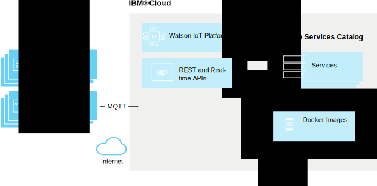

---

copyright:
  years: 2018
lastupdated: "2018-03-04"

---

{:new_window: target="\_blank"}
{:shortdesc: .shortdesc}
{:screen: .screen}
{:codeblock: .codeblock}
{:pre: .pre}

# {{site.data.keyword.iot_short_notm}} Edge overview (Preview)
{: #edge_overview}

**Important:** The {{site.data.keyword.iot_full}} Edge feature is available only as part of a limited preview program. Future updates might include changes that are incompatible with the current version of this feature. Try it out and [let us know what you think ](https://developer.ibm.com/answers/smart-spaces/17/internet-of-things.html){: new_window}.

{{site.data.keyword.iot_short_notm}} Edge enables you to extend {{site.data.keyword.iot_short_notm}} capabilities to Edge devices. Edge devices reside on the edge of a network within an organization. Examples include sensors and industrial controllers at a physical location, such as a factory. With {{site.data.keyword.iot_short_notm}} Edge, data can be processed inside of the devices before being sent to the cloud.

To use {{site.data.keyword.iot_short_notm}} Edge, you create Edge nodes and configure those nodes with the services that are to be run inside of them. WIoTP Edge then deploys those services to the nodes. With the Edge services running in them, Edge nodes can send messages from devices with the Edge gateway. The gateway processes the messages, transforms the data, and then can send the data to the cloud, depending on how the interfaces are configured.

The {{site.data.keyword.iot_short_notm}} Edge preview provides the Core IoT default service, along with the ability to create custom services, such as a service to predict failures in a manufacturing floor robot and send failure notifications. An example of an edge device is a sensor that monitors CPU usage and sends an alert when usage exceeds a certain percentage.

## {{site.data.keyword.iot_short_notm}} Edge components

**Edge Node**
An Edge node consists of a gateway and a device that resides at the edge of the network.

**Edge device**
A device, such as a sensor, the resides at the edge of a network and runs services that process data before it is sent to the cloud. An example of an edge device is a sensor that monitors CPU usage and sends an alert when usage exceeds a certain percentage.

**Edge gateway**
Gateways are specialized devices that have the combined capabilities of an application and a device, which allows them to serve as access points for other devices. When Edge is enabled, Edge gateways enable devices that cannot connect directly to the Internet to access the {{site.data.keyword.iot_short_notm}} service by first connecting to the gateway device at the Edge.

**Edge Gateway Type**
A gateway type groups gateway devices that share attributes, such as model number or location. When Edge capabilities are enabled and an edge gateway device is added to {{site.data.keyword.iot_short_notm}}, the attributes from the edge gateway type are used as a template for the new edge gateway device.

**Edge services**
Services are capabilities that are added to a {{site.data.keyword.iot_short_notm}} Edge gateway and perform processes such as data manipulation. You build applications that use the services.

**Edge Services Catalog**
The default Core IoT Service is included in the catalog and added to all Edge nodes. You can add custom services based on your business needs. The Edge Services Catalog holds all of the available custom services.

**File Server Repository**
The File Server Repository holds docker containers and images. All of the Edge processing capabilities, or services, work inside docker containers. You select the docker images to be run inside of the devices.

## Finding more information
{: #more_info}

For more information about configuring, installing, and developing for {{site.data.keyword.iot_short_notm}} Edge, see the following topics:
 - [Configuring {{site.data.keyword.iot_short_notm}} Edge](WIoTP_edge_config.html#edge_configure)
 - [Installing {{site.data.keyword.iot_short_notm}} Edge on edge devices](WIoTP_edge_install.html#edge_install_device)
 - [Developing for {{site.data.keyword.iot_short_notm}} Edge](WIoTP_edge_dev.html#edge_dev)
