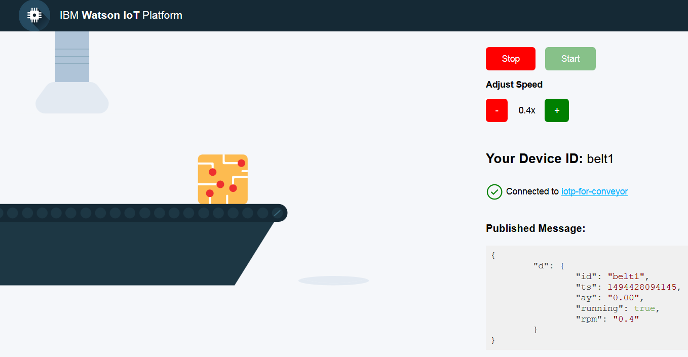

---

copyright:
  years: 2017, 2018
lastupdated: "2018-01-11"

---

{:shortdesc: .shortdesc}
{:new_window: target="_blank"}
{:codeblock: .codeblock}
{:pre: .pre}
{:screen: .screen}
{:tip: .tip}


# Guide 1: Connecting a conveyor belt device  
Create a basic conveyor belt with an IoT device that sends monitoring data to {{site.data.keyword.iot_full}} on {{site.data.keyword.Bluemix_notm}}.
{:shortdesc}

## Overview and goal
{: #overview}  
This guide is the first in a series to walk you, step-by-step, through the process of connecting devices to {{site.data.keyword.iot_short_notm}}, monitoring and acting on device data, and more. Each guide builds on the previous guide, and the sample code in each guide serves as input to the next guide. You can also use these guides standalone by modifying the sample code to suit your purposes.

In this first guide, we set up a connected conveyor belt and use it to send IoT data to {{site.data.keyword.iot_short_notm}}.
Depending on your skill level, you can follow one or both of the following paths to set up your conveyor belt:
- Path A  
This path gets you started quickly by installing a conveyor belt simulator app on {{site.data.keyword.Bluemix_notm}}. The app self-registers a device with {{site.data.keyword.iot_short_notm}} and automatically sends well-formatted data to the platform. Instructions for this path are in [Step 2A - Use the simulator sample app from GitHub](#deploy_app).  
- Path B  
This path is technically more challenging and requires additional hardware, Python programming skills, and manual registration of your device with {{site.data.keyword.iot_short_notm}}. Instructions for this path are in [Step 2B - Build a physical conveyor belt with a Raspberry Pi and an electric motor](#raspberry).

As part of this guide, you will:
- Create and deploy a {{site.data.keyword.iot_short_notm}} organization by using Cloud Foundry CLI.
- Build and deploy a sample conveyor belt device.
- Connect the simulated conveyor belt device to {{site.data.keyword.iot_short_notm}}.
- Monitor and visualize device data by using the {{site.data.keyword.iot_short_notm}} dashboards.

To get started with {{site.data.keyword.iot_short_notm}} using a different IoT device, see the [Getting started tutorial](/docs/services/IoT/getting-started.html).
{: tip}

## Prerequisites
{: #prereqs}

You will need the following accounts and tools:
* [{{site.data.keyword.Bluemix_notm}} account ](https://console.ng.bluemix.net/registration/){: new_window}
* [Cloud Foundry Command Line Interface (cf CLI) ](https://github.com/cloudfoundry/cli#downloads){: new_window}  
Use the cf CLI to deploy apps and services to {{site.data.keyword.Bluemix_notm}}. For more information, see the [Cloud Foundry CLI documentation](https://docs.cloudfoundry.org/cf-cli/){: new_window}
* Optional: [Git ](https://git-scm.com/downloads){: new_window}  
If you choose to use Git to download the code samples you must also have a [GitHub.com account ](https://github.com){: new_window}. You can also download the code as a compressed file without a GitHub.com account.
* Optional: A mobile phone on which to run the *Conveyor belt* sample web application to send accelerometer data.

## Step 1 - Deploy {{site.data.keyword.iot_short_notm}}  
{: #deploy_watson_iot_platform_service}
{{site.data.keyword.iot_short_notm}} provides powerful application access to IoT devices and data to help you rapidly compose analytics applications, visualization dashboards, and mobile IoT apps.
The steps that follow will deploy an instance of the {{site.data.keyword.iot_short_notm}} service with the name `iotp-for-conveyor` in your {{site.data.keyword.Bluemix_notm}} environment. If you already have a service instance running, you can use that instance with the guide and skip this first step. Just make sure that you use the correct service name and {{site.data.keyword.Bluemix_notm}} space when you proceed through the guides.
{: tip}
1. From the command line, set your API endpoint by running the cf api command.   
Replace the `API-ENDPOINT` value with the API endpoint for your region.
   ```
cf api API-ENDPOINT
   ```
Example: `cf api https://api.us-south.cf.cloud.ibm.com`
<table>
<tr>
<th>Region</th>
<th>API Endpoint</th>
</tr>
<tr>
<td>US South</td>
<td>https://api.us-south.cf.cloud.ibm.com</td>
</tr>
<tr>
<td>United Kingdom</td>
<td>https://api.eu-gb.cf.cloud.ibm.com</td>
</tr>
 <!--<tr>
 <td>Germany</td>
 <td>https://api.eu-de.cf.cloud.ibm.com</td>
 </tr>-->
</table>
2. Log into your {{site.data.keyword.Bluemix_notm}} account.
  ```
cf login
  ```
If prompted, select the organization and space where you want to deploy {{site.data.keyword.iot_short_notm}} and the sample app.
3. Deploy the {{site.data.keyword.iot_short_notm}} service to {{site.data.keyword.Bluemix_notm}}.  
   ```
cf create-service iotf-service iotf-service-free YOUR_IOT_PLATFORM_NAME
  ```
For YOUR_IOT_PLATFORM_NAME, use *iotp-for-conveyor*.  
Example: `cf create-service iotf-service iotf-service-free iotp-for-conveyor`
3. Create your sample conveyor belt device.  
 - Path A: [Step 2A - Use the simulator sample app from GitHub](#deploy_app).  
 - Path B: [Step 2B - Build a physical conveyor belt with a Raspberry Pi and an electric motor](#raspberry).  

## Step 2A - Deploy the sample conveyor belt web application  
{: #deploy_app}

The sample app lets you simulate an {{site.data.keyword.Bluemix_notm}} connected industrial conveyor belt. You can start and stop the belt and adjust the speed of the belt. Every change to the belt is sent to {{site.data.keyword.Bluemix_notm}} in the form of an MQTT message that is displayed in the app. You can monitor the belt behavior by using the default dashboard cards.
The sample app is built using the Node.js client libraries at: [https://github.com/ibm-watson-iot/iot-nodejs ](https://github.com/ibm-watson-iot/iot-nodejs){: new_window}



1. Use your favorite git tool to clone the following repository:  
https://github.com/ibm-watson-iot/guide-conveyor-simulator
In Git shell, use the following command:
  ```bash
git clone https://github.com/ibm-watson-iot/guide-conveyor-simulator
  ```
2. On the command line, change the directory to the directory in which the sample app is located.
  ```bash
cd guide-conveyor-simulator
  ```
3. From the *guide-conveyor-simulator* directory, push your app to {{site.data.keyword.Bluemix_notm}} and give it a new name by replacing *YOUR_APP_NAME* in the cf push command. Use the `--no-start` option because you will start the app in the next stage after it is bound to {{site.data.keyword.iot_short_notm}}.
**Note:** Deploying your application can take a few minutes.
   ```bash
cf push YOUR_APP_NAME --no-start
  ```  
1. In the *guide-conveyor-simulator* directory, bind your app to your instance of the {{site.data.keyword.iot_short_notm}} by using the names that you provided for each.
  ```bash
cf bind-service YOUR_APP_NAME iotp-for-conveyor
  ```
For more information about binding applications, see [Connecting applications](/docs/services/IoT/platform_authorization.html#bluemix-binding).
2. Start your application for the binding to take effect.
  ```bash
cf start YOUR_APP_NAME
  ```
At this stage, your sample web application is deployed on {{site.data.keyword.Bluemix_notm}}.
When deployment is completed, a message is displayed to indicate that your app is running.   
Example:
  ```bash
name:              YOUR_APP_NAME
requested state:   started
instances:         1/1
usage:             64M x 1 instances
routes:            YOUR_APP_NAM.mybluemix.net
last uploaded:     Tue 09 May 09:29:49 EDT 2017
stack:             cflinuxfs2
buildpack:         SDK for Node.js(TM) (ibm-node.js-4.8.0,
                   buildpack-v3.11-20170303-1144)
start command:     ./vendor/initial_startup.rb

     state     since                  cpu    memory         disk            details
#0   running   2017-05-09T13:35:08Z   0.0%   19.6M of 64M   66.2M of 256M
  ```
To see both the app deployment status and the app URL, you can run the following command:
  ```bash
cf apps
  ```
Troubleshoot errors in the deployment process by using the `cf logs YOUR_APP_NAME --recent` command.
{: tip}
1. In a browser, access the app.  
Open the following URL: `https://YOUR_APP_NAME.mybluemix.net`    
Example: `https://conveyorbelt.mybluemix.net/`.
2. Enter a device ID and token for your device.  
The sample app automatically registers a device of type `iot-conveyor-belt` with the device ID and token that you provided. For more information about registering devices, see [Connecting devices](/docs/services/IoT/iotplatform_task.html#iotplatform_subtask1).
4. Continue with [Step 3 - See raw data in {{site.data.keyword.iot_short_notm}}](#see_live_data).

## Step 2B - Build a Raspberry Pi-powered conveyor belt
{: #raspberry}

The Raspberry Pi solution is built using the Python client libraries at: [https://github.com/ibm-watson-iot/iot-python ](https://github.com/ibm-watson-iot/iot-python){: new_window}

### Schematic diagram for the circuit


### Required connections

The following connections between the Raspberry Pi and the L298N Dual H Bridge Motor Driver Board are required. Connect:

- Pin 2 of the Raspberry Pi to +5v on the L298N board
- Pin 6 of the Raspberry Pi to GND on the L298N board
- Pin 13 of the Raspberry Pi to the IN1 of the L298N board
- Pin 15 of the Raspberry Pi to the IN2 of the L298N board
- +9v of the battery to +12v on the L298N board
- -9v of the battery to GND on the L298N board
- The +ve node of the motor to OUT1 on the L298N board
- The -ve node of the motor to OUT2 on the L298N board

### Hardware requirements

1. [Raspberry Pi(2/3) ](https://www.raspberrypi.org/){: new_window} with Raspbian Jessie (8.x).
2. [L298N Dual H Bridge Motor Driver Board ](https://tronixlabs.com.au/robotics/motor-controllers/l298n-dual-motor-controller-module-2a-australia/){: new_window}
3. 9V DC motor
4. 9V Battery

### Raspberry Pi software requirements
- Python 2.7.9 and above, installed with Raspbian Jessie (8.x).
- [Watson IoT Python library ](https://github.com/ibm-watson-iot/iot-python){: new_window}
- Optional: Git.  
If you do not have git installed on your Raspberry Pi, you can install it by using the following command:  
```bash
$ sudo apt-get install git
```

### Detailed steps

1. Open the terminal or SSH to your Raspberry Pi.
2. Use your favorite git tool to clone the following repository to your Raspberry Pi:  
https://github.com/ibm-watson-iot/guide-conveyor-rasp-pi
In Git Shell, use the following command:
```bash
$ git clone https://github.com/ibm-watson-iot/guide-conveyor-rasp-pi
```
3. Register the device with {{site.data.keyword.iot_short_notm}}.  
For more information about registering devices, see [Connecting devices](/docs/services/IoT/iotplatform_task.html#iotplatform_subtask1).
	 1. In the {{site.data.keyword.Bluemix_notm}} console, click **Launch** on the {{site.data.keyword.iot_short_notm}} service details page.
	     The {{site.data.keyword.iot_short_notm}} web console opens in a new browser tab at the following URL:
	     ```
	     https://ORG_ID.internetofthings.ibmcloud.com/dashboard/#/overview
	     ```
	     Where ORG_ID is the unique six character ID of [your {{site.data.keyword.iot_short_notm}} organization](/docs/services/IoT/iotplatform_overview.html#organizations){: new_window}.
	 2. In the Overview dashboard, from the menu pane, select **Devices** and then click **Add Device**.
	 3. Create a device type for the device that you are adding.
	     1. Click **Create device type**.
	     2. Enter the device type name `iotp-for-conveyor` and a description for the device type.  
	**Tip:** You can enter any device type name, but the other guides in the series expect devices that use the device type `iotp-for-conveyor`. If you use a different device type, you must modify the settings in the other guides accordingly.
	     3. Optional: Enter device type attributes and metadata.
	 4. Click **Next** to begin the process of adding your device with the selected device type.
	 5. Enter a device ID, for example, `conveyor_belt`.
	 5. Click **Next** to complete the process.
	 6. Provide an authentication token or accept an automatically generated token.
	 7. Verify the summary information is correct and then click **Add** to add the connection.
	 8. In the device information page, copy and save the following details:
	     * Organization ID
	     * Device Type
	     * Device ID
	     * Authentication Method
	     * Authentication Token
	     You'll need the values for the Organization ID, Device Type, Device ID, and Authentication Token to configure your device to connect to {{site.data.keyword.iot_short_notm}}.
4. Navigate to the *guide-conveyor-rasp-pi* root of the cloned repository.
5. Make the shell script executable by using this command `sudo chmod +x setup.sh`
6. Run the *setup.sh* file and enter the details that you copied from the device information page when prompted.
```bash  
./setup.sh
```  

7. Run the deviceClient program.  
When you run the program, your Raspberry Pi starts the motor and it will run for up to 2 minutes based on parameter settings.
```bash
python deviceClient.py -t 2
```

While the motor is running, the program publishes events of event type `sensorData` that have the following sample payload structure:  
```
{
"d": {
  "elapsed": 1,
  "running": true,
  "temperature": 35.00,
  "ay": "0.00",
  "rpm": "0.6"
}
}
```

8. Continue with [Step 3 - See raw data in {{site.data.keyword.iot_short_notm}}](#see_live_data).

## Step 3 - See raw data in {{site.data.keyword.iot_short_notm}}
{: #see_live_data}
1. Verify that the device is registered with {{site.data.keyword.iot_short_notm}}.
 1. Login to your {{site.data.keyword.Bluemix_notm}} dashboard at: https://bluemix.net
 2. From [your list of services ](https://bluemix.net/dashboard/services){: new_window}, click the *iotp-for-conveyor* {{site.data.keyword.iot_short_notm}} service.
 3. Click *Launch* to open the {{site.data.keyword.iot_short_notm}} dashboard in a new browser tab.  
You can bookmark the URL for easy access later.   
Example: `https://*iot-org-id*.internetofthings.ibmcloud.com`.
 4. From the menu, select **Devices** and verify that your new device is displayed.
2. View raw data
 1. From the menu, select **Boards**.
 3. Select the **Device Centric Analytics** board.
 4. Locate the **Devices I Care About** card and select your device.  
The device name is displayed in the Device Properties card.
4. Send sensor data to the platform.   
The device sends data to {{site.data.keyword.iot_short_notm}} when sensor readings change. You can simulate this data sending by stopping, starting or changing the speed of the conveyor belt.   
**Path A:** If you are accessing the app on a mobile browser, try shaking your smart phone to trigger accelerometer data for the conveyor belt.
{: tip}
3. Verify that the updated device data points that correspond to the published message are displayed in the Device Properties card.  
Message example A:
  ```
{
	"d": {
		"id": "belt1",
		"ts": 1494341288662,
		"ay": "0.00",
		"running": true,
		"rpm": "0.6"
	}
}
  ```
Message example B:
  ```
{
	"d": {
    "elapsed": 1,
    "running": true,
    "temperature": 35.00,
    "ay": "0.00",
    "rpm": "0.6"
  }
}
  ```


## Step 4 - Visualize live data in {{site.data.keyword.iot_short_notm}}
{: #add_card}
To create a dashboard card to see live conveyor belt data:
1. On the same Device Centric Analytics board, click **Add New Card** and then select **Line Chart**.
2. For card source data, click **Cards**.   
A list of card names is displayed.
3. Select **Devices I Care About** and then click **Next**.
4. Click **Connect new data set** and enter the following values for the data set parameters:
  - Event: sensorData
  - Property: d.rpm
  - Name: Belt RPM
  - Type: Float
  - Unit: rpm
5. Click **Next**.
6. On the card preview page, select **L**, and then click **Next**.
7. On the card information page, change the name of the title to `Belt data` and then click **Submit**.
8. Change the speed of your belt to see live data in your new card.
9. Optional: Add a second data set to add acceleration data for the belt.  
If you use your phone to connect to the sample app, you can shake the phone to send acceleration data for the belt.
 1. Click the menu icon on your card and select to edit the card.
 2. For card source data, select **Cards**.   
 3. Select **Devices I Care About** and click **Next**.
 4. Click **Connect new data set** and enter the following values:
    - Event: sensorData
    - Property: d.ay
    - Name: Accel. Y
    - Type: Float
    - Unit: gs
 5. Click **Next**.
 6. Path A only: Shake your phone to see the live accelerometer data in your new card.
For more information about creating boards and cards, see [Visualizing real-time data by using boards and cards](/docs/services/IoT/data_visualization.html#boards_and_cards).

## What's next
{: @whats_next}  
Continue with the next guide or jump to another topic that interests you:
- Path A: Modify the conveyor belt app to suit your needs.  
For technical details, see:
 - [https://github.com/ibm-watson-iot/guide-conveyor-simulator/blob/master/README.md ](https://github.com/ibm-watson-iot/guide-conveyor-simulator/blob/master/README.md){: new_window}
 - [Node.js clienmt libraries ](https://github.com/ibm-watson-iot/iot-nodejs){: new_window}

 **Note:** Bluemix is now IBM Cloud. Check out the [IBM Cloud Blog](https://www.ibm.com/blogs/bluemix/2017/10/bluemix-is-now-ibm-cloud/){: new_window}  for more details.

- Path B: Modify the Raspberry Pi setup to suit your needs.  
For technical details, see:
 - [https://github.com/ibm-watson-iot/guide-conveyor-rasp-pi/blob/master/README.md ](https://github.com/ibm-watson-iot/guide-conveyor-rasp-pi/blob/master/README.md){: new_window}
- [Guide 2: Using basic real-time rules and actions](getting-started-iot-rules.html)  
Now that you successfully set up your conveyor belt, connected it to {{site.data.keyword.iot_short_notm}}, and sent some data, it is time to make that data work for you by using rules and actions.

**Note:** Bluemix is now IBM Cloud. Check out the [IBM Cloud Blog](https://www.ibm.com/blogs/bluemix/2017/10/bluemix-is-now-ibm-cloud/){: new_window}  for more details.

- [Guide 3: Monitoring your device data](getting-started-iot-monitoring.html)  
Now that you connected one or more devices and started making good use of the device data, it is time to start monitoring a collection of devices.
- [Guide 4: Simulating a large number of devices](getting-started-iot-large-scale-simulation.html)  
The conveyor belt sample app in path A lets you manually simulate one or a few conveyor belt devices. This guide lets you set up a simulated environment that has a large number of devices.
- [Learn more about {{site.data.keyword.iot_short_notm}}](/docs/services/IoT/iotplatform_overview.html)
- [Learn more about {{site.data.keyword.iot_short_notm}} APIs](/docs/services/IoT/reference/api.html)
