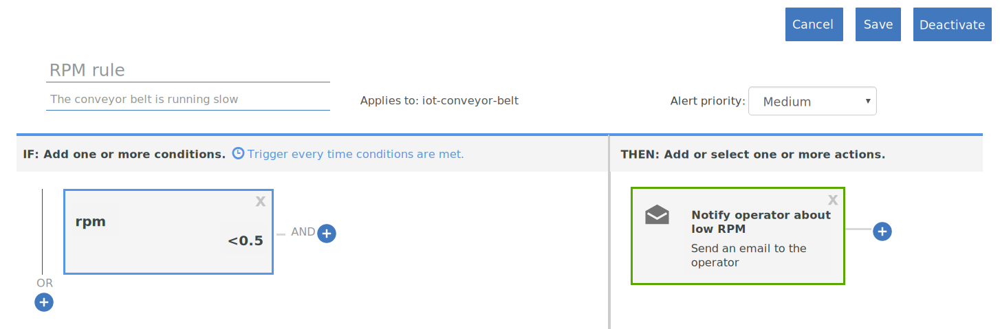

---

copyright:
  years: 2017
lastupdated: "2017-06-06"

---

{:shortdesc: .shortdesc}
{:new_window: target="\_blank"}
{:codeblock: .codeblock}
{:pre: .pre}
{:screen: .screen}
{:tip: .tip}

# Guide 2: Using basic real-time rules and actions
Use the instructions in this guide to configure a set of basic rules and actions for some real-time analytics of your conveyor belt IoT data.
{:shortdesc}

## Overview and goal
{: #overview}  
Now that you successfully set up your conveyor belt, connected it to {{site.data.keyword.iot_short_notm}}, and sent some data, it is time to make that data work for you by using rules and actions.



As part of this guide, you will:
- Create a message schema for your conveyor belt device event data.
- Create and trigger a rule.
- Create an email action.

## Prerequisites
{: #prereqs}  
Complete [Guide 1: Connecting a conveyor belt device](getting-started-iot-conveyor.html).

or...

Have one or more devices connected that meet the following requirements:
- Device type: iot-conveyor-belt
- Device messaging:
 - Event name: sensorData
 - Message payload that is similar to the following message:  
```
{
	"d": {
		"id": "belt1",
		"ts": 1494946276931,
		"ay": "0.00",
		"running": true,
		"rpm": "1.0"
		}
}
```
{: pre}

## Step 1 - Create a message schema for the sample app
{: #create_schema}

To use the properties that are sent by your device as triggers for your rules, you must first map these properties to a messaging schema in {{site.data.keyword.Bluemix_notm}}. For more information, see [Create device type schemas](/docs/services/IoT/im_schemas.html#iotrtinsights_task).
1. In the {{site.data.keyword.iot_short_notm}} dashboard, go to **Devices** and select **Manage Schemas**.
2. Click **Add Schema**.
3. Select the **iot-conveyor-belt** device type and click **Next**.
4. Add properties to the schema.
 1. Click **Add property**.
 2. Select **From Connected**.
 3. Send a conveyor belt datapoint by changing the rpm value.
In the conveyor belt web app, click **Stop** or **Start** to publish a message.  
The properties list is populated with the properties that the device sent.
 4. Select all properties and then click **OK**.
5. Click **Finish** to create the schema.  

The schema is created, and the rpm data type is set to float.

## Step 2 - Create a simple rule for the rpm property
{: #create_rule}  
The {{site.data.keyword.Bluemix_notm}} rule engine compares property datapoints that are sent by your device to static threshold values that are set in the rule and triggers the rule when the rule conditions are met. For more information about rules, see [Cloud Analytics](/docs/services/IoT/cloud_analytics.html#rules).
To create a rule that is triggered when the conveyor belt rpm value is less than 0.5:
1. Change the rpm property type to Float.  
When we create a rule, we want to compare the numerical rpm value with a threshold. To do that, the property must be recognized as a float or integer.
 1. In the {{site.data.keyword.iot_short_notm}} dashboard, go to **Devices** and select **Manage Schemas**.
 1. Click the new schema that you just created and select **Properties**.
 2. Click the edit icon to edit the schema.
 3. Click the edit icon next to the `rpm` property.
 4. Change the data type to `Float`.  
 5. Click **OK**.
 6. Click **Finish** to update the schema.  
2. Create the rule.
 1. In the dashboard, go to **Rules**.
 2. Click **Create Cloud Rule**.
 3. Enter `RPM rule` for the name.
 4. Set the rule to apply to the **iot-conveyor-belt** schema.
 5. Click **Next**.
 6. Add a rule condition.
    6. Click the **New condition** tile to add a condition for the rule.
    7. Select the **rpm** property.
    8. Select the less than operator (`<`).
    9. Enter `0.5` for the value and click **OK**.
    10. Click **Save** and then click **Close**.
 11. Click **Close**.  
The new rule is listed in the state "Deactivated".
12. Click the state switch to activate the rule.
The state is now listed as "Activated".

## Step 3 - Trigger the rule
{: #trigger_rule}
By lowering the rpm, you can simulate issues with the conveyor belt that might require intervention by the operator. When the threshold value for rpm is met, an alert is displayed in the dashboard.
1. In the {{site.data.keyword.iot_short_notm}} dashboard, select **Boards**.
3. Select the **Rule-Centric Analytics** board.
4. In the conveyor belt web app, decrease the rpm value below 0.5 rpm.
The device sends data to {{site.data.keyword.iot_short_notm}} when sensor readings change. You can simulate this sending of data by stopping, starting or changing the speed of the conveyor belt.  
5. Verify that the `RPM rule` appears in the Rules with Alerts card.
6. Select the new alert in the Rule Alerts card and view the data points that triggered the rule in the Rule Alert Info card.  
To see more information about the alert, see the device details in the Associated Devices, Device Info, and Device Properties cards.  
{: tip}

## Step 4 - Create an action to take when the RPM rule is triggered
{: #create_action}
In addition to displaying an alert in the {{site.data.keyword.iot_short_notm}} dashboard, you can create actions that are taken when a rule is triggered, for example, sending an email to the operator to look at the conveyor belt if the rpm gets too low. For more information, see [Cloud Analytics](/docs/services/IoT/cloud_analytics.html#shared).
To create an email action:
1. In the {{site.data.keyword.iot_short}} dashboard, go to **Rules**.
2. Click the **RPM rule**.
3. Click the **New action** tile.
4. Create an action.
 1. Click **Add action**.
 2. Enter the action name `Notify operator about low RPM`.
 3. Enter the description `Send an email to the operator.`.
 4. Select the **Send email** type.
 5. Click **Next**.
 6. In the subject line, enter: `Low RPM alert.`
 7. In the To field, select **Specific people** and enter `operator@company.com`.  
Substitute the email address with your own.
 8. Select **Include Data** to include the device data in the email.
 9. Click **Finish** to save the action.  
5. Select the action in the list and click **OK** to set the action.
6. Click **Save** to enable the action with the rule.
7. Test the new action.
 4. In the conveyor belt web app, decrease the rpm value below 0.5 rpm.
 5. Verify that you received the alert email.  
The message body might look something like this example:
> **Rule:** RPM rule  
> **Device:** 3m5wxr:iot-conveyor-belt:belt1  
> **Date:** 2017-05-09T18:21:21.567Z  
> **Condition:**  
> iot_conveyor_belt.d.rpm<0.5  
> **Incoming Message:**  
> {"d":{"id":"belt1","ts":1494354089837,"ay":"0.00","rpm":"0.4","running":true},"ruleContent":{"jobID":"sdIyBfdu","contextSchemas":[],"ruleDescription":"","severity":4,"messageSchemas":["iot_conveyor_belt"],"disabled":false,"ruleCondition":"iot_conveyor_belt.d.rpm<0.5","transforms":[],"name":"RPM rule","actions":["pziIRovt"],"id":"ncKK4N7k","updated":"9 May 2017 18:20:25 GMT","created":"9 May 2017 17:41:38 GMT","version":7}}  
> This is an automatically generated email. Do not reply. For questions regarding this alert, contact your system administrator.

## Whats next
{: #whats_next}  
Continue with the next guide, or jump to another topic that interests you:
- [Guide 3: Monitoring your device data](getting-started-iot-monitoring.html)  
Now that you connected one or more devices and started making good use of the device data, it is time to start monitoring a collection of devices and the real-time data that they are sending.
- [Guide 4: Simulating a large number of devices](getting-started-iot-large-scale-simulation.html)  
The conveyor belt sample app in path A lets you manually simulate one or a few conveyor belt devices. This guide lets you set up a simulated environment that has a large number of devices.
- [Connect other IoT devices to {{site.data.keyword.iot_short_notm}}](/docs/services/IoT/iotplatform_task.html)
- [Learn more about {{site.data.keyword.iot_short_notm}}](/docs/services/IoT/iotplatform_overview.html)
- [Learn more about {{site.data.keyword.iot_short_notm}} APIs](/docs/services/IoT/reference/api.html)
