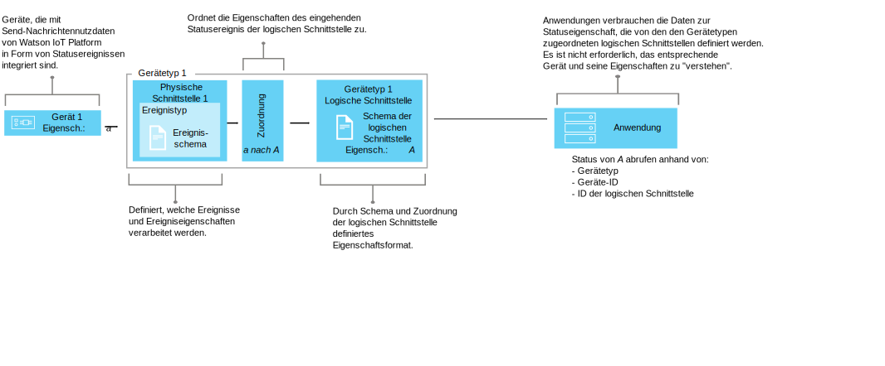

---

copyright:
  years: 2016, 2017
lastupdated: "2017-10-09"

---

{:new_window: target="\_blank"}
{:shortdesc: .shortdesc}
{:screen: .screen}
{:codeblock: .codeblock}
{:pre: .pre}


# Erklärung des Datenmanagements
{: #definitions_resources}
Sie verfügen möglicherweise über eine Reihe unterschiedlicher Geräte, die mit {{site.data.keyword.iot_full}} verbunden werden sollen. Diese Geräte publizieren möglicherweise Daten in unterschiedlichen Formaten. Mithilfe der Funktion für das Datenmanagement können Sie die Datenausgabe dieser Geräte in einer einzigen logischen Ansicht normalisieren und umwandeln, die von Ihren Anwendungen auf einfache Weise genutzt werden kann. Durch Verwendung einer einzigen logischen Ansicht ist es nicht mehr erforderlich, Ihre Anwendungen so zu codieren, dass sie die unterschiedlichen Datenformate interpretieren können, die von den einzelnen Geräten ausgegeben werden.
{: shortdesc}

## Übersicht

Verwenden Sie die Funktion für das Datenmanagement zum Erstellen gemeinsam genutzter Abstraktionen von Geräten (Gerätezwillingen), um die Wiederverwendbarkeit und Wartung zu verbessern und die Komplexität eines IoT-Ökosystems zu verwalten, jedoch gleichzeitig Anwendungen gegenüber möglichen Datenänderungen abzuschirmen. 

Anwendungen können auf Anforderung auf den aktuellen Status eines Geräts zugreifen. Der Zugriff erfolgt über eine HTTP-API oder durch Subskription für eine bestimmte Topic-Zeichenfolge. Der Status besteht aus einer Reihe von Statuseigenschaften, die durch eine logische Schnittstelle definiert werden. Wenn sich der Status eines Geräts aufgrund der Publikation eines Ereignisses in {{site.data.keyword.iot_short_notm}} ändert, dann werden die Werte dieser Eigenschaften aktualisiert und in {{site.data.keyword.iot_short_notm}} gespeichert.

Durch Verwendung der Funktion für das Datenmanagement können Sie die folgenden Vorteile erzielen:
- Statuseigenschaften zu Ereignisnachrichtendaten zuordnen
- Die von Ihnen bevorzugte Datenstruktur definieren
- Mehr als eine Darstellung oder Ansicht des Gerätestatus definieren
- Gerätestatusangaben subskribieren oder diese jederzeit über eine HTTP-API abfragen

Im Folgenden sind einige gängige Anwendungsfälle für die Implementierung der Funktion für das Datenmanagement aufgeführt:
- Bereitstellen konsistenter Schnittstellen für den Zugriff auf ereignisgesteuerte Gerätedaten im REST-Stil für Anwendungsentwickler
- Normalisieren der Daten von Geräten unterschiedlicher Marken oder Modelle, die Daten in unterschiedlichen Formaten publizieren
- Ändern und Konvertieren von Datenformaten zur Anpassung an Ihr Anwendungsmodell

## Beispiel: Heterogene Temperatursensoren einer logischen Schnittstelle zuordnen
{: #device-type-example}
Um mit der Nutzung der Funktion für das Datenmanagement beginnen zu können, müssen Sie eine Reihe von Ressourcen definieren, die in den folgenden Abschnitten beschrieben werden. 

Im folgenden Beispiel wird gezeigt, wie diese Ressourcen zusammengestellt werden können, um Anwendungen den Zugriff auf homogene Temperaturstatusdaten in einem Format zu ermöglichen, und zwar unabhängig vom Nutzdatenformat der Geräteereignisnachrichten. "Temperatursensor 1" gibt einen Temperaturmesswert in Celsius von `{ "t" : 34.5 }` an {{site.data.keyword.iot_short_notm}} aus. "Temperatursensor 2" gibt einen Temperaturmesswert in Fahrenheit von `{ "temp" : 72.55 }` aus. Jeder Temperatursensor ist einem eigenen [Gerätetyp](../reference/device_model.html#id_and_device_types) zugeordnet. Die Temperaturmesswerte werden als separate Ereignisse ausgegeben.

Verwenden Sie die {{site.data.keyword.iot_short_notm}}-Funktion für das Datenmanagement, um die Konfiguration dieser Lösung durch Normalisierung und Umwandlung Ihrer Gerätedaten zu vereinfachen. 


Als Teil des Datenflusses können Sie Berechnungen für die eingehenden Daten ausführen, um diese Messwerte in einem einheitlichen Format zur Verarbeitung zu normalisieren. Dies bedeutet, dass Sie Ihre Anwendung nicht so schreiben müssen, dass sie verschiedene Temperaturskalen verstehen oder konvertieren muss. Die Anwendung empfängt einen einzelnen normalisierten Status und verwendet die Statuseigenschaft **temperature** anstelle der gerätespezifischen Eigenschaften **t** und **temp**.

 Zur Konfiguration dieser Lösung müssen Sie die folgenden Informationen definieren:

-	Die Struktur des eingehenden Temperaturereignisses ("t" und "temp") von jedem Gerätetyp.  
-	Die Eigenschaft ("temperature"), die aufgezeichnet werden soll. Die Eigenschaft "temperature" definiert die logische Struktur des Gerätestatus, der von Ihren Anwendungen genutzt werden kann.
-	Vorgehensweise zur Zuordnung der Eigenschaften "t" und "temp" des eingehenden Ereignisses zur Eigenschaft "temperature".

Sie können die erforderlichen Informationen definieren, indem Sie die folgenden Ressourcen konfigurieren, die in {{site.data.keyword.iot_short_notm}} vorhanden sind:

-	Physische Schnittstelle, Ereignistyp und Ereignisschemaressource, die die Struktur der eingehenden Ereignisse "t" und "temp" definieren.
-	Logische Schnittstelle und logische Schemaressource, die die logische Struktur des Gerätestatus "temperature" definieren, der generiert werden soll.
-	Zuordnungsressource, die definiert, wie Sie die Eigenschaften "t" und "temp" der Eigenschaft "temperature" zuordnen wollen.

Ein umfassendes Szenario, das dieses Beispiel beschreibt, finden Sie in [Schrittweise Anleitung: Detailliertes Beispiel zur Vorgehensweise beim Arbeiten mit Geräten über eine allgemeine Schnittstelle](ga_im_index_scenario.html).

Weiterführende Informationen zu diesen Ressourcen werden im Abschnitt "Eigene Ressourcen definieren" bereitgestellt.


## Eigene Ressourcen definieren
{: #definitions_resources}

Das folgende Diagramm veranschaulicht die logische Zuordnung zwischen Geräten und Anwendungen in {{site.data.keyword.iot_short_notm}} bei der Verwendung der Funktion für das Datenmanagement.



### Konzepte
{: #concepts}
Die folgende Tabelle beschreibt das Konzept von Ereignissen, Eigenschaften und Statuszuständen, auf die im vorherigen Diagramm verwiesen wurde.

Konzepte                        | Beschreibung       
------------- | ------------- | -------------  
Ereignis | Ereignisse sind der Mechanismus, über den Geräte Daten in {{site.data.keyword.iot_short_notm}} publizieren. Das Gerät steuert den Inhalt des Ereignisses und ordnet jedem Ereignis, das von ihm gesendet wird, einen Namen zu.
Eigenschaft| Daten, die einen Teil der Ereignisnutzdaten eines Geräts tragen.
Status | Die aktuellste Darstellung des Status des physischen Geräts, die alle Eigenschaften enthalten kann, die von mehreren eingehenden Ereignissen zugeordnet wurden.

### Ressourcen für das Datenmanagement
{: #resources}

Sie können Ressourcen über REST-APIs verwalten. Informationen zu den REST-APIs finden Sie in der Dokumentation zur [{{site.data.keyword.iot_short_notm}}-HTTP-REST-API](https://docs.internetofthings.ibmcloud.com/apis/swagger/v0002/state-mgmt.html).

Typressourcen                        | Beschreibung       
------------- | ------------- | -------------  
Ereignistyp                         | Benutzen Sie die Ereignistypressource, um ein Ereignis zu modellieren, das von einem Gerät publiziert wird. Ein Ereignistyp muss eine Ereignisschemaressource referenzieren. Die Schemaressource definiert die Struktur des Ereignisses, das publiziert wird. </br>**Wichtig:** Eingehende Ereignisse, die in einer logischen Schnittstelle verwendet werden, müssen im JSON-Format angegeben werden. 
Gerätetyp                         |  Verwenden Sie die Gerätetypressource, um Geräte zu Gruppen zusammenzufassen, die gemeinsame Merkmale oder Verhalten aufweisen. Beim Datenmanagement wird der Gerätetyp so erweitert, dass er eine physische Schnittstelle für ein Gerät und mindestens eine logische Schnittstelle enthält, über die der Gerätestatus abgerufen wird. </br>Weitere Informationen hierzu finden Sie im Abschnitt zu IDs und Gerätetypen im Thema zu den [Gerätemodellen](../reference/device_model.html#id_and_device_types).
Schemaressourcen                         |  Verwenden Sie Schemaressourcen zum Definieren der Struktur eines Ereignis- oder Gerätestatus. Die folgenden [JSON-Schemas ](http://json-schema.org/){:new_window} werden verwendet: <ul><li>Ein Schema, das einem Ereignistyp zugeordnet ist. Dieses Schema wird zum Definieren der Struktur des Ereignisses verwendet, das durch ein Gerät in {{site.data.keyword.iot_short_notm}} publiziert wird. Diese Schemas werden als Ereignisschemas bezeichnet. <li>Ein Schema, das einer logischen Schnittstelle zugeordnet ist. Dieses Schema wird zum Definieren der Struktur des Gerätestatus verwendet, der in {{site.data.keyword.iot_short_notm}} gespeichert wird. Diese Schemas werden als Schemas der logischen Schnittstelle bezeichnet. </ul>.  

Schnittstellenressourcen                        | Beschreibung       
------------- | ------------- | -------------  
Logische Schnittstelle | Ein programmgesteuertes Konstrukt, zu dem Ihre Anwendungen eine Verbindung herstellen oder das sie subskribieren können, um den Status eines Geräts anzuzeigen. Eine logische Schnittstelle wird verwendet, um die normalisierte Ansicht des Gerätestatus in {{site.data.keyword.iot_short_notm}} zu definieren. Eine logische Schnittstelle muss einem Schema der logischen Schnittstelle zugeordnet werden. Der Status wird als Antwort auf eingehende Geräteereignisse aktualisiert. 
Physische Schnittstelle                         | Eine physische Schnittstelle wird verwendet, um die Schnittstelle zwischen einem physischen Gerät und {{site.data.keyword.iot_short_notm}} zu modellieren. Ereignistypen können der physische Schnittstelle zugeordnet werden. 

Instanzressourcen                        | Beschreibung       
------------- | ------------- | -------------  
Gerät                         | Ein Gerät stellt ein Asset, ein System oder eine Komponente dar, das bzw. die bei {{site.data.keyword.iot_short_notm}} registriert ist und IoT-Daten in Form von Ereignissen sendet.

Unterstützende Ressourcen                        | Beschreibung       
------------- | ------------- | -------------  
Zuordnungen                         | Verwenden Sie Zuordnungen, um zu definieren, wie Eigenschaften, die eingehenden Ereignissen zugeordnet sind, Eigenschaften zugewiesen werden, die für eine logische Schnittstelle definiert sind. </br>**Wichtig:** Bevor Zuordnungen definiert werden können, muss mindestens eine logische Schnittstelle einem Gerätetyp zugeordnet sein.


## Einschränkungen bei der Benennung von Ressourcen
{: #naming_restrictions}
Für Schemas, Ereignistypen und logische sowie physische Schnittstellen gelten die folgenden Einschränkungen bei der Benennung:
- Der Name muss zwischen 1 und 128 Zeichen lang sein. 
- Der Name muss aus Unicode-Zeichen bestehen. 
- Die folgenden Sonderzeichen sind zulässig: Leerzeichen, Bindestrich (-), Unterstreichungszeichen (_), Punkt (.).
- Der Name darf nicht ausschließlich aus Leerzeichen bestehen.

## Ressourcen erstellen, aktualisieren, aktivieren und inaktivieren
{: #draft_active_resources}

Es gibt zwei Versionen einer Ressource: Eine Entwurfsversion und eine aktive Version. Wenn Sie eine Ressource erstellen, dann wird sie als Entwurfsversion erstellt.
{: shortdesc}

Die Entwurfsversion stellt eine Arbeitsdatei der Ressource dar, die Sie über APIs direkt abfragen, aktualisieren und löschen können. Erstellen Sie eine aktive Version einer Entwurfsressource, indem Sie entweder einen Entwurf eines Gerätetyps oder einen Entwurf einer logischen Schnittstelle aktivieren. Sie können nur einen Entwurf eines Gerätetyps oder einen Entwurf einer logischen Schnittstelle aktivieren. Zur Aktivierung anderer Ressourcen (z. B. Schemas) müssen Sie einen Entwurf eines Gerätetyps oder einen Entwurf einer logischen Schnittstelle aktivieren, der die Ressource referenziert, die Sie aktivieren möchten.

Um bei Verwendung von REST-APIs zwischen einer Entwurfsressource und einer aktiven Ressource zu unterscheiden, wird das Präfix *draft/* verwendet, um diejenigen Ressourcen zu identifizieren, die sich im Entwurfsstatus befinden.

Im folgenden Beispiel werden Metadaten für eine Entwurfsschemadefinition abgerufen, indem eine angegebene ID benutzt wird:

```
GET /api/v0002/draft/schemas/{schemaId}
```
Im folgenden Beispiel werden Metadaten für eine aktive Schemadefinition abgerufen, indem eine angegebene ID benutzt wird:
```
GET /api/v0002/schemas/{schemaId}
```
*Hinweis:* Die ID ist für die Entwurfsversion und die aktive Version einer bestimmten Ressource gleich.


- Ressource aktivieren
{: #activate_resources}  

Verwenden Sie die Operation **activate-configuration**, um die Konfiguration, die einem Gerätetyp zugeordnet ist, zu überprüfen und zu aktivieren. Diese Konfiguration enthält die Entwurfsversionen Ihrer Schemas, Ereignistypen, physischen Schnittstellen, logischen Schnittstellen und Zuordnungen. Die Operation **activate-configuration** muss für die Entwurfsversion einer logischen Schnittstelle oder eines Gerätetyps ausgeführt werden.

Im folgenden Beispiel wird die PATCH-Anforderung dargestellt, für die eine Operation **activate-configuration** für eine Entwurfsversion eines Gerätetyps ausgeführt wird:
```
PATCH /api/v0002/draft/device/types/TemperatureSensor
```
Hierbei enthalten die Nutzdaten des PATCH-Hauptteils den folgenden Inhalt:
```
  {
    "operation": "activate-configuration"
  }
```
- Unterschiede auflisten
{: #list_differences}  

Verwenden Sie die Operation **list-differences**, um eine Liste der Unterschiede zurückzugeben, die zwischen einer aktiven Konfiguration und der Entwurfskonfiguration einer logischen Schnittstelle oder einer Gerätetypressource bestehen. Die Operation **list-differences** muss für die Entwurfsversion einer logischen Schnittstelle oder eines Gerätetyps ausgeführt werden. Im folgenden Beispiel wird eine PATCH-Anforderung dargestellt, bei der eine Operation **list-differences** für eine Entwurfsversion eines Gerätetyps ausgeführt wird:
```
PATCH /api/v0002/draft/device/types/TemperatureSensor
```
Hierbei enthalten die Nutzdaten des PATCH-Hauptteils den folgenden Inhalt:
```
  {
    "operation": "list-differences"
  }
```


- Ressource inaktivieren  
{: #deactivate_resources}  

Verwenden Sie die Operation **deactivate-configuration**, um die aktive Konfiguration zu entfernen, die einer Ressource zugeordnet ist. Die Operation 'deactivate-configuration' kann nur für die aktive Version einer logische Schnittstelle oder eines Gerätetyps ausgeführt werden. Im folgenden Beispiel wird eine PATCH-Anforderung dargestellt, bei der eine Operation **deactivate-configuration** für eine aktive Version eines Gerätetyps ausgeführt wird:
```
PATCH /api/v0002/device/types/TemperatureSensor
```
Hierbei enthalten die Nutzdaten des PATCH-Hauptteils den folgenden Inhalt:
```
  {
    "operation": "deactivate-configuration"
  }
```
*Hinweis:*
- Eine aktive Ressource ist schreibgeschützt. Sie können Entwurfsressourcen und aktive Ressourcen filtern und sortieren, indem Sie Abfrageparameter verwenden.
- Sie können einen Gerätetyp nicht löschen, wenn Geräteinstanzen vorhanden sind, die diesem Gerätetyp zugeordnet sind. Der Status des Geräts wird bereinigt, wenn die Geräteinstanz gelöscht wird. 
- Sie können nur logische Schnittstellen und Gerätetypen über APIs direkt aktivieren. Andere Ressourcen (z. B. Schemas, physische Schnittstellen und Ereignistypen) werden aktiviert, wenn Sie von einer logischen Schnittstelle oder einem Gerätetyp referenziert werden, die bzw. der aktiviert wird.  
- Die Operation **activate-configuration** muss für eine Entwurfsversion einer logischen Schnittstelle ausgeführt werden, die einem Gerätetyp zugeordnet ist, oder aber für den Gerätetyp selbst. Die Operation **activate-configuration** überprüft, ob die Ressourcenkonfiguration gültig ist, bevor die Ressource aktiviert wird. Nach erfolgreichem Abschluss der Aktivierung wird der Status für jede Geräteinstanz des Gerätetyps generiert.

## Fehlerbehebung bei der Konfiguration
{: #troubleshooting}
Wenn Ihre Aktivierung fehlschlägt, dann müssen Sie überprüfen, ob alle erforderlichen Konfigurationswerte für einen bestimmten Gerätetyp angegeben wurden. Die folgende Konfiguration muss bereitgestellt und einem Gerätetyp zugeordnet werden:
  - Eine physische Schnittstelle, die mindestens einem Ereignis zugeordnet ist
  - Mindestens eine logische Schnittstelle
  - Zuordnungen für mindestens eine zugeordnete logische Schnittstelle

Sie können außerdem die Operation **validate-configuration** für eine Entwurfsversion des Gerätetyps oder der logischen Schnittstelle ausführen, um sicherzustellen, dass die zugehörigen Metadaten gültig sind. Wenn die Metadaten ungültig sind, wird eine Liste der Probleme im Hauptteil der Antwort zurückgegeben.  

Im folgenden Beispiel wird eine PATCH-Anforderung dargestellt, bei der eine Operation **validate-configuration** für eine Entwurfsversion eines Gerätetyps mit dem Namen "TemperatureSensor" ausgeführt wird:  
```
PATCH /api/v0002/draft/device/types/TemperatureSensor
```
Hierbei enthalten die Nutzdaten des PATCH-Hauptteils den folgenden Inhalt:
```
  {
    "operation": "validate-configuration"
  }
```  
Das folgende Beispiel zeigt eine nicht erfolgreiche Antwort auf die PATCH-Anforderung:  
```
{
"message": "CUDIM0303I: State update configuration for Device Type 'TemperatureSensor' is not valid.",
"details": {
  "id": "CUDIM0303I",
  "properties": [
    "Device Type",
    "TemperatureSensor"
  ]
},
"failures": [
  {
    "message": "CUDVS0301E: The device type 'TemperatureSensor' does not have any mappings defined for it",
    "details": {
      "id": "CUDVS0301E",
      "properties": [
        "TemperatureSensor"
      ]
    }
  }
]
}
```  
Das folgende Beispiel zeigt eine erfolgreiche Antwort auf die PATCH-Anforderung:  
```  
{
"message": "CUDIM0303I: State update configuration for Device Type 'TemperatureSensor' is valid.",
"details": {
  "id": "CUDIM0303I",
  "properties": [
    "Device Type",
    "TemperatureSensor"
  ]
},
 "failures": []
}
```  
Wenn alle erforderlichen Ressourcen einem Gerätetyp zugeordnet sind, dann überprüfen Sie, ob die Eigenschaftszuordnungen gültig sind. Die folgenden Beispiele zeigen Fehler, die möglicherweise auftreten können:
  - Ein Ausdruck referenziert eine Eigenschaft für ein Ereignis, das im Ereignisschema nicht definiert wurde
  - Ein Ausdruck referenziert eine Eigenschaft für einen Status, der im Schema der logischen Schnittstelle nicht definiert wurde
  - Eine Zuordnung ist für eine Eigenschaft definiert, die im Schema der logischen Schnittstelle nicht definiert ist


Sie können das folgende Fehlerprotokoll überprüfen, um die Diagnose von Laufzeitfehlern zu vereinfachen:
```
iot-2/type/${typeId}/id/${devieId}/err/data
```
### Ressourcengrenzen

Die folgende Tabelle enthält die maximale Anzahl von Ressourcen, die auf Basis des Plantyps konfiguriert werden können. 

Ressource                  |Standardplan                   | Lite-Plan 
------------- | ------------- | ------------- 
Logische Schnittstellen| 1000 | 10
Physische Schnittstellen      | 1000 | 5
Ereignistypen| 1000 | 10
Schemas |2000 | 20
Referenzen für logische Schnittstellen (Anzahl der logischen Schnittstellen, denen ein Gerätetyp zugeordnet werden kann)  |20 | 5
Ereignistypreferenzen (Anzahl der Zuordnungen zwischen Ereignis-ID und Ereignistyp, die eine physische Schnittstelle haben kann)| 40 | 10
