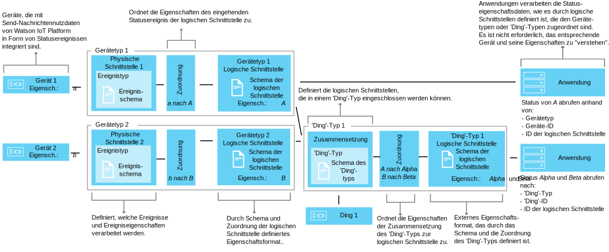

---

copyright:
years: 2016, 2018
lastupdated: "2018-03-22"

---

{:new_window: target="\_blank"}
{:shortdesc: .shortdesc}
{:screen: .screen}
{:codeblock: .codeblock}
{:pre: .pre}

# Erklärung des Datenmanagements
{: #definitions_resources}
Sie verfügen möglicherweise über eine Reihe unterschiedlicher Geräte und Dinge, die mit {{site.data.keyword.iot_full}} verbunden werden sollen. Diese Geräte und Dinge können Daten in unterschiedlichen Formaten publizieren. Mithilfe der Funktion für Geräte- und Assetzwillinge der Datenmanagementkomponente können Sie die Datenausgabe der Geräte und Dinge in einer einzigen logischen Ansicht normalisieren und umwandeln, die von Ihren Anwendungen auf einfache Weise genutzt werden kann. Durch Verwendung einer einzigen logischen Ansicht ist es nicht mehr erforderlich, Ihre Anwendungen so zu konfigurieren, dass sie die unterschiedlichen Datenformate interpretieren können, die von den einzelnen Geräten ausgegeben werden.
Sie können dann mehrere Geräte oder Dinge zusammenfassen, um ein neues Ding in {{site.data.keyword.iot_short_notm}} zu definieren. Mit diesem Ding können Sie Daten organisieren und analysieren, die aus einer Reihe von Eingaben nach {{site.data.keyword.iot_short_notm}} fließen. 

{: shortdesc}

## Übersicht
{: #overview}

Verwenden Sie die Funktion für Gerätezwillinge, um ein logisches Modell eines Geräts zu erstellen. Fassen Sie dann mit der Funktion für Assetzwillinge diese logischen Modelle zusammen, um neue Dinge zu definieren. Mit den logischen Modellen können Sie die Wiederverwendung und Wartung von Code optimieren und die komplexen Aspekte eines IoT-Ökosystems verwalten, jedoch gleichzeitig Anwendungen vor Datenänderungen schützen. 

Anwendungen können auf Anforderung auf den aktuellen Geräte- oder 'Ding'-Status zugreifen. Der Zugriff erfolgt über eine HTTP-API oder durch Subskription für eine bestimmte IoT-Topic-Zeichenfolge. Der Status besteht aus einer Reihe von Statuseigenschaften, die durch eine logische Schnittstelle definiert werden. Wenn sich der Status eines Geräts oder 'Dings' aufgrund der Publikation eines Ereignisses in {{site.data.keyword.iot_short_notm}} ändert, dann werden die Werte dieser Eigenschaften aktualisiert und in {{site.data.keyword.iot_short_notm}} gespeichert.

Durch Verwendung der Funktion für Geräte- und Assetzwillinge können Sie die folgenden Vorteile erzielen:
- Statuseigenschaften zu Ereignisnachrichtendaten zuordnen.
- Mehrere Geräte oder Dinge zum Definieren neuer Dinge zusammenfassen.
- Die von Ihnen bevorzugte Datenstruktur definieren.
- Mehr als eine Darstellung oder Ansicht des Status für Geräte oder Dinge definieren.
- Statusangaben zu Geräten oder Dingen subskribieren oder diese jederzeit über eine HTTP-API abfragen.

Im Folgenden sind einige gängige Anwendungsfälle für die Implementierung der Funktion für Geräte- und Assetzwillinge aufgeführt:
- Bereitstellung konsistenter Schnittstellen für Ihre Anwendungsentwickler, um auf ereignisgesteuerte Gerätedaten in REST-ähnlicher Weise zugreifen zu können.
- Normalisierung von Daten von Geräten unterschiedlicher Marken oder Modelle, die Daten in unterschiedlichen Formaten publizieren.
- Ändern und Konvertieren von Datenformaten entsprechend Ihrem Anwendungsmodell.
- Formatieren von Big Data aus einer Reihe von Geräten oder Dingen, damit die Daten analysiert und auf effektive Weise dargestellt werden können, um Störungen vorherzusagen, Wartungsprozesse zu planen, Ressourcen zu verfolgen und die betriebliche Effizienz zu verbessern.

## Beispiele
{: #examples}
Die folgenden Beispiele veranschaulichen zwei mögliche Lösungsansätze. Beispiel 1 zeigt, wie Sie die Funktion für Gerätezwillinge verwenden können und Beispiel 2 veranschaulicht die Verwendung der Funktion für Assetzwillinge. 

### Beispiel 1: Heterogene Temperatursensoren einer logischen Schnittstelle zuordnen
{: #device-type-example}
In diesem Beispiel wird eine logische Schnittstelle erstellt, die homogene Temperaturstatusdaten in einem Format unabhängig vom tatsächlichen Format der Ereignisnachrichtennutzdaten des Geräts bereitstellt. Das Gerät *tSensor* gibt einen Temperaturmesswert in Celsius von `{ "t" : 34.5 }` an {{site.data.keyword.iot_short_notm}} aus. Das Gerät *tempSensor* gibt einen Temperaturmesswert in Fahrenheit von `{ "temp" : 72.55 }` aus. Die Temperaturmesswerte werden als separate Ereignisse ausgegeben.

Ein umfassendes Szenario, das dieses Beispiel beschreibt, finden Sie in [Schrittweise Anleitung 1](ga_im_index_scenario.html).


Als Teil des Datenflusses der logischen Schnittstelle können Sie Berechnungen für eingehende Daten ausführen, um diese Werte in einem konsistenten Format für die Verarbeitung zu normalisieren. Dies bedeutet, dass Sie Ihre Anwendung nicht so schreiben müssen, dass sie verschiedene Temperaturskalen verstehen oder konvertieren muss. Die Anwendung empfängt einen einzelnen normalisierten Status und verwendet die Statuseigenschaft **temperature** anstelle der gerätespezifischen Eigenschaften **t** und **temp**.

### Beispiel 2: Mehrere Klimageräte zu einer logischen Schnittstelle für 'Ding'-Typen zuordnen
{: #thing-type-example}  
In diesem Beispiel wird das Beispiel mit den Gerätetypen erweitert, indem eine Gruppe von Feuchtigkeitssensoren in Form von separaten Hygrometer-Geräten hinzugefügt wird. Durch die Verwendung einer logischen Schnittstelle für einen 'Ding'-Typ können Daten von unterschiedlichen Gerätetypen in einer Anwendungsschnittstelle zusammengeführt werden, die alle Geräte und Sensoren in einem Raum darstellt. Eine Anwendung kann nun die erfassten Klimadaten für einen Raum abrufen, indem sie eine Verbindung zu der logischen Schnittstelle herstellen, die dem 'Ding'-Typ 'Raumtyp' zugeordnet ist. Das folgende Diagramm zeigt die Konfiguration für den Besprechungsraum 1.

Ein umfassendes Szenario, das dieses Beispiel beschreibt, finden Sie in [Schrittweise Anleitung 2](../information_management/im_index_scenario_thing.html).


Ein Temperaturgerät mit der Bezeichnung *tSensor* und ein Feuchtigkeitsgerät mit der Bezeichnung *Feuchtigkeitssensor 1* geben Umgebungsdaten aus, die in Raum *Besprechungsraum 1* erfasst werden. Die Daten des Temperatur- und des Feuchtigkeitssensors werden separat zwei logischen Schnittstellen für den Gerätetyp zugeordnet: einer für den Gerätetyp Thermometer und einer anderen für den Gerätetyp Hygrometer. Nun wird ein 'Ding'-Typ namens *Raumtyp* erstellt und eine 'Ding'-Instanz des Typs 'Raum' namens *Besprechungsraum 1* instanziiert.

In einem zweiten Besprechungsraum geben ein Temperaturgerät namens *tempSensor* und ein Feuchtigkeitsgerät namens *Feuchtigkeitssensor 2* Umgebungsdaten aus, die in *Besprechungsraum 2* erfasst werden. Basierend auf dem 'Ding'-Typ *Raumtyp* wird eine weitere 'Ding'-Instanz des Typs 'Raum' mit der Bezeichnung *Besprechungsraum 2* erstellt.

Jetzt können Sie eine Zusammensetzung einrichten, die die logischen Schnittstellen für Thermometer und Hygrometer enthält. Die richtigen Umgebungssensoren werden dann den einzelnen Rauminstanzen zugeordnet. Beispiel: *tSensor* und *Feuchtigkeitssensor 1* zu *Besprechungsraum 1* und *tempSensor* und *Feuchtigkeitssensor 2* zu *Besprechungsraum 2*.

Die Endbenutzeranwendung kann nun den Status einer 'Ding'-ID für einen bestimmten Raum anfordern und die Statusangaben für Raumtemperatur und Raumfeuchtigkeit erhalten, ohne dabei die zugrunde liegende Geräteinfrastruktur kennen zu müssen.

## Definitionen und Ressourcen
{: #resources}

Die folgenden Diagramme veranschaulichen die logische Zuordnung zwischen Geräten und Anwendungen in {{site.data.keyword.iot_short_notm}} bei der Verwendung von logischen Schnittstellen.



### Konzepte

Konzepte                        | Beschreibung       
------------- | ------------- | -------------  
Ereignis | Ereignisse sind der Mechanismus, über den Geräte Daten in {{site.data.keyword.iot_short_notm}} publizieren. Das Gerät steuert den Inhalt des Ereignisses und ordnet jedem Ereignis, das von ihm gesendet wird, einen Namen zu.
Eigenschaft | Daten, die einen Teil der Ereignisnutzdaten eines Geräts tragen.
Status | Die aktuellste Darstellung des Status des physischen Geräts, die alle Eigenschaften enthalten kann, die von mehreren eingehenden Ereignissen zugeordnet wurden.
Zusammensetzung  | Ein logisches Konstrukt, das die logischen Schnittstellen definiert, die einem 'Ding'-Typ zugeordnet sind. Die Zusammensetzung wird durch das Schema eines 'Ding'-Typs angegeben.

### Ressourcen für das Datenmanagement
Sie können die Ressourcen über REST-APIs verwalten. Informationen zu den REST-APIs finden Sie in der Dokumentation zur [{{site.data.keyword.iot_short_notm}}-HTTP-REST-API](https://docs.internetofthings.ibmcloud.com/apis/swagger/v0002/state-mgmt.html). 

Typressourcen                        | Beschreibung       
------------- | ------------- | -------------  
Ereignistyp                         | Benutzen Sie die Ereignistypressource, um ein Ereignis zu modellieren, das von einem Gerät publiziert wird. Ein Ereignistyp muss eine Ereignisschemaressource referenzieren. Die Schemaressource definiert die Struktur des Ereignisses, das publiziert wird. </br>**Wichtig:** Eingehende Ereignisse, die in einer logischen Schnittstelle verwendet werden, müssen im JSON-Format angegeben werden.    
Gerätetyp                         |  Verwenden Sie die Gerätetypressource, um Geräte zu Gruppen zusammenzufassen, die gemeinsame Merkmale oder Verhalten aufweisen. Beim Datenmanagement wird der Gerätetyp so erweitert, dass er eine physische Schnittstelle für ein Gerät und mindestens eine logische Schnittstelle enthält, über die der Gerätestatus abgerufen wird. </br>Weitere Informationen hierzu finden Sie im Abschnitt zu IDs und Gerätetypen im Thema zu den [Gerätemodellen](../reference/device_model.html#id_and_device_types).
'Ding'-Typ                         | Ein programmgesteuertes Konstrukt, das eine Gruppe von einem oder mehreren separaten Gerätetypen, 'Ding'-Typen oder beiden darstellt. </br>**Wichtig:** Die Betaversion unterstützt zehn Verschachtelungsebenen von logischen Schnittstellen für 'Ding'-Typen.                                   .
Schemaressourcen                         |  Verwenden Sie Schemeressourcen, um die Struktur des Status eines Ereignisses, eines Geräts oder eines 'Dings' zu definieren. Die folgenden [JSON-Schemas ](http://json-schema.org/){:new_window} werden verwendet: <ul><li>Ein Schema, das einem Ereignistyp zugeordnet ist. Dieses Schema wird zum Definieren der Struktur des Ereignisses verwendet, das durch ein Gerät in {{site.data.keyword.iot_short_notm}} publiziert wird. Diese Schemas werden als Ereignisschemas bezeichnet. <li>Ein Schema, das einer logischen Schnittstelle zugeordnet ist. Dieses Schema wird zum Definieren der Struktur des Geräte- oder 'Ding'-Status verwendet, der in {{site.data.keyword.iot_short_notm}} gespeichert wird. Diese Schemas werden als Schemas der logischen Schnittstelle bezeichnet.</ul>.</ul>

Schnittstellenressourcen                        | Beschreibung       
------------- | ------------- | -------------  
Logische Schnittstelle | Ein programmgesteuertes Konstrukt, zu dem Ihre Anwendungen eine Verbindung herstellen oder das sie subskribieren können, um den Status eines Geräts anzuzeigen. Eine logische Schnittstelle wird verwendet, um die normalisierte Ansicht des Gerätestatus in {{site.data.keyword.iot_short_notm}} zu definieren. Eine logische Schnittstelle muss einem Schema der logischen Schnittstelle zugeordnet werden. Der Status wird als Antwort auf eingehende Geräteereignisse aktualisiert. **Hinweis:** Sie können optional einen aussagekräftigen Aliasnamen für die logische Schnittstelle angeben. Der Aliasname kann in der API-Aufruf- oder Topic-Zeichenfolgensubskription referenziert werden, die verwendet wird, um den Status eines Geräts abzurufen, anstatt die automatisch generierte logische Schnittstellenkennung zu verwenden.  
Physische Schnittstelle                         | Eine physische Schnittstelle wird verwendet, um die Schnittstelle zwischen einem physischen Gerät und {{site.data.keyword.iot_short_notm}} zu modellieren. Ereignistypen können der physische Schnittstelle zugeordnet werden.  

Instanzressourcen                        | Beschreibung       
------------- | ------------- | -------------  
Gerät                         | Ein Gerät stellt ein Asset, ein System oder eine Komponente dar, das bzw. die bei {{site.data.keyword.iot_short_notm}} registriert ist und IoT-Daten in Form von Ereignissen sendet.  
Ding                         | Ein programmgesteuertes Konstrukt, das in logischer Form eine eindeutige Instanz eines 'Ding'-Typs darstellt. Eine 'Ding'-Instanz dient demselben Zweck wie ein registriertes Gerät eines Gerätetyps.


Unterstützende Ressourcen                        | Beschreibung       
------------- | -------------   
Zuordnungen       |Verwenden Sie Zuordnungen, um zu definieren, wie Eigenschaften, die eingehenden Ereignissen zugeordnet sind, Eigenschaften zugewiesen werden, die für eine logische Schnittstelle definiert sind. </br>**Wichtig:** Bevor Zuordnungen definiert werden können, muss mindestens eine logische Schnittstelle einem Geräte- oder 'Ding'-Typ zugeordnet sein.

## Einschränkungen bei der Benennung von Ressourcen
{: #naming_restrictions}
Für Schemas, Ereignistypen, logische und physische Schnittstellen gelten die folgenden Einschränkungen bei der Benennung:
- Der Name muss zwischen 1 und 128 Zeichen lang sein. 
- Der Name muss aus Unicode-Zeichen bestehen. 
- Die folgenden Sonderzeichen sind zulässig: Leerzeichen, Bindestrich (-), Unterstreichungszeichen (_), Punkt (.).
- Der Name darf nicht ausschließlich aus Leerzeichen bestehen.

## Ressourcen erstellen, aktualisieren, aktivieren und inaktivieren
{: #draft_active_resources}

Es gibt zwei Versionen einer Ressource: Eine Entwurfsversion und eine aktive Version. Wenn Sie eine Ressource erstellen, dann wird sie als Entwurfsversion erstellt. 
{: shortdesc}

Die Entwurfsversion stellt eine Arbeitsdatei der Ressource dar, die Sie über APIs direkt abfragen, aktualisieren und löschen können. Erstellen Sie eine aktive Version einer Entwurfsressource, indem Sie entweder den Entwurf eines Gerätetyps, den Entwurf eines 'Ding'-Typs oder den Entwurf einer logischen Schnittstelle aktivieren. Zur Aktivierung anderer Ressourcen (z. B. Schemas) müssen Sie einen Entwurf eines Gerätetyps, einen Entwurf eines 'Ding'-Typs oder einen Entwurf einer logischen Schnittstelle aktivieren, der die Ressource referenziert, die Sie aktivieren möchten.

Um bei Verwendung von REST-APIs zwischen einer Entwurfsressource und einer aktiven Ressource zu unterscheiden, wird das Präfix *draft/* verwendet, um diejenigen Ressourcen zu identifizieren, die sich im Entwurfsstatus befinden.

Im folgenden Beispiel werden Metadaten für eine Entwurfsschemadefinition abgerufen, indem eine angegebene ID benutzt wird:

```
GET /api/v0002/draft/schemas/{schemaId}
```
Im folgenden Beispiel werden Metadaten für eine aktive Schemadefinition abgerufen, indem eine angegebene ID benutzt wird:
```
GET /api/v0002/schemas/{schemaId}
```
*Hinweis:* Die ID ist für die Entwurfsversion und die aktive Version einer bestimmten Ressource gleich.


- Ressource aktivieren
{: #activate_resources}  

Verwenden Sie die Operation **activate-configuration**, um die Konfiguration zu validieren und zu aktivieren, die einem Geräte- oder 'Ding'-Typ zugeordnet ist. Diese Konfiguration enthält die Entwurfsversionen Ihrer Schemas, Ereignistypen, physischen Schnittstellen, logischen Schnittstellen und Zuordnungen. Die Operation **activate-configuration** muss für die Entwurfsversion einer logischen Schnittstelle, eines Gerätetyps oder eines 'Ding'-Typs ausgeführt werden.

Im folgenden Beispiel wird die PATCH-Anforderung dargestellt, für die eine Operation **activate-configuration** für eine Entwurfsversion eines Gerätetyps ausgeführt wird:
```
PATCH /api/v0002/draft/device/types/TSensor
```
Hierbei enthalten die Nutzdaten des PATCH-Hauptteils den folgenden Inhalt:
```
  {
    "operation": "activate-configuration"
  }   
```
Verwenden Sie die folgenden PATCH-Methode, um eine Entwurfsversion eines 'Ding'-Typs zu aktivieren:
```
PATCH /api/v0002/draft/thing/types/RoomType
```

- Unterschiede auflisten
{: #list_differences}  

Verwenden Sie die Operation **list-differences**, um eine Liste der Unterschiede zurückzugeben, die zwischen einer aktiven Konfiguration und der Entwurfskonfiguration einer logischen Schnittstelle, einer Ressource für Gerätetypen oder für 'Ding'-Typen bestehen. Die Operation **activate-configuration** muss für die Entwurfsversion einer logischen Schnittstelle, eines Gerätetyps oder eines 'Ding'-Typs ausgeführt werden. Im folgenden Beispiel wird eine PATCH-Anforderung dargestellt, bei der eine Operation **list-differences** für eine Entwurfsversion eines Gerätetyps ausgeführt wird:
```
PATCH /api/v0002/draft/device/types/TSensor
```
Hierbei enthalten die Nutzdaten des PATCH-Hauptteils den folgenden Inhalt:
```
  {
    "operation": "list-differences"
  }
```
Verwenden Sie die folgende PATCH-Methode, um eine Liste aller Unterschiede zwischen der aktiven Konfiguration und der Entwurfskonfiguration für eine Ressource für 'Ding'-Typen zurückzugeben:
```
PATCH /api/v0002/draft/thing/types/meetingroom1
```

- Ressource inaktivieren  
{: #deactivate_resources}  

Verwenden Sie die Operation **deactivate-configuration**, um die aktive Konfiguration zu entfernen, die einer Ressource zugeordnet ist. Die Operation 'deactivate-configuration' kann nur für die aktive Version einer logischen Schnittstelle, eines Gerätetyps oder eines 'Ding'-Typs ausgeführt werden. Im folgenden Beispiel wird eine PATCH-Anforderung dargestellt, bei der eine Operation **deactivate-configuration** für eine aktive Version eines Gerätetyps ausgeführt wird:
```
PATCH /api/v0002/device/types/TSensor
```
Hierbei enthalten die Nutzdaten des PATCH-Hauptteils den folgenden Inhalt:
```
  {
    "operation": "deactivate-configuration"
  }
```
Verwenden Sie die folgende PATCH-Methode, um einen 'Ding'-Typ zu inaktivieren:
```
PATCH /api/v0002/thing/types/RoomType
```

*Hinweise:*
- Eine aktive Ressource ist schreibgeschützt. Sie können Entwurfsressourcen und aktive Ressourcen filtern und sortieren, indem Sie Abfrageparameter verwenden.
- Sie können einen Gerätetyp nicht löschen, wenn Geräteinstanzen vorhanden sind, die diesem Gerätetyp zugeordnet sind. Der Status des Geräts wird bereinigt, wenn die Geräteinstanz gelöscht wird. 
- Sie können einen 'Ding'-Typ nicht löschen, wenn Geräte- oder 'Ding'-Instanzen vorhanden sind, die diesem 'Ding'-Typ zugeordnet sind. Der Status der 'Ding'-Instanz wird gelöscht, wenn die Geräte- oder die 'Ding'-Instanz gelöscht wird. 
- Sie können nur logische Schnittstellen, Gerätetypen und 'Ding'-Typen direkt über APIs aktivieren. Andere Ressourcen (z. B. Schemas, physische Schnittstellen, Schnittstellen für 'Ding'-Typen und Ereignistypen) werden aktiviert, wenn Sie von einer logischen Schnittstelle, einem 'Ding'-Typ oder einem Gerätetyp referenziert werden, die bzw. der aktiviert wird.  
- Die Operation **activate-configuration** muss für die Entwurfsversion einer logischen Schnittstelle ausgeführt werden, die einem Geräte- oder 'Ding'-Typ zugeordnet ist, oder aber für den Geräte- oder 'Ding'-Typ selbst. Die Operation **activate-configuration** überprüft, ob die Ressourcenkonfiguration gültig ist, bevor die Ressource aktiviert wird. Nach erfolgreichem Abschluss der Aktivierung wird der Status für jede Geräte- oder 'Ding'-Instanz des Geräte- oder 'Ding'-Typs generiert.

## Fehlerbehebung bei der Konfiguration
{: #troubleshooting}
Wenn Ihre Aktivierung fehlschlägt, dann müssen Sie überprüfen, ob alle erforderlichen Konfigurationswerte für einen bestimmten Geräte- oder 'Ding'-Typ angegeben wurden. 

Die folgende Konfiguration muss bereitgestellt und einem Gerätetyp zugeordnet werden:
  - Eine physische Schnittstelle, die mindestens einem Ereignis zugeordnet ist
  - Mindestens eine logische Schnittstelle
  - Zuordnungen für mindestens eine zugeordnete logische Schnittstelle
  
Die folgende Konfiguration muss angegeben und einem 'Ding'-Typ zugeordnet werden:
  - Eine 'Ding'-Schnittstelle, die mindestens einem Geräte- oder 'Ding'-Typ zugeordnet ist
  - Mindestens eine logische Schnittstelle
  - Zuordnungen für mindestens eine zugeordnete logische Schnittstelle  

Sie können außerdem die Operation **validate-configuration** für eine Entwurfsversion der Ressource des Gerätetyps, des 'Ding'-Typs oder der logischen Schnittstelle ausführen, um sicherzustellen, dass die zugehörigen Metadaten gültig sind. Wenn die Metadaten ungültig sind, wird eine Liste der Probleme im Hauptteil der Antwort zurückgegeben.  

Im folgenden Beispiel wird eine PATCH-Anforderung dargestellt, bei der eine Operation **validate-configuration** für eine Entwurfsversion eines Gerätetyps mit dem Namen 'TSensor' ausgeführt wird:  
```
PATCH /api/v0002/draft/device/types/TSensor
```
Hierbei enthalten die Nutzdaten des PATCH-Hauptteils den folgenden Inhalt:
```
  {
    "operation": "validate-configuration"
  }
```  
Das folgende Beispiel zeigt eine nicht erfolgreiche Antwort auf die PATCH-Anforderung:  
```
{
"message": "CUDIM0303I: State update configuration for Device Type 'TSensor' is not valid.",
"details": {
  "id": "CUDIM0303I",
  "properties": [
    "Device Type",
    "Sensor"
  ]
},
"failures": [
  {
    "message": "CUDVS0301E: The device type 'TSensor' does not have any mappings defined for it",
    "details": {
      "id": "CUDVS0301E",
      "properties": [
        "TSensor"
      ]
    }
  }
]
}
```  
Das folgende Beispiel zeigt eine erfolgreiche Antwort auf die PATCH-Anforderung:  
```  
{
"message": "CUDIM0303I: State update configuration for Device Type 'TSensor' is valid.",
"details": {
  "id": "CUDIM0303I",
  "properties": [
    "Device Type",
    "TSensor"
  ]
},
 "failures": []
}
```  
Wenn alle erforderlichen Ressourcen dem Geräte- oder 'Ding'-Typ zugeordnet sind, überprüfen Sie, ob die Eigenschaftszuordnungen gültig sind. Die folgenden Beispiele zeigen Fehler, die möglicherweise auftreten können:

  - Ein Ausdruck referenziert eine Eigenschaft für ein Ereignis, das im Ereignisschema nicht definiert wurde
  - Ein Ausdruck referenziert eine Eigenschaft für einen Status, der im Schema der logischen Schnittstelle nicht definiert wurde
  - Eine Zuordnung ist für eine Eigenschaft definiert, die im Schema der logischen Schnittstelle nicht definiert ist


Sie können auf das folgende Fehlerprotokoll verweisen, das Sie bei der Diagnose von Laufzeitfehlern für Gerätetypen unterstützt:
```
iot-2/type/${typeId}/id/${deviceId}/err/data
```
Sie können auf das folgende Fehlerprotokoll verweisen, das Sie bei der Diagnose von Laufzeitfehlern für 'Ding'-Typen unterstützt:
```
iot-2/type/${typeId}/id/${thingId}/err/data
```

### Ressourcengrenzen

Die folgende Tabelle enthält die maximale Anzahl von Ressourcen, die auf Basis des Plantyps konfiguriert werden können. 

Ressource                   |Standardplan                  | Lite-Plan 
------------- | ------------- | ------------- 
Logische Schnittstellen | 1000 | 10
Physische Schnittstellen           | 1000 | 5
Ereignistypen | 1000 | 10
Schemas |2000 | 20
Referenzen für logische Schnittstellen (Anzahl der logischen Schnittstellen, denen ein Gerätetyp zugeordnet werden kann)  |20 | 5
Ereignistypreferenzen (Anzahl der Zuordnungen zwischen Ereignis-ID und Ereignistyp, die eine physische Schnittstelle haben kann)| 40 | 10


