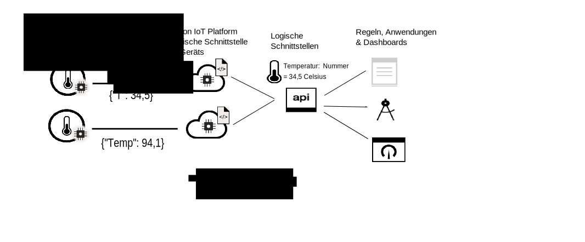

---

copyright:
years: 2016, 2017
lastupdated: "2017-07-20"

---

{:new_window: target="\_blank"}
{:shortdesc: .shortdesc}
{:screen: .screen}
{:codeblock: .codeblock}
{:pre: .pre}

# Einführung zum Datenmanagement
{: #device_twins}

In der modernen Welt existiert eine nie zuvor verfügbare Anzahl von Geräten und Sensoren. Viele dieser Geräte bieten eine ähnliche Funktionalität, Varianten bei Marke, Modell und Version bedeuten jedoch, dass die Daten in unterschiedlichen Formaten ausgegeben werden. Ein Temperatursensor kann beispielsweise die Temperatur in Grad Fahrenheit oder in Grad Celsius aufzeichnen. Es ist nicht effizient, Anwendungen so zu codieren, dass Daten in all diesen Formaten genutzt werden können. Stattdessen müssen die Daten normalisiert werden, um eine einzige logische Ansicht zu erstellen, die von den Anwendungen benutzt werden kann.
{: shortdesc}

Verwenden Sie die Funktion für das Datenmanagement in {{site.data.keyword.iot_full}}, um einen Gerätezwilling zu konfigurieren, mit dem eine normalisierte Ansicht der Daten für Ihre Anwendungen bereitgestellt werden kann.

Ein Gerätezwilling ist eine cloudbasierte digitale Darstellung eines physischen Geräts oder Sensors, das bzw. der über eine Verbindung zu {{site.data.keyword.iot_short_notm}} verfügt. Ein Gerätezwilling erstellt ein logisches Modell der Eigenschaften und Ereignisse, die von einem bestimmten Sensor oder Gerät stammen. Nachdem der Gerätezwilling definiert und instanziiert wurde, stellt er eine konsistente Möglichkeit zur Interaktion mit einem Gerät im REST-Stil bereit, und zwar unabhängig davon, ob das Gerät online oder offline ist. Da ein logisches Modell von mehreren Geräten unterschiedlicher Marken und Modelle gemeinsam genutzt werden kann, ist die IoT-Anwendung nun gegenüber der Variabilität und gegenüber Änderungen innerhalb des Geräteökosystems abgeschirmt. Die Eigenschaften eines Geräts (einschließlich der Informationen zum aktuellen Status des Geräts) können mithilfe einer HTTP-Anforderung oder durch Subskription eines Themas abgerufen werden.

Gerätezwillinge bieten Ihnen Unterstützung in folgenden Bereichen:
- Bereitstellung konsistenter Schnittstellen für Ihre Anwendungsentwickler für den Zugriff auf ereignisgesteuerte Gerätedaten in einer REST-ähnlichen Form.
- Normalisierung von Daten von Geräten unterschiedlicher Marken oder Modelle, die Daten in unterschiedlichen Formaten publizieren.

Zur Verwendung der Funktion für das Datenmanagement für die Konfiguration eines Gerätezwillings müssen Sie die folgenden Informationen definieren, indem Sie Ressourcen in {{site.data.keyword.iot_short_notm}} konfigurieren:
- Die Struktur der Ereignisse, die von Ihrem Gerät gesendet werden. Die Struktur eines eingehenden Ereignisses wird in der physischen Schnittstelle, im Ereignistyp und in den Ereignisschemaressourcen definiert. 
- Die Eigenschaften, die Sie aufzeichnen wollen. Diese Eigenschaften definieren die logische Struktur des Gerätestatus, die von Ihren Anwendungen genutzt werden kann. Die Eigenschaften werden in der logischen Schnittstelle und in den logischen Schemaressourcen definiert.
- Vorgehensweise bei der Zuordnung der Ereignisse der physischen Schnittstelle zu den Eigenschaften der logischen Schnittstelle. Verwenden Sie die Zuordnungsressource, um Ereignisse bestimmten Eigenschaften zuzuordnen.

Im folgenden Diagramm werden die Gerätedaten in unterschiedlichen Formaten angezeigt, die bei {{site.data.keyword.iot_short_notm}} eingehen und umgewandelt und in einer einzigen logischen Ansicht normalisiert werden, die von Back-End-Anwendungen auf einfache Weise genutzt werden kann.  

Weitere Informationen zum Definieren und Konfigurieren von Schlüsselinformationen und Ressourcen finden Sie in [Erklärung des Datenmanagements](ga_im_definitions.html). Sie können einen eigenen Gerätezwilling in {{site.data.keyword.iot_short_notm}} erstellen, indem Sie die in [Einführung zum Datenmanagement](ga_im_example.html) erläuterten Schritte ausführen. Weiterführende Informationen zu den im Handbuch erläuterten Schritten finden Sie im Beispielszenario, das in [Schrittweise Anleitung: Detailliertes Beispiel zur Vorgehensweise beim Arbeiten mit Geräten über eine allgemeine Schnittstelle](ga_im_index_scenario.html#scenario) dokumentiert ist. 
