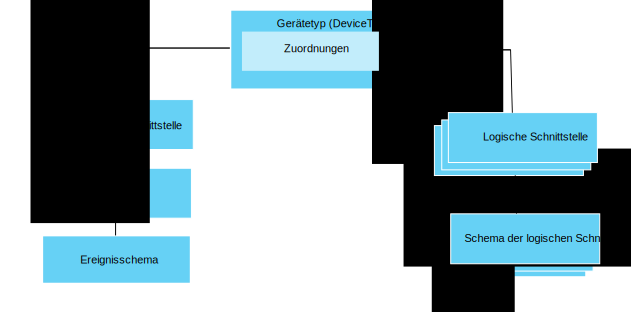

---

copyright:
years: 2016, 2017
lastupdated: "2017-07-21"

---

{:new_window: target="\_blank"}
{:shortdesc: .shortdesc}
{:screen: .screen}
{:codeblock: .codeblock}
{:pre: .pre}

# Einführung zum Datenmanagement
{: #im_example}

Die folgenden Schritte sollen Sie beim Konfigurieren der Ressourcen unterstützen, die zur Verwendung der Funktion für das Datenmanagement erforderlich sind.

Details zur API finden Sie in der Dokumentation zur [{{site.data.keyword.iot_full}}-HTTP-REST-API ](https://docs.internetofthings.ibmcloud.com/apis/swagger/v0002/state-mgmt.html){:new_window}.

**Tipp:** Nähere Informationen zu den einzelnen Schritten finden Sie in den Beispielszenarios. Über die entsprechenden Links können Sie auch direkt zu einem bestimmten Schritt in der schrittweisen Anleitung gelangen. [Schrittweise Anleitung: Detailliertes Beispiel zur Vorgehensweise beim Arbeiten mit Geräten über eine allgemeine Schnittstelle](ga_im_index_scenario.html#scenario) führt Sie durch die Schritte zur Erstellung einer logischen Schnittstelle eines Gerätetyps für heterogene Thermometergeräte.

## Vorbereitende Schritte
Um mit der Nutzung der Funktion für das Datenmanagement beginnen zu können, müssen Sie über mindestens ein [registriertes Gerät](ga_im_index_scenario.html#step14) verfügen, das Daten an {{site.data.keyword.iot_short_notm}} sendet.  

Im folgenden Diagramm wird die logische Ansicht dargestellt, in der gezeigt wird, wie die Ressourcen, die Sie konfigurieren müssen, zusammengestellt werden können:

## Schritte

1. 	Definieren Sie die eingehenden Statuseigenschaften.  
Definieren Sie die eingehenden Statuseigenschaften, die über die logische Schnittstelle für Ihre Anwendungen bereitgestellt werden sollen.  
<dl>
<dd>
<ol>
<li>[Erstellen Sie einen Entwurf einer Ereignisschemadatei](ga_im_index_scenario.html#step1). Bei der Ereignisschemadatei handelt es sich um eine lokale .JSON-Datei, in der die Struktur und das Format eines eingehenden Ereignisses definiert ist.
<li>[Erstellen Sie einen Entwurf einer Ereignisschemaressource für Ihren Ereignistyp](ga_im_index_scenario.html#step2). Das Ereignisschema ist ein programmgesteuertes Konstrukt, das von {{site.data.keyword.iot_short_notm}} verwendet wird.
<li>[Erstellen Sie einen Entwurf eines Ereignistyps, der das Ereignisschema referenziert](ga_im_index_scenario.html#step3). Der Ereignistyp wird von {{site.data.keyword.iot_short_notm}} verwendet, um eine oder mehrere Ereignisschemaressourcen zu einer physischen Schnittstelle zuzuordnen.
<li>[Erstellen Sie einen Entwurf einer physischen Schnittstelle](ga_im_index_scenario.html#step7).
<li>[Fügen Sie den Ereignistyp zum Entwurf der physischen Schnittstelle hinzu](ga_im_index_scenario.html#step8).
<li>[Aktualisieren Sie den Entwurf des Gerätetyps, um eine Verbindung zum Entwurf der physische Schnittstelle herzustellen](ga_im_index_scenario.html#step9).
</ol>
</dd>
</dl>
4. 	Erstellen Sie den Entwurf einer logischen Schnittstelle.
 1. 	[Erstellen Sie eine Schemadatei für einen Entwurf einer logischen Schnittstelle](ga_im_index_scenario.html#step4) für den Entwurf eines Gerätetyps.  
Eine Schemadatei einer logischen Schnittstelle ist eine lokale JSON-Datei, die den Gerätestatus definiert, der für Ihre Anwendungen bereitgestellt wird.
 2. [Erstellen Sie eine Schemaressource für einen Entwurf einer logischen Schnittstelle](ga_im_index_scenario.html#step5) für den Entwurf eines Gerätetyps.
 3.	[Erstellen Sie einen Entwurf einer logischen Schnittstelle](ga_im_index_scenario.html#step6) für den Entwurf eines Gerätetyps.
 4.	[Fügen Sie den Entwurf der logische Schnittstelle zum Entwurf des Gerätetyps hinzu](ga_im_index_scenario.html#step10).
5. 	[Definieren Sie die Entwurfszuordnungen](ga_im_index_scenario.html#step11) für den Entwurf des Gerätetyps.   
Zuordnungen werden zum Zuordnen von eingehenden Eigenschaften zu den Eigenschaften in der logischen Schnittstelle verwendet.
6. 	[Überprüfen und aktivieren Sie die Konfiguration](ga_im_index_scenario.html#step15), die dem Entwurf des Gerätetyps zugeordnet ist.
7. 	[Rufen Sie den Status des aktiven Geräts ab](ga_im_index_scenario.html#step13).  
Überprüfen Sie, ob Ihre Subskriptionen die aktualisierten Gerätedaten anzeigen oder ob die aktualisierten Gerätedaten mit einem REST-Aufruf oder durch Subskription eines Themas zurückgegeben werden können.
