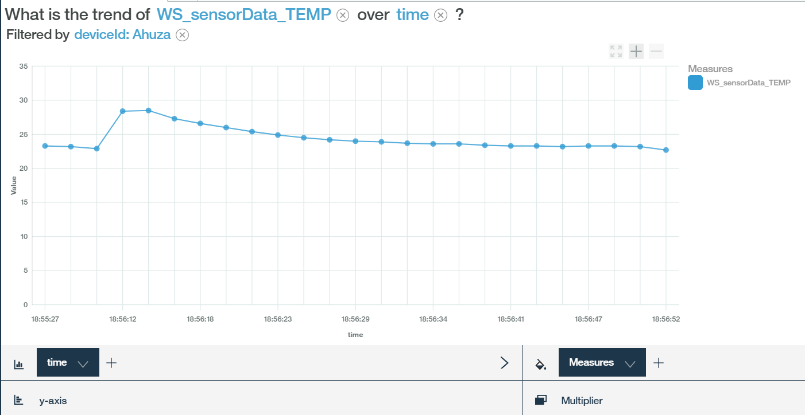
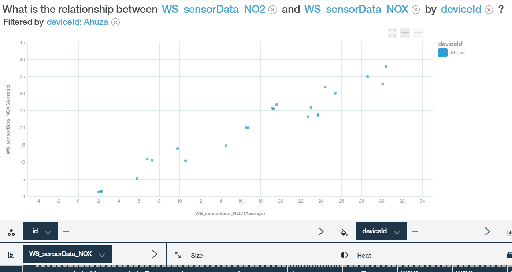

---

copyright:
  years: 2017
lastupdated: "2017-09-18"
---

---

{:new_window: target="blank"}
{:shortdesc: .shortdesc}
{:screen: .screen}
{:codeblock: .codeblock}
{:pre: .pre}


# Daten anhand von Watson Analytics analysieren
{: #WA_integration}  

Sie können {{site.data.keyword.iot_full}} mit Watson Analytics (WA) verwenden, um die Daten, die von Geräten gesendet werden, die mit der Plattform verbunden sind, zu visualisieren und zu untersuchen.
{: shortdesc}

## Übersicht und Ziele

Die folgende Anleitung führt Sie in einzelnen Arbeitsschritten durch den Prozess zum Visualisieren der {{site.data.keyword.iot_short_notm}}-Geräteereignisdaten mithilfe des Analysetools Watson Analytics (WA).

Die Gerätedaten, die an {{site.data.keyword.iot_short_notm}} gesendet werden, können erfasst und mithilfe des {{site.data.keyword.cloudantfull}} NoSQL DB-Service in {{site.data.keyword.Bluemix}} gespeichert werden. Zum Erfassen der Daten müssen Sie zuerst eine Verbindung zwischen {{site.data.keyword.iot_short_notm}} und dem {{site.data.keyword.cloudant_short_notm}}-Service herstellen. Nach der Erfassung der Daten müssen Sie die Daten in eine CSV-Datei exportieren. Sie laden diese Datei in Watson Analytics (WA) hoch, wo Sie die Gerätedaten visualisieren und analysieren können. Gerätedaten werden in {{site.data.keyword.cloudant_short_notm}}-Datenbanken gespeichert, die auf der Grundlage 'Tag', 'Woche' oder 'Monat' arbeiten. Die zur Speicherung verwendete Datenbank hängt vom konfigurierten Bucketintervall ab.


In der vorliegenden Anleitung erhalten Sie Informationen zu den folgenden Themen:

 - Vorgehensweise zum Konfigurieren des Plattformdatenspeichers, um Cloudant NoSQL DB als Archivierungsfunktion einsetzen zu können.
 - Vorgehensweise zum Verwenden des Wettersensorensimulators zum Generieren von Daten, die von der Plattform verwendet werden.
 - Vorgehensweise zum Exportieren der Daten und zum anschließenden Importieren dieser Daten in WA zur Datenanalyse.


## Voraussetzungen

Zur Ausführung dieser Schritte müssen Sie über Zugriff auf [{{site.data.keyword.iot_short_notm}} ](https://console.bluemix.net/catalog/services/internet-of-things-platform){: new_window} mit [Cloudant NoSQL DB ](https://console.bluemix.net/catalog/services/cloudant-nosql-db
){: new_window}und über Zugriff auf [Watson Analytics ](https://www.ibm.com/watson-analytics){: new_window} verfügen.


## Schritt 1. Simulator einrichten
{: #WA_sensor_data}


Zur Durchführung einer aussagekräftigen Analyse benötigen Sie aussagekräftige Daten. Sie können reale Sensordaten simulieren, um sich mit der Vorgehensweise zur Analyse der Watson IoT Platform-Gerätedaten mithilfe von Watson Analytics vertraut zu machen. Dieser Schritt enthält Anweisungen für die folgenden Arbeitsschritte:
 - [Einrichten des Simulators mit einer **vorhandenen Instanz von {{site.data.keyword.iot_short_notm}}**](#sim_existing_platorm)
 - [Einrichten des Simulators mit einer **neuen Instanz von {{site.data.keyword.iot_short_notm}}**](#sim_new_platform)
 - [Herunterladen der vorab erstellten CSV-Beispieldatei mit Daten](#WA_sensor_premade), wenn Sie nicht den Simulator einsetzen möchten


### Wettersensorensimulator mit vorhandener Instanz von {{site.data.keyword.iot_short_notm}} einrichten
{: #sim_existing_platform}

Zum Simulieren realer Sensordatenereignisse für Ihre Organisationen mithilfe des Wettersensorensimulators müssen Sie zuerst den Simulator einrichten. In den auszuführenden Schritten wird davon ausgegangen, dass Sie bereits über eine funktionsbereite Instanz von {{site.data.keyword.iot_short_notm}} verfügen.

1. [Generieren Sie den API-Schlüssel und das Token, die zur Ausführung des Simulators erforderlich sind ](https://console.bluemix.net/docs/services/IoT/platform_authorization.html#api-key){: new_window}.
2. [Stellen Sie die Web-App für den Wettersensorensimulator ](https://bluemix.net/deploy?repository=https://github.com/ibm-watson-iot/guide-weathersensors-simulator){: new_window} bereit und befolgen Sie die detaillierten Anweisungen.

   Weitere Informationen zu den Wettersensoren finden Sie im [Leitfaden zum Wettersensorensimulator ](https://github.com/ibm-watson-iot/guide-weathersensors-simulator){: new_window}.
3. Fahren Sie mit [Schritt 2. Datenbankconnector konfigurieren](#WA_config_db) fort.


### Wettersensorensimulator mit neuer Instanz von {{site.data.keyword.iot_short_notm}} einrichten
{: #sim_new_platform}

Zum Simulieren realer Sensordatenereignisse für Ihre Organisationen mithilfe des Wettersensorensimulators müssen Sie zuerst den Simulator einrichten. Diese Schritte enthalten Anweisungen zur Erstellung einer {{site.data.keyword.iot_short_notm}}-Instanz mit dem Simulator.

1. [Stellen Sie die Web-App des Wettersensorensimulators mit einer Instanz von {{site.data.keyword.iot_short_notm}} ](https://bluemix.net/deploy?repository=https://github.com/ibm-watson-iot/guide-weathersensors-simulator&branch=bindwiotp){: new_window} bereit und befolgen Sie die detaillierten Anweisungen.

   Weitere Informationen zu den Wettersensoren finden Sie im [Leitfaden zum Wettersensorensimulator ](https://github.com/ibm-watson-iot/guide-weathersensors-simulator){: new_window}.
2. Warten Sie, bis das System die Bereitstellung abgeschlossen hat, und navigieren Sie dann zum Bluemix-Dashboard.
3. Starten Sie den {{site.data.keyword.iot_short_notm}}-Service 'wiotp-for-weather-sensors-simulator', der vom Bereitstellungsprozess erstellt wurde.
4. Fahren Sie mit [Schritt 2. Datenbankconnector konfigurieren](#WA_config_db) fort.


### Sensordaten aus vorab erstellter CSV-Beispieldatei verwenden
{: #WA_sensor_premade}

Gehen Sie wie folgt vor, um reale Sensordatenereignisse für Ihre Organisationen mithilfe der vorab erstellten CSV-Datei zu simulieren:

1. [Laden Sie die Cloudant-CSV-Datei herunter](https://github.com/ibm-watson-iot/guide-weathersensors-simulator/releases/download/v1.0/cloudant.csv){: new_window}.
2. Fahren Sie mit [Schritt 5. WA einrichten und Daten visualisieren](#WA_import_data) fort.


## Schritt 2. Datenbankconnector konfigurieren
{: #WA_config_db}

Zur Verwendung von {{site.data.keyword.cloudant_short_notm}} mit Watson Analytics müssen Sie den Plattformdatenspeicher so konfigurieren, dass als Archivierungsfunktion Cloudant NoSQL DB verwendet wird.

1. Klicken Sie im {{site.data.keyword.cloudant_short_notm}}-Dashboard in der Navigationsleiste auf **Erweiterungen**.
2. Klicken Sie unter **Speicherung archivierter Daten** auf **Einrichtung**. Daraufhin werden im Abschnitt **Speicherung archivierter Daten konfigurieren** alle Cloudant NoSQL DB-Services aufgelistet, die innerhalb desselben Bluemix-Bereichs wie {{site.data.keyword.cloudant_short_notm}} verfügbar sind.
3. Wählen Sie den Cloudant NoSQL DB-Service aus, zu dem eine Verbindung hergestellt werden soll.
4. Geben Sie die folgenden Cloudant NoSQL DB-Konfigurationsoptionen an:
  - Bucketintervall = Tag
  - Zeitzone = UTC
  - Datenbankname = default (Standard)
5. Klicken Sie nun auf **Fertig** und bestätigen Sie die Berechtigung zur Herstellung einer Verbindung zum Cloudant-Service. Vergewissern Sie sich, dass die Anzeige von Popups im Browser aktiviert ist, damit Sie Zugriff auf das Bestätigungsfenster haben. Wenn Sie Cloudant NoSQL DB erfolgreich konfiguriert haben, dann wird der Status für die Speicherung archivierter Daten in 'Konfiguriert' geändert und die Gerätedaten werden in {{site.data.keyword.cloudant_short_notm}} NoSQL DB gespeichert.
6. Fahren Sie mit [Schritt 3. Simulator ausführen](#run_simulator) fort.


## Schritt 3. Simulator ausführen
{: #run_simulator}

Der Simulator publiziert reale Wettersensorendaten, die aus 17 Wetterstationen in der Gegend von Haifa stammen, in Ihrer {{site.data.keyword.iot_short_notm}}-Organisation.

1. Navigieren Sie zum Simulator.
2. Geben Sie die folgenden Einzelangaben ein:
   - Watson IoT Platform-Organisation
   - API-Schlüssel
   - Authentifizierungstoken

3. Klicken Sie auf die Option zum **Ausführen des Simulators**. Das Generieren der Daten kann einige Minuten in Anspruch nehmen.
4. Rufen Sie Watson IoT Platform auf, während der Simulator ausgeführt wird, und überprüfen Sie, ob die Geräte erstellt wurden und ob die Ereignisse auf diesen Geräten eingehen. 
5. Fahren Sie mit [Schritt 4. Cloudant-Datenbank exportieren](#WA_export_csv) fort.


## Schritt 4. Cloudant-Datenbank exportieren
{: #WA_export_csv}

Wenn Sie eine {{site.data.keyword.cloudant_short_notm}} NoSQL DB-Instanz zum Speichern der Gerätedaten konfigurieren, werden vom Connector automatisch drei Datenbanken erstellt. Eine dieser Datenbanken wird für das aktuelle Bucketintervall, eine für das nächste Intervall und eine für die Konfigurationsdatenbank erstellt. Am Ende des Intervalls werden die Gerätedaten in der Bucketdatenbank für das neue Intervall gespeichert und eine neue Datenbank wird für das nachfolgende Bucket erstellt.

Die Erweiterungsfunktion für die Speicherung archivierter Daten in {{site.data.keyword.cloudant_short_notm}} erstellt in Cloudant ein Entwurfsdokument mit dem Namen 'iotp'. Dieses Dokument verfügt über eine Listenfunktion mit dem Namen 'csv', die zum Exportieren der Geräteereignisse, die als Dokumente in Cloudant gespeichert werden, im CSV-Format verwendet werden kann. Nur Ereignisse im JSON-Format werden an die CSV-Datei gesendet. Dieses Entwurfsdokument wird automatisch für die nächsten Bucketintervalle an alle neuen Datenbanken weitergegeben.

Die CSV-Datei enthält Informationen zu den Metadaten für Geräteereignisse und den zugehörigen Nutzdaten. Die folgende Liste enthält Beispiele für Ereignismetadaten:
 -	DeviceId
 -	DeviceType
 - 	EventType
 - 	Zeitmarke im ISO 8601-Format

Die Listenfunktion 'csv' dient zur Aufteilung der ursprünglichen Zeitmarke in zwei neue separate Felder für Uhrzeit und Datum. Zusätzlich zu den Metadaten umfasst die Listenfunktion 'csv' die Datenattribute für die Gerätenutzdaten. Diese Nutzdaten werden im Cloudant-Dokument unter dem Schlüssel 'data' angezeigt. Dokumente, die vom Wettersensorensimulator generiert werden, weisen die im folgenden Beispiel dargestellte Struktur auf:

```
{"deviceType": "WS",
  "deviceId": "Old-Market",
  "eventType": "sensorData",
  "format": "json",
  "timestamp": "2017-08-09T16:28:14.666Z",
  "data": { "NO2": 3.2, … }}
```

In der dabei generierten CSV-Datei werden alle Nutzdatenattribute als Spalten dargestellt und erhalten das folgende Präfix:

```
<deviceType>_<eventType>_  
```

Im obigen Beispiel wird eine Spalte mit dem Namen 'WS_sensorData_NO2' zur CSV-Datei hinzugefügt.

Gehen Sie wie folgt vor, um die Cloudant-Datenbank im CSV-Format zu exportieren:  

1. Melden Sie sich bei Cloudant NoSQL DB an.
2. Wählen Sie eine Datenbank aus, die exportiert werden soll.
3. Öffnen Sie die ausgewählte Datenbank.
4. Öffnen Sie eine neue Registerkarte im Browser und geben Sie die folgende URL ein:
   ```
   https://{cloudant service id}-bluemix.cloudant.com/{dbName}/_design/iotp/_list/csv/by-date?include_docs=true
```
   Die Cloudant-Service-ID und der Datenbankname (dbName) müssen in die Werte für Ihre Cloudant-Service-ID und den Namen der ausgewählten Datenbank geändert werden. Die Cloudant-Service-ID kann von der URL des Cloudant-Management-Dashboards kopiert werden.

   **Beispiel:**
   ```
   https://ccf73725-b617-4f3e-8a7e-f5fb09569af4-bluemix.cloudant.com/iotp_115ccv_default_2017-08-23/_design/iotp/_list/csv/by-date?include_docs=true
   ```

   In diesem Beispiel werden die Daten nach Zeitmarke sortiert, da zum Aufrufen der Listenfunktion die Ansicht nach Datum verwendet wird. Sie können Daten auch mit der nativen Filterfunktion der Cloudant-Ansichten filtern. Dazu wird die Ansicht, die in der URL verwendet wird, geändert und es werden die Attribute für den Startschlüssel und den Endschlüssel angewendet.

   **Beispiel:**
   ```
   https://{cloudant service id}-bluemix.cloudant.com/{dbName}/_design/iotp/_list/csv/by-deviceType?include_docs=true&startkey='WS'&endkey='WS'
   ```
   In diesem Beispiel wird die Ansicht für den Gerätetyp (deviceType) verwendet, um die CSV-Datei zu generieren. Nur Dokumente mit der Angabe 'deviceType=WS' werden in die heruntergeladene Datei aufgenommen. Um Dokumente auszuwählen, die innerhalb eines bestimmten Zeitfensters liegen, verwenden Sie die Ansicht nach Datum und die folgende Abfrage-URL (die die Zeitmarken für den gewünschten Bereich ersetzt):
   ```
   https://{cloudant service id}-bluemix.cloudant.com/{dbName}/_design/iotp/_list/csv/by-date?statkey="2017-08-29T12:25:50.995Z"&endkey="2017-08-29T12:25:51.514Z"
   ```
5. Geben Sie bei Bedarf die Cloudant-Berechtigungsnachweise an und laden Sie die CSV-Datei herunter. Der Dateiname wird auf Basis der Ansicht generiert, die in der URL definiert ist. Der Dateiname kann beispielsweise 'by-date.csv' oder 'by-deviceType.csv' lauten.
6. Fahren Sie mit [Schritt 5. WA einrichten und Daten visualisieren](#WA_import_data) fort.


## Schritt 5. WA einrichten und Daten visualisieren
{: #WA_import_data}

Gehen Sie wie folgt vor, um WA einzurichten und die Visualisierung von Daten zu starten:

1. Melden Sie sich unter 'https://watson.analytics.ibmcloud.com' bei WA an.
2. Wählen Sie auf der WA-Homepage **Data** aus.
3. Klicken Sie auf **Local File**, um die lokale CSV-Datei zu importieren. Der Name der CSV-Datei hängt von der Ansicht ab, die Sie zum Exportieren der Daten verwendet haben (z. B. 'by-deviceType' oder 'by-date').
4. Wählen Sie das CSV-Datenasset aus, das Sie hochgeladen haben.
5. Stellen Sie im Feld **Ask a question about your data** eine Frage, die Sie in natürlicher Sprache eingeben können.
5. Öffnen Sie den Visualisierungsvorschlag, der am besten zu Ihrer Frage passt. Der Vorschlag kann manuell überarbeitet werden.
7. Speichern Sie die Visualisierung.


## Beispiele zur Visualisierung von Daten mit WA
{: #WA_visualize}

Im folgenden Abschnitt sind Beispiele zur Analyse von Daten aufgeführt, für die als Analysetool WA eingesetzt wird.

**Hinweis:** Diese Beispiele sollen Ihnen einen Eindruck vermitteln, welche Ergebnisse zu erwarten sind, wenn Sie eigene Visualisierungen ausführen. Die Ergebnisse in den Beispielen, die hier aufgeführt sind, können von den Ergebnissen, die Sie bei der Ausführung dieser Visualisierungen mit den Beispieldaten erhalten, abweichen. Dies kann beispielsweise darauf zurückzuführen sein, dass die Daten zu unterschiedlichen Zeitpunkten (Datum und Uhrzeit) erfasst wurden.

### Gerätestatus visualisieren

Im folgenden Abschnitt erfahren Sie, wie IoT-Geräte mit Daten gefüllt werden. Außerdem werden die folgenden Fragen beantwortet:

1. Wie viele Einheiten haben Meldungen ausgeführt?
2. Welche Aufgliederung der Geräte nach Gerätetyp wird verwendet?
3. Über wie viele Berichte verfügt ein Gerät?
4. Wie viele Berichte wurden pro Gerät gesendet?

**Wie viele Einheiten haben Meldungen ausgeführt?**

In diesem Beispiel wird die Anzahl der Geräte gezählt, die im Verlauf des angegebenen Intervalls Meldungen ausgeführt haben, um festzustellen, ob die Gerätemeldungen in der erwarteten Form durchgeführt wurden. Zur Durchführung dieser Analyse müssen Sie die folgende Frage in WA eingeben oder kopieren und einfügen:

*"Wie viele Einheiten-IDs gibt es?"*

Hier ist das Ergebnis, das zeigt, dass 17 Geräte vorhanden sind:


**Welche Aufgliederung der Geräte nach Gerätetyp wird verwendet?**

In diesem Beispiel wird die Anzahl der Geräte pro Gerätetyp verglichen, die im Verlauf des angegebenen Intervalls Meldungen ausgeführt haben, um festzustellen, ob Geräte aus allen Gerätetypen Meldungen in der erwarteten Form ausgeführt haben. Zur Durchführung dieser Analyse müssen Sie die folgende Frage in WA eingeben oder kopieren und einfügen:

*"Wie hoch ist die Anzahl der Geräte-IDs nach Gerätetyp im Vergleich?"*

Hier ist das Ergebnis, das eine Aufgliederung der Geräte nach Gerätetyp zeigt:


Zur Anzeige dieser Daten in einem Kreisdiagramm müssen Sie links auf **Visualisierung** klicken und dann **Kreis** auswählen.


**Über wie viele Berichte verfügt ein Gerät?**

In diesem Beispiel wird die Anzahl der Berichte gezählt, die von einem Gerät erstellt wurden, um die Netzbedingungen und andere gerätebezogenen Probleme zu erkennen. Zur Durchführung dieser Analyse müssen Sie die folgende Frage in WA eingeben oder kopieren und einfügen:

*"Wie viele Zeilen sind bei Filterung nach Geräte-ID vorhanden: Ahuza"*

**Hinweis:** Es ist nicht notwendig, die vollständigen Feldnamen einzugeben. IBM Watson Analytics (WA) versucht, den vollständigen Feldnamen vorauszusehen, die Filterwerte (z. B. "Ahuza") müssen jedoch vollständig und korrekt eingegeben werden. Wenn Sie für den Filter keinen korrekten Vorschlag sehen, dann klicken Sie auf den Link zum **Anzeigen des nächsten Elements** oder stellen Sie die Frage *"Wie viele Zeilen gibt es?"*. Öffnen Sie dann das Diagramm, klicken Sie auf das Feld für den **Multiplikator** unterhalb des Diagramms und wählen Sie den Parameter für die Geräte-ID (deviceId) in der Liste aus. Nehmen Sie die Auswahl aller nicht relevanten Geräte-IDs zurück.

Hier ist das Ergebnis, das zeigt, dass 25 Zeilen oder Berichte vorhanden sind, die für das Gerät 'Ahuza' erstellt wurden:


**Über wie viele Berichte verfügt jedes der unterschiedlichen Geräte?**

In diesem Beispiel wird der Auslastungsgrad der Geräte auf Basis der Anzahl der Berichte verglichen, die jedes Gerät während des untersuchten Intervalls gesendet hat. Zur Durchführung dieser Analyse müssen Sie die folgende Frage in WA eingeben oder kopieren und einfügen:

*"Wie hoch ist die Anzahl der Zeilen nach Geräte-ID im Vergleich?"*

Dies ist das Ergebnis, das in einem Balkendiagramm den Auslastungsgrad der verschiedenen Geräte angezeigt:


### Sensordaten für Gerätetyp visualisieren

Im folgenden Abschnitt erhalten Sie Informationen zur Zusammenfassung der Sensordaten, die von allen Geräten eines Gerätetyps gemeldet werden. Außerdem werden die folgenden Fragen beantwortet:

1. Welche Durchschnitts-, Mindest- und Maximalwerte liegen für alle gemeldeten Sensorwerte vor?
2. Kann ich ein Histogramm der Ausgabe eines Sensors anzeigen?  
3. Welche Korrelation besteht zwischen zwei Sensoren?


**Welche Durchschnitts-, Mindest- und Maximalwerte liegen für alle gemeldeten Sensorwerte vor?**

Im vorliegenden Beispiel werden die numerischen Parameter in einer Tabelle zusammengefasst, die von allen Geräten eines Gerätetyps gemeldet werden. Aus dieser Tabelle können Sie den Wertebereich ersehen, der in der Umgebung über Sensoren ermittelt wird, und einen umfassenden Überblick über die mit den Sensoren gemessenen Daten erhalten.

Diese Visualisierung muss manuell anhand der folgenden Schritte erstellt werden:

1.	Wählen Sie im Abschnitt zur **Erstellung einer eigenen Visualisierung** die Option **Tabelle** aus.
2.	Klicken Sie auf die Schaltfläche mit dem Pluszeichen für 'Neue Spalte erstellen' und wählen Sie dann **Berechnung** aus.
3.	Ordnen Sie der neuen Spalte einen Namen zu, wählen Sie die Spalte für diese Berechnung in der Dropdown-Liste **Spalten** aus und klicken Sie dann auf **Fertig**, um die Spalte zu duplizieren. Die neue Spalte wird rechts im Datenfach hinzugefügt.
4.	Klicken Sie mit der rechten Maustaste auf den Titel der neuen Spalte, wählen Sie einen Aggregationstyp ('min', 'max' oder 'average') aus und schließen Sie dann das Fenster mit den Eigenschaften.
6.	Wiederholen Sie den Vorgang, um weitere Spalten hinzuzufügen, und blenden Sie das Datenfach dann aus.
7.	Klicken Sie auf **Spalten** und wählen Sie dann unten in der Liste die **Maße** aus.
8.	Klicken Sie auf Option zur **Aggregation nach** und wählen Sie alle Berechnungen aus, die Sie hinzugefügt haben.
9.	Klicken Sie auf **Fertig**.
10.	Speichern Sie die Visualisierung.

Hier ist das Ergebnis, das den Wertebereich zeigt:


**Kann ich ein Histogramm der Ausgabe eines Gerätesensors anzeigen?**

In diesem Beispiel wird das Verhalten eines Sensors geräteübergreifend für einen Gerätetyp bewertet. Dabei wird die Verteilung der Werte ermittelt, die in der Umgebung über Sensoren erfasst wurden. Sie können diese Visualisierung verwenden, um sich einen Überblick über die Umgebung zu verschaffen, die von den Sensoren erfasst wird, und auch zu den Einschränkungen, die in Bezug auf die Sensoren bestehen. Zur Durchführung dieser Analyse müssen Sie die folgende Frage in WA eingeben oder kopieren und einfügen:

*"Wie hoch ist die Anzahl der Zeilen nach TEMP im Vergleich?"*

Dies ist das Ergebnis, in dem der Vergleich der Anzahl der Zeilen dargestellt wird:


**Welche Korrelation besteht zwischen zwei Sensoren?**

In diesem Beispiel erhalten Sie Informationen zu den Korrelationen in der Umgebung. Dazu werden die Messungen von zwei Gerätesensoren geräteübergreifend für einen Gerätetyp verglichen. Zur Durchführung dieser Analyse müssen Sie die folgenden Fragen in WA eingeben oder kopieren und einfügen:

*"Welche Beziehung besteht zwischen NO2 und NOX?"* oder *"Wie sind die Werte für NO2 und NOX einander zugeordnet?"*

Hier ist das Ergebnis, das die Beziehung zwischen den beiden Sensoren zeigt:


Sie können die Sensordaten auch mithilfe farbiger Punkte nach Geräte-ID anzeigen. Hierzu müssen Sie die Geräte-ID im Feld **Farbe** auswählen.

Hier ist das Ergebnis, in dem eine begrenzte Untermenge der Geräte angezeigt wird:


### Sensordetails visualisieren (vertiefende Darstellung)

Im vorliegenden Abschnitt werden die speziellen Parameter untersucht, die von einem bestimmten Gerät gemeldet werden. Dabei werden die folgenden Fragen beantwortet:

1.	Welche Durchschnitts-, Mindest- und Maximalwerte wurden gemeldet?
2.	Kann ich ein Histogramm der Ausgabe eines Gerätesensors anzeigen?
3.	Wie verändert sich ein bestimmter Gerätesensorwert im Zeitverlauf?
4.	Wie werden die Sensorwerte von zwei Geräten im Zeitverlauf verglichen?
5.	Wie werden die Sensorwerte eines Geräts im Zeitverlauf verglichen?
6.	Welche Korrelation besteht zwischen zwei Sensoren eines Geräts?


**Welche Durchschnitts-, Mindest- und Maximalwerte wurden gemeldet?**

Im vorliegenden Beispiel werden die numerischen Parameter, die von einem bestimmten Gerät gemeldet werden, in einer Tabelle zusammengefasst. Die so gewonnenen Daten können z. B. zur Untersuchung der Wertebereiche in der Umgebung oder zur Untersuchung von Sensorenstörungen verwendet werden.

Diese Visualisierung muss manuell anhand der folgenden Schritte erstellt werden:

1)	Wählen Sie im Abschnitt zur **Erstellung einer eigenen Visualisierung** die Option **Tabelle** aus.
2)	Klicken Sie auf die Schaltfläche mit dem Pluszeichen für 'Neue Spalte erstellen' und wählen Sie dann **Berechnung** aus.
3)	Ordnen Sie der neuen Spalte einen Namen zu, wählen Sie die Spalte für diese Berechnung in der Dropdown-Liste **Spalten** aus und klicken Sie dann auf **Fertig**, um die Spalte zu duplizieren. Die neue Spalte wird rechts im Datenfach hinzugefügt.
4)	Klicken Sie mit der rechten Maustaste auf den Titel der neuen Spalte, wählen Sie einen Aggregationstyp ('min', 'max' oder 'average') aus und schließen Sie dann das Fenster **Eigenschaften**.
6)	Wiederholen Sie den Vorgang, um weitere Spalten hinzuzufügen, und blenden Sie das Datenfach dann aus.
7)	Klicken Sie auf **Spalten** und wählen Sie dann die **Messungen** aus.
8)	Klicken Sie auf Option zur **Aggregation nach** und wählen Sie alle Berechnungen aus, die Sie hinzugefügt haben.
9)	Klicken Sie auf **Fertig**.
10)	Wählen Sie im Feld für den Multiplikator den Parameter 'deviceId' und dann die Geräte aus, die angezeigt werden sollen.
11)	Speichern Sie die Visualisierung.

Hier ist das Ergebnis, das die angegebenen Werte zeigt:


**Kann ich ein Histogramm der Ausgabe eines Gerätesensors anzeigen?**

In diesem Beispiel wird das Verhalten eines speziellen Gerätesensors bewertet. Dabei wird die Verteilung der Werte ermittelt, die in der Umgebung über Sensoren erfasst wurden. Sie können diese Visualisierung verwenden, um sich einen Überblick über die Umgebung, die von dem Sensor erfasst wird, und auch zu den potenziellen Störungen zu verschaffen, die im Sensor auftreten können. Zur Durchführung dieser Analyse müssen Sie die folgenden Fragen in WA eingeben oder kopieren und einfügen:

*"Welche Verteilung gilt für TEMP bei Filterung nach der Geräte-ID: Ahuza"* oder *"Wie wird die Anzahl der Zeilen auf Basis von TEMP bei Filterung nach Geräte-ID verglichen: Ahuza"*

Hier ist das Ergebnis, das die Ausgabedaten für die Gerätesensoren in einem Histogramm zeigt:


**Wie verändert sich ein bestimmter Gerätesensorwert im Zeitverlauf?**

Im vorliegenden Beispiel erfahren Sie, wie die Messwerte eines bestimmten Sensors eines bestimmten Geräts sich ändern und damit die Änderungen der Umgebung im Zeitverlauf wiedergeben. Diese Informationen bieten Unterstützung bei der Planung und Problemerkennung. Zur Durchführung dieser Analyse müssen Sie die folgende Frage in WA eingeben oder kopieren und einfügen:

*"Welcher Trend zeigt sich für TEMP im Zeitverlauf bei Filterung nach der Geräte-ID: Ahuza"*

Hier ist das Ergebnis, das den Trend für die Sensordaten im Zeitverlauf zeigt:




**Wie werden die Sensorwerte von zwei Geräten im Zeitverlauf verglichen?**

Im vorliegenden Beispiel werden die Trends der Sensormesswerte unterschiedlicher Geräte verglichen. Dabei werden die Beziehungen zwischen den Geräten ermittelt, um Anomalien, Gerätestörungen und andere Probleme zu erkennen. Zur Durchführung dieser Analyse müssen Sie die folgenden Fragen in WA eingeben oder kopieren und einfügen:

*"Welcher Trend zeigt sich für TEMP im Zeitverlauf nach Geräte-ID?"* oder *"Welcher Trend zeigt sich für TEMP im Zeitverlauf nach Geräte-ID bei Filterung nach der Geräte-ID: Ahuza, Igud"*

Hier ist das Ergebnis, das den Sensorwertevergleich im Zeitverlauf zeigt:


Sie können diese Informationen auch anzeigen, indem Sie unten im Diagramm auf den Parameternamen klicken. Es werden mehrere Zeilen (eine pro Geräte-ID) erstellt. Die relevanten Geräte-IDs können in der Liste ausgewählt werden.


Sie können das Feld für den **Multiplikator** unterhalb des Diagramms verwenden und die Geräte-ID auswählen, um die Diagramme nebeneinander darzustellen.


**Wie werden die Sensorwerte eines Geräts im Zeitverlauf verglichen?**

Im vorliegenden Beispiel werden die Trends von zwei Gerätesensoren miteinander visualisiert, um weitere Einblicke in die Änderungen zu erhalten, die sich im Zeitverlauf in der Umgebung ergeben. Zur Durchführung dieser Analyse müssen Sie die folgende Frage in WA eingeben oder kopieren und einfügen:

*"Welcher Trend zeigt sich für NO2 und NOX im Zeitverlauf nach Geräte-ID bei Filterung nach der Geräte-ID: Ahuza"*

Hier ist das Ergebnis, das den Trend für zwei Gerätesensoren im Zeitverlauf zeigt:


**Welche Korrelation besteht zwischen zwei Sensoren eines Geräts?**

In diesem Beispiel erhalten Sie Informationen zu den Korrelationen in der Umgebung. Dazu werden die Messungen der beiden Gerätesensoren verglichen. Zur Durchführung dieser Analyse müssen Sie die folgenden Fragen in WA eingeben oder kopieren und einfügen:

*"Welche Beziehung besteht zwischen NO2 und NOX bei Filterung nach der Geräte-ID: Ahuza"* oder *"Welche Zuordnung besteht zwischen den Werten von NO2 und NOX bei Filterung nach der Geräte-ID: Ahuza"*

Hier ist das Ergebnis, das die Korrelation zwischen den beiden Sensoren eines Geräts zeigt:




## Weitere Schritte

Weitere Informationen zu WA finden Sie in den folgenden Ressourcen:
- [Watson Analytics Developer Center ](https://developer.ibm.com/watson-analytics/){: new_window}
- [Watson Analytics-Community ](https://www.ibm.com/communities/analytics/watson-analytics/){: new_window}
- [Watson Analytics-Forum ](https://community.watsonanalytics.com/discussions/spaces/15/view.html){: new_window}
