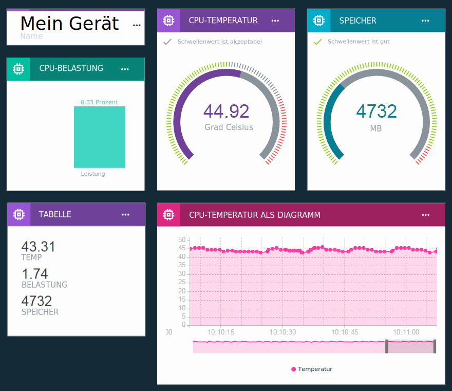

---

copyright:
  years: 2016, 2018
lastupdated: "2018-03-13"

---

{:new_window: target="\_blank"}
{:shortdesc: .shortdesc}
{:screen: .screen}
{:codeblock: .codeblock}
{:pre: .pre}
{:tip: .tip}

# Echtzeitdaten mithilfe von Boards und Karten visualisieren
{: #boards_and_cards}

**Wichtig:** Eine Betaversion, mit der eine neue Methode zur Definition von Regeln für IoT-Gerätedaten zur Verfügung steht,
wird im Rahmen eines umfassenderen Programms mit Änderungen gestartet, das die Bereitstellung von Regeln und Aktionen in {{site.data.keyword.iot_full}} verbessern soll.

Weitere Informationen finden Sie im Blogbeitrag [Alternative Methode zur Definition von Regeln für IoT-Daten ](https://developer.ibm.com/iotplatform/2018/03/01/alternative-approach-defining-rules-iot-data/){: new_window}.

Lesen Sie als ersten Schritt bei der Definition eigener Regeln die Informationen in der Dokumentation [Eingebettete Regeln erstllen (Beta)](information_management/im_rules.html).

## Informationen zu Boards und Karten

Erstellen Sie Boards und Karten, um eigene Dashboards zu erstellen und gemeinsam zu nutzen, die Ihre Gerätedaten in Echtzeit visualisieren.

Mithilfe von Boards und Karten können Sie Datasetwerte, die von mindestens einem Gerät stammen, grafisch darstellen, um eine schnelle Übersicht bereitzustellen und das Verständnis der Daten zu verbessern. Erstellen Sie Boards und fügen Sie Karten hinzu, die Daten als unbearbeitete Zahlen, Echtzeit-Grafiken, Messanzeigen und anderes anzeigen. Fügen Sie Ihren Boards Mitglieder hinzu, um die Boards mit anderen Benutzern in Ihrer Organisation gemeinsam zu nutzen. Ordnen Sie die Karten an und fügen Sie Trennlinien für den erklärenden Text hinzu, um Ihre Präsentation zu optimieren.  

Sie können den Standardsatz von Karten durch das [Erstellen eigener angepasster Karten](custom_cards/custom-cards.html) erweitern.

## Standardboards
{: #default_boards}
Das {{site.data.keyword.iot_short_notm}}-Dashboard weist folgende Standardboards auf:

|Boardname | Beschreibung | Enthaltene Karten
|:---|:---|:---|  
|Nutzungsübersicht  | Die Nutzungsstatistiken für Ihre Organisation. Listet Gerätetypen und verarbeitete Daten auf. | <ul><li>Gerätetypen<li>Übertragene Daten</ul>
|Regelbasierte Analyse | Die Regeln für Ihre Organisation. Zusätzliche Karten listen ausgelöste Alerts, zugeordnete Geräte, Geräteeigenschaften und Alertinformationen auf. | <ul><li>Von mir verwaltete Regeln<li>Regelalerts<li>Informationen zu Regelalerts<li>Zugehörige Geräte<li>Geräteinformationen<li>Geräteeigenschaften</ul>  
|Gerätebezogene Analyse | Die mit Ihrer Organisation verbundenen Geräte. Zusätzliche Karten zeigen Alerts für ausgewählte Geräte, Informationen zu einem ausgewählten Gerät, Geräteeigenschaften und Alertinformationen an. | <ul><li>Für mich relevante Geräte<li>Geräteinformationen<li>Regelalerts für dieses Gerät<li>Informationen zu Regelalerts<li>Geräteeigenschaften</ul>
|Risiko- und Sicherheitsübersicht (Beta) | Der Gesamt-Sicherheitsstatus Ihrer Organisation. Systembediener und Sicherheitsanalysten können Details zu Konformität, Verbindungsstatus für Geräte, Ursachen von Verbindungsfehlern und Geräten, die durch eine Blacklist blockiert bzw. durch eine Whitelist zugelassen sind, anzeigen.  Über die Karte für die Verbindungskonformität kann der Benutzer einen Drilldown auf einen detaillierten Bericht zu nicht konformen Geräten durchführen und den Bericht nach Excel exportieren. | <ul><li>Richtlinienkonformität<li>Verbindungssicherheit<li>Blacklist-/Whitelist-Konformität</ul>

Sie können diese Boards aktualisieren, indem Sie Karten hinzufügen, aktualisieren und entfernen.

Um ein Standardboard in den ursprünglichen Zustand zurückzusetzen, können Sie es löschen. Das Board wird anschließend mit den ursprünglichen Karten erneut erstellt.
{: tip}

## Boards und Karten erstellen
{: #visualizing_data}

{{site.data.keyword.iot_short_notm}} stellt ein integriertes Dashboard bereit, das Sie zum Anzeigen der Echtzeitdaten verwenden können, die von Ihrem Gerät zurückgegeben werden. Die Seite 'Überblick' zeigt Nutzungsinformationen zu Ihrer {{site.data.keyword.iot_short_notm}}-Organisation an, wie beispielsweise Daten und verbrauchter Speicherplatz. Um die Echtzeitdaten zu einem Gerät beim Empfangen anzuzeigen, fügen Sie dieser Seite gerätespezifische Karten hinzu.

Eine Beschreibung der einzelnen Schritte zum Anzeigen von Echtzeitgerätedaten finden Sie in der Anleitung [Boards konfigurieren & Karten im neuen Watson IoT-Dashboard ](https://developer.ibm.com/recipes/tutorials/configuring-the-cards-in-the-new-watson-iot-dashboard/){: new_window}.
{: tip}

Zum Erstellen eines Boards und Hinzufügen einer Karte zu diesem Board gehen Sie folgendermaßen vor:
1. Wählen Sie im {{site.data.keyword.iot_short_notm}}-Dashboard die Option **Boards** aus.
2. Wählen Sie ein Board aus, für das Sie über Bearbeitungsrechte verfügen, oder erstellen Sie ein neues Board.
3. Klicken Sie im Board auf **Neue Karte hinzufügen**.
3. Wählen Sie einen Kartentyp aus.  
**Tipp:** Wenn Sie sich nicht sicher sind, welche Visualisierung für eine Gerätetypkarte geeignet ist, wählen Sie **Generische Visualisierung** aus. Sie können den Kartentyp später ändern.
<dl>
<dt>Geräte</dt>
<dd><table>
<thead>
<tr>
<th>Typ</th>
<th>Angezeigte Daten</th>
</tr>
</thead>
<tbody>
<tr>
<td>Generische Visualisierung</td>
<td>Der Wert mindestens eines Datasets.  **Tipp:** Zum Anzeigen von bis zu drei Datenpunkten in einer kleinen Tabelle wählen Sie die große Widgetgröße aus. </td>
</tr>
<tr>
<td>Kurvendiagramm (Line Chart)</td>
<td>Mindestens ein Dataset in einem Echtzeitdiagramm, in dem geblättert werden kann. Verwenden Sie das Menü 'Einstellungen', um den Datenbereich und die Aufbewahrungsdauer, die Darstellung und die Funktionsweise sowie weitere Einstellungen für die Diagramme festzulegen. </td>
<tr>
<td>Balkendiagramm</td>
<td>Datasetwerte in beschrifteten Balken. Mit dem Menü 'Einstellungen' können Sie zwischen der horizontalen oder vertikalen Richtung hin- und herschalten.</td>
</tr>
<tr>
<td>Ringdiagramm</td>
<td>Mindestens ein Dataset in einer kreisförmigen Darstellung.</td>
</tr>
<tr>
<td>Wert</td>
<td>Der unaufbereitete Wert mindestens eines Datasets.</td>
</tr>
<tr>
<td>Messanzeige</td>
<td>Als Messanzeige angezeigter Wert eines Datasets. Mit dem Menü 'Einstellungen' können Sie für die Messanzeige optional Schwellenwerte für den unteren, mittleren und oberen Datenbereich festlegen.  </td>
</tr>
<tr>
<td>Geräteeigenschaften</td>
<td>Bestimmte Eigenschaften für mindestens ein Gerät.</td>
</tr>
<tr>
<td>Alle Geräteeigenschaften</td>
<td>Alle Eigenschaften für mindestens ein Gerät.</td>
</tr>
<tr>
<td>Geräteliste</td>
<td>Eine Liste für die Überwachung mehrerer Geräte. Eine Liste kann als Datenquelle für andere Karten verwendet werden.  Sie können Listen nach Geräte-ID und -Typ in den Karteneinstellungen filtern. Gerätelisten der Größe L oder größer können auch interaktiv gefiltert werden, indem Sie auf das Filtersymbol in der Karte klicken. Filtereinträge können als Einzeleinträge, Bereiche (x-y) oder durch Kommas getrennt hinzugefügt werden.  Standardmäßig werden in einer Liste die Geräte-ID und der Geräteyp angezeigt. Sie können die Listenkarteneinstellungen auch so konfigurieren, dass in der Karte noch weitere Geräte-Metadaten angezeigt werden.  </td>
</tr>
<tr>
<td>Geräteinformationen</td>
<td>Basisinformationen für ein einzelnes Gerät.</td>
<tr>
<td>Gerätezuordnung</td>
<td>Position von Geräten in einer Geräteliste.</td>
</tr>
</tbody>
</table>
</dd>
<dt>Analyse</dt>
<dd>
<table>
<thead>
<tr>
<th>Typ</th>
<th>Angezeigte Daten</th>
</tr>
</thead>
<tbody>
<tr>
<td>Regeln</td>
<td>Eine Liste der Regeln, die Alerts aufweisen.</td>
</tr>
<tr>
<td>Regelalerts</td>
<td>Eine Liste der für ein Gerät aufgetretenen Alerts.</td>
</tr>
<tr>
<td>Alertinformationen</td>
<td>Basisinformationen für einen einzelnen Alert.</td>
</tr>
</tbody>
</table>
</dd>
<dt>Risikomanagement (Beta)</dt>
<dd>Nur für Organisationen verfügbar, die [Erweiterte Sicherheit](reference/security/RM_security.html) verwenden.
<table>
<thead>
<tr>
<th>Typ</th>
<th>Angezeigte Daten</th>
</tr>
</thead>
<tbody>
<tr>
<td>Richtlinienkonformität</td>
<td>Eine Übersicht über die Verbindungssicherheit und die Geräte mit Blacklist und Whitelist.</td>
</tr>
<tr>
<td>Blacklist-/Whitelist-Konformität</td>
<td>Die Anzahl der Geräte mit Blacklist oder Whitelist.</td>
</tr>
<tr>
<td>Verbindungssicherheit</td>
<td>Die Anzahl der Geräte, die bei der Verbindungssicherheitsprüfung durchgefallen sind.</td>
</tr>
</tbody>
</table>
</dd>
<dt>Nutzung</dt>
<dd>
<table>
<thead>
<tr>
<th>Typ</th>
<th>Angezeigte Daten</th>
</tr>
</thead>
<tbody>
<tr>
<td>Gerätetypen</td>
<td>Ein Kreisdiagramm, das die Anzahl der registrierten Geräte pro Gerätetyp für Ihre Organisation anzeigt.</td>
</tr><tr>
<td>Übertragene Daten</td>
<td>Für Ihre Organisation geltende Nutzungsstatistiken für übertragene Daten.</td>
</tr>
</tbody>
</table>
</dd>
<dt>Basis</dt>
<dd>
<table>
<thead>
<tr>
<th>Typ</th>
<th>Angezeigte Daten</th>
</tr>
</thead>
<tbody>
<tr>
<td>Trennzeichen</td>
<td>Eine horizontale Trennlinie zum Strukturieren und Gruppieren von Karten im Board.</td>
</tr>
</tbody>
</table>
</dd>
</dl>

4.	Wählen Sie die Quellendaten für die Karte aus.  
Wählen Sie mindestens eine Datenquelle für die Karte aus und klicken Sie auf **Weiter**.  
Datenquellen können einzelne registrierte Geräte oder andere Karten sein. Zum Verwenden einer Karten-Datenquelle muss im Board eine Liste oder eine Mapkarte vorhanden sein.  
5. Fügen Sie für jede Ihrer Datenquellen mindestens ein Dataset hinzu.
 - Geräte
    2. Wählen Sie ein Ereignis aus, das den Datenpunkt enthält, den Sie anzeigen möchten.
    3.	Wählen Sie die Eigenschaft aus, die den Datenpunkt darstellt.
    1.	Bennen Sie das Dataset mit einem eindeutigen Namen.
    4.	Wählen Sie den Typ, die Einheit, die Genauigkeit und die minimalen und maximalen Werte für den Datenpunkt aus.  
    Nach Beenden können Sie auf **Neues Dataset** klicken, um weitere Datasets hinzuzufügen, oder Sie können auf **Weiter** klicken.
 - Listen
    2. Wählen Sie einen Gerätetyp aus oder wählen Sie **Jeder Gerätetyp** aus.
    2. Wählen Sie ein Ereignis aus, das den Datenpunkt enthält, den Sie anzeigen möchten.
    3.	Wählen Sie die Eigenschaft aus, die den Datenpunkt darstellt.
    1.	Bennen Sie das Dataset mit einem eindeutigen Namen.
    4.	Wählen Sie den Typ, die Einheit, die Genauigkeit und die minimalen und maximalen Werte für den Datenpunkt aus.  
    Nach Beenden können Sie auf **Neues Dataset** klicken, um weitere Datasets hinzuzufügen, oder Sie können auf **Weiter** klicken.
5.	Passen Sie die Kartenvisualisierung in der Kartenvorschau an.  
 7. Wählen Sie die Größe der Darstellung.  
Zusätzlich zum Einstellen der Größe der Karte in Ihrem Board werden mit der Einstellung der Kartengröße auch andere Darstellungsvariablen gesteuert, z. B. die Anzahl der aufgelisteten Geräte, die angezeigten Graph-Metadaten u.a.   
**Tipp:** Klicken Sie auf die verschiedenen Größenbezeichnungen, um Vorschauen der Karten in den verschiedenen Größen zu sehen.
 8. Konfigurieren Sie gegebenenfalls zusätzliche Einstellungen.  
Sofern es von der Karte unterstützt wird, klicken Sie auf **Einstellungen**, um zu sehen, welche zusätzlichen Einstellungen Sie konfigurieren können, z. B. Datenbereiche für Karten mit Zustandsanzeiger oder Filteroptionen für Gerätelistenkarten.
6. Aktualisieren Sie die Karteninformationen.  
 1. Geben Sie einen Titel und eine Beschreibung für die Karte ein und wählen Sie optional ein Farbschema aus.   
 2. Klicken Sie auf **Abschicken**, um die Karte zu erstellen.
7.	Positionieren Sie die neue Karte in Ihrem Board, indem Sie sie an eine geeignete Position ziehen.  
