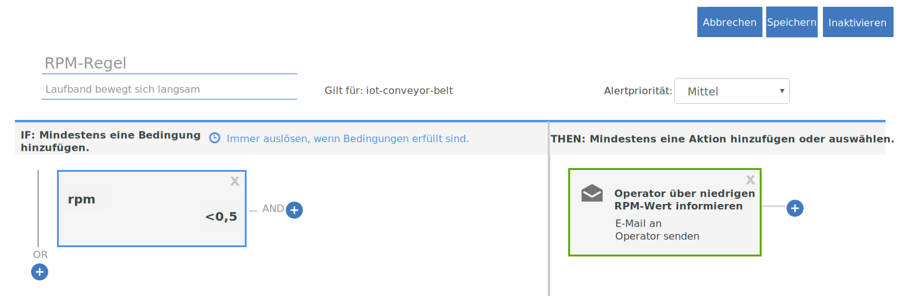

---

copyright:
  years: 2017, 2018
lastupdated: "2018-01-11"

---

{:shortdesc: .shortdesc}
{:new_window: target="_blank"}
{:codeblock: .codeblock}
{:pre: .pre}
{:screen: .screen}
{:tip: .tip}

# Anleitung 2: Grundlegende Echtzeitregeln und -aktionen verwenden

**Wichtig:** Eine Betaversion, mit der eine neue Methode zur Definition von Regeln für IoT-Gerätedaten zur Verfügung steht,
wird im Rahmen eines umfassenderen Programms mit Änderungen gestartet, das die Bereitstellung von Regeln und Aktionen in {{site.data.keyword.iot_full}} verbessern soll.

Weitere Informationen finden Sie im Blogbeitrag [Alternative Methode zur Definition von Regeln für IoT-Daten ](https://developer.ibm.com/iotplatform/2018/03/01/alternative-approach-defining-rules-iot-data/){: new_window}.

Lesen Sie als ersten Schritt bei der Definition eigener Regeln die Informationen in der Dokumentation [Eingebettete Regeln erstellen (Beta)](../information_management/im_rules.html).

## Übersicht und Ziel
{: #overview}  

Verwenden Sie die Anweisungen in dieser Anleitung, um eine Gruppe von Basisregeln und -aktionen für die Echtzeitanalyse der IoT-Daten Ihres Laufbands zu konfigurieren.

Nachdem Sie das Laufband erfolgreich konfiguriert, es mit {{site.data.keyword.iot_full}} verbunden und Daten gesendet haben, sollten Sie mit der Nutzung der Daten beginnen, indem Sie Regeln und Aktionen verwenden.



Im Rahmen dieser Anleitung werden Sie die folgenden Arbeitsschritte ausführen:
- Erstellen eines Nachrichtenschemas für die Ereignisdaten Ihres Laufbandgeräts.
- Erstellen und Auslösen einer Regel.
- Erstellen einer E-Mail-Aktion.

## Voraussetzungen
{: #prereqs}  
Sie müssen über ein verbundenes Gerät des Gerätetyps `iot-conveyor-belt` verfügen, das Ereignisse mit dem Ereignisnamen `sensorData` und mit Nachrichtennutzdaten sendet, die die folgenden Eigenschaften umfassen:
```
{
	"d": {
		"id": "belt1",
		"ts": 1494946276931,
		"ay": "0.00",
		"running": true,
		"rpm": "1.0"
		}
}
```
Weitere Informationen zu den Geräteereignissen und Nachrichtenformaten finden Sie in [Ereignisse publizieren](/docs/services/IoT/devices/mqtt.html#publishing_events).  
Wenn Sie [Anleitung 1: Einführung zu {{site.data.keyword.iot_short_notm}} und zu einem simulierten Laufband](getting-started-iot-conveyor.html) ausgeführt haben, dann haben Sie alle Vorbereitungen getroffen.  
{: tip}

## Schritt 1 - Nachrichtenschema für Beispielapp erstellen
{: #create_schema}

Zur Verwendung der Eigenschaften, die von Ihrem Gerät als Auslöser für Ihre Regeln gesendet werden, müssen Sie diese Eigenschaften zuerst einem Nachrichtenschema in {{site.data.keyword.Bluemix_notm}} zuordnen. Weitere Informationen zu diesem Thema finden Sie in [Schemas für Gerätetypen erstellen](/docs/services/IoT/im_schemas.html#iotrtinsights_task).
1. Wechseln Sie im {{site.data.keyword.iot_short_notm}}-Dashboard zu **Geräte** und wählen Sie **Schemas verwalten** aus.
2. Klicken Sie auf **Schema hinzufügen**.
3. Wählen Sie den Gerätetyp **iot-conveyor-belt** aus und klicken Sie auf **Weiter**.
4. Fügen Sie Eigenschaften zum Schema hinzu.
 1. Klicken Sie auf **Eigenschaft hinzufügen**.
 2. Wählen Sie **Von verbundenen Geräten** aus.
 3. Senden Sie einen Datenpunkt des Laufbands, indem Sie den RPM-Wert ändern.
Klicken Sie in der Web-App für das Laufband auf **Stoppen** oder **Starten**, um eine Nachricht zu publizieren.  
Die Eigenschaftsliste wird mit den Eigenschaften gefüllt, die von dem Gerät gesendet wurden.
 4. Wählen Sie alle Eigenschaften aus und klicken Sie dann auf **OK**.
5. Klicken Sie auf **Fertigstellen**, um das Schema zu erstellen.  

Das Schema wird erstellt und als RPM-Datentyp wird 'Gleitkomma' festgelegt.

## Schritt 2 - Einfache Regel für die RPM-Eigenschaft erstellen
{: #create_rule}  
Die {{site.data.keyword.Bluemix_notm}}-Regelengine vergleicht Eigenschaftsdatenpunkte, die von Ihrem Gerät gesendet werden, mit statischen Grenzwerten, die in der Regel festgelegt sind, und löst die Regel aus, wenn die Regelbedingungen erfüllt werden. Weitere Informationen zu Regeln finden Sie in [Cloud Analytics](/docs/services/IoT/cloud_analytics.html#rules).
Zur Erstellung einer Regel, die ausgelöst wird, wenn der RPM-Wert des Laufband kleiner als 0,5 ist, müssen Sie wie folgt vorgehen:
1. Ändern Sie den RPM-Eigenschaftstyp in 'Gleitkomma'.  
Wenn Sie eine Regel erstellen, dann müssen Sie den numerischen RPM-Wert mit einem Grenzwert vergleichen. Hierzu muss die Eigenschaft als Gleitkomma- oder Ganzzahl erkannt werden.
 1. Wechseln Sie im {{site.data.keyword.iot_short_notm}}-Dashboard zu **Geräte** und wählen Sie **Schemas verwalten** aus.
 1. Klicken Sie auf das neue Schema, das Sie soeben erstellt haben, und wählen Sie **Eigenschaften** aus.
 2. Klicken Sie auf das Bearbeitungssymbol, um das Schema zu bearbeiten.
 3. Klicken Sie auf das Bearbeitungssymbol neben der Eigenschaft `rpm`.
 4. Ändern Sie den Datentyp in `Gleitkomma`.  
 5. Klicken Sie auf **OK**.
 6. Klicken Sie auf **Fertigstellen**, um das Schema zu aktualisieren.  
2. Erstellen Sie eine Regel.
 1. Wechseln Sie im Dashboard zu **Regeln**.
 2. Klicken Sie auf **Cloud-Regel erstellen**.
 3. Geben Sie als Name `RPM-Regel` ein.
 4. Konfigurieren Sie die Regel so, dass sie auf das Schema **iot-conveyor-belt** angewendet wird.
 5. Klicken Sie auf **Weiter**.
 6. Fügen Sie eine Regelbedingung hinzu.
    6. Klicken Sie auf die Kachel **Neue Bedingung**, um eine Bedingung für die Regel hinzuzufügen.
    7. Wählen Sie die Eigenschaft **rpm** aus.
    8. Wählen Sie den Operator 'Kleiner als' (`<`) aus.
    9. Geben Sie als Wert `0,5` ein und klicken Sie auf **OK**.
    10. Klicken Sie auf **Speichern** und dann auf **Schließen**.
 11. Klicken Sie auf **Schließen**.  
Die neue Regel wird nun im Status 'Inaktiviert' aufgelistet.
12. Klicken Sie auf den Statusschalter, um die Regel zu aktivieren.
Als Status wird nun 'Aktiviert' angezeigt.

## Schritt 3 - Regel auslösen
{: #trigger_rule}
Durch eine Reduzierung des RPM-Werts können Sie Probleme mit dem Laufband simulieren, die eventuell ein Eingreifen des Operators erforderlich machen. Wenn der Grenzwert für RPM erreicht ist, dann wird im Dashboard ein Alert angezeigt.
1. Wählen Sie im {{site.data.keyword.iot_short_notm}}-Dashboard die Option **Boards** aus.
3. Wählen Sie das Board **Rule-Centric Analytics** aus.
4. Reduzieren Sie in der Web-App für das Laufband den RPM-Wert auf unter 0,5 RPM.
Das Gerät sendet Daten an {{site.data.keyword.iot_short_notm}}, wenn die Sensormesswerte sich ändern. Sie können diesen Datenversand simulieren, indem Sie das Laufband stoppen oder starten oder die Geschwindigkeit des Laufbands ändern.  
5. Überprüfen Sie, ob die `RPM-Regel` auf der Karte 'Regeln mit Alerts' erscheint.
6. Wählen Sie den neuen Alert auf der Karte 'Regelalerts' aus und zeigen Sie die Datenpunkte an, die die Regel auf der Karte 'Regelalerts' ausgelöst haben.  
Weitere Informationen zum Alert erhalten Sie in den Gerätedetails auf den Karten für die zugeordneten Geräte, Geräteinformationen und Geräteeigenschaften.  
{: tip}

## Schritt 4 - Auszuführende Aktion bei Auslösung der RPM-Regel erstellen
{: #create_action}
Zusätzlich zur Anzeige eines Alerts im {{site.data.keyword.iot_short_notm}}-Dashboard können Sie Aktionen erstellen, die ausgeführt werden sollen, wenn eine Regel ausgelöst wird. Hierbei kann es sich um das Senden einer E-Mail an den Operator handeln, in dem dieser aufgefordert wird, das Laufband zu überprüfen, wenn der RPM-Wert zu niedrig wird. Weitere Informationen hierzu finden Sie in [Cloud Analytics](/docs/services/IoT/cloud_analytics.html#shared).
Gehen Sie wie folgt vor, um eine E-Mail-Aktion zu erstellen:
1. Wechseln Sie im {{site.data.keyword.iot_short}}-Dashboard zu **Regeln**.
2. Klicken Sie auf die **RPM-Regel**.
3. Klicken Sie auf die Kachel **Neue Aktion**.
4. Erstellen Sie eine Aktion.
 1. Klicken Sie auf **Aktion hinzufügen**.
 2. Geben Sie als Aktionsnamen `Operator über niedrigen RPM-Wert informieren` ein.
 3. Geben Sie die Beschreibung `E-Mail an Operator senden` ein.
 4. Wählen Sie den Typ **E-Mail senden** aus.
 5. Klicken Sie auf **Weiter**.
 6. Geben Sie in der Betreffzeile Folgendes ein: `Altert für niedrigen RPM-Wert`.
 7. Wählen Sie für das Feld 'An' **Bestimmte Personen** aus und geben Sie `operator@company.com` ein.  
Ersetzen Sie die E-Mail-Adresse durch Ihre eigene E-Mail-Adresse.
 8. Wählen Sie **Daten einfügen** aus, um die Gerätedaten in die E-Mail einzuschließen.
 9. Klicken Sie auf **Fertigstellen**, um die Aktion zu speichern.  
5. Wählen Sie die Aktion in der Liste aus und klicken Sie auf **OK**, um die Aktion festzulegen.
6. Klicken Sie auf **Speichern**, um die Aktion mit der Regel zu aktivieren.
7. Testen Sie die neue Aktion.
 4. Reduzieren Sie in der Web-App für das Laufband den RPM-Wert auf unter 0,5 RPM.
 5. Überprüfen Sie, ob Sie die Alert-E-Mail erhalten haben.  
Der Nachrichtenhauptteil hat das im folgenden Beispiel aufgeführte Format:
> **Regel:** RPM-Regel  
> **Gerät:** 3m5wxr:iot-conveyor-belt:belt1  
> **Datum:** 2017-05-09T18:21:21.567Z  
> **Bedingung:**  
> iot_conveyor_belt.d.rpm<0.5  
> **Eingehende Nachricht:**  
> {"d":{"id":"belt1","ts":1494354089837,"ay":"0.00","rpm":"0.4","running":true},"ruleContent":{"jobID":"sdIyBfdu","contextSchemas":[],"ruleDescription":"","severity":4,"messageSchemas":["iot_conveyor_belt"],"disabled":false,"ruleCondition":"iot_conveyor_belt.d.rpm<0.5","transforms":[],"name":"RPM rule","actions":["pziIRovt"],"id":"ncKK4N7k","updated":"9 May 2017 18:20:25 GMT","created":"9 May 2017 17:41:38 GMT","version":7}}  
> Dies ist eine automatisch generierte E-Mail. Beantworten Sie sie nicht. Bei Fragen zu diesem Alert wenden Sie sich an den zuständigen Systemadministrator.

## Weitere Schritte
{: #whats_next}  
Fahren Sie mit der nächsten Anleitung fort oder springen Sie zu einem anderen Thema, das für Sie von Interesse ist:
- [Anleitung 3: Gerätedaten überwachen](getting-started-iot-monitoring.html)  
Nachdem Sie nun mindestens ein Gerät verbunden und mit der effizienten Nutzung der Gerätedaten begonnen haben, sollten Sie nun mit der Überwachung einer Gruppe von Geräten und der von diesen Geräten gesendeten Echtzeitdaten beginnen.
- [Anleitung 4: Große Anzahl von Geräten simulieren](getting-started-iot-large-scale-simulation.html)  
Die Beispielapp für das Laufband in Pfad A ermöglicht Ihnen die manuelle Simulation einzelner oder mehrerer Laufbandgeräte. Diese Anleitung ermöglicht Ihnen die Konfiguration einer simulierten Umgebung, die eine große Anzahl von Geräten enthält.
- [Andere IoT-Geräte mit {{site.data.keyword.iot_short_notm}} verbinden](/docs/services/IoT/iotplatform_task.html)
- [Weitere Informationen zu {{site.data.keyword.iot_short_notm}}](/docs/services/IoT/iotplatform_overview.html)
- [Weitere Informationen zu {{site.data.keyword.iot_short_notm}}-APIs](/docs/services/IoT/reference/api.html)
