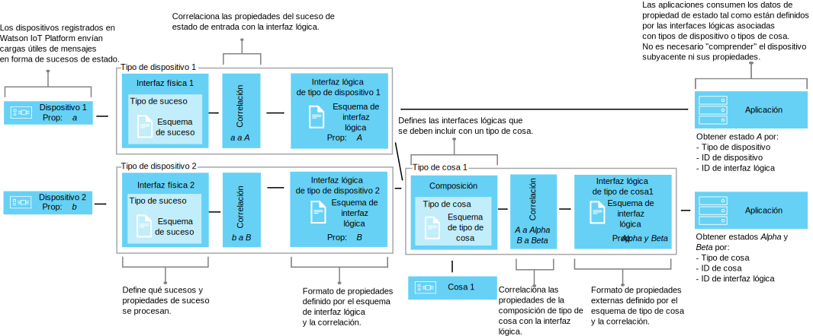

---

copyright:
years: 2016, 2018
lastupdated: "2018-03-22"

---

{:new_window: target="\_blank"}
{:shortdesc: .shortdesc}
{:screen: .screen}
{:codeblock: .codeblock}
{:pre: .pre}

# Visión general de la gestión de datos
{: #definitions_resources}
Es posible que tenga una cantidad de dispositivos o cosas diferentes que desee conectar a {{site.data.keyword.iot_full}}, y es posible que esos dispositivos o cosas puedan publicar datos en formatos distintos. Utilizando el dispositivo las características de duplicado de dispositivo y de duplicado de activo del componente de gestión de datos, puede normalizar y transformar la salida de datos de sus dispositivos y cosas en una única vista lógica que puedan consumir fácilmente sus aplicaciones. Al utilizar una única vista lógica, elimine la necesidad de configurar las aplicaciones para que comprendan los diferentes formatos de datos que se van a producir por cada dispositivo o cosa. A continuación, puede agregar varios dispositivos o cosas juntos para definir una cosa nueva en {{site.data.keyword.iot_short_notm}}. Utilice la cosa para ayudarle a organizar y analizar los datos que se están entrando en {{site.data.keyword.iot_short_notm}} desde una gama de entradas. 

{: shortdesc}

## Visión general
{: #overview}

Utilice la característica de duplicado de dispositivo para crear un modelo lógico de un dispositivo y, a continuación, utilice la característica de duplicado de activo para agregar estos modelos lógicos para definir nuevas cosas. Estos modelos lógicos le ayudan a mejorar la reutilización y el mantenimiento de código y a gestionar las complejidades de un ecosistema IoT manteniendo sus aplicaciones aisladas de cambios en los datos. 

Las aplicaciones pueden acceder al estado actual de un dispositivo o cosa en una solicitud mediante una API HTTP, o bien mediante la suscripción a una serie de tema IoT. El estado consta de un conjunto de propiedades de estado que se han definido mediante la interfaz lógica. Si el estado de un dispositivo o cosa cambia como resultado de un suceso publicado en {{site.data.keyword.iot_short_notm}}, los valores de estas propiedades se actualizan y almacenan en {{site.data.keyword.iot_short_notm}}.

Utilizando las características de duplicado de dispositivo y de activo, puede obtener las siguientes ventajas:
- Correlacionar propiedades de estado con datos de mensajes de suceso.
- Agregar múltiples dispositivos o cosas juntas para definir nuevas cosas.
- Definir la estructura de datos que prefiera.
- Definir más de una representación o vista del estado del dispositivo o de la cosa.
- Suscribirse a estados de dispositivo o cosa, o consultarlos en cualquier momento a través de una API HTTP.

Algunos casos de uso común para implementar las características de duplicado de dispositivo y de activo incluyen:
- Ofrecer a los desarrolladores de aplicaciones interfaces coherentes para acceder a los datos de dispositivos controlados por sucesos de forma REST.
- Normalizar datos procedentes de dispositivos de diferentes modelos que publican datos en distintos formatos.
- Modificar y convertir formatos de datos para que se adapten a su modelo de aplicación.
- Dar formato a big data de un rango de dispositivos o cosas para que los datos se puedan analizar y presentar de la forma más eficaz con el fin de ayudar a predecir anomalías, planificar el mantenimiento, realizar un seguimiento de los activos y mejorar la eficiencia operativa.

## Ejemplos
{: #examples}
Los ejemplos siguientes ilustran dos posibles soluciones. El Ejemplo 1 ilustra cómo puede utilizar la característica de duplicado de dispositivo y el Ejemplo 2 ilustra cómo puede utilizar la característica de duplicado de activo. 

### Ejemplo 1: Correlación de sensores de temperatura heterogéneos con una interfaz lógica
{: #device-type-example}
En este ejemplo, creamos una interfaz lógica que proporciona datos de estado de temperatura homogéneos en un formato, sin importar cuál sea el formato de carga útil del mensaje de suceso de dispositivo real. El dispositivo *tSensor* publica una lectura de temperatura de Celsius de `{ "t" : 34.5 }` a {{site.data.keyword.iot_short_notm}}. El dispositivo *tempSensor* publica una lectura de temperatura de Fahrenheit de `{ "temp" : 72.55 }`. Las lecturas de temperatura se publican como sucesos separados.

Para ver un caso de ejemplo completo detallado que describe este ejemplo, consulte la [Guía paso a paso 1](ga_im_index_scenario.html).


Como parte del flujo de datos de interfaz lógica, puede realizar cálculos sobre los datos de entrada para normalizar estas lecturas en un formato coherente para su proceso. Esto significa que no es necesario que escriba la aplicación para entender o convertir distintas escalas de temperatura. La aplicación recibe un único estado normalizado y utiliza la propiedad de estado **temperature** en lugar de las propiedades **t** y **temp** específicas de cada dispositivo.

### Ejemplo 2: Correlación de varios dispositivos de clima con una interfaz lógica de tipo de cosa
{: #thing-type-example}  
En este ejemplo, ampliaremos el ejemplo de tipo de dispositivo añadiendo un conjunto de sensores de humedad en forma de distintos higrómetros. Mediante el uso de una interfaz lógica de tipo de cosa, podemos fusionar los datos procedentes de distintos tipos de dispositivos en una interfaz lógica que represente todos los dispositivos y sensores de una sala. Una aplicación ahora puede obtener los datos climáticos recopilados para una sala conectándose a la interfaz lógica asociada con el tipo de cosa "RoomType". El diagrama siguiente muestra la configuración de la sala de reuniones 1.

Para obtener un caso de ejemplo global detallado que describa este ejemplo, consulte [Guía paso a paso 2](../information_management/im_index_scenario_thing.html).


Un dispositivo de temperatura que se denomina *tSensor* y un dispositivo de humedad que se denomina *humiditySensor1* publican datos medioambientales que se recopilan en la sala *Meeting Room 1*. Los datos de sensor de temperatura y humedad se correlacionan por separado con dos interfaces lógicas de tipo de dispositivo; una para el tipo de dispositivo del termómetro y otra para el tipo de dispositivo del higrómetro. Ahora creamos un tipo de cosa llamado *RoomType* e instanciamos una instancia de cosa de sala que se denomina *Meeting Room 1*.

En una segunda sala de reuniones, un dispositivo de temperatura que se denomina *tempSensor* y un dispositivo de humedad que se denomina *humiditySensor2* publican datos medioambientales que se recopilan en la sala *Meeting Room 2*. Se crea otra instancia de cosa de sala llamada *Meeting Room 2*, basada en el tipo de cosa *RoomType*.

Ahora podemos configurar una composición que incluya las interfaces lógicas de termómetro e higrómetro y, a continuación, correlacionar los sensores ambientales correctos con cada una de las instancias de la sala, por ejemplo, *tSensor* y *humiditySensor1* correlacionados con *Meeting Room 1* y *tempSensor* y *humiditySensor2* correlacionados con *Meeting Room 2*.

Ahora la aplicación de usuario final puede solicitar el estado de un determinado ID de dispositivo de sala y obtener los estados de temperatura y de humedad de la sala sin tener que conocer la infraestructura de dispositivos subyacente.

## Definiciones y recursos
{: #resources}

En los diagramas siguientes se muestra la correlación lógica entre dispositivos y aplicaciones en {{site.data.keyword.iot_short_notm}} cuando se utilizan interfaces lógicas.



### Conceptos

Conceptos                        | Descripción       
------------- | ------------- | -------------  
Suceso | Los sucesos son el mecanismo por el que los dispositivos publican datos en {{site.data.keyword.iot_short_notm}}. El dispositivo controla el contenido del suceso y asigna un nombre a cada suceso que envía.
Propiedad | Datos que contienen parte de la carga útil del suceso del dispositivo.
Estado | La última representación del estado del dispositivo físico, que puede incluir todas las propiedades correlacionadas a lo largo de varios sucesos de entrada.
Composición                         | Construcción lógica que define las interfaces lógicas que están asociadas con un tipo de cosa. La composición se especifica mediante un esquema de tipo de cosa.   

### Recursos de la gestión de datos
Puede gestionar los recursos mediante las API REST. Para obtener información sobre las API REST, consulte la [documentación de {{site.data.keyword.iot_short_notm}} API REST HTTP](https://docs.internetofthings.ibmcloud.com/apis/swagger/v0002/state-mgmt.html). 

Recursos de tipo                        | Descripción       
------------- | ------------- | -------------  
Tipo de suceso                         | Utiliza el recurso de tipo de suceso para modelar un suceso publicado por un dispositivo. Un tipo de suceso debe hacer referencia a un recurso de esquema de suceso. El recurso de esquema define la estructura del suceso publicado. </br>**Importante:** Los sucesos de entrada utilizados en una interfaz lógica deben estar en formato JSON.    
Tipo de dispositivo                         |  Utilice el recurso de tipo de dispositivo para agrupar dispositivos que comparten características o comportamientos. En la gestión de datos, el tipo de dispositivo se amplía para incluir una interfaz física para un dispositivo y una o varias interfaces físicas que se utilizan para recuperar el estado del dispositivo. </br>Para obtener más información, consulte la sección sobre "Identificadores y tipos de dispositivo" del tema [Modelo de dispositivo](../reference/device_model.html#id_and_device_types).
Tipo de cosa                         | Construcción programática que representa una colección de uno o varios tipos de dispositivos, tipos de cosas o ambos. </br>**Importante:** La versión Beta admite diez niveles de anidación para una interfaz lógica de tipo de cosa.
Recursos de esquema                         |  Utilizar los recursos de esquema para definir la estructura de un suceso, un dispositivo o un estado de cosa. Se utilizan los siguientes [Esquemas JSON ](http://json-schema.org/){:new_window}: <ul><li>Un esquema asociado con un tipo de suceso. Este esquema se utiliza para definir la estructura del suceso que publica un dispositivo en {{site.data.keyword.iot_short_notm}}. A estos esquemas se los conoce como esquemas de suceso. <li>Un esquema asociado con una interfaz lógica. Este esquema se utiliza para definir la estructura del dispositivo o estado de cosa que se almacena en {{site.data.keyword.iot_short_notm}}. A estos esquemas se los conoce como esquemas de interfaz lógica.</ul>.</ul>

Recursos de interfaz                        | Descripción       
------------- | ------------- | -------------  
Interfaz lógica | Construcción programática con la que pueden conectar las aplicaciones, o suscribirse a la misma, para ver el estado de un dispositivo. Una interfaz lógica se utiliza para definir la vista normalizada en el estado de dispositivo en {{site.data.keyword.iot_short_notm}}. Una interfaz lógica debe asociarse con un esquema de interfaz lógica. El estado se actualiza como respuesta a sucesos de dispositivo de entrada. **Nota:** Opcionalmente, puede especificar un nombre de alias significativo para la interfaz lógica. Se puede hacer referencia al alias en la suscripción de llamada de API o de serie de tema que se utiliza para recuperar el estado de un dispositivo, en lugar de utilizar el identificador de interfaz lógica generado automáticamente.  
Interfaz física                         | Una interfaz física se utiliza para modelar la interfaz entre un dispositivo físico y {{site.data.keyword.iot_short_notm}}. Los tipos de suceso se pueden asociar con una interfaz física.  

Recursos de instancia                        | Descripción       
------------- | ------------- | -------------  
Dispositivo                         | Un dispositivo representa un activo, sistema o componente registrado con {{site.data.keyword.iot_short_notm}} y envía datos de IoT en forma de sucesos.  
Cosa                         | Construcción programática que representa de forma lógica una instancia única de un tipo de cosa. Una instancia de cosa tiene el mismo objetivo que un dispositivo registrado como tipo de dispositivo.


Recursos de soporte                        | Descripción       
------------- | -------------   
Correlaciones       |Utiliza correlaciones para definir la forma en que las propiedades asociadas con sucesos de entrada se correlacionan con las propiedades definidas en una interfaz lógica. </br>**Importante:** Al menos una interfaz lógica debe estar asociada a un dispositivo o tipo de cosa antes de que pueda definirse cualquier correlación.

## Restricciones de nombre para recursos
{: #naming_restrictions}
Los esquemas, los tipos de suceso y las interfaces lógicas y físicas tienen las siguientes restricciones de nombre:
- El nombre debe tener entre 1 - 128 caracteres. 
- El nombre debe consistir de caracteres unicode. 
- Los caracteres especiales válidos son: espacio, guion ( - ), guión bajo ( _ ), punto ( . )
- El nombre no puede ser solo espacios.

## Creación, actualización, activación y desactivación de recursos
{: #draft_active_resources}

Puede haber dos versiones de un recurso; una versión borrador y una versión activa. Cuando crea un recurso, ese recurso se crea como versión borrador. 
{: shortdesc}

La versión borrador es una copia de trabajo de su recurso que puede consultar, actualizar y suprimir directamente utilizando las API. Cree una versión activa de un recurso borrador activando un tipo de dispositivo borrador, un tipo de cosa borrador o una interfaz lógica borrador. Para activar otros recursos, por ejemplo esquemas, debe activar un tipo de dispositivo borrador, un tipo de cosa borrador o una interfaz lógica borrador que haga referencia al recurso que desea activar.

Para diferenciar entre recursos activos y borradores al utilizar API REST, se utiliza el prefijo *draft/* para identificar los recursos que están en estado borrador.

El siguiente ejemplo recupera metadatos de una definición de esquema borrador utilizando un identificador especificado:

```
GET /api/v0002/draft/schemas/{schemaId}
```
El siguiente ejemplo recupera metadatos de una definición de esquema activa utilizando un identificador especificado:
```
GET /api/v0002/schemas/{schemaId}
```
*Nota:* El identificador es el mismo para la versión activa y el borrador de un recurso dado.


- Activación de un recurso
{: #activate_resources}  

Utilice la operación **activate-configuration** para validar y activar la configuración asociada con un tipo de dispositivo o de cosa. Esta configuración incluye esquemas borrador, tipos de suceso, interfaces físicas, interfaces lógicas y correlaciones. La operación **activate-configuration** se debe realizar en la versión de borrador de una interfaz lógica, tipo de dispositivo o tipo de cosa.

El siguiente ejemplo muestra una solicitud PATCH donde se realiza una operación **activate-configuration** en una versión borrador de un tipo de dispositivo:
```
PATCH /api/v0002/draft/device/types/TSensor
```
donde la carga útil del cuerpo PATCH contiene el siguiente contenido:
```
  {
    "operation": "activate-configuration"
  }   
```
Para activar una versión borrador de un tipo de cosa, utilice el método PATCH siguiente:
```
PATCH /api/v0002/draft/thing/types/RoomType
```

- Lista de diferencias
{: #list_differences}  

Utilice la operación **list-differences** para devolver una lista de cualquier diferencia entre la configuración activa y la borrador para un recurso de interfaz lógica, tipo de dispositivo o tipo de cosa. La operación **list-differences** se debe realizar en la versión de borrador de un tipo de interfaz lógica, dispositivo o cosa. El siguiente ejemplo muestra una solicitud PATCH donde se realiza una operación **list-differences** en una versión borrador de un tipo de dispositivo:
```
PATCH /api/v0002/draft/device/types/TSensor
```
donde la carga útil del cuerpo PATCH contiene el siguiente contenido:
```
  {
    "operation": "list-differences"
  }
```
Para devolver una lista de cualquier diferencia entre la configuración activa y la borrador para un recurso de tipo de cosa, utilice el método PATCH siguiente:
```
PATCH /api/v0002/draft/thing/types/meetingroom1
```

- Desactivación de un recurso  
{: #deactivate_resources}  

Utilice la operación **deactivate-configuration** para eliminar la configuración activa asociada con un recurso. La operación deactivate-configuration solo se puede realizar en la versión activa de una interfaz lógica, tipo de dispositivo o tipo de cosa. El siguiente ejemplo muestra una solicitud PATCH donde se realiza una operación **deactivate-configuration** en una versión activa de un tipo de dispositivo:
```
PATCH /api/v0002/device/types/TSensor
```
donde la carga útil del cuerpo PATCH contiene el siguiente contenido:
```
  {
    "operation": "deactivate-configuration"
  }
```
Para desactivar un tipo de cosa, utilice el siguiente método PATCH: 
```
PATCH /api/v0002/thing/types/RoomType
```

*Notas:*
- Un recurso activo es de solo lectura. Puede filtrar y ordenar recursos activos y borrador utilizando parámetros de consulta.
- No puede suprimir un tipo de dispositivo si hay instancias de dispositivo asociadas con ese tipo de dispositivo. El estado del dispositivo se borra cuando se suprime la instancia de dispositivo. 
- No puede suprimir un tipo de cosa si hay instancias de dispositivo o de cosa asociadas con dicho tipo de cosa. El estado de la cosa se borra cuando se suprimen las instancias de dispositivo o de cosa. 
- Puede activar solo interfaces lógicas, tipos de dispositivo y tipos de cosa directamente mediante las API. Otros recursos, por ejemplo esquemas, interfaces físicas, interfaces de tipo de cosa y tipos de suceso se activan si están referenciados por una interfaz lógica, tipo de dispositivo o tipo de cosa que se activa.  
- La operación **activate-configuration** debe realizarse en una versión borrador de una interfaz lógica asociada con un tipo de dispositivo o de cosa, o directamente en el tipo de dispositivo o de cosa. La operación **activate-configuration** comprueba que la configuración de recurso es válida antes de activar el recurso. Una vez se ha completado la activación, se genera un estado para cada instancia de dispositivo o de cosa del tipo de dispositivo o de cosa.

## Resolución de problemas en su configuración
{: #troubleshooting}
Si la activación falla, compruebe que se ha proporcionado toda la configuración necesaria para un dispositivo determinado o tipo de cosa. 

La siguiente configuración debe proporcionarse y asociarse con un tipo de dispositivo:
  - Una interfaz física asociada con, por lo menos, un suceso
  - Como mínimo una interfaz lógica
  - Correlaciones para, por lo menos, una de las interfaces lógicas asociadas
  
La configuración siguiente debe proporcionarse y asociarse a un tipo de cosa:
  - Una interfaz de cosa asociada con al menos un tipo de dispositivo o cosa
  - Como mínimo una interfaz lógica
  - Correlaciones para, por lo menos, una de las interfaces lógicas asociadas  

También puede realizar una operación **validate-configuration** en una versión borrador del recurso de tipo de dispositivo, de tipo de cosa o de interfaz lógica para asegurarse de que los metadatos asociados son válidos. Si los metadatos no son válidos, se devuelve una lista de problemas en el cuerpo de la respuesta.  

El ejemplo siguiente muestra una solicitud PATCH en la que se lleva a cabo una operación **validate-configuration** en una versión de borrador de un tipo de dispositivo denominado "TSensor":  
```
PATCH /api/v0002/draft/device/types/TSensor
```
donde la carga útil del cuerpo PATCH contiene el siguiente contenido:
```
  {
    "operation": "validate-configuration"
  }
```  
El ejemplo siguiente muestra una respuesta no satisfactoria para la solicitud PATCH:  
```
{
"message": "CUDIM0303I: State update configuration for Device Type 'TSensor' is not valid.",
"details": {
  "id": "CUDIM0303I",
  "properties": [
    "Device Type",
    "Sensor"
  ]
},
"failures": [
  {
    "message": "CUDVS0301E: The device type 'TSensor' does not have any mappings defined for it",
    "details": {
      "id": "CUDVS0301E",
      "properties": [
        "TSensor"
      ]
    }
  }
]
}
```  
El ejemplo siguiente muestra una respuesta satisfactoria para la solicitud PATCH:  
```  
{
"message": "CUDIM0303I: State update configuration for Device Type 'TSensor' is valid.",
"details": {
  "id": "CUDIM0303I",
  "properties": [
    "Device Type",
    "TSensor"
  ]
},
"failures": []
}
```  
Si todos los recursos necesarios están asociados con el tipo de dispositivo o de cosa, compruebe que las correlaciones de propiedad sean válidas. Los siguientes ejemplos muestran posibles errores que pueden ocurrir:

  - Una expresión hace referencia a una propiedad en un suceso que no está definido por un esquema de suceso.
  - Una expresión hace referencia a una propiedad en el estado que no está definida por el esquema de interfaz lógica.
  - Está definida una correlación para una propiedad que no está definida por el esquema de interfaz lógica.


Puede hacer referencia al siguiente registro de errores para ayudarle a diagnosticar errores de tiempo de ejecución para los tipos de dispositivo:
```
iot-2/type/${typeId}/id/${deviceId}/err/data
```
Puede consultar el registro de errores siguiente para ayudarle a diagnosticar los errores de tiempo de ejecución para los tipos de cosa:
```
iot-2/type/${typeId}/id/${thingId}/err/data
```

### Límites de recursos

La siguiente tabla muestra el número máximo de recursos que se pueden configurar en función del tipo de plan. 

Recursos                   |Plan estándar                  | Plan Lite 
------------- | ------------- | ------------- 
Interfaces lógicas | 1000 | 10
Interfaces físicas           | 1000 | 5
Tipos de suceso | 1000 | 10
Esquemas |2000 | 20
Referencias de interfaz lógica (Número de interfaces lógicas que se pueden correlacionar con un tipo de dispositivo)  |20 | 5
Referencias de tipo de suceso (Número de identificador de suceso para las asociaciones de tipo de suceso que puede tener una interfaz física)| 40 | 10


