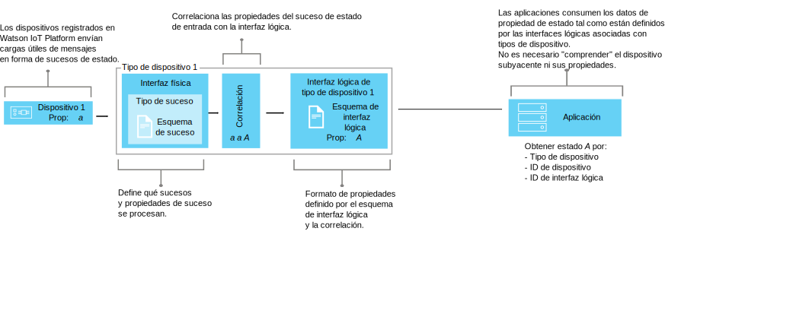

---

copyright:
  years: 2016, 2017
lastupdated: "2017-10-09"

---

{:new_window: target="\_blank"}
{:shortdesc: .shortdesc}
{:screen: .screen}
{:codeblock: .codeblock}
{:pre: .pre}


# Visión general de la gestión de datos
{: #definitions_resources}
Es posible que tenga una cantidad de dispositivos diferentes que desee conectar a {{site.data.keyword.iot_full}}, y es posible que esos dispositivos publiquen datos en formatos diferentes. Utilizando la característica de gestión de datos, puede normalizar y transformar la salida de datos de sus dispositivos en una única vista lógica que puedan consumir fácilmente sus aplicaciones. Utilizando la vista lógica única, elimina la necesidad de codificar sus aplicaciones para que entiendan los diferentes formatos de datos que emite cada dispositivo.
{: shortdesc}

## Visión general

Utilice la característica de gestión de datos para crear abstracciones compartidas de dispositivos (duplicados de dispositivo), para mejorar la reutilización y el mantenimiento y para gestionar las complejidades de un ecosistema de IoT mientras mantiene la aplicación aislada de los cambios de datos. 

Las aplicaciones puede acceder al estado actual de un dispositivo bajo petición utilizando una API HTTP o suscribiéndose a una serie de tema. El estado consta de un conjunto de propiedades de estado que se han definido mediante la interfaz lógica. Si el estado de un dispositivo cambia como resultado de un suceso publicado en {{site.data.keyword.iot_short_notm}}, los valores de estas propiedades se actualizan y almacenan en {{site.data.keyword.iot_short_notm}}.

Utilizando la característica de gestión de datos, puede obtener los siguientes beneficios:
- Correlacionar propiedades de estado con datos de mensajes de suceso
- Definir la estructura de datos que prefiera
- Definir más de una representación o vista del estado de un dispositivo
- Suscribirse a estados de dispositivo o consultarlos en cualquier momento a través de una API HTTP

Algunos casos de uso comunes para implementar la característica de gestión de datos incluyen:
- Proporcionar a los desarrolladores de aplicaciones interfaces coherentes para acceder a datos de dispositivos controlados por sucesos al estilo REST.
- Normalizar datos procedentes de dispositivos de diferentes modelos que publican datos en distintos formatos.
- Modificar y convertir formatos de datos para que se adapten a su modelo de aplicación.

## Ejemplo: Correlación de sensores de temperatura heterogéneos con una interfaz lógica
{: #device-type-example}
Para empezar a utilizar la característica de gestión de datos, debe definir un número de recursos que están descritos en las siguientes secciones. 

El siguiente ejemplo muestra cómo se ajustan estos recursos entre ellos para permitir a las aplicaciones acceder a datos de estado de temperatura homogéneos en un formato, independientemente del formato de la carga útil de los mensajes de sucesos del dispositivo. TemperatureSensor1 publica una lectura de temperatura en grados centígrados de `{ "t" : 34.5 }` en {{site.data.keyword.iot_short_notm}}. TemperatureSensor2 publica una lectura de temperatura en grados Fahrenheit de `{ "temp" : 72.55 }`. Cada sensor de temperatura está asociado con su propio [tipo de dispositivo](../reference/device_model.html#id_and_device_types). Las lecturas de temperatura se publican como sucesos separados.

Utilice la característica de gestión de datos de {{site.data.keyword.iot_short_notm}} para ayudarle a configurar esta solución normalizando y transformando los datos de su dispositivo. 


Como parte del flujo de datos, puede realizar cálculos sobre los datos de entrada para normalizar estas lecturas en un formato coherente para su proceso. Esto significa que no es necesario que escriba la aplicación para entender o convertir distintas escalas de temperatura. La aplicación recibe un único estado normalizado y utiliza la propiedad de estado **temperature** en lugar de las propiedades **t** y **temp** específicas de cada dispositivo.

 Para configurar esta solución, debe definir la siguiente información:

-	La estructura del suceso de temperatura de entrada, "t" y "temp", de cada tipo de dispositivo.  
-	La propiedad "temperature" que desea registrar. La propiedad "temperature" define la estructura lógica del estado de dispositivo que sus aplicaciones pueden consumir.
-	Cómo desea correlacionar las propiedades "t" y "temp" del suceso de entrada con la propiedad "temperature".

Puede definir la información necesaria configurando los siguientes recursos que existen en {{site.data.keyword.iot_short_notm}}:

-	Interfaz física, tipo de suceso y recurso de esquema de suceso, que definen la estructura de los sucesos de entrara "t" y "temp".
-	Interfaz lógica y recurso de esquema lógico, que definen la estructura lógica del estado de dispositivo "temperature" que desea generar.
-	Un recurso de correlación que define cómo desea correlacionar las propiedades "t" y "temp" con la propiedad "temperature".

Para un caso de ejemplo completo detallado que describe este ejemplo, consulte la [Guía paso a paso: Un ejemplo detallado sobre cómo trabajar con dispositivos a través de una interfaz común](ga_im_index_scenario.html).

Se proporciona más información detallada acerca de estos recursos en la sección "Definición de sus recursos".


## Definición de sus recursos
{: #definitions_resources}

En el diagrama siguiente se muestra la correlación lógica entre dispositivos y aplicaciones en {{site.data.keyword.iot_short_notm}} cuando se utiliza la característica de gestión de datos.



### Conceptos
{: #concepts}
La tabla siguiente describe los conceptos de suceso, propiedades y estado, que están referenciadas en el diagrama anterior.

Conceptos                        | Descripción       
------------- | ------------- | -------------  
Suceso | Los sucesos son el mecanismo por el que los dispositivos publican datos en {{site.data.keyword.iot_short_notm}}. El dispositivo controla el contenido del suceso y asigna un nombre a cada suceso que envía.
Propiedad | Datos que contienen parte de la carga útil del suceso del dispositivo.
Estado | La última representación del estado del dispositivo físico, que puede incluir todas las propiedades correlacionadas a lo largo de varios sucesos de entrada.

### Recursos de la gestión de datos
{: #resources}

Puede gestionar recursos mediante las API REST. Para obtener información sobre las API REST, consulte la [documentación de {{site.data.keyword.iot_short_notm}} API REST HTTP](https://docs.internetofthings.ibmcloud.com/apis/swagger/v0002/state-mgmt.html).

Recursos de tipo                        | Descripción       
------------- | ------------- | -------------  
Tipo de suceso                         | Utiliza el recurso de tipo de suceso para modelar un suceso publicado por un dispositivo. Un tipo de suceso debe hacer referencia a un recurso de esquema de suceso. El recurso de esquema define la estructura del suceso publicado. </br>**Importante:** Los sucesos de entrada utilizados en una interfaz lógica deben estar en formato JSON. 
Tipo de dispositivo                         |  Utilice el recurso de tipo de dispositivo para agrupar dispositivos que comparten características o comportamientos. En la gestión de datos, el tipo de dispositivo se amplía para incluir una interfaz física para un dispositivo y una o varias interfaces físicas que se utilizan para recuperar el estado del dispositivo. </br>Para obtener más información, consulte la sección sobre "Identificadores y tipos de dispositivo" del tema [Modelo de dispositivo](../reference/device_model.html#id_and_device_types).
Recursos de esquema                         |  Utiliza recursos de esquema para definir la estructura de un suceso o un tipo de dispositivo. Se utilizan los siguientes [Esquemas JSON ](http://json-schema.org/){:new_window}: <ul><li>Un esquema asociado con un tipo de suceso. Este esquema se utiliza para definir la estructura del suceso que publica un dispositivo en {{site.data.keyword.iot_short_notm}}. A estos esquemas se los conoce como esquemas de suceso. <li>Un esquema asociado con una interfaz lógica. Este esquema se utiliza para definir la estructura del estado de dispositivo almacenado en {{site.data.keyword.iot_short_notm}}. A estos esquemas se los conoce como esquemas de interfaz lógica. </ul>.  

Recursos de interfaz                        | Descripción       
------------- | ------------- | -------------  
Interfaz lógica | Construcción programática con la que pueden conectar las aplicaciones, o suscribirse a la misma, para ver el estado de un dispositivo. Una interfaz lógica se utiliza para definir la vista normalizada en el estado de dispositivo en {{site.data.keyword.iot_short_notm}}. Una interfaz lógica debe asociarse con un esquema de interfaz lógica. El estado se actualiza como respuesta a sucesos de dispositivo de entrada. 
Interfaz física                         | Una interfaz física se utiliza para modelar la interfaz entre un dispositivo físico y {{site.data.keyword.iot_short_notm}}. Los tipos de suceso se pueden asociar con una interfaz física.

Recursos de instancia                        | Descripción       
------------- | ------------- | -------------  
Dispositivo                         | Un dispositivo representa un activo, sistema o componente registrado con {{site.data.keyword.iot_short_notm}} y envía datos de IoT en forma de sucesos.

Recursos de soporte                        | Descripción       
------------- | ------------- | -------------  
Correlaciones                         | Utiliza correlaciones para definir la forma en que las propiedades asociadas con sucesos de entrada se correlacionan con las propiedades definidas en una interfaz lógica. </br>**Importante:** debe haber como mínimo una interfaz lógica asociada a un tipo de dispositivo para que se puedan definir correlaciones.


## Restricciones de nombre para recursos
{: #naming_restrictions}
Los esquemas, los tipos de suceso y las interfaces lógicas y físicas tienen las siguientes restricciones de nombre:
- El nombre debe tener entre 1 - 128 caracteres. 
- El nombre debe consistir de caracteres unicode. 
- Los caracteres especiales válidos son: espacio, guion ( - ), guión bajo ( _ ), punto ( . )
- El nombre no puede ser solo espacios.

## Creación, actualización, activación y desactivación de recursos
{: #draft_active_resources}

Puede haber dos versiones de un recurso; una versión borrador y una versión activa. Cuando crea un recurso, ese recurso se crea como versión borrador.
{: shortdesc}

La versión borrador es una copia de trabajo de su recurso que puede consultar, actualizar y suprimir directamente utilizando las API. Cree una versión activa de un recurso borrador activando un tipo de dispositivo borrador o una interfaz lógica borrador. Puede activar solo el recurso tipo de dispositivo borrador o el recurso interfaz lógica borrador. Para activar otros recursos, por ejemplo esquemas, debe activar un tipo de dispositivo borrador o una interfaz lógica borrador que haga referencia al recurso que desea activar.

Para diferenciar entre recursos activos y borradores al utilizar API REST, se utiliza el prefijo *draft/* para identificar los recursos que están en estado borrador.

El siguiente ejemplo recupera metadatos de una definición de esquema borrador utilizando un identificador especificado:

```
GET /api/v0002/draft/schemas/{schemaId}
```
El siguiente ejemplo recupera metadatos de una definición de esquema activa utilizando un identificador especificado:
```
GET /api/v0002/schemas/{schemaId}
```
*Nota:* El identificador es el mismo para la versión activa y el borrador de un recurso dado.


- Activación de un recurso
{: #activate_resources}  

Utilice la operación **activate-configuration** para validar y activar la configuración asociada con un tipo de dispositivo. Esta configuración incluye esquemas borrador, tipos de suceso, interfaces físicas, interfaces lógicas y correlaciones. La operación **activate-configuration** debe realizarse en la versión borrador de una interfaz lógica o un tipo de dispositivo.

El siguiente ejemplo muestra una solicitud PATCH donde se realiza una operación **activate-configuration** en una versión borrador de un tipo de dispositivo:
```
PATCH /api/v0002/draft/device/types/TemperatureSensor
```
donde la carga útil del cuerpo PATCH contiene el siguiente contenido:
```
  {
    "operation": "activate-configuration"
  }
```
- Lista de diferencias
{: #list_differences}  

Utilice la operación **list-differences** para devolver una lista de cualquier diferencia entre la configuración activa y la borrador para un recurso de interfaz lógica o tipo de dispositivo. La operación **list-differences** debe realizarse en la versión borrador de una interfaz lógica o un tipo de dispositivo. El siguiente ejemplo muestra una solicitud PATCH donde se realiza una operación **list-differences** en una versión borrador de un tipo de dispositivo:
```
PATCH /api/v0002/draft/device/types/TemperatureSensor
```
donde la carga útil del cuerpo PATCH contiene el siguiente contenido:
```
  {
    "operation": "list-differences"
  }
```


- Desactivación de un recurso
  
{: #deactivate_resources}  

Utilice la operación **deactivate-configuration** para eliminar la configuración activa asociada con un recurso. La operación deactivate-configuration solo se puede realizar en la versión activa de una interfaz lógica o un tipo de dispositivo. El siguiente ejemplo muestra una solicitud PATCH donde se realiza una operación **deactivate-configuration** en una versión activa de un tipo de dispositivo:
```
PATCH /api/v0002/device/types/TemperatureSensor
```
donde la carga útil del cuerpo PATCH contiene el siguiente contenido:
```
  {
    "operation": "deactivate-configuration"
  }
```
*Notas:*
- Un recurso activo es de solo lectura. Puede filtrar y ordenar recursos activos y borrador utilizando parámetros de consulta.
- No puede suprimir un tipo de dispositivo si hay instancias de dispositivo asociadas con ese tipo de dispositivo. El estado del dispositivo se borra cuando se suprime la instancia de dispositivo. 
- Solo puede activar interfaces lógicas y tipos de dispositivo directamente utilizando API. Otros recursos, por ejemplo esquemas, interfaces físicas y tipos de suceso se activan si están referenciados por una interfaz lógica o tipo de dispositivo que se activa.  
- La operación **activate-configuration** debe realizarse en una versión borrador de una interfaz lógica asociada con un tipo de dispositivo o directamente en un tipo de dispositivo. La operación **activate-configuration** comprueba que la configuración de recurso es válida antes de activar el recurso. Una vez se ha completado la activación, se genera un estado para cada instancia del tipo de dispositivo.

## Resolución de problemas en su configuración
{: #troubleshooting}
Si su activación falla, compruebe que se han proporcionado todas las configuraciones necesarias para un tipo de dispositivo. La siguiente configuración debe proporcionarse y asociarse con un tipo de dispositivo:
  - Una interfaz física asociada con, por lo menos, un suceso.
  - Como mínimo una interfaz lógica.
  - Correlaciones para, por lo menos, una de las interfaces lógicas asociadas.

También puede realizar una operación **validate-configuration** en una versión borrador del recurso de tipo de dispositivo o de interfaz lógica para asegurarse de que los metadatos asociados son válidos. Si los metadatos no son válidos, se devuelve una lista de problemas en el cuerpo de la respuesta.  

El siguiente ejemplo muestra una solicitud PATCH donde se realiza una operación **validate-configuration** en una versión borrador de un tipo de dispositivo llamado "TemperatureSensor":  
```
PATCH /api/v0002/draft/device/types/TemperatureSensor
```
donde la carga útil del cuerpo PATCH contiene el siguiente contenido:
```
  {
    "operation": "validate-configuration"
  }
```  
El ejemplo siguiente muestra una respuesta no satisfactoria para la solicitud PATCH:
  
```
{
"message": "CUDIM0303I: State update configuration for Device Type 'TemperatureSensor' is not valid.",
"details": {
  "id": "CUDIM0303I",
  "properties": [
    "Device Type",
    "TemperatureSensor"
  ]
},
"failures": [
  {
    "message": "CUDVS0301E: The device type 'TemperatureSensor' does not have any mappings defined for it",
    "details": {
      "id": "CUDVS0301E",
      "properties": [
        "TemperatureSensor"
      ]
    }
  }
]
}
```  
El ejemplo siguiente muestra una respuesta satisfactoria para la solicitud PATCH:
  
```  
{
"message": "CUDIM0303I: State update configuration for Device Type 'TemperatureSensor' is valid.",
"details": {
  "id": "CUDIM0303I",
  "properties": [
    "Device Type",
    "TemperatureSensor"
  ]
},
"failures": []
}
```  
Si todos los recursos necesarios están asociados con un tipo de dispositivo, compruebe que las correlaciones de propiedad son válidas. Los siguientes ejemplos muestran posibles errores que pueden ocurrir:

  - Una expresión hace referencia a una propiedad en un suceso que no está definido por un esquema de suceso.
  - Una expresión hace referencia a una propiedad en el estado que no está definida por el esquema de interfaz lógica.
  - Está definida una correlación para una propiedad que no está definida por el esquema de interfaz lógica.


Puede hacer referencia al siguiente registro de errores para ayudarle a diagnosticar errores de tiempo de ejecución:
```
iot-2/type/${typeId}/id/${devieId}/err/data
```
### Límites de recursos

La siguiente tabla muestra el número máximo de recursos que se pueden configurar en función del tipo de plan. 

Recursos|Plan estándar | Plan Lite 
------------- | ------------- | ------------- 
Interfaces lógicas| 1000 | 10
Interfaces físicas| 1000 | 5
Tipos de suceso| 1000 | 10
Esquemas|2000 | 20
Referencias de interfaz lógica (Número de interfaces lógicas que se pueden correlacionar con un tipo de dispositivo)|20 | 5
Referencias de tipo de suceso (Número de identificador de suceso para las asociaciones de tipo de suceso que puede tener una interfaz física)| 40 | 10
