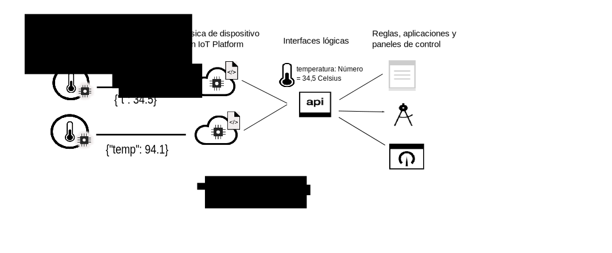

---

copyright:
years: 2016, 2017
lastupdated: "2017-07-20"

---

{:new_window: target="\_blank"}
{:shortdesc: .shortdesc}
{:screen: .screen}
{:codeblock: .codeblock}
{:pre: .pre}

# Introducción a la gestión de datos
{: #device_twins}

En el mundo moderno existe una cantidad sin precedentes de dispositivos y sensores. Muchos de estos dispositivos proporcionan funcionalidades similares, pero varían en la marca, el modelo y la versión lo que significa que los datos salen en formatos diferentes. Por ejemplo, un sensor de temperatura puede registrar la temperatura en grados Fahrenheit o en grados centígrados. No es eficiente codificar aplicaciones para ser capaz de consumir datos en todos estos formatos. En su lugar, los datos deben normalizarse para crear una única vista lógica que puedan utilizar las aplicaciones.
{: shortdesc}

Utilice la característica de gestión de datos en {{site.data.keyword.iot_full}}, para configurar un duplicado de dispositivo para exponer una vista normalizada de los datos de sus aplicaciones.

Un duplicado de dispositivo es una representación digital en la nube de un dispositivo físico o sensor que está conectado a {{site.data.keyword.iot_short_notm}}. Un duplicado de dispositivo crea un modelo lógico de las propiedades y sucesos que llegan de un sensor o dispositivo particular. Una vez definido y con una instancia creada, el duplicado de dispositivo proporciona medidas coherentes de la interacción con un dispositivo al estilo REST, independientemente de si el dispositivo está en línea o fuera de línea. Puesto que el modelo lógico puede compartirse entre varios dispositivos de diferentes marcas y modelos, la aplicación de IoT ahora está aislada de la variabilidad y los cambios en el ecosistema del dispositivo. Las propiedades de un dispositivo, incluyendo la información acerca del estado actual del dispositivo (estado de dispositivo), se pueden recuperar utilizando una solicitud HTTP o suscribiéndose a un tema.

Los duplicados de dispositivo pueden ayudarle a:
- Proporcionar a sus desarrolladores de aplicaciones interfaces coherentes para acceder a datos de dispositivos controlados por sucesos al estilo REST.
- Normalizar datos procedentes de dispositivos de diferentes modelos que publican datos en distintos formatos.

Para utilizar la característica de gestión de datos para configurar un duplicado de dispositivo debe definir la siguiente información configurando recursos en {{site.data.keyword.iot_short_notm}}:
- La estructura de los sucesos que envía su dispositivo. La estructura de un suceso de entrada se define en los recursos de la interfaz física, el tipo de suceso y el esquema de suceso. 
- Las propiedades que desea registrar. Estas propiedades definen la estructura lógica del estado de dispositivo que sus aplicaciones pueden consumir. Las propiedades se definen en los recursos de la interfaz lógica y el esquema lógico.
- Cómo se correlacionan los sucesos de interfaz física en las propiedades de interfaz lógica. Utilice el recurso de correlaciones para correlacionar sucesos con propiedades.

El siguiente diagrama muestra datos de dispositivo en formatos diferentes que entran en {{site.data.keyword.iot_short_notm}} y se transforman y normalizan en una única vista lógica que pueden consumir fácilmente las aplicaciones de fondo.  

Para obtener más información acerca de la definición y configuración de recursos e información clave, consulte [Visión general de la gestión de datos](ga_im_definitions.html). Puede crear su propio duplicado de dispositivo en {{site.data.keyword.iot_short_notm}} completando los pasos descritos en [Iniciación a la gestión de datos](ga_im_example.html). Para obtener información más detallada acerca de cada uno de los pasos descritos en la guía, consulte el caso de ejemplo documentado en [Guía paso a paso: Un ejemplo detallado sobre cómo trabajar con dispositivos a través de una interfaz común](ga_im_index_scenario.html#scenario). 
