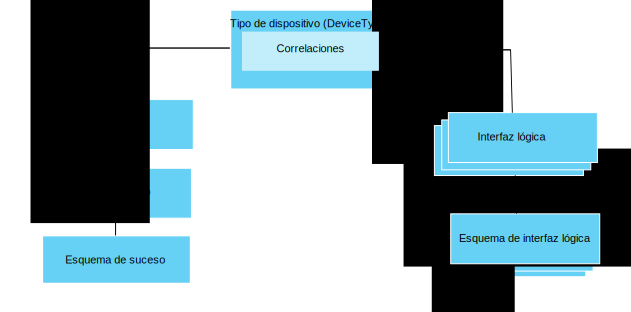

---

copyright:
years: 2016, 2017
lastupdated: "2017-07-21"

---

{:new_window: target="\_blank"}
{:shortdesc: .shortdesc}
{:screen: .screen}
{:codeblock: .codeblock}
{:pre: .pre}

# Iniciación a la gestión de datos
{: #im_example}

Siga los pasos siguientes como ayuda para configurar los recursos que necesita para empezar a utilizar la característica de gestión de datos.

Para obtener detalles acerca de la API, consulte la documentación de la [API REST HTTP de {{site.data.keyword.iot_full}} ](https://docs.internetofthings.ibmcloud.com/apis/swagger/v0002/state-mgmt.html){:new_window}.

**Consejo:** para obtener más información sobre cada uno de los pasos, consulte los casos de ejemplo o utilice los enlaces para ir directamente a un paso específico de la guía paso a paso. [Guía paso a paso: Un ejemplo detallado sobre cómo trabajar con dispositivos a través de una interfaz común](ga_im_index_scenario.html#scenario) le guía a través de los pasos para crear una interfaz lógica de tipo de dispositivo para dispositivos de termómetro heterogéneo.

## Antes de empezar
Para empezar a utilizar la característica de gestión de datos, debe tener, por lo menos, un [dispositivo registrado con](ga_im_index_scenario.html#step14) y enviando datos a {{site.data.keyword.iot_short_notm}}.  

El siguiente diagrama muestra una vista lógica de cómo se ajustan entre ellos los recursos que debe configurar:

## Pasos

1. 	Defina las propiedades de estado de entrada.  
Defina las propiedades de estado de entrada que desea que la interfaz lógica ponga a disponibilidad de las aplicaciones.  
<dl>
<dd>
<ol>
<li>[Crear un archivo de esquema de suceso borrador](ga_im_index_scenario.html#step1). El archivo de esquema de suceso es un archivo .JSON local que define la estructura y el formato de un suceso de entrada.
<li>[Crear un recurso de esquema de suceso borrador para el tipo de suceso](ga_im_index_scenario.html#step2). El recurso de esquema de suceso es una construcción programática utilizada por o que se utiliza por {{site.data.keyword.iot_short_notm}}.
<li>[Crear un tipo de suceso borrador que haga referencia al esquema de suceso](ga_im_index_scenario.html#step3). {{site.data.keyword.iot_short_notm}} utiliza el tipo de suceso para correlacionar uno o varios recursos de esquema de suceso con una interfaz física.
<li>[Crear una interfaz física borrador](ga_im_index_scenario.html#step7).
<li>[Añadir el tipo de suceso a la interfaz física borrador](ga_im_index_scenario.html#step8).
<li>[Actualizar el tipo de dispositivo borrador para que se conecte a la interfaz física borrador](ga_im_index_scenario.html#step9).
</ol>
</dd>
</dl>
4. 	Cree la interfaz lógica borrador.
 1. 	[Crear un archivo de esquema de interfaz lógica borrador](ga_im_index_scenario.html#step4) para el tipo de servicio borrador.  
Un archivo de esquema de interfaz lógica es un archivo .JSON local que define el estado del dispositivo que pasará a disposición de las aplicaciones.
 2. [Crear un recurso de esquema de interfaz lógica borrador](ga_im_index_scenario.html#step5) para el tipo de dispositivo borrador.
 3.	[Crear una interfaz lógica borrador](ga_im_index_scenario.html#step6) para el tipo de dispositivo borrador.
 4.	[Añadir la interfaz lógica borrador a un tipo de dispositivo borrador](ga_im_index_scenario.html#step10).
5. 	[Definir las correlaciones borrador](ga_im_index_scenario.html#step11) para el tipo de dispositivo borrador.   
Las correlaciones se utilizan para correlacionar propiedades de entrada con propiedades de la interfaz lógica.
6. 	[Validar y activar la configuración](ga_im_index_scenario.html#step15) asociada con el tipo de dispositivo borrador.
7. 	[Recuperar el estado del dispositivo activo](ga_im_index_scenario.html#step13).  
Compruebe que las suscripciones muestran los datos de dispositivo actualizados o que se devuelven los datos de dispositivo actualizados mediante una llamada REST o suscribiéndose a un tema.
