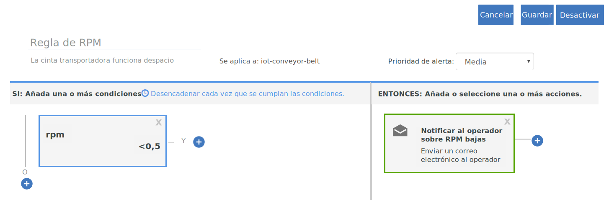

---

copyright:
  years: 2017, 2018
lastupdated: "2018-01-11"

---

{:shortdesc: .shortdesc}
{:new_window: target="_blank"}
{:codeblock: .codeblock}
{:pre: .pre}
{:screen: .screen}
{:tip: .tip}

# Guía 2: Utilización de reglas y acciones básicas en tiempo real

**Importante:** estamos lanzando una versión Beta con una nueva forma de definir reglas en los datos del dispositivo IoT como parte de un programa más ambicioso de cambios para mejorar la forma en que {{site.data.keyword.iot_full}} distribuye reglas y acciones.

Para ver más información, consulte la publicación del blog sobre [Un enfoque alternativo a la definición de reglas en datos de IoT ](https://developer.ibm.com/iotplatform/2018/03/01/alternative-approach-defining-rules-iot-data/){: new_window}.

Para empezar a definir sus propias reglas, consulte la documentación sobre [Creación de reglas incorporadas (Beta)](../information_management/im_rules.html).

## Visión general y objetivo
{: #overview}  

Utilice las instrucciones de esta guía para configurar un conjunto de reglas básicas y acciones para algunas analíticas en tiempo real de los datos de IoT de su cinta transportadora.

Ahora que ha configurado correctamente su cinta transportadora, la ha conectado con {{site.data.keyword.iot_full}} y ha enviado algunos datos, es hora de hacer que esos datos trabajen para usted utilizando reglas y acciones.



Como parte de esta guía aprenderá a:
- Crear un esquema de mensaje para los datos de suceso de dispositivo de su cinta transportadora.
- Crear y desencadenar una regla.
- Crear una acción de correo electrónico.

## Requisitos previos
{: #prereqs}  
Debe tener un dispositivo conectado del tipo de dispositivo `iot-conveyor-belt` que envía sucesos con nombre de suceso `sensorData` y con una carga útil de mensaje que incluye las siguientes propiedades:
```
{
	"d": {
		"id": "belt1",
		"ts": 1494946276931,
		"ay": "0.00",
		"running": true,
		"rpm": "1.0"
		}
}
```
Para obtener más información acerca de los sucesos de dispositivo y el formato de mensaje, consulte [Publicación de sucesos](/docs/services/IoT/devices/mqtt.html#publishing_events).  
Si ha completado la [Guía 1: Iniciación a {{site.data.keyword.iot_short_notm}} y una cinta transportadora simulada](getting-started-iot-conveyor.html), está listo.  
{: tip}

## Paso 1: Crear un esquema de mensaje para la app de muestra
{: #create_schema}

Para utilizar las propiedades que envía su dispositivo como desencadenante de sus reglas, primero debe asignar estas propiedades a un esquema de mensaje en {{site.data.keyword.Bluemix_notm}}. Para obtener información, consulte [Crear esquemas de tipo de dispositivo](/docs/services/IoT/im_schemas.html#iotrtinsights_task).
1. En el panel de control de {{site.data.keyword.iot_short_notm}}, vaya a **Dispositivos** y seleccione **Gestionar esquemas**.
2. Pulse **Añadir esquema**.
3. Seleccione el tipo de dispositivo **iot-conveyor-belt** y pulse **Siguiente**.
4. Añada propiedades al esquema.
 1. Pulse **Añadir propiedad**.
 2. Seleccione **Desde conectados**.
 3. Envíe un punto de datos de cinta transportadora cambiando el valor de rpm.
En la app web de la cinta transportadora, pulse **Detener** o **Iniciar** para publicar un mensaje.  
La lista de propiedades de rellena con las propiedades que envía el dispositivo.
 4. Seleccione todas las propiedades y pulse **Aceptar**.
5. Pulse **Finalizar** para crear el esquema.  

Se crea el esquema y el tipo de datos rpm se establece en flotante.

## Paso 2: Crear una regla simple para la propiedad rpm
{: #create_rule}  
El motor de reglas de {{site.data.keyword.Bluemix_notm}} compara los puntos de datos de propiedad que envía su dispositivo con los valores de umbral que se establecen en la regla y desencadena la regla cuando se cumplen las condiciones. Para obtener más información acerca de las reglas, consulte [Cloud Analytics](/docs/services/IoT/cloud_analytics.html#rules).
Para crear una regla que se desencadena cuando el valor de rpm es menor que 0,5:
1. Cambie el tipo de propiedad rpm a flotante (Float).  
Cuando creamos una regla, queremos comparar el valor numérico de rpm con un umbral. Para ello, la propiedad se debe reconocer como flotante o entero.
 1. En el panel de control de {{site.data.keyword.iot_short_notm}}, vaya a **Dispositivos** y seleccione **Gestionar esquemas**.
 1. Pulse el nuevo esquema que acaba de crear y seleccione **Propiedades**.
 2. Pulse el icono de editar para editar el esquema.
 3. Pulse el icono de editar junto a la propiedad `rpm`.
 4. Cambie el tipo de datos a `Float`.  
 5. Pulse **Aceptar**.
 6. Pulse **Finalizar** para actualizar el esquema.  
2. Cree la regla.
 1. En el panel de control, vaya a **Reglas**.
 2. Pulse **Crear regla en la nube**.
 3. Especifique `RPM rule` para el nombre.
 4. Establezca la regla que se aplica al esquema **iot-conveyor-belt**.
 5. Pulse **Siguiente**.
 6. Añada una condición de regla.
    6. Pulse el mosaico **Nueva condición** para añadir una condición a la regla.
    7. Seleccione la propiedad **rpm**.
    8. Seleccione el operador menor que (`<`).
    9. Especifique `0.5` para el valor y pulse **Aceptar**.
    10. Pulse **Guardar** y luego pulse **Cerrar**.
 11. Pulse **Cerrar**.  
La nueva regla se lista en el estado "Desactivada".
12. Pulse el conmutador de estado para activar la regla.
Ahora el estado se lista como "Activada".

## Paso 3: Desencadenar la regla
{: #trigger_rule}
Al bajar las rpm, puede simular problemas con la cinta transportadora que podrían requerir la intervención de un operador. Cuando se alcanza el valor de umbral para las rpm, se visualiza una alerta en el panel de control.
1. En el panel de control de {{site.data.keyword.iot_short_notm}}, seleccione **Paneles**.
3. Seleccione el panel **Analítica centrada en las reglas**.
4. En la app web de cinta transportadora, disminuya el valor de rpm por debajo de 0,5 rpm.
El dispositivo envía datos a {{site.data.keyword.iot_short_notm}} cuando las lecturas del sensor cambian. Puede simular este envío de datos deteniendo, iniciando o cambiando la velocidad de la cinta transportadora.  
5. Verifique que la regla `RPM rule` aparece en la tarjeta Reglas con alertas.
6. Seleccione la nueva alerta en la tarjeta Alertas de reglas y visualice los puntos de datos que han desencadenado la regla en la tarjeta Información de alerta de reglas.  
Para ver más información sobre la alerta, consulte los detalles de dispositivo en las tarjetas Dispositivos asociados, Información de dispositivo y Propiedades de dispositivo.  
{: tip}

## Paso 4: Crear una acción a llevar a cabo cuando se desencadena la regla de RPM
{: #create_action}
Además de visualizar una alerta en el panel de control de {{site.data.keyword.iot_short_notm}}, puede crear acciones a llevar a cabo cuando se desencadene una regla, por ejemplo, enviar un correo electrónico al operador para que mire si las rpm de la cinta transportadora son muy bajas. Para obtener más información, consulte [Cloud Analytics](/docs/services/IoT/cloud_analytics.html#shared).
Para crear una acción de correo electrónico:
1. En el panel de control de {{site.data.keyword.iot_short}}, vaya a **Reglas**.
2. Pulse **RPM rule**.
3. Pulse el mosaico **Nueva acción**.
4. Cree una acción.
 1. Pulse **Añadir acción**.
 2. Especifique el nombre de acción `Notificar al operador sobre RPM bajas`.
 3. Especifique la descripción `Enviar un correo electrónico al operador`.
 4. Seleccione el tipo **Enviar correo electrónico**.
 5. Pulse **Siguiente**.
 6. En la línea de asunto, especifique: `Alerta de RPM bajas.`
 7. En el campo Para, seleccione **Personas específicas** y especifique `operator@company.com`.  
Sustituya la dirección de correo electrónico por la suya.
 8. Seleccione **Incluir datos** para incluir los datos de dispositivo en el correo electrónico.
 9. Pulse **Finalizar** para guardar la acción.  
5. Seleccione la acción en la lista y pulse **Aceptar** para definir la acción.
6. Pulse **Guardar** para habilitar la acción con la regla.
7. Pruebe la nueva acción.
 4. En la app web de cinta transportadora, disminuya el valor de rpm por debajo de 0,5 rpm.
 5. Verifique que ha recibido el correo electrónico de alerta.  
El cuerpo del mensaje puede parecerse a este ejemplo:
> **Regla:** RPM rule  
> **Dispositivo:** 3m5wxr:iot-conveyor-belt:belt1  
> **Fecha:** 2017-05-09T18:21:21.567Z  
> **Condición:**  
> iot_conveyor_belt.d.rpm<0.5  
> **Mensaje entrante:**  
> {"d":{"id":"belt1","ts":1494354089837,"ay":"0.00","rpm":"0.4","running":true},"ruleContent":{"jobID":"sdIyBfdu","contextSchemas":[],"ruleDescription":"","severity":4,"messageSchemas":["iot_conveyor_belt"],"disabled":false,"ruleCondition":"iot_conveyor_belt.d.rpm<0.5","transforms":[],"name":"RPM rule","actions":["pziIRovt"],"id":"ncKK4N7k","updated":"9 May 2017 18:20:25 GMT","created":"9 May 2017 17:41:38 GMT","version":7}}  
>Este es un correo electrónico generado automáticamente. No responda a este mensaje. Para preguntas relacionadas con esta alerta, póngase en contacto con su administrador del sistema.

## Qué hacer a continuación
{: #whats_next}  
Continúe con la guía siguiente o salte a otro tema que le interese:
- [Guía 3: Supervisión de los datos de dispositivo](getting-started-iot-monitoring.html)  
Ahora que ha conectado uno o varios dispositivos y ha empezado a realizar un buen uso de los datos de dispositivo, es hora de empezar a supervisar una colección de dispositivos y los datos en tiempo real que están enviando.
- [Guía 4: Simulación de un gran número de dispositivos](getting-started-iot-large-scale-simulation.html)  
La app de muestra de cinta transportadora en la vía de acceso A le permite simular de forma manual uno o varios dispositivos de cinta transportadora. Esta guía le permite configurar un entorno simulado que tiene un gran número de dispositivos.
- [Conectar otros dispositivos de IoT a {{site.data.keyword.iot_short_notm}}](/docs/services/IoT/iotplatform_task.html)
- [Obtenga más información acerca de {{site.data.keyword.iot_short_notm}}](/docs/services/IoT/iotplatform_overview.html)
- [Obtenga más información acerca de las API de {{site.data.keyword.iot_short_notm}}](/docs/services/IoT/reference/api.html)
