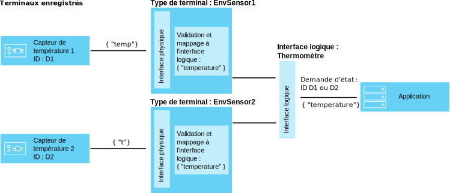
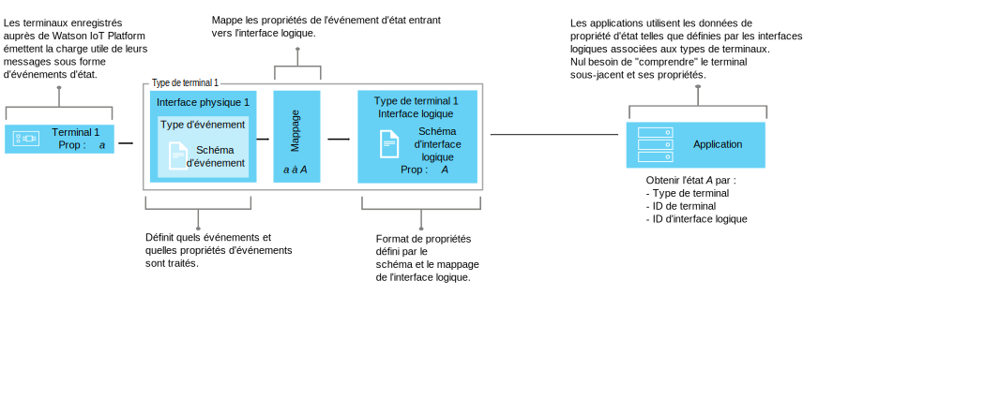

---

copyright:
  years: 2016, 2017
lastupdated: "2017-10-09"

---

{:new_window: target="\_blank"}
{:shortdesc: .shortdesc}
{:screen: .screen}
{:codeblock: .codeblock}
{:pre: .pre}


# Comprendre la gestion des données
{: #definitions_resources}
Vous pouvez vouloir connecter un certain nombre de terminaux différents à {{site.data.keyword.iot_full}}, et ces terminaux peuvent publier des données dans différents formats. En utilisant la fonction de gestion des données, vous pouvez normaliser et transformer la sortie de données en une seule vue logique qui peut être facilement utilisée par vos applications. Lorsque vous utilisez une seule vue logique, vous n'avez plus besoin de coder vos applications pour comprendre les différents formats de données résultant de chaque terminal.
{: shortdesc}

## Présentation

Utilisez la fonction de gestion des données pour créer des abstractions partagées des terminaux (terminaux jumeaux), améliorer les capacités de réutilisation et de maintenance et gérer la complexité d'un écosystème IoT tout en isolant l'application des changements de données. 

Les applications peuvent accéder à l'état en cours d'un terminal sur demande via une API HTTP ou en s'abonnant à une chaîne de rubrique. Cet état est constitué d'un ensemble de propriétés définies par une interface logique. Si l'état d'un terminal change en raison d'un événement publié sur {{site.data.keyword.iot_short_notm}}, les valeurs de ces propriétés sont mises à jour et stockées dans {{site.data.keyword.iot_short_notm}}.

Les avantages liés à l'utilisation de la fonction de gestion des données sont les suivants :
- Mapper les propriétés d'état aux données des messages d'événement
- Définir votre structure de données préférée
- Définir plusieurs représentations ou vues de l'état des terminaux
- Vous abonner aux états des terminaux ou les interroger à tout moment via une API HTTP

Certains cas d'utilisation courants pour l'implémentation de la fonction de gestion des données incluent :
- Fournir à vos développeurs d'application des interfaces cohérentes pour leur permettre d'accéder aux données des terminaux déclenchées par les événements à travers des API REST
- Normaliser les données issues de terminaux et d'appareils de différentes marques et de différents modèles qui publient leurs données dans différents formats
- Modifier et convertir les formats de données pour les adapter à votre modèle d'application

## Exemple : Mappage de capteurs de température hétérogènes à une interface logique
{: #device-type-example}
Pour commencer à utiliser la fonction de gestion des données, vous devez définir un certain nombre de ressources décrites dans les sections suivantes. 

L'exemple suivant illustre comment ces ressources s'imbriquent entre elles pour permettre aux applications d'accéder à des données d'état de température homogènes dans un seul format, sans tenir compte du format de contenu du message d'événement de terminal. Le capteur de température 1 publie sur {{site.data.keyword.iot_short_notm}} une mesure de température en degrés Celsius, `{ "t" : 34.5 }`. Le capteur de température 2 publie une mesure en degrés Fahrenheit, `{ "temp" : 72.55 }`. Chaque capteur de température est associé à son propre [type de terminal](../reference/device_model.html#id_and_device_types). Les mesures de température sont publiées sous la forme d'événements distincts.

Utilisez la fonction de gestion des données {{site.data.keyword.iot_short_notm}} pour vous aider à configurer cette solution en normalisant et en transformant vos données de terminal. 



Dans le cadre du flux de données, vous pouvez effectuer des calculs sur les données entrantes pour normaliser ces relevés à des fins de traitement cohérent. Cela signifie que vous n'avez pas besoin d'inclure dans votre application une logique visant à comprendre ou convertir différentes échelles de température. L'application reçoit un seul état normalisé, la propriété d'état **temperature**, et non la propriété spécifique de
chaque terminal, **t** pour l'un et **temp** pour l'autre.

 Pour configurer cette solution, vous devez définir les informations suivantes :

-	La structure de l'événement de température entrant, "t" et "temp",  de chaque type de terminal.  
-	La propriété, "temperature", à enregistrer. La propriété "temperature" définit la structure logique de l'état du terminal pouvant être utilisé par vos applications.
-	La façon dont vous souhaitez mapper les propriétés "t" et "temp" de l'événement entrant vers la propriété "temperature".

Vous pouvez définir les informations requises en configurant les ressources suivantes qui existent dans {{site.data.keyword.iot_short_notm}} :

-	L'interface physique, le type d'événement et la ressource schéma d'événement, qui définissent la structure des événements entrants "t" et "temp".
-	L'interface logique et la ressource schéma logique, qui définissent la structure logique de l'état de terminal "temperature" que vous souhaitez générer.
-	Une ressource de mappages qui définit la façon dont vous souhaitez mapper les propriétés "t" et "temp" à la propriété "temperature".

Pour obtenir un scénario de bout en bout décrivant cet exemple, voir le document [Guide expliquant étape par étape comment travailler avec des terminaux via une interface commune](ga_im_index_scenario.html).

Pour obtenir des informations détaillées sur ces ressources, voir la section "Définition de vos ressources".


## Définition de vos ressources
{: #definitions_resources}

Le diagramme suivant illustre le mappage logique entre les terminaux et les applications sur {{site.data.keyword.iot_short_notm}} lorsque vous utilisez la fonction de gestion des données.



### Concepts
{: #concepts}
Le tableau suivant décrit le concept des événements, des propriétés et de l'état, qui sont référencés dans le diagramme précédent.

Concepts                        | Description       
------------- | ------------- | -------------  
Evénement | Les événements constituent le mécanisme par lequel les terminaux publient des données sur {{site.data.keyword.iot_short_notm}}. Le terminal contrôle le contenu de l'événement et affecte un nom à chaque événement qu'il envoie.
Propriété | Donnée porteuse d'une partie de la charge utile de l'événement émis par un terminal.
Etat | Représentation la plus récente de l'état du terminal physique, qui peut inclure toutes les propriétés ayant été mappées à partir de plusieurs événements entrants.

### Ressources de gestion des données
{: #resources}

Vous pouvez gérer des ressources à l'aide d'API REST. Pour plus d'informations sur les API REST, consultez la documentation de l'[{{site.data.keyword.iot_short_notm}} API REST HTTP](https://docs.internetofthings.ibmcloud.com/apis/swagger/v0002/state-mgmt.html).

Ressources Type                        | Description       
------------- | ------------- | -------------  
Type d'événement                         | Utilisez cette ressource de type d'événement pour modéliser un événement qui est publié par un terminal. Un type d'événement doit faire référence à une ressource de schéma d'événement. La ressource de schéma définit la structure de l'événement qui est publié. </br>**Important :** Les événements entrants qui sont utilisés dans une interface logique doivent être au format JSON.   
Type de terminal                         |  Utilisez la ressource du type de terminal pour regrouper les terminaux partageant les mêmes caractéristiques ou comportements. En gestion des données, le type de terminal est étendu pour inclure une interface physique pour un terminal et une ou plusieurs interfaces logiques qui sont utilisées pour extraire l'état du terminal. </br>Pour plus d'informations, consultez la section "Identificateurs et types de terminaux" dans la rubrique [Modèle de terminal](../reference/device_model.html#id_and_device_types).
Ressources Schéma                         |  Utilisez les ressources schéma pour définir la structure d'un événement ou de l'état d'un terminal. Les [schémas JSON ](http://json-schema.org/){:new_window} suivants sont utilisés : <ul><li>Un schéma qui est associé à un type d'événement. Ce schéma est utilisé pour définir la structure de l'événement qui est publié sur {{site.data.keyword.iot_short_notm}} par un terminal. Ces schémas sont considérés comme des schémas d'événement. <li>Un schéma qui est associé à une interface logique. Ce schéma sert à définir la structure de l'état du terminal qui est stocké sur {{site.data.keyword.iot_short_notm}}. Ces schémas sont considérés comme des schémas d'interface logique</ul>.  

Ressources Interface                        | Description       
------------- | ------------- | -------------  
Interface logique | Construction de programme à laquelle vos applications peuvent se connecter ou s'abonner pour voir l'état d'un terminal. Une interface logique sert à définir la vue normalisée sur l'état du terminal dans {{site.data.keyword.iot_short_notm}}. Une interface logique doit être associées à un schéma d'interface logique. L'état est mis à jour en réponse à des événements de terminal entrants. 
Interface physique                         | Interface physique utilisée pour modéliser l'interface entre un terminal physique et {{site.data.keyword.iot_short_notm}}. Des types d'événements peuvent être associés à l'interface physique.  

Ressources Instance                        | Description       
------------- | ------------- | -------------  
Terminal                         | Un terminal représente un actif, un système ou un composant qui est enregistré auprès de {{site.data.keyword.iot_short_notm}} et qui envoie des données IoT sous la forme d'événements.  

Ressources de support                        | Description       
------------- | ------------- | -------------  
Mappages                         | Utilisez des mappages pour définir la façon dont les propriétés associées aux événements entrants sont mappées aux propriétés qui sont définies sur une interface logique. </br>**Important :** Au moins une interface logique doit être associée à un type de terminal pour que des mappages puissent être définis.


## Restrictions de dénomination liées aux ressources
{: #naming_restrictions}
Les restrictions de dénomination liées aux schémas, aux types d'événements et aux interfaces logique et physique sont les suivantes :
- Le nom doit comporter entre 1 et 128 caractères 
- Le nom doit comporter des caractères Unicode 
- Les caractères spéciaux valides sont l'espace, le tiret ( - ), le trait de soulignement ( _ ) et le point ( . )
- Le nom ne doit pas comporter que des espaces

## Création, mise à jour, activation et désactivation de vos ressources
{: #draft_active_resources}

Il peut y avoir deux versions d'une ressource : une version provisoire et une version active. Lorsque vous créez une ressource, celle-ci est créée en tant que version provisoire.
{: shortdesc}

La version provisoire est une copie de travail que vous pouvez interroger, mettre à jour et supprimer directement par le biais des API. Créez une version active d'une ressource provisoire en activant soit un type de terminal provisoire, soit une interface logique provisoire. Vous pouvez activer uniquement une ressource de type de terminal provisoire ou d'interface logique provisoire. Pour activer d'autres ressources, par exemple des schémas, vous devez activer un type de terminal provisoire ou une interface logique provisoire qui fasse référence à la ressource que vous souhaitez activer.

Pour distinguer les ressources provisoires des ressources actives lorsque vous utilisez les API REST, le préfixe *draft/* permet d'identifier les ressources qui sont à l'état de brouillon.

L'exemple ci-dessous extrait les métadonnées d'une définition de schéma provisoire à l'aide d'un ID spécifique :

```
GET /api/v0002/draft/schemas/{schemaId}
```
L'exemple ci-dessous extrait les métadonnées d'une définition de schéma active à l'aide d'un ID spécifique :
```
GET /api/v0002/schemas/{schemaId}
```
*Remarque :* L'identificateur est le même pour les versions provisoire et active d'une ressource donnée.


- Activation d'une ressource
{: #activate_resources}  

Utilisez l'opération **activate-configuration** pour valider et activer la configuration qui est associée à un type de terminal. Cette configuration inclut vos schémas, types d'événements, interfaces physiques, interfaces logiques et mappages provisoires. L'opération **activate-configuration** doit être réalisée sur la version provisoire d'une interface logique ou d'un type de terminal.

L'exemple ci-dessous illustre une demande PATCH où une opération **activate-configuration** est réalisée sur la version provisoire d'un type de terminal :
```
PATCH /api/v0002/draft/device/types/TemperatureSensor
```
où le corps PATCH contient le contenu suivant :
```
  {
    "operation": "activate-configuration"
  }
```
- Liste des différences
{: #list_differences}  

Utilisez l'opération **list-differences** pour renvoyer une liste des différences entre les configurations active et provisoire d'une ressource d'interface logique ou de type d'événement. L'opération **list-differences** doit être réalisée sur la version provisoire d'une interface logique ou d'un type de terminal. L'exemple suivant illustre une demande PATCH où une opération **list-differences** est réalisée sur une version provisoire d'un type de terminal :
```
PATCH /api/v0002/draft/device/types/TemperatureSensor
```
où le corps PATCH contient le contenu suivant :
```
  {
    "operation": "list-differences"
  }
```


- Désactivation d'une ressource  
{: #deactivate_resources}  

Utilisez l'opération **deactivate-configuration** pour supprimer la configuration active qui est associée à une ressource. L'opération deactivate-configuration peut être réalisée uniquement sur la version active d'une interface logique et d'un type de terminal. L'exemple suivant illustre une demande PATCH où une opération **deactivate-configuration** est réalisée sur une version active d'un type de terminal :
```
PATCH /api/v0002/device/types/TemperatureSensor
```
où le corps PATCH contient le contenu suivant :
```
  {
    "operation": "deactivate-configuration"
  }
```
*Remarques :*
- Une ressource active est en lecture seule. Vous pouvez filtrer et trier des ressources provisoire et active en utilisant des paramètres de requête.
- Vous ne pouvez pas supprimer de type de terminal si des instances de terminal sont associées à ce type de terminal. L'état du terminal est effacé lorsque l'instance du terminal est supprimée. 
- Vous pouvez activer uniquement des interfaces logiques et des types de terminaux directement à l'aide d'API. D'autres ressources, par exemple des schémas, des interfaces physiques et des types d'événement sont activées si elles sont référencées par une interface logique ou un type de terminal qui est activé.  
- L'opération **activate-configuration** doit être réalisée sur la version provisoire d'une interface logique qui est associée à un type de terminal, ou sur le type de terminal lui-même. L'opération **activate-configuration** vérifie que la configuration de la ressource est valide avant d'activer la ressource. Une fois l'activation terminée, l'état est généré pour chaque instance de terminal du type de terminal.

## Traitement des incidents liés à votre configuration
{: #troubleshooting}
Si votre activation échoue, vérifiez que la configuration requise pour un type de terminal donné a été fournie. La configuration suivante doit être fournie et associée à un type de terminal :
  - Une interface physique associée à au moins un événement
  - Au moins une interface logique
  - Des mappages pour au moins une des interfaces logiques associées

Vous pouvez également effectuer une opération **validate-configuration** sur la version provisoire d'une ressource de type de terminal ou d'interface logique pour vous assurer que les métadonnées associées sont valides. Si les métadonnées sont invalides, une liste des problèmes est renvoyée dans le corps de la réponse.  

L'exemple suivant illustre une demande PATCH où une opération **validate-configuration** est réalisée sur la version provisoire d'un type de terminal appelé "TemperatureSensor" :  
```
PATCH /api/v0002/draft/device/types/TemperatureSensor
```
où le corps PATCH contient le contenu suivant :
```
  {
    "operation": "validate-configuration"
  }
```  
L'exemple suivant illustre une réponse invalide à la demande PATCH :  
```
{
"message": "CUDIM0303I: State update configuration for Device Type 'TemperatureSensor' is not valid.",
"details": {
  "id": "CUDIM0303I",
  "properties": [
    "Device Type",
    "TemperatureSensor"
  ]
},
"failures": [
  {
    "message": "CUDVS0301E: The device type 'TemperatureSensor' does not have any mappings defined for it",
    "details": {
      "id": "CUDVS0301E",
      "properties": [
        "TemperatureSensor"
      ]
    }
  }
]
}
```  
L'exemple suivant illustre une réponse valide à la demande PATCH :  
```  
{
"message": "CUDIM0303I: State update configuration for Device Type 'TemperatureSensor' is valid.",
"details": {
  "id": "CUDIM0303I",
  "properties": [
    "Device Type",
    "TemperatureSensor"
  ]
},
 "failures": []
}
```  
Si toutes les ressources requises sont associées à un type de terminal, vérifiez que les mappages de propriété sont valides. Les exemples suivants illustrent des erreurs susceptibles de se produire :
  - Une expression fait référence à une propriété sur un événement qui n'est pas défini par le schéma d'événement
  - Une expression fait référence à une propriété sur un état qui n'est pas défini par le schéma d'interface logique
  - Un mappage est défini pour une propriété qui n'est pas définie par le schéma d'interface logique


Vous pouvez consulter le journal des erreurs suivants pour en savoir plus les erreurs d'exécution :
```
iot-2/type/${typeId}/id/${devieId}/err/data
```
### Limites de ressources

Le tableau ci-dessous présente le nombre maximum de ressources pouvant être configurées en fonction du type de plan. 

Ressource                   |Plan standard                  | Plan Lite 
------------- | ------------- | ------------- 
Interfaces logiques | 1000 | 10
Interfaces physiques           | 1000 | 5
Types d'événement| 1000 | 10
Schémas |2000 | 20
Références à l'interface logique (Nombre d'interfaces logiques pouvant être mappées à un type de terminal)  |20 | 5
Références au type d'événement (Nombre d'associations ID d'événement-Type d'événement pouvant appartenir à une interface physique)| 40 | 10
