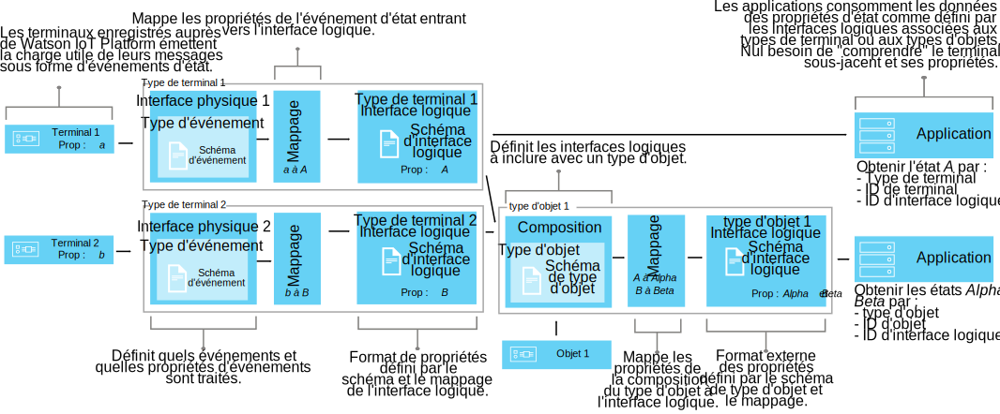

---

copyright:
years: 2016, 2018
lastupdated: "2018-03-22"

---

{:new_window: target="\_blank"}
{:shortdesc: .shortdesc}
{:screen: .screen}
{:codeblock: .codeblock}
{:pre: .pre}

# Comprendre la gestion des données
{: #definitions_resources}
Vous pouvez vouloir connecter un certain nombre de terminaux ou d'objets différents à {{site.data.keyword.iot_full}}, et ces terminaux ou objets peuvent publier des données dans différents formats. En utilisant les fonctions terminal jumeau et actif jumeau du composant de gestion des données, vous pouvez normaliser et transformer la sortie de données de vos terminaux ou objets en une seule vue logique qui peut être facilement utilisée par vos applications. Lorsque vous utilisez une seule vue logique, vous n'avez plus besoin de configurer vos applications pour comprendre les différents formats de données résultant de chaque terminal ou objet.
Vous pouvez ensuite agréger plusieurs terminaux ou objets ensemble pour définir un nouvel objet dans {{site.data.keyword.iot_short_notm}}. Utilisez l'objet pour vous aider à organiser et à analyser les données qui entrent dans {{site.data.keyword.iot_short_notm}} à partir d'une série d'entrées.  

{: shortdesc}

## Présentation
{: #overview}

Utilisez la fonction de terminal jumeau pour créer un modèle logique d'un terminal puis utilisez la fonction d'actif jumeau pour agréger ces modèles logiques pour définir de nouveaux objets. Ces modèles logiques vous aident à améliorer la réutilisation et la maintenance du code et à gérer la complexité d'un écosystème IoT en isolant vos applications des changements de données. 

Les applications peuvent accéder à l'état en cours d'un terminal ou objet sur demande via une API HTTP ou en s'abonnant à une chaîne de rubrique IoT. Cet état est constitué d'un ensemble de propriétés définies par une interface logique. Si l'état d'un terminal ou d'un objet change en raison d'un événement publié sur {{site.data.keyword.iot_short_notm}}, les valeurs de ces propriétés sont mises à jour et stockées dans {{site.data.keyword.iot_short_notm}}.

Les avantages liés à l'utilisation des fonctions de terminal jumeau ou d'actif jumeau sont les suivants :
- Mapper les propriétés d'état aux données des messages d'événement.
- Agréger plusieurs terminaux ou objets ensemble pour définir de nouveaux objets.
- Définir la structure de données que vous préférez.
- Définir plusieurs représentations ou vues de l'état des terminaux ou des objets.
- Vous abonner aux états des terminaux ou des objets, ou les interroger à tout moment via une API HTTP.

Certains cas d'utilisation courants pour l'implémentation des fonctions de terminal jumeau et d'actif jumeau incluent :
- Fournir à vos développeurs d'applications des interfaces cohérentes pour leur permettre d'accéder aux données des terminaux déclenchées par des événements à travers des API REST.
- Normaliser les données issues de terminaux de différentes marques et de différents modèles, qui publient leurs données dans différents formats.
- Modifier et convertir les formats de données pour les adapter à votre modèle d'application.
- Formater de grandes données à partir d'une gamme de terminaux ou d'objets afin que les données puissent être analysées et présentées de la manière la plus efficace possible pour aider à prédire les défaillances, planifier la maintenance, suivre les actifs et améliorer l'efficacité opérationnelle.

## Exemples
{: #examples}
Les exemples suivants illustrent deux solutions possibles. L'exemple 1 illustre comment utiliser la fonction de terminal jumeau et l'exemple 2 illustre comment utiliser la fonction d'actif jumeau. 

### Exemple 1 : Mappage de capteurs de température hétérogènes à une interface logique
{: #device-type-example}
Dans cet exemple, nous créons une interface logique qui fournit des données d'état de température homogènes dans un seul format, quel que soit le format du contenu du message d'événement du terminal actuel. Le terminal *tSensor* publie un relevé de température en degrés Celsius de `{ "t" : 34.5 }` dans {{site.data.keyword.iot_short_notm}}. Le terminal *tempSensor* publie un relevé de température en degrés Fahrenheit de `{ "temp" : 72.55 }`. Les mesures de température sont publiées sous la forme d'événements distincts.

Pour obtenir un scénario détaillé décrivant cet exemple de bout en bout, voir le [guide détaillé 1](ga_im_index_scenario.html).


Dans le cadre du flux de données de l'interface logique, vous pouvez effectuer des calculs sur les données entrantes pour normaliser ces relevés afin de les traiter de manière cohérente. Cela signifie que vous n'avez pas besoin d'inclure dans votre application une logique visant à comprendre ou convertir différentes échelles de température. L'application reçoit un seul état normalisé, la propriété d'état **temperature**, et non la propriété spécifique de chaque terminal, **t** pour l'un et **temp** pour l'autre.

### Exemple 2 : Mappage de plusieurs terminaux climatiques à une interface logique de type d'objet
{: #thing-type-example}  
Cet exemple reprend l'exemple précédent en l'élargissant à plusieurs types d'appareils. On ajoute à cet effet un ensemble de capteurs d'humidité sous la forme
d'hygromètres individuels. Grâce à l'emploi d'une interface logique de type d'objet, il est possible de fusionner les données de plusieurs types de terminal séparés en une seule interface logique qui représente tous les terminaux et capteurs installés dans la salle. Une application peut maintenant recueillir les données environnementales d'une salle en se connectant à l'interface logique associée au type d'objet "RoomType". Le diagramme suivant montre la configuration de la salle de réunion 1.

Pour obtenir un scénario de bout en bout décrivant cet exemple en détail, voir le [guide détaillé 2](../information_management/im_index_scenario_thing.html).


Un terminal de température appelé *tSensor* et un terminal d'humidité appelé *humiditySensor1* publient des données environnementales qui sont collectées dans la *Salle de réunion 1*. Les données du capteur de température et d'humidité sont mappées séparément à deux interfaces logiques de type de terminal ; une pour le type de terminal Thermomètre et pour le type de terminal Hygromètre. Nous créons maintenant un type d'objet appelé *RoomType* et instancions une instance d'objet de salle appelé *Salle de réunion 1*.

Dans une seconde salle de réunion, un terminal Température appelé *tempSensor* et un terminal Humidité appelé *humiditySensor2* publient des données environnementales collectées dans la *Salle de réunion 2*. Une autre instance d'objet de salle appelée *Salle de réunion 2* est créée sur la base du type d'objet *RoomType*.

Nous pouvons maintenant configurer une composition qui inclut les interfaces logiques Thermomètre et Hygromètre puis mapper les capteurs environnementaux corrects à chaque instance de salle, par exemple, *tSensor* et *humiditySensor1* peuvent être mappées à la *Salle de réunion 1* et *tempSensor* et *humiditySensor2* à la *Salle de réunion 2*.

L'application pour utilisateur final peut maintenant demander l'état d'ID Objet de salle spécifique et obtenir la température et l'humidité de la sale sans avoir à connaître l'infrastructure sous-jacente du terminal.

## Définitions et ressources
{: #resources}

Les diagrammes suivants illustrent le mappage logique entre les terminaux et les applications sur {{site.data.keyword.iot_short_notm}} lorsque des interfaces logiques sont utilisées.



### Concepts

Concepts                        | Description       
------------- | ------------- | -------------  
Evénement | Les événements constituent le mécanisme par lequel les terminaux publient des données sur {{site.data.keyword.iot_short_notm}}. Le terminal contrôle le contenu de l'événement et affecte un nom à chaque événement qu'il envoie.
Propriété | Donnée porteuse d'une partie de la charge utile de l'événement émis par un terminal.
Etat | Représentation la plus récente de l'état du terminal physique, qui peut inclure toutes les propriétés ayant été mappées à partir de plusieurs événements entrants.
Composition                         | Construction logique qui définit les interfaces logiques associées à un type d'objet. La composition est spécifiée par un schéma de type d'objet.   

### Ressources de gestion des données
Vous pouvez gérer les ressources à l'aide d'API REST. Pour plus d'informations sur les API REST, consultez la documentation [{{site.data.keyword.iot_short_notm}} HTTP REST API](https://docs.internetofthings.ibmcloud.com/apis/swagger/v0002/state-mgmt.html). 

Ressources Type                        | Description       
------------- | ------------- | -------------  
Type d'événement                         | Utilisez cette ressource de type d'événement pour modéliser un événement qui est publié par un terminal. Un type d'événement doit faire référence à une ressource de schéma d'événement. La ressource de schéma définit la structure de l'événement qui est publié. </br>**Important :** les événements entrants qui sont utilisés dans une interface logique doivent être au format JSON.    
Type de terminal                         |  Utilisez la ressource du type de terminal pour regrouper les terminaux partageant les mêmes caractéristiques ou comportements. En gestion des données, le type de terminal est étendu pour inclure une interface physique pour un terminal et une ou plusieurs interfaces logiques qui sont utilisées pour extraire l'état du terminal. </br>Pour plus d'informations, consultez la section "Identificateurs et types de terminal" dans la rubrique [Modèle de terminal](../reference/device_model.html#id_and_device_types).
Type d'objet                         | Construction de programmation qui représente une collection d'un ou de plusieurs types de terminal séparés, types d'objet, ou les deux. </br>**Important :** la version bêta prend en charge dix niveaux d'imbrication pour une interface logique de type d'objet.
Ressources de schéma                         |  Utilisez les ressources de schéma pour définir la structure de l'état d'un événement, d'un terminal ou d'un objet. Les [schémas JSON ](http://json-schema.org/){:new_window} suivants sont utilisés : <ul><li>Un schéma qui est associé à un type d'événement. Ce schéma est utilisé pour définir la structure de l'événement qui est publié sur {{site.data.keyword.iot_short_notm}} par un terminal. Ces schémas sont considérés comme des schémas d'événement. <li>Un schéma qui est associé à une interface logique. Ce schéma est utilisé pour définir la structure de l'état du terminal ou de l'objet qui est stocké sur {{site.data.keyword.iot_short_notm}}. Ces schémas sont considérés comme des schémas d'interface logique</ul>.</ul>

Ressources Interface                        | Description       
------------- | ------------- | -------------  
Interface logique | Construction de programme à laquelle vos applications peuvent se connecter ou s'abonner pour voir l'état d'un terminal. Une interface logique sert à définir la vue normalisée sur l'état du terminal dans {{site.data.keyword.iot_short_notm}}. Une interface logique doit être associées à un schéma d'interface logique. L'état est mis à jour en réponse à des événements de terminal entrants. **Remarque :** si vous le souhaitez, vous pouvez spécifier un alias significatif pour votre interface logique. L'alias peut être référencé dans l'appel API ou dans l'abonnement à la chaîne de rubrique utilisée pour extraire l'état d'un terminal, au lieu d'utiliser l'identificateur d'interface logique auto-généré.
Interface physique                         | Interface physique utilisée pour modéliser l'interface entre un terminal physique et {{site.data.keyword.iot_short_notm}}. Des types d'événements peuvent être associés à l'interface physique.  

Ressources Instance                        | Description       
------------- | ------------- | -------------  
Terminal                         | Un terminal représente un actif, un système ou un composant qui est enregistré auprès de {{site.data.keyword.iot_short_notm}} et qui envoie des données IoT sous la forme d'événements.  
Objet (ou Chose)                         | Construction de programmation représentant logiquement une instance unique d'un type d'objet. Une instance d'objet a le même but qu'un terminal enregistré d'un type de termina.l


Ressources de support                        | Description       
------------- | -------------   
Mappages       |Utilisez des mappages pour définir la façon dont les propriétés associées aux événements entrants sont mappées aux propriétés qui sont définies sur une interface logique. </br>**Important :** Au moins une interface logique doit être associée à un terminal ou type d'objet avant de pouvoir définir un mappage.

## Restrictions de dénomination liées aux ressources
{: #naming_restrictions}
Les restrictions de dénomination liées aux schémas, aux types d'événements et aux interfaces logiques et physiques sont les suivantes :
- Le nom doit comporter entre 1 et 128 caractères 
- Le nom doit comporter des caractères Unicode 
- Les caractères spéciaux valides sont l'espace, le tiret ( - ), le trait de soulignement ( _ ) et le point ( . )
- Le nom ne doit pas comporter que des espaces

## Création, mise à jour, activation et désactivation de vos ressources
{: #draft_active_resources}

Il peut y avoir deux versions d'une ressource : une version provisoire et une version active. Lorsque vous créez une ressource, celle-ci est créée en tant que version provisoire. 
{: shortdesc}

La version provisoire est une copie de travail que vous pouvez interroger, mettre à jour et supprimer directement par le biais des API. Créez une version active d'une ressource provisoire en activant soit un type de terminal provisoire, un type d'objet provisoire ou une interface logique provisoire. Pour activer d'autres ressources, par exemple des schémas, vous devez activer un type de terminal provisoire, un type d'objet provisoire ou une interface logique provisoire qui fasse référence à la ressource que vous souhaitez activer.

Pour distinguer les ressources provisoires des ressources actives lorsque vous utilisez les API REST, le préfixe *draft/* permet d'identifier les ressources qui sont à l'état de brouillon.

L'exemple ci-dessous extrait les métadonnées d'une définition de schéma provisoire à l'aide d'un ID spécifique :

```
GET /api/v0002/draft/schemas/{schemaId}
```
L'exemple ci-dessous extrait les métadonnées d'une définition de schéma active à l'aide d'un ID spécifique :
```
GET /api/v0002/schemas/{schemaId}
```
*Remarque :* L'identificateur est le même pour les versions provisoire et active d'une ressource donnée.


- Activation d'une ressource
{: #activate_resources}  

Utilisez l'opération **activate-configuration** pour valider et activer la configuration associée à un terminal ou à un type d'objet. Cette configuration inclut vos schémas, types d'événements, interfaces physiques, interfaces logiques et mappages provisoires. L'opération **activate-configuration** doit être exécutée sur la version provisoire d'une interface logique, d'un type de terminal ou d'un type d'objet.

L'exemple ci-dessous illustre une demande PATCH où une opération **activate-configuration** est réalisée sur la version provisoire d'un type de terminal :
```
PATCH /api/v0002/draft/device/types/TSensor
```
où le corps PATCH contient le contenu suivant :
```
  {
    "operation": "activate-configuration"
  }   
```
Pour activer une version temporaire d'un type d'objet, utilisez la méthode PATCH suivante :
```
PATCH /api/v0002/draft/thing/types/RoomType
```

- Liste des différences
{: #list_differences}  

Utilisez l'opération **list-differences** pour renvoyer une liste des différences entre la configuration active et provisoire d'une ressource d'interface logique, de type Terminal ou de type d'objet. L'opération **list-differences** doit être réalisée sur la version provisoire d'une interface logique, d'un type Terminal ou d'un type d'objet. L'exemple suivant illustre une demande PATCH où une opération **list-differences** est réalisée sur une version provisoire d'un type de terminal :
```
PATCH /api/v0002/draft/device/types/TSensor
```
où le corps PATCH contient le contenu suivant :
```
  {
    "operation": "list-differences"
  }
```
Pour renvoyer une liste des différences entre la configuration active et provisoire pour une ressource de type d'objet, utilisez la méthode PATCH suivante :
```
PATCH /api/v0002/draft/thing/types/meetingroom1
```

- Désactivation d'une ressource  
{: #deactivate_resources}  

Utilisez l'opération **deactivate-configuration** pour supprimer la configuration active qui est associée à une ressource. L'opération deactivate-configuration peut être réalisée uniquement sur la version active d'une interface logique, d'un type Terminal ou d'un type d'objet. L'exemple suivant illustre une demande PATCH où une opération **deactivate-configuration** est réalisée sur une version active d'un type de terminal :
```
PATCH /api/v0002/device/types/TSensor
```
où le corps PATCH contient le contenu suivant :
```
  {
    "operation": "deactivate-configuration"
  }
```
Pour désactiver un type d'objet, utilisez la méthode PATCH suivante :
```
PATCH /api/v0002/thing/types/RoomType
```

*Remarques :*
- Une ressource active est en lecture seule. Vous pouvez filtrer et trier des ressources provisoire et active en utilisant des paramètres de requête.
- Vous ne pouvez pas supprimer de type de terminal si des instances de terminal sont associées à ce type de terminal. L'état du terminal est effacé lorsque l'instance du terminal est supprimée. 
- Vous ne pouvez pas supprimer un type d'objet si des instances de terminal ou d'objet sont associées à ce type d'objet. L'état de l'objet est effacé lorsque les instances de terminal ou d'objet sont supprimées. 
- Vous pouvez activer uniquement les interfaces logiques, les types de terminal ou les types d'objets, directement à l'aide des API. Les autres ressources, par exemple les schémas, les interfaces physiques, les interfaces de type d'objet et les types d'événements sont activés s'ils sont référencés par une interface logique, un type Terminal ou un type d'objet qui est rendu actif.  
- L'opération **activate-configuration** doit être réalisée sur la version provisoire d'une interface logique associée à un type Terminal ou à un type d'objet, ou sur le type Terminal ou le type d'objet lui-même. L'opération **activate-configuration** vérifie que la configuration de la ressource est valide avant d'activer la ressource. Une fois l'activation terminée, l'état est généré pour chaque terminal ou instance d'objet du terminal, ou type d'objet.

## Traitement des incidents liés à votre configuration
{: #troubleshooting}
Si votre activation échoue, vérifiez que la configuration requise pour un terminal donné ou un type d'objet donné a été fournie. 

La configuration suivante doit être fournie et associée à un type de terminal :
  - Une interface physique associée à au moins un événement
  - Au moins une interface logique
  - Des mappages pour au moins une des interfaces logiques associées
  
La configuration suivante doit être fournie et associée à un type d'objet :
  - Une interface d'objet associée à au moins un terminal ou type d'objet
  - Au moins une interface logique
  - Des mappages pour au moins une des interfaces logiques associées  

Vous pouvez également effectuer une opération **validate-configuration** sur la version provisoire d'une ressource de type de terminal, de type d'objet ou d'interface logique pour vous assurer que les métadonnées associées sont valides. Si les métadonnées sont invalides, une liste des problèmes est renvoyée dans le corps de la réponse.  

L'exemple suivant illustre une demande PATCH où une opération **validate-configuration** est réalisée sur la version provisoire d'un type de terminal appelé "TSensor" :  
```
PATCH /api/v0002/draft/device/types/TSensor
```
où le corps PATCH contient le contenu suivant :
```
  {
    "operation": "validate-configuration"
  }
```  
L'exemple suivant illustre une réponse invalide à la demande PATCH :  
```
{
"message": "CUDIM0303I: State update configuration for Device Type 'TSensor' is not valid.",
"details": {
  "id": "CUDIM0303I",
  "properties": [
    "Device Type",
    "Sensor"
  ]
},
"failures": [
  {
    "message": "CUDVS0301E: The device type 'TSensor' does not have any mappings defined for it",
    "details": {
      "id": "CUDVS0301E",
      "properties": [
        "TSensor"
      ]
    }
  }
]
}
```  
L'exemple suivant illustre une réponse valide à la demande PATCH :  
```  
{
"message": "CUDIM0303I: State update configuration for Device Type 'TSensor' is valid.",
"details": {
  "id": "CUDIM0303I",
  "properties": [
    "Device Type",
    "TSensor"
  ]
},
 "failures": []
}
```  
Si toutes les ressources requises sont associées au type de terminal ou d'objet, vérifiez que les mappages de propriété sont valides. Les exemples suivants illustrent des erreurs susceptibles de se produire :

  - Une expression fait référence à une propriété sur un événement qui n'est pas défini par le schéma d'événement
  - Une expression fait référence à une propriété sur un état qui n'est pas défini par le schéma d'interface logique
  - Un mappage est défini pour une propriété qui n'est pas définie par le schéma d'interface logique


Vous pouvez consulter le journal des erreurs suivant pour mieux diagnostiquer les erreurs d'exécution des types de terminal :
```
iot-2/type/${typeId}/id/${deviceId}/err/data
```
Vous pouvez consulter le journal des erreurs suivant pour mieux diagnostiquer les erreurs d'exécution des types d'objets :
```
iot-2/type/${typeId}/id/${thingId}/err/data
```

### Limites de ressources

Le tableau ci-dessous présente le nombre maximum de ressources pouvant être configurées en fonction du type de plan. 

Ressource                   |Plan standard                  | Plan Lite 
------------- | ------------- | ------------- 
Interfaces logiques | 1000 | 10
Interfaces physiques           | 1000 | 5
Types d'événement | 1000 | 10
Schémas |2000 | 20
Références à l'interface logique (Nombre d'interfaces logiques pouvant être mappées à un type de terminal)  |20 | 5
Références au type d'événement (Nombre d'associations ID d'événement-Type d'événement pouvant appartenir à une interface physique)| 40 | 10


