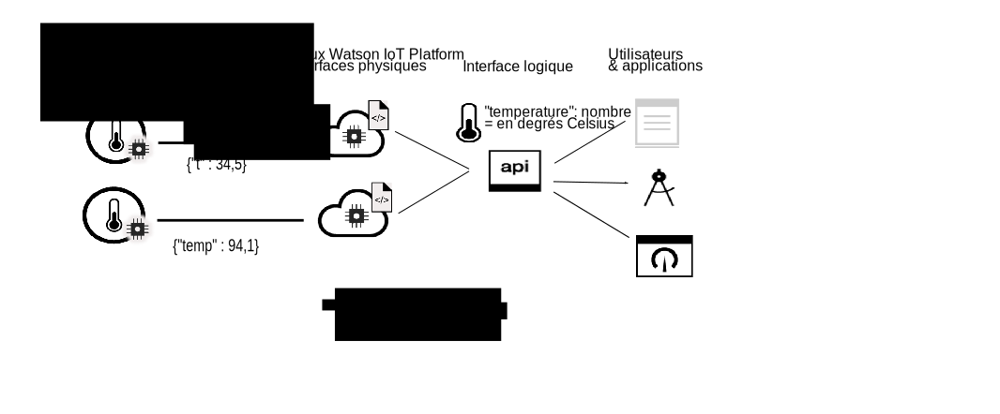

---

copyright:
years: 2017, 2018
lastupdated: "2018-08-28"

---

{:new_window: target="\_blank"}
{:shortdesc: .shortdesc}
{:screen: .screen}
{:codeblock: .codeblock}
{:pre: .pre}

# Introduction à la gestion de données
{: #device_twins}

<!--An unprecedented number of devices and sensors exist in the modern world. Connected devices generate vast amounts of digital data at extraordinary speeds. Such volumes of data represent great opportunities but also challenges, in terms of how big data can be processed, analyzed and presented to help to deliver insights and drive transformation.-->

Les terminaux peuvent fournir des sorties de données similaires mais varier en terme de marque, de modèle et de version ou peuvent générer des données dans des formats différents. Par exemple, un terminal équipé d'un capteur de température dans un bureau peut rapporter des températures en degrés Fahrenheit ou en degrés Celsius. Il est inefficace de configurer les applications pour qu'elles puissent consommer les données dans tous ces formats. A la place, les données doivent être collectées, transformées et normalisées pour créer un modèle logique unique afin qu'une application puisse interagir avec les différents terminaux de la même manière. 

Le composant de gestion de données de {{site.data.keyword.iot_short_notm}} inclut une fonction de terminal jumeau et une fonction d'actif jumeau. La fonction de terminal jumeau vous permet de tirer parti de la collecte, de la transformation et de la normalisation des différents formats de données de terminal en un seul modèle logique. La fonction d'actif jumeau vous permet de grouper différents terminaux ensemble pour créer un objet, qui est une structure de données basée sur un actif de valeur supérieure. Vous pouvez même regrouper des objets ensemble pour créer de nouveaux objets. Une application peut interagir avec le modèle logique, quel que soit le format de données utilisé par les terminaux ou les objets individuels. 

Par exemple, un groupe de terminaux générant des rapports sur la température, l'humidité et la lumière ambiante peut être agrégé en un objet "Salle" pour représenter le niveau de confort d'un bureau spécifique. Plusieurs objets "Salle" peuvent être agrégés dans un objet "Etage" pour représenter tous les bureaux à un niveau spécifique, et plusieurs objets "Etage" peuvent être agrégés dans un objet "Immeuble". L'abstraction d'objet permet à votre application d'être dissociée de la manière complexe dont les terminaux sont connectés, du format dans lequel les terminaux publient les données des événements et de la façon dont les données sont combinées.
{: shortdesc}

## Terminaux jumeaux

Un terminal jumeau est une représentation numérique basée sur le cloud d'un terminal physique connecté à {{site.data.keyword.iot_short_notm}}. Un terminal jumeau représente un modèle logique des événements qui sont publiés par un terminal. Une fois que vous avez défini et instancié le terminal jumeau, ce dernier permet d'interagir de manière constante avec un terminal basé sur REST, que le terminal soit en ligne ou hors ligne. Les propriétés d'un terminal, y compris les informations sur l'état en cours du terminal (état du terminal), peuvent être extraites avec une demande HTTP ou en s'abonnant à une rubrique IoT.

Les avantages liés aux terminaux jumeaux sont les suivants :
- Fournir à vos développeurs d'application des interfaces cohérentes pour leur permettre d'accéder aux données des terminaux déclenchées par les événements à travers des API REST.
- Accéder à l'état d'un terminal.
- Normaliser les données issues de terminaux de marques et modèles différents qui publient leurs données dans différents formats.
- Filtrer les données non nécessaires.

Pour créer un terminal jumeau, vous devez définir les ressources suivantes dans {{site.data.keyword.iot_short_notm}}:
- La structure des événements qui sont envoyés par votre terminal.  
La structure d'un événement entrant est défini dans l'interface physique, le type d'événement et les ressources de schéma d'événement. 
- Les propriétés que vous souhaitez enregistrer.  
Ces propriétés définissent la structure logique de l'état du terminal pouvant être utilisé par vos applications. Les propriétés sont définies dans l'interface logique et les ressources de schéma logiques.  
- Le mappage des événements de l'interface physique sur les propriétés de l'interface logique.  
Utilisez la ressource des mappages pour mapper les événements aux propriétés.

Le diagramme suivant montre deux terminaux de température différents à des emplacements différents. Un terminal signale les données de terminal en degrés Celsius et l'autre en degrés Fahrenheit. Les données sont envoyées à {{site.data.keyword.iot_short_notm}} dans les formats de température "t" et "temp". {{site.data.keyword.iot_short_notm}} transforme automatiquement les degrés Fahrenheit en degrés Celsius. Les formats de température "t" et "temp" sont normalisés dans le format logique "temperature". L'application peut demander l'état de n'importe quel terminal en accédant à la valeur du paramètre "temperature". 

## Actifs jumeaux (Objets)

Les actifs jumeaux vous permettent de pousser le concept de terminal jumeau un peu plus loin. Un actif jumeau permet d'agréger des terminaux dans une entité unique appelée Objet. Un objet, ou un actif jumeau, a un concept similaire à celui du terminal jumeau, à la différence qu'il représente un groupe de terminaux en tant que modèle logique unique. Vous pouvez même agrégé des objets pour former des niveaux d'abstractions supérieurs. Par exemple, un objet "Salle" peut agréger les terminaux suivants :

- Un terminal avec un capteur de température (thermomètre)
- Un terminal avec un capteur d'humidité (hygromètre)

Un objet "Etage" peut ensuite agréger plusieurs objets "Salle". 

La structure d'un objet est définie à l'aide d'un schéma JSON. Le schéma fait référence aux interfaces logiques des terminaux ou objets agrégés. Les propriétés d'un objet, y compris les informations sur l'état en cours de l'objet, peuvent être extraites à l'aide d'une demande HTTP, ou en s'abonnant à une rubrique IoT.

Les actifs jumeaux peuvent vous aider à :
 
- agréger plusieurs terminaux jumeaux ou objets pour définir de nouveaux objets.
- accéder à l'état d'un objet.
- gérer des actifs sans être exposé à leur instrumentation individuelle.
- filtrer les données non nécessaires.
- normaliser les interfaces d'objet pour dissocier vos applications de la manière complexe dont les objets spécifiques sont construits.

Pour créer un actif jumeau, vous devez définir les ressources suivantes dans {{site.data.keyword.iot_short_notm}} :

- La structure de l'objet.  
La structure de l'objet est définie par le schéma d'objet qui spécifie les terminaux ou les objets agrégés.
- La structure de l'état d'objet souhaité qui est composé des propriétés que vous souhaitez enregistrer.  
Ces propriétés définissent la structure logique de l'état d'objet qui peut être consommé par vos applications. Les propriétés sont définies dans l'interface logique et les ressources de schéma logiques.  
- Les modalités de mappage de l'interface d'objet aux propriétés de l'interface logique.  
Utilisez la ressource des mappages pour mapper les événements aux propriétés.

Le diagramme suivant montre les capteurs de température et d'humidité sur différents terminaux qui publient des données d'événement de température et d'humidité dans {{site.data.keyword.iot_short_notm}}. Deux terminaux jumeaux, chacun représentant un terminal physique, ont des interfaces logiques associées et sont créés dans {{site.data.keyword.iot_short_notm}}. Les données qui sont publiées à partir du terminal de température sont mappées à l'interface logique "IThermometer". Les données qui sont publiées à partir du terminal d'humidité sont mappées à l'interface logique "IHygrometer". Les interfaces logiques sont agrégées dans un type d'objet *Salle* avec une interface logique "IRoom". L'interface logique "IRoom" définit les propriétés de température et d'humidité et vous permet de créer votre propre modèle logique en agrégeant des terminaux dans un objet unique avec lequel votre application peut interagir.  

**Important :** La fonction Objet de {{site.data.keyword.iot_short_notm}} est uniquement disponible dans le cadre d'un programme bêta limité. Il est possible que des mises à jour ultérieures incluent des modifications incompatibles avec la version en cours de cette fonction. Essayez-la et [dites-nous ce que vous en pensez ](https://developer.ibm.com/answers/smart-spaces/17/internet-of-things.html){: new_window}.

Pour plus d'informations sur la définition et la configuration d'informations et ressources clés, voir [Comprendre la gestion des données](ga_im_definitions.html). 

## Etapes suivantes

- Créez votre propre terminal jumeau dans {{site.data.keyword.iot_short_notm}}. Pour plus d'informations, voir la documentation [Initiation à la gestion des données via l'interface Web](im_ui_flow.html). 
- Créez un terminal jumeau et un actif jumeau à l'aide des API REST. Pour plus d'informations, voir la documentation [Initiation à la gestion des données](../information_management/getting_started_things.html).  
- Créez des règles qui sont déclenchées lorsque des données d'événements qui correspondent à une condition spécifiée ou à une ensemble de condition, sont reçues par {{site.data.keyword.iot_short_notm}}. Pour plus d'informations, voir la documentation bêta [Règles imbriquées](../information_management/im_rules.html).

Pour en savoir plus sur chacune des étapes décrites dans la documentation *Initiation à la gestion des données*, reportez-vous aux exemples de scénarios documentés dans les rubriques suivantes : 

- [Guide détaillé 1 : Exemple détaillé d'utilisation des terminaux via une interface commune](ga_im_index_scenario.html#scenario) 
- [Guide détaillé 2 : Exemple détaillé d'utilisation des objets via une interface commune](../information_management/im_index_scenario_thing.html#scenario) 

