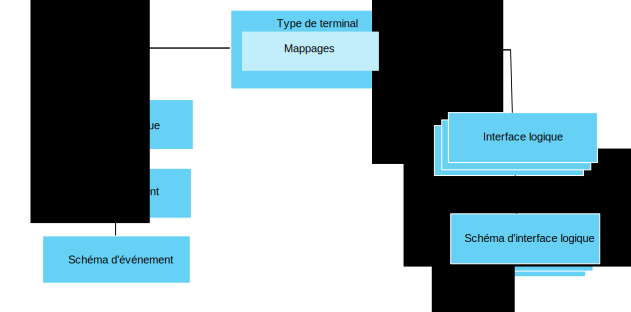

---

copyright:
years: 2016, 2017
lastupdated: "2017-07-21"

---

{:new_window: target="\_blank"}
{:shortdesc: .shortdesc}
{:screen: .screen}
{:codeblock: .codeblock}
{:pre: .pre}

# Initiation à la gestion des données
{: #im_example}

Utilisez les étapes décrites ci-après pour vous aider à configurer les ressources dont vous avez besoin pour commencer à utiliser la fonction de gestion des données.

Pour des détails sur les API, consultez la documentation en anglais [{{site.data.keyword.iot_full}} HTTP REST API ](https://docs.internetofthings.ibmcloud.com/apis/swagger/v0002/state-mgmt.html){:new_window}.

**Astuce :** Pour des informations plus détaillées sur chacune de ces étapes, consultez les exemples de scénario ou utilisez les liens pour accéder directement à une étape spécifique du guide détaillé. Le document [Guide détaillé : Exemple détaillé de la manière de travailler avec des terminaux via une interface commune](ga_im_index_scenario.html#scenario) vous fait découvrir la procédure de création d'une interface logique de type de terminal pour différents thermomètres hétérogènes.

## Avant de commencer
Pour commencer à utiliser la fonction de gestion des données, vous devez avoir au moins un [terminal enregistré](ga_im_index_scenario.html#step14) qui envoie des données à {{site.data.keyword.iot_short_notm}}.  

Le diagramme ci-dessous présente une vue logique de la manière dont les ressources que vous devez configurer s'imbriquent entre elles :

## Procédure

1. 	Définissez les propriétés d'état entrantes.  
Définissez les propriétés d'état entrantes que votre interface logique devra mettre à la disposition de vos applications.  
<dl>
<dd>
<ol>
<li>[Créez un fichier schéma d'événement provisoire](ga_im_index_scenario.html#step1). Il s'agit d'un fichier .JSON local qui définit la structure et le format d'un événement entrant.
<li>[Créez une ressource de schéma d'événement provisoire pour votre type d'événement](ga_im_index_scenario.html#step2). Cette ressource est une construction programmatique utilisée par {{site.data.keyword.iot_short_notm}}.
<li>[Créez un type d'événement provisoire qui fasse référence au schéma d'événement](ga_im_index_scenario.html#step3). Le type d'événement est utilisé par
{{site.data.keyword.iot_short_notm}} pour mapper une ou plusieurs ressources Schéma d'événement à une interface physique.
<li>[Créez une interface physique provisoire](ga_im_index_scenario.html#step7).
<li>[Ajoutez le type d'événement à l'interface physique provisoire](ga_im_index_scenario.html#step8).
<li>[Mettez à jour le type de terminal pour connecter l'interface physique provisoire](ga_im_index_scenario.html#step9).
</ol>
</dd>
</dl>
4. 	Créez l'interface logique provisoire.
 1. 	[Créez un fichier schéma d'interface logique provisoire](ga_im_index_scenario.html#step4) pour le type de terminal provisoire.  
Un fichier schéma d'interface logique est un fichier .JSON local qui définit l'état du terminal mis à la disposition de vos applications.
 2. [Créez une ressource de schéma d'interface logique provisoire](ga_im_index_scenario.html#step5) pour le type de terminal provisoire.
 3.	[Créez une interface logique provisoire](ga_im_index_scenario.html#step6) pour le type de terminal provisoire.
 4.	[Ajoutez l'interface logique provisoire au type de terminal provisoire](ga_im_index_scenario.html#step10).
5. 	[Définissez les mappages provisoires](ga_im_index_scenario.html#step11) pour le type de terminal provisoire.   
Les mappages servent à mapper les propriétés entrantes aux propriétés de l'interface logique.
6. 	[Validez et activez la configuration](ga_im_index_scenario.html#step15) associée au type de terminal provisoire.
7. 	[Extrayez l'état du terminal actif](ga_im_index_scenario.html#step13).  
Vérifiez que vos abonnements permettent de voir les données de terminal mises à jour ou que ces mêmes données sont retournées en réponse à un appel REST ou à un abonnement à une rubrique.
