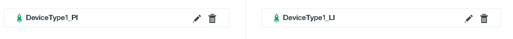

---

copyright:
years: 2016, 2018
lastupdated: "2018-05-14"

---

{:new_window: target="\_blank"}
{:shortdesc: .shortdesc}
{:screen: .screen}
{:codeblock: .codeblock}
{:pre: .pre}

# Initiation à la gestion des données via l'interface Web
{: #gs_web}

{{site.data.keyword.iot_full}} fournit des outils en ligne pour vous permettre de normaliser et de transformer des données dans le cadre de la fonctionnalité de gestion des données.

## Présentation
{: #web_overview}

Outre l'[API de gestion des données Watson IoT Platform](https://docs.internetofthings.ibmcloud.com/apis/swagger/v0002/state-mgmt.html){:new_window} fournie, vous pouvez utiliser le Créateur d'interface simple ou le Créateur d'interface avancée pour configurer des ressources et commencer à mapper vos données de terminal. Les créateurs d'interface en ligne vous guident tout au long de la procédure de l'interface utilisateur.

Une interface physique est utilisée pour modeler l'interface entre un terminal physique et Watson IoT Platform. Des types d'événements peuvent être associés à l'interface physique. Une interface logique est utilisée pour définir la vue normalisée sur l'état du terminal dans Watson IoT Platform et elle est généralement utilisée par les applications. Une interface logique doit être associée à un schéma d'interface logique. L'état est mis à jour en réponse à des événements de terminal entrants.

Pour en savoir plus sur la fonction de gestion des données et ses avantages, voir [Introduction à la gestion des données](../GA_information_management/ga_im_device_twin.html#device_twins).

Pour plus d'informations sur les ressources que vous devez configurer, voir [Comprendre la gestion des données](../GA_information_management/ga_im_definitions.html#definitions_resource).

Avec le Créateur d'interface simple, lorsque vous ajoutez une interface physique, une interface logique est automatiquement créée et mappée à elle. Lorsque vous utilisez le Créateur d'interface avancée, vous disposez de davantage d'options de configuration. Vous ajoutez une interface physique, une ou plusieurs interfaces logiques, puis vous ajoutez des mappages entre les deux.

Les interfaces et les mappages sont ajoutés de manière provisoire. Une fois que vous les avez ajoutés et validés, vous devez les activer. Pour plus d'informations sur les ressources actives et provisoires, voir [Création, mise à jour, activation et désactivation de vos ressources](../GA_information_management/ga_im_definitions.html#draft_active_resources).

Les bibliothèques d'interfaces contiennent des interfaces physiques et logiques types que vous pouvez réutiliser.

## Flux de niveau supérieur
{: #interface_flow}

Utilisez les étapes décrites ci-après pour vous aider à configurer les ressources dont vous avez besoin pour commencer à utiliser la fonction de gestion des données.

### Avant de commencer

Cette procédure suppose que votre type de terminal comprend au moins un terminal enregistré et connecté. Pour en savoir plus sur ces conditions requises et pour savoir comment créer un type de terminal et enregistrer un terminal, voir [Connexion des terminaux](../iotplatform_task.html#iotplatform_task).

### Procédure

1. Sélectionnez le Créateur d'interface simple ou le Créateur d'interface avancé :
  - **Flux du Créateur d'interface simple**
    1. [Créez une interface physique provisoire](#create_physical_interface_simple).
  - **Flux du Créateur d'interface avancée**
    1. [Créez une interface physique provisoire](#create_physical_interface_advanced).
    2. [Créez une ou plusieurs interfaces logiques provisoires](#create_logical_interface). (Cette étape est automatique lorsque vous utilisez le flux simple.)
    3. [Mappez l'interface physique aux interfaces logiques](#create_interface_mappings).
2. [Définissez vos préférences de notification](#set_notifications).
3. [Activez la configuration](#validate_activate).

Vous pouvez également configurer la fonction de gestion des données au moyen des API. Pour obtenir des informations détaillées sur la configuration de la fonction de gestion des données pour normaliser et transformer les données de votre terminal à l'aide des API, voir [Initiation à la gestion des données](ga_im_example.html#im_example). Le document [Guide détaillé : Exemple d'utilisation des terminaux via une interface commune](../GA_information_management/ga_im_index_scenario.html#scenario) vous fait découvrir la procédure de création d'une interface logique de type de terminal pour différents thermomètres hétérogènes. Pour des détails sur les API, consultez la documentation en anglais [{{site.data.keyword.iot_short_notm}} HTTP REST API ](https://docs.internetofthings.ibmcloud.com/apis/swagger/v0002/state-mgmt.html){:new_window}.
{: tip}

## Création d'une interface physique provisoire (Flux simple)
{: #create_physical_interface_simple}

1. Dans le menu de navigation principal, cliquez sur **Terminaux**.
2. Cliquez sur **types de terminal** et sélectionnez le type de terminal pour lequel vous souhaitez créer une interface. Vous pouvez également créer un nouveau type de terminal. Voir [Connexion des terminaux](../iotplatform_task.html#iotplatform_task) pour plus d'informations.
3. Consultez les informations relatives au type de terminal et cliquez sur **Interface**.
4. Cliquez sur **Flux simple** pour ouvrir le Créateur d'interface simple.
5. Cliquez sur **Créer une interface**.
6. Cliquez sur **Ajouter une propriété** pour commencer à ajouter des événements et des propriétés à l'interface physique.
   a. Dans la fenêtre **Ajouter des propriétés à l'interface**, sélectionnez les événements que vous voulez ajouter à l'interface. Le système écoute les événements actifs des terminaux connectés pour le type de terminal que vous avez sélectionné. Vous pouvez sélectionner l'ID de terminal du dernier événement mis en cache, ou sélectionner un autre événement à partir de la liste.
   b. Sélectionnez les propriétés à partir de l'événement et cliquez sur **Ajouter**.
   c. Ajoutez d'autres propriétés si nécessaire.
7. Cliquez sur **Terminé**. L'interface physique est créée. Si vous souhaitez ajouter plus de détails, vous pouvez [effectuer une mise à niveau vers une interface avancée](#create_physical_interface_advanced) en sélectionnant le lien **Utiliser le créateur d'interface avancée**.

## Création d'une interface physique provisoire (Flux avancé)
{: #create_physical_interface_advanced}

1. Dans le menu de navigation principal, cliquez sur **Terminaux**.
2. Cliquez sur **types de terminal** et sélectionnez le type de terminal pour lequel vous souhaitez créer une interface. Vous pouvez également créer un nouveau type de terminal. Voir [Connexion des terminaux](../iotplatform_task.html#iotplatform_task) pour plus d'informations.
2. Consultez les informations relatives au type de terminal et cliquez sur **Interface**.
3. Cliquez sur **Flux avancé** pour ouvrir le Créateur d'interface avancée.
4. Choisissez l'une des options suivantes :
 - Pour créer une nouvelle interface physique, cliquez sur **Créer une interface**.
 - Pour utiliser un modèle d'interface de la bibliothèque, cliquez sur **Ajouter à partir d'une bibliothèque**, sélectionnez l'interface puis allez à la section [Création d'un projet d'interface logique](#create_logic_interface).
5. Sur l'onglet **Identité** de la page **Créer une interface physique**, entrez un nom et une description de l'interface physique.
6. Facultatif : activez Edge si vous utilisez des terminaux compatibles avec Edge avec l'interface. Pour en savoir plus sur Edge, voir [Edge analytics](../edge_analytics.html#edge_analytics).
7. Cliquez sur **Suivant**.
8. Définissez l'interface physique en ajoutant et en modifiant les types d'événements et les contenus :
   a. Sélectionnez un type d'événement dans la liste pour modifier un type d'événement existant ou cliquez sur **Créer un type d'événement**.
   b. Sélectionnez le dernier événement mis en cache, sélectionnez un événement dans la liste, ou ajoutez un événement manuellement puis cliquez sur **Ajouter**.
9. Cliquez sur **Terminé**. L'interface physique est créée en version provisoire. Vous pouvez continuer en ajoutant une ou plusieurs interfaces logiques.

## Création d'interfaces logiques provisoires (flux avancé)
{: #create_logical_interface}

1. Après avoir créé l'interface physique provisoire, choisissez l'une des options suivantes :
 - Cliquez sur **Ajouter une interface logique** pour créer une nouvelle interface logique.
 - Cliquez sur **Ajouter à partir d'une bibliothèque** pour utiliser un modèle d'interface à partir de la bibliothèque d'interfaces. Sélectionnez l'interface et passez à l'étape 7.
2. Sur l'onglet **Identité** de la page **Créer une interface logique**, entrez un nom et une description de l'interface logique.
3. Cliquez sur **Suivant**.
4. Cliquez sur **Ajouter une propriété** pour commencer à définir les propriétés de l'interface logique.
5. Dans la fenêtre **Créer une propriété**, sélectionnez les propriétés de l'interface physique que vous souhaitez ajouter à l'interface logique et sauvegardez vos modifications.
6. Cliquez sur **Ajouter un objet**.
7. Ajoutez d'autres interfaces logiques si nécessaire, et cliquez sur **Suivant**.
8. {: #set_notifications}Définissez les préférences de notification de l'interface. Sélectionnez l'une des options suivantes pour déterminer à quel moment envoyer les notifications d'état du terminal :
 - Pas de notifications d'événement - Aucune notification n'est envoyée. Vous pouvez vous servir de l'API pour extraire les informations relatives au changement d'état du terminal.
 - En cas de changement d'état - Une notification est envoyée en cas de changement d'état du terminal.
 - Pour chaque événement - Une notification est envoyée chaque fois que la plateforme traite un événement pour le terminal, même si l'événement n'entraîne pas de changement d'état.
8. Cliquez sur **Terminé**. Les interfaces sont créées et  indique l'état provisoire. Vous pouvez procéder à la modification ou activer les interfaces.

## Activation de la configuration
{: #validate_activate}

Après avoir créé les interfaces physiques et logiques, vous devez activer la configuration.

- Cliquez sur **Activer** pour activer la configuration. L'état de la configuration est défini sur activé.
 Si vous apportez des changement aux interfaces, les interfaces reviennent à l'état provisoire et vous devez les réactiver.
