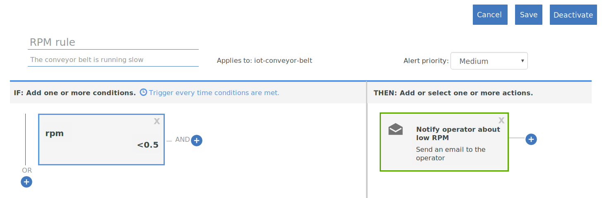

---

copyright:
  years: 2017, 2018
lastupdated: "2018-01-11"

---

{:shortdesc: .shortdesc}
{:new_window: target="_blank"}
{:codeblock: .codeblock}
{:pre: .pre}
{:screen: .screen}
{:tip: .tip}

# Guide 2 : Utilisation des règles et actions de base en temps réel
Utilisez les instructions de ce guide pour configurer un ensemble de règles et d'actions de base pour certaines analyses en temps réel des données IoT de votre tapis roulant.
{:shortdesc}

## Présentation et objectif
{: #overview}  
Maintenant que vous avez correctement configuré votre tapis roulant, que vous l'avez connecté à {{site.data.keyword.iot_full}} et que vous avez envoyé certaines données , il est temps d'exploiter ces données en utilisant des règles et des actions.



Dans le cadre de ce guide, vous allez apprendre à :
- Créer un schéma de message pour les données d'événement de terminal de votre tapis roulant.
- Créer et déclencher une règle.
- Créer une action de messagerie.

## Prérequis
{: #prereqs}  
Vous devez disposer d'un terminal connecté de type `iot-conveyor-belt` qui envoie des événements `sensorData` avec une charge de message incluant les propriétés suivantes :
```
{
	"d": {
		"id": "belt1",
		"ts": 1494946276931,
		"ay": "0.00",
		"running": true,
		"rpm": "1.0"
		}
}
```
Pour plus d'informations sur les événements de terminaux et le format des messages, voir [Publication d'événements](/docs/services/IoT/devices/mqtt.html#publishing_events).  
Si vous avez terminé l'étape [Guide 1 : Initiation à {{site.data.keyword.iot_short_notm}} et à un tapis roulant simulé](getting-started-iot-conveyor.html), vous êtes prêt.  
{: tip}

## Etape 1 - Création d'un schéma de message pour le modèle d'application
{: #create_schema}

Pour utiliser les propriétés qui sont envoyées par votre terminal en tant que déclencheurs de règles, vous devez d'abord mapper ces propriétés à un schéma de messagerie dans {{site.data.keyword.Bluemix_notm}}. Pour plus d'informations, voir [Création de schémas de type de terminal](/docs/services/IoT/im_schemas.html#iotrtinsights_task).
1. Dans le tableau de bord {{site.data.keyword.iot_short_notm}}, accédez à **Terminaux** et sélectionnez **Gérer les schémas**.
2. Cliquez sur **Ajouter un schéma**.
3. Sélectionnez le type de terminal **iot-conveyor-belt** et cliquez sur **Suivant**.
4. Ajoutez des propriétés au schéma.
 1. Cliquez sur **Ajouter une propriété**.
 2. Sélectionnez **A partir de terminaux connectés**.
 3. Envoyez un point de données du tapis roulant en modifiant la valeur rpm.
Dans l'application Web du tapis roulant, cliquez sur **Arrêter** ou **Démarrer** pour publier un message.  
La liste des propriétés est renseignée avec les propriétés envoyées par le terminal.
 4. Sélectionnez toutes les propriétés et cliquez sur **OK**.
5. Cliquez sur **Terminer** pour créer le schéma.  

Le schéma est créé et le type de données rpm est défini sur Variable flottante.

## Etape 2 - Création d'une règle simple pour la propriété rpm
{: #create_rule}  
Le moteur de règles {{site.data.keyword.Bluemix_notm}} compare les points de données de la propriété qui sont envoyés par votre terminal aux valeurs de seuil statiques qui sont définies dans la règle, et déclenche la règle lorsque les conditions sont remplies. Pour plus d'informations sur les règles, voir [Cloud Analytics](/docs/services/IoT/cloud_analytics.html#rules).
Pour créer une règle qui se déclenche lorsque la valeur rpm du tapis roulant est inférieure à 0.5 :
1. Modifiez le type de la propriété rpm en Valeur flottante.  
Lorsque nous créons une règle, nous voulons comparer la valeur rpm numérique à un seuil. Pour ce faire, la propriété doit être reconnue en tant que valeur flottante ou entier.
 1. Dans le tableau de bord {{site.data.keyword.iot_short_notm}}, accédez à **Terminaux** et sélectionnez **Gérer les schémas**.
 1. Cliquez sur le schéma que vous venez de créer et sélectionnez **Propriétés**.
 2. Cliquez sur l'icône d'édition pour éditer le schéma.
 3. Cliquez sur l'icône d'édition en regard de la propriété `rpm`.
 4. Modifiez le type de données en `Variable flottante`.  
 5. Cliquez sur **OK**.
 6. Cliquez sur **Terminer** pour mettre à jour le schéma.  
2. Créez la règle.
 1. Dans le tableau de bord, accédez à **Règles**.
 2. Cliquez sur **Créer une règle Cloud**.
 3. Entrez le nom `Règle RPM`.
 4. Définissez la règle à appliquer au schéma **iot-conveyor-belt**.
 5. Cliquez sur **Suivant**.
 6. Ajoutez une condition de règle.
    6. Cliquez sur la vignette **Nouvelle condition** pour ajouter une condition à la règle.
    7. Sélectionnez la propriété **rpm**.
    8. Sélectionnez l'opérateur Inférieur à (`<`).
    9. Entrez la valeur `0.5` et cliquez sur **OK**.
    10. Cliquez sur **Sauvegarder**, puis sur **Fermer**.
 11. Cliquez sur **Fermer**.  
La nouvelle règle apparaît dans la liste avec l'état "Désactivé".
12. Cliquez sur le commutateur d'état pour activer la règle.
L'état apparaît maintenant comme "Activé".

## Etape 3 - Déclenchement de la règle
{: #trigger_rule}
En diminuant la valeur rpm, vous pouvez simuler les problèmes de tapis roulant susceptibles de nécessiter une intervention de l'opérateur. Lorsque la valeur de seuil de rpm est atteinte, une alerte s'affiche dans le tableau de bord.
1. Dans le tableau de bord {{site.data.keyword.iot_short_notm}}, sélectionnez **Tableaux**.
3. Sélectionnez **Analyse centrée sur la règle**.
4. Dans l'application Web du tapis roulant, diminuez la valeur rpm en dessous de la valeur 0.5.
Le terminal envoie les données à {{site.data.keyword.iot_short_notm}} lorsque les relevés de capteur changent. Vous pouvez simuler cet envoi de données en arrêtant le tapis roulant, en le démarrant ou en changeant sa vitesse.  
5. Vérifiez que la `Règle RPM` s'affiche dans la carte Règles avec alertes.
6. Sélectionnez la nouvelle alerte dans la carte Alertes de règle et examinez les points de données qui ont déclenché la règle dans la carte Informations sur l'alerte de règle.  
Pour plus d'informations sur l'alerte, consultez les détails du terminal dans les cartes Terminaux associés, Informations sur le terminal et Propriétés de terminal.  
{: tip}

## Etape 4 - Création de l'action à prendre en cas de déclenchement de la règle RPM
{: #create_action}
Outre l'affichage d'une alerte dans le tableau de bord {{site.data.keyword.iot_short_notm}}, vous pouvez créer des actions à prendre lorsqu'une règle est déclenchée, par exemple, envoyer un e-mail à l'opérateur qui s'occupe du tapis roulant si la valeur rpm devient trop basse. Pour plus d'informations, voir [Cloud Analytics](/docs/services/IoT/cloud_analytics.html#shared).
Pour créer l'action Envoyer un courrier électronique :
1. Dans le tableau de bord {{site.data.keyword.iot_short}}, accédez à **Règles**.
2. Cliquez sur la **Règle RPM**.
3. Cliquez sur la vignette **Nouvelle action**.
4. Créez une action.
 1. Cliquez sur **Ajouter une action**.
 2. Entrez le nom d'action `Avertir l'opérateur en cas de valeur RPM faible`.
 3. Entrez la description `Envoyer un e-mail à l'opérateur`.
 4. Sélectionnez le type **Envoyer un e-mail**.
 5. Cliquez sur **Suivant**.
 6. Dans la ligne Objet, entrez `Alerte de RPM faible`.
 7. Dans la zone A, sélectionnez **Des personnes spécifiques** et entrez `operator@company.com`.  
Remplacez l'adresse e-mail par la vôtre.
 8. Sélectionnez **Inclure des données** pour inclure les données de terminal dans le courrier électronique.
 9. Cliquez sur **Terminer** pour sauvegarder l'action.  
5. Sélectionnez l'action dans la liste et cliquez sur **OK** pour la définir.
6. Cliquez sur **Sauvegarder** pour activer l'action avec la règle.
7. Testez la nouvelle action.
 4. Dans l'application Web du tapis roulant, diminuez la valeur rpm en dessous de la valeur 0.5.
 5. Vérifiez que vous avez reçu un e-mail d'alerte.  
Le corps du message peut ressembler à ce qui suit :
> **Règle :** Règle RPM  
> **Terminal :** 3m5wxr:iot-conveyor-belt:belt1  
> **Date :** 2017-05-09T18:21:21.567Z  
> **Condition :**  
> iot_conveyor_belt.d.rpm<0.5  
> **Message entrant :**  
> {"d":{"id":"belt1","ts":1494354089837,"ay":"0.00","rpm":"0.4","running":true},"ruleContent":{"jobID":"sdIyBfdu","contextSchemas":[],"ruleDescription":"","severity":4,"messageSchemas":["iot_conveyor_belt"],"disabled":false,"ruleCondition":"iot_conveyor_belt.d.rpm<0.5","transforms":[],"name":"RPM rule","actions":["pziIRovt"],"id":"ncKK4N7k","updated":"9 May 2017 18:20:25 GMT","created":"9 May 2017 17:41:38 GMT","version":7}}  
> This is an automatically generated email. Do not reply. For questions regarding this alert, contact your system administrator.

## Etapes suivantes
{: #whats_next}  
Passez au guide suivant ou à une autre rubrique qui vous intéresse :
- [Guide 3 : Surveillance des données de votre terminal](getting-started-iot-monitoring.html)  
Maintenant que vous avez connecté un ou plusieurs terminaux et que vous avez commencé à exploiter les données du terminal, vous pouvez commencer à surveiller une collection de terminaux et les données en temps réel qui sont envoyées.
- [Guide 4 : Simulation d'un grand nombre de terminaux](getting-started-iot-large-scale-simulation.html)  
Le modèle d'application de tapis roulant du chemin A vous permet de simuler manuellement un ou quelques terminaux de tapis roulant. Ce guide vous permet de configurer un environnement simulé qui contient un grand nombre de terminaux.
- [Connecter d'autres terminaux IoT à {{site.data.keyword.iot_short_notm}}](/docs/services/IoT/iotplatform_task.html)
- [En savoir plus sur {{site.data.keyword.iot_short_notm}}](/docs/services/IoT/iotplatform_overview.html)
- [En savoir plus sur les API {{site.data.keyword.iot_short_notm}}](/docs/services/IoT/reference/api.html)
