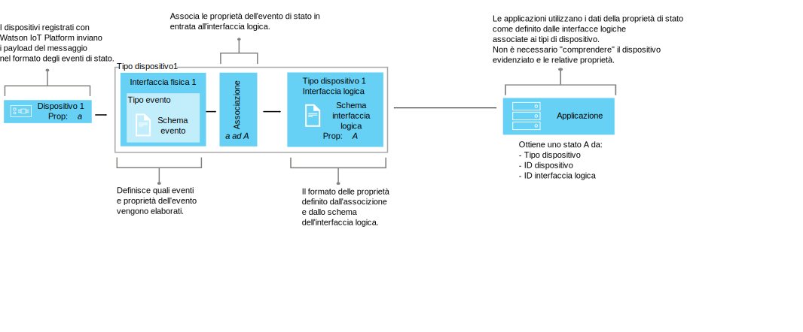

---

copyright:
  years: 2016, 2017
lastupdated: "2017-10-09"

---

{:new_window: target="\_blank"}
{:shortdesc: .shortdesc}
{:screen: .screen}
{:codeblock: .codeblock}
{:pre: .pre}


# Informazioni sulla gestione dei dati
{: #definitions_resources}
Si potrebbe disporre di diversi dispositivi che si desidera collegare a {{site.data.keyword.iot_full}} e questi dispositivo potrebbero pubblicare i dati in diversi formati. Utilizzando la funzione di gestione dei dati, puoi normalizzare e trasformare l'output dei dati dai tuoi dispositivi in una sola vista logica che può essere facilmente utilizzata dalle tue applicazioni. Utilizzando una sola vista logica, rimuovi la necessità di codificare le tue applicazioni per comprendere i diversi formati di dati emessi da ogni dispositivo.
{: shortdesc}

## Panoramica

Utilizza la funzione di gestione dei dati per creare astrazioni condivise di dispositivi (dispositivi gemelli), per migliorare il riutilizzo e la manutenzione e per gestire le complessità di un ecosistema IoT mantenendo al tempo stesso l'applicazione isolata dalla modifica dei dati. 

Le applicazioni possono accedere allo stato corrente di un dispositivo su richiesta utilizzando un'API HTTP o sottoscrivendo una stringa dell'argomento. Lo stato è composto da una serie di proprietà dello stato definite da un'interfaccia logica. Se lo stato di un dispositivo viene modificato a causa di una pubblicazione dell'evento in {{site.data.keyword.iot_short_notm}}, i valori di queste proprietà vengono aggiornati e archiviati in {{site.data.keyword.iot_short_notm}}.

Utilizzando la funzione di gestione dei dati, puoi ottenere i seguenti vantaggi:
- Associare le proprietà di stato ai dati di messaggio di evento
- Definire la struttura di dati che preferisci
- Definire più di una rappresentazione o vista dello stato del dispositivo
- Sottoscrivere gli stati del dispositivo o eseguirne query in qualsiasi momento tramite una API HTTP

Alcuni casi di utilizzo comuni per l'implementazione della funzione di gestione dei dati includono:
- Fornire agli sviluppatori di applicazioni delle interfacce congruenti per accedere ai dati dei dispositivi controllati dagli eventi in un modo simile a REST
- Normalizzare i dati dai dispositivi di fabbricazioni o modelli diversi che pubblicano i dati in formati differenti
- Modificare e convertire i formati di dati per adattarli al tuo modello di applicazione 

## Esempio: associazione di sensori di temperatura eterogenei a un'interfaccia logica 
{: #device-type-example}
Per iniziare a utilizzare la funzione di gestione dei dati, devi definire un numero di risorse come descritto nelle seguenti sezioni.  

Il seguente esempio illustra come queste risorse possono adattarsi tra loro per consentire alle applicazioni di accedere ai dati di stato della temperatura omogenei in un singolo formato, indipendentemente dal formato del payload del messaggio di evento del dispositivo. TemperatureSensor1 pubblica una lettura della temperatura in Celsius di `{ "t" : 34.5 }` su {{site.data.keyword.iot_short_notm}}. TemperatureSensor2 pubblica una lettura della temperatura Fahrenheit di `{ "temp" : 72.55 }`. Ogni sensore dell temperatura è associato al proprio [tipo di dispositivo](../reference/device_model.html#id_and_device_types). Le letture della temperatura sono pubblicate come eventi separati.

Utilizza la funzione di gestione dei dati {{site.data.keyword.iot_short_notm}} per aiutarti a configurare questa soluzione normalizzando e trasformando i tuoi dati del dispositivo. 


Come parte del flusso di dati, puoi eseguire dei calcoli sui dati in entrata per normalizzare queste letture in un formato congruente per l'elaborazione. Questo significa che non hai bisogno di scrivere la tua applicazione per comprendere o convertire diverse scale di temperatura. L'applicazione riceve un singolo stato normalizzato e utilizza la proprietà di stato **temperature** invece delle proprietà **t** e **temp** specifiche per il dispositivo.

 Per configurare questa soluzione, devi definire le seguenti informazioni:

-	La struttura dell'evento della temperatura in entrata, "t" e "temp", da ogni tipo di dispositivo.  
-	La proprietà, "temperature", che desideri registrare. La proprietà "temperature" definisce la struttura dello stato del dispositivo che può essere utilizzata dalle tue applicazioni.
-	Come desideri associare le proprietà "t" e "temp" dell'evento in entrata alla proprietà "temperature".

Puoi definire le informazioni obbligatorie configurando le seguenti risorse presenti in {{site.data.keyword.iot_short_notm}}:

-	Interfaccia fisica, tipo di evento e risorsa dello schema dell'evento, che definiscono la struttura degli eventi in entrata "t" e "temp".
-	Interfaccia logica e risorsa dello schema logico, che definiscono la struttura logica dello stato del dispositivo "temperature" che desideri generare.
-	Una risorsa di associazione che definisce come desideri associare le proprietà "t" e "temp" alla proprietà "temperature".

Per uno scenario end-to-end dettagliato che descrive questo esempio, vedi [Manuale passo dopo passo: un esempio dettagliato su come utilizzare i dispositivi tramite un'interfaccia comune](ga_im_index_scenario.html).

Ulteriori informazioni dettagliate su queste risorse vengono fornite nella sezione "Definizione delle tue risorse".


## Definizione delle tue risorse 
{: #definitions_resources}

Il seguente diagramma illustra l'associazione logica tra dispositivi e applicazioni su {{site.data.keyword.iot_short_notm}} quando utilizzi la funzione di gestione dei dati.



### Concetti
{: #concepts}
La seguente tabella descrive il concetto di eventi, proprietà e stato, a cui si fa riferimento nel diagramma precedente.

Concetti                        | Descrizione       
------------- | ------------- | -------------  
Evento | Gli eventi sono meccanismi con cui i dispositivi pubblicano i dati in {{site.data.keyword.iot_short_notm}}. Il dispositivo controlla il contenuto dell'evento e assegna un nome ad ogni evento che invia.
Proprietà | Dati che trasportano parte di un payload di evento di dispositivo.
Stato | L'ultima rappresentazione dello stato del dispositivo fisico, che può includere tutte le proprietà che sono state associate in più eventi in entrata.

### Risorse della gestione dei dati
{: #resources}

Puoi gestire le risorse utilizzando le API REST. Per informazioni sulle API REST, consulta la documentazione [{{site.data.keyword.iot_short_notm}} HTTP REST API](https://docs.internetofthings.ibmcloud.com/apis/swagger/v0002/state-mgmt.html).

Risorse tipo                        | Descrizione       
------------- | ------------- | -------------  
Tipo di evento                         | Utilizza la risorsa del tipo di evento per modellare un evento pubblicato da un dispositivo. Un tipo di evento deve fare riferimento a una risorsa dello schema dell'evento. La risorsa dello schema definisce la struttura dell'evento che viene pubblicato. </br>**Importante:** gli eventi in entrata utilizzati nell'interfaccia logica devono essere nel formato JSON.  
Tipo dispositivo                         |  Utilizza la risorsa del tipo di di dispositivo per raggruppare i dispositivi che condividono caratteristiche o modalità di funzionamento. Nella gestione dei dati, il tipo di evento viene esteso per includere una singola interfaccia logica per un dispositivo e una o più interfacce dell'applicazione che vengono utilizzate per recuperare lo stato del dispositivo. </br>Per ulteriori informazioni, consulta la sezione "Tipi di dispositivo e identificativi" nell'argomento [Modello del dispositivo](../reference/device_model.html#id_and_device_types).
Risorse di schema                         |  Utilizza le risorse dello schema per definire la struttura di un evento o dello stato del dispositivo. Vengono utilizzati i seguenti [schemi JSON ](http://json-schema.org/){:new_window}: <ul><li>Uno schema associato a un tipo di evento. Questo schema viene utilizzato per definire la struttura dell'evento che viene pubblicato in {{site.data.keyword.iot_short_notm}} da un dispositivo. Viene fatto riferimento a questi schemi come agli schemi dell'evento. <li>Uno schema associato a un'interfaccia logica. Questo schema viene utilizzato per definire la struttura dello stato del dispositivo archiviato in {{site.data.keyword.iot_short_notm}}. Viene fatto riferimento a questi schemi come agli schemi dell'interfaccia logica </ul>.  

Risorse di interfaccia                        | Descrizione       
------------- | ------------- | -------------  
Interfaccia logica| Un costrutto programmatico che a cui le applicazioni possono connettersi, o che possono sottoscrivere, per appurare lo stato di un dispositivo. Un'interfaccia logica viene utilizzata per definire la vista normalizzata in uno stato del dispositivo in {{site.data.keyword.iot_short_notm}}. Un'interfaccia logica deve essere associata a uno schema dell'interfaccia logica. Lo stato viene aggiornato in risposta ad eventi del dispositivo in entrata. 
Interfaccia fisica                         | Un'interfaccia fisica viene utilizzata per modellare l'interfaccia tra un dispositivo fisico e {{site.data.keyword.iot_short_notm}}. I tipi di evento possono essere associati all'interfaccia fisica. 

Risorse di istanza                        | Descrizione       
------------- | ------------- | -------------  
Dispositivo                         | Un dispositivo rappresenta un asset, un sistema o un componente registrato presso {{site.data.keyword.iot_short_notm}} e invia i dati IoT sotto forma di eventi. 

Risorse di supporto                        | Descrizione       
------------- | ------------- | -------------  
Associazioni                         | Utilizzare le associazioni per definire come le proprietà associate negli eventi in entrata vengono associate alle proprietà definite in un'interfaccia logica. </br>**Importante:** deve essere associata almeno un'interfaccia logica con un tipo dispositivo prima che possa essere definita un'associazione.


## Rinominazione delle restrizioni delle le risorse
{: #naming_restrictions}
Gli schemi, i tipi di evento e le interfacce logica e fisica hanno le seguenti restrizioni di denominazione:
- Il nome deve essere compreso tra 1 e 128 caratteri 
- Il nome deve essere costituito da caratteri unicode 
- I caratteri speciali validi sono, trattino ( - ), carattere di sottolineatura ( _ ), punto ( . )
- Il nome non può contenere soli spazi

## Creazione, aggiornamento, attivazione e disattivazione delle tue risorse
{: #draft_active_resources}

Possono esserci due versioni di una risorsa; una versione di bozza e una attiva. Quando crei una risorsa, viene creata come una versione di bozza.
{: shortdesc}

La versione di bozza è una copia di lavoro della tua risorsa di cui puoi eseguire query, che puoi aggiornare ed eliminare utilizzando le API. Crea una versione attiva da una risorsa di bozza attivando un tipo di dispositivo o un'interfaccia di bozza. Puoi attivare solo una risorsa di tipo di dispositivo o di interfaccia logica di bozza. Per attivare altre risorse, ad esempio gli schemi, devi attivare un tipo di servizio o un'interfaccia di bozza che fa riferimento alla risorsa che desideri attivare.

Per differenziare le risorse attive e di bozza quando utilizzi le API REST, viene utilizzato il prefisso *draft/* per identificare le risorse che sono nello di bozza.

Il seguente esempio richiama i metadati di una definizione dello schema di bozza utilizzando un id specificato:

```
GET /api/v0002/draft/schemas/{schemaId}
```
Il seguente esempio richiama i metadati di una definizione dello schema attiva utilizzando un id specificato:
```
GET /api/v0002/schemas/{schemaId}
```
*Nota:* l'identificativo è lo stesso per la versione di bozza e attiva per una risorsa fornita.


- Attivazione di una risorsa
{: #activate_resources}  

Utilizza l'operazione **activate-configuration** per convalidare e attivare la configurazione associata a un tipo di dispositivo. Questa configurazione include i tuoi schemi di bozza, tipi di evento, interfacce fisiche, interfacce logiche e associazioni. L'operazione **activate-configuration** deve essere eseguita in una versione di bozza di un'interfaccia logica o tipo di dispositivo.

Il seguente esempio mostra un richiesta PATCH in cui l'operazione **activate-configuration** viene eseguita in una versione di bozza di un tipo di dispositivo:
```
PATCH /api/v0002/draft/device/types/TemperatureSensor
```
dove il payload del corpo PATCH contiene il seguente contenuto:
```
  {
    "operation": "activate-configuration"
  }
```
- Elenco delle differenze
{: #list_differences}  

Utilizza l'operazione **list-differences** per restituire un elenco di tutte le differenze tra la configurazione di bozza e attiva di una risorsa dell'interfaccia logica o del tipo di dispositivo. L'operazione **list-differences** deve essere eseguita in una versione di bozza di un'interfaccia logica o tipo di dispositivo. Il seguente esempio mostra un richiesta PATCH in cui un'operazione **list-differences** viene eseguita in una versione di bozza di un tipo di dispositivo: 
```
PATCH /api/v0002/draft/device/types/TemperatureSensor
```
dove il payload del corpo PATCH contiene il seguente contenuto:
```
  {
    "operation": "list-differences"
  }
```


- Disattivazione di una risorsa  
{: #deactivate_resources}  

Utilizza l'operazione **deactivate-configuration** per rimuovere la configurazione attiva associata a una risorsa. L'operazione deactivate-configuration può essere eseguita solo in una versione attiva di un'interfaccia logica o di un tipo di dispositivo. l seguente esempio mostra un richiesta PATCH in cui un'operazione **deactivate-configuration** viene eseguita in una versione attiva di un tipo di dispositivo: 
```
PATCH /api/v0002/device/types/TemperatureSensor
```
dove il payload del corpo PATCH contiene il seguente contenuto:
```
  {
    "operation": "deactivate-configuration"
  }
```
*Note:*
- Una risorsa attiva è di sola lettura. Puoi filtrare e ordinare le risorse attive utilizzando i parametri di query.
- Non puoi eliminare un tipo di dispositivo se sono presenti istanze del dispositivo associate ad esso. Lo stato del dispositivo viene cancellato quando l'istanza del dispositivo viene eliminata. 
- Puoi attivare solo le interfacce logiche e i tipi di dispositivo direttamente utilizzando le API. Le altre risorse, ad esempio gli schemi, le interfacce fisiche e i tipi di evento vengono attivate se viene fatto loro riferimento da un'interfaccia logica a da un tipo di dispositivo che è stato reso attivo.  
- L'operazione **activate-configuration** deve essere eseguita in una versione i bozza di un'interfaccia logica associata a un tipo di dispositivo o sullo stesso tipo di dispositivo. L'operazione **activate-configuration** verifica che la configurazione della risorsa sia valida prima di attivare la risorsa. Dopo il completamento dell'attivazione, lo stato viene generato per ogni istanza del dispositivo del tipo di dispositivo.

## Risoluzione dei problemi con la tua configurazione
{: #troubleshooting}
Se la tua attivazione ha esito negativo, controlla che sia stata fornita tutta la configurazione obbligatoria per un tipo di dispositivo selezionato. La seguente configurazione deve essere fornita e associata a un tipo di dispositivo:
  - Un'interfaccia fisica associata ad almeno un evento
  - Almeno un'interfaccia logica
  - Associazioni ad almeno una delle interfacce logiche associate

Puoi anche eseguire un'operazione **validate-configuration** in una versione di bozza di una risorsa di un tipo di dispositivo o di un'interfaccia logica per garantire che i metadati associati siano validi. Se i metadati sono validi, viene restituito un elenco di problemi nel corpo della risposta.  

Il seguente esempio mostra un richiesta PATCH in cui un'operazione **validate-configuration** viene eseguita in una versione di bozza di un tipo di dispositivo denominato "TemperatureSensor":  
```
PATCH /api/v0002/draft/device/types/TemperatureSensor
```
dove il payload del corpo PATCH contiene il seguente contenuto:
```
  {
    "operation": "validate-configuration"
  }
```  
Il seguente esempio mostra una risposta non riuscita alla richiesta PATCH:   
```
{
"message": "CUDIM0303I: State update configuration for Device Type 'TemperatureSensor' is not valid.",
"details": {
  "id": "CUDIM0303I",
  "properties": [
    "Device Type",
    "TemperatureSensor"
  ]
},
"failures": [
  {
    "message": "CUDVS0301E: The device type 'TemperatureSensor' does not have any mappings defined for it",
    "details": {
      "id": "CUDVS0301E",
      "properties": [
        "TemperatureSensor"
      ]
    }
  }
]
}
```  
Il seguente esempio mostra una risposta riuscita alla richiesta PATCH:   
```  
{
"message": "CUDIM0303I: State update configuration for Device Type 'TemperatureSensor' is valid.",
"details": {
  "id": "CUDIM0303I",
  "properties": [
    "Device Type",
    "TemperatureSensor"
  ]
},
 "failures": []
}
```  
Se tutte le risorse obbligatorie vengono associate a un tipo di dispositivo, controlla che le associazioni alla proprietà siano valide. I seguenti esempi mostrano i possibili errori che potrebbero verificarsi:

  - Un'espressione fa riferimento a una proprietà in un evento non definito dallo schema dell'evento
  - Un'espressione fa riferimento a una proprietà in uno stato non definito dallo schema dell'interfaccia logica 
  - Un'associazione è stata definita per una proprietà che non è definita dallo schema dell'interfaccia logica


Puoi fare riferimento al seguente log di errore per diagnosticare gli errori di runtime:
```
iot-2/type/${typeId}/id/${devieId}/err/data
```
### Limiti delle risorse

La seguente tabella mostra il numero massimo di risorse che possono essere configurare in base al tipo di piano. 

Risorsa                   |Piano standard                  | Piano lite
------------- | ------------- | ------------- 
Interfacce logiche | 1000 | 10
Interfacce fisiche | 1000 | 5
Tipi di evento | 1000 | 10
Schemi |2000 | 20
Riferimenti interfaccia logica (numero di interfacce logiche a cui può associarsi un tipo di dispositivo)  |20 | 5
Riferimenti tipo evento (il numero di ID evento per le associazioni del tipo di evento che un'interfaccia fisica può avere)| 40 | 10
