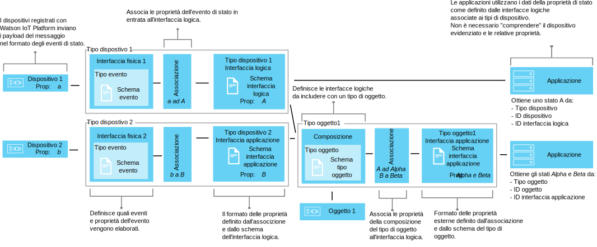

---

copyright:
years: 2016, 2018
lastupdated: "2018-03-22"

---

{:new_window: target="\_blank"}
{:shortdesc: .shortdesc}
{:screen: .screen}
{:codeblock: .codeblock}
{:pre: .pre}

# Informazioni sulla gestione dei dati
{: #definitions_resources}
Potresti avere una serie di dispositivi o di oggetti che vuoi collegare a {{site.data.keyword.iot_full}} e questi dispositivi o oggetti potrebbero pubblicare i dati in formati diversi. Utilizzando le funzioni di dispositivo gemello e asset gemello del componente di gestione dei dati, puoi normalizzare e trasformare l'output dei dati dai tuoi dispositivi e oggetti in una singola vista logica che può essere facilmente utilizzata dalle tue applicazioni. Utilizzando una singola vista logica, le tue applicazioni non dovranno più essere configurate per comprendere i diversi formati di dati che vengono emessi da ciascun dispositivo o oggetto. Puoi quindi aggregare più dispositivi o oggetti insieme per definire un nuovo oggetto in {{site.data.keyword.iot_short_notm}}. Utilizza l'oggetto per aiutarti a organizzare e analizzare i dati che arrivano in {{site.data.keyword.iot_short_notm}} da una serie di input. 

{: shortdesc}

## Panoramica
{: #overview}

Utilizza la funzione di dispositivo gemello per creare un modello logico di un dispositivo, quindi utilizza la funzione di asset gemello per aggregare questi modelli logici per definire nuovi oggetti. Questi modelli logici ti consentono di migliorare il riutilizzo e la manutenzione del codice e di gestire le complessità di un ecosistema IoT mantenendo le applicazioni isolate dalla modifica dei dati.  

Le applicazioni possono accedere allo stato corrente di un dispositivo o di un oggetto su richiesta utilizzando un'API HTTP o sottoscrivendo a una stringa di argomento IoT. Lo stato è composto da una serie di proprietà dello stato definite da un'interfaccia logica. Se lo stato di un dispositivo o oggetto cambia in seguito alla pubblicazione di un evento in {{site.data.keyword.iot_short_notm}}, i valori di queste proprietà vengono aggiornati e memorizzati in {{site.data.keyword.iot_short_notm}}.

Utilizzando le funzioni di dispositivo gemello e asset gemello, puoi ottenere i seguenti vantaggi:
- Associare le proprietà di stato ai dati del messaggio di evento.
- Aggregare più dispositivi o oggetti per definire nuovi oggetti.
- Definire la struttura di dati che preferisci.
- Definire più di una rappresentazione o vista dello stato del dispositivo o dell'oggetto.
- Sottoscrivere agli stati del dispositivo o dell'oggetto o eseguirne query in qualsiasi momento tramite una API HTTP.

Alcuni casi di utilizzo comuni per l'implementazione delle funzioni di dispositivo e asset gemello includono:
- Fornire agli sviluppatori di applicazioni interfacce coerenti per accedere ai dati dei dispositivi guidati da eventi in modo simile a REST.
- Normalizzare i dati dai dispositivi di fabbricazioni o modelli diversi che pubblicano i dati in formati differenti.
- Modificare e convertire i formati di dati per adattarli al tuo modello di applicazione.
- Formattare i big data da una gamma di dispositivi o oggetti in modo che i dati possano essere analizzati e presentati nel modo più efficace al fine di aiutare a prevedere gli errori, pianificare la manutenzione, tenere traccia degli asset e migliorare l'efficienza operativa.

## Esempi
{: #examples}
I seguenti esempi illustrano due possibili soluzioni. L'esempio 1 illustra come puoi utilizzare la funzione di dispositivo gemello e l'esempio 2 illustra come puoi utilizzare la funzione di asset gemello. 

### Esempio 1: associazione di sensori di temperatura eterogenei a un'interfaccia logica
{: #device-type-example}
In questo esempio, creiamo un'interfaccia logica che fornisce dati di stato della temperatura omogenei in un solo formato, indipendentemente dall'effettivo formato del payload del messaggio di evento del dispositivo. Il dispositivo *tSensor* pubblica una lettura della temperatura in Celsius di `{ "t" : 34.5 }` su {{site.data.keyword.iot_short_notm}}. Il dispositivo *tempSensor* pubblica una lettura della temperatura in Fahrenheit di `{ "temp" : 72.55 }`. Le letture della temperatura sono pubblicate come eventi separati.

Per uno scenario end-to-end dettagliato che descrive questo esempio, consulta [Guida passo a passo 1](ga_im_index_scenario.html).


Come parte del flusso di dati dell'interfaccia logica, puoi eseguire calcoli sui dati in entrata per normalizzare queste letture in un modulo coerente per l'elaborazione. Questo significa che non hai bisogno di scrivere la tua applicazione per comprendere o convertire diverse scale di temperatura. L'applicazione riceve un singolo stato normalizzato e utilizza la proprietà di stato **temperature** invece delle proprietà **t** e **temp** specifiche per il dispositivo.

### Esempio 2: associazione di più dispositivi climatici a un'interfaccia logica del tipo di oggetto
{: #thing-type-example}  
In questo esempio, espandiamo un esempio di tipo dispositivo aggiungendo una serie di sensori di umidità sotto forma di dispositivi igrometro separati. Utilizzando un'interfaccia logica del tipo di oggetto, possiamo unire senza problemi i dati provenienti da tipi di dispositivi separati in una singola interfaccia logica che rappresenta tutti i dispositivi e i sensori in una stanza. Un'applicazione può ora ottenere i dati climatici raccolti per una stanza collegandosi all'interfaccia logica associata al tipo di oggetto "RoomType". Il seguente diagramma mostra la configurazione per la Sala riunioni 1.

Per uno scenario end-to-end dettagliato che descrive questo esempio, consulta [Guida passo a passo 2](../information_management/im_index_scenario_thing.html).


Un dispositivo di temperatura denominato *tSensor* e un dispositivo di umidità denominato *humiditySensor1* pubblicano i dati ambientali raccolti nella stanza *Meeting Room 1*.
I dati dei sensori di temperatura e umidità sono associati separatamente a due interfacce logiche del tipo di dispositivo; una per il tipo di dispositivo termometro e una per il tipo di dispositivo igrometro. Creiamo ora un tipo di oggetto denominato *RoomType* e creiamo un'istanza dell'oggetto stanza denominata *Meeting Room 1*.

In una seconda sala riunioni, un dispositivo di temperatura denominato *tempSensor* e un dispositivo di umidità denominato *humiditySensor2* pubblicano i dati ambientali raccolti nella stanza *Meeting Room 2*. Viene creata un'altra istanza dell'oggetto stanza denominata *Meeting Room 2*, basata sul tipo di oggetto *RoomType*.

Possiamo ora impostare una composizione che include le interfacce logiche di termometro e igrometro e quindi associare i sensori ambientali corretti a ciascuna delle istanze di stanza, ad esempio *tSensor* e *humiditySensor1* sono associati a *Meeting Room 1* e *tempSensor* e *humiditySensor2* sono associati a *Meeting Room 2*.

L'applicazione per l'utente finale può ora richiedere lo stato di uno specifico ID oggetto stanza e ottenere gli stati di temperatura e umidità della stanza senza dover conoscere l'infrastruttura del dispositivo sottostante.

## Definizioni e risorse
{: #resources}

I seguenti diagrammi illustrano l'associazione logica tra dispositivi e applicazioni su {{site.data.keyword.iot_short_notm}} quando si utilizzano le interfacce logiche.



### Concetti

Concetti                        | Descrizione       
------------- | ------------- | -------------  
Evento | Gli eventi sono meccanismi con cui i dispositivi pubblicano i dati in {{site.data.keyword.iot_short_notm}}. Il dispositivo controlla il contenuto dell'evento e assegna un nome ad ogni evento che invia.
Proprietà | Dati che trasportano parte di un payload di evento di dispositivo.
Stato | L'ultima rappresentazione dello stato del dispositivo fisico, che può includere tutte le proprietà che sono state associate in più eventi in entrata.
Composizione                         | Un costrutto logico che definisce le interfacce logiche associate a un tipo di oggetto. La composizione è specificata da uno schema del tipo di oggetto.   

### Risorse della gestione dei dati
Puoi gestire le risorse utilizzando le API REST. Per informazioni sulle API REST, consulta la documentazione [{{site.data.keyword.iot_short_notm}} HTTP REST API](https://docs.internetofthings.ibmcloud.com/apis/swagger/v0002/state-mgmt.html). 

Risorse tipo                        | Descrizione       
------------- | ------------- | -------------  
Tipo di evento                         | Utilizza la risorsa del tipo di evento per modellare un evento pubblicato da un dispositivo. Un tipo di evento deve fare riferimento a una risorsa dello schema dell'evento. La risorsa dello schema definisce la struttura dell'evento che viene pubblicato. </br>**Importante:** gli eventi in entrata utilizzati nell'interfaccia logica devono essere nel formato JSON.    
Tipo dispositivo                         |  Utilizza la risorsa del tipo di di dispositivo per raggruppare i dispositivi che condividono caratteristiche o modalità di funzionamento. Nella gestione dei dati, il tipo di evento viene esteso per includere una singola interfaccia logica per un dispositivo e una o più interfacce dell'applicazione che vengono utilizzate per recuperare lo stato del dispositivo. </br>Per ulteriori informazioni, consulta la sezione "Tipi di dispositivo e identificativi" nell'argomento [Modello del dispositivo](../reference/device_model.html#id_and_device_types).
Tipo di oggetto                         | Un costrutto programmatico che rappresenta una raccolta di uno o più tipi di dispositivo e tipi di oggetto separati o entrambi. </br>**Importante:** la versione Beta supporta dieci livelli di nidificazione per un'interfaccia logica del tipo di oggetto.
Risorse di schema                         |  Utilizza le risorse dello schema per definire la struttura dello stato di un evento, dispositivo o oggetto. Vengono utilizzati i seguenti [schemi JSON ](http://json-schema.org/){:new_window}: <ul><li>Uno schema associato a un tipo di evento. Questo schema viene utilizzato per definire la struttura dell'evento che viene pubblicato in {{site.data.keyword.iot_short_notm}} da un dispositivo. Viene fatto riferimento a questi schemi come agli schemi dell'evento. <li>Uno schema associato a un'interfaccia logica. Questo schema viene utilizzato per definire la struttura dello stato del dispositivo o dell'oggetto memorizzato in {{site.data.keyword.iot_short_notm}}. Viene fatto riferimento a questi schemi come agli schemi dell'interfaccia logica</ul>.</ul>

Risorse di interfaccia                        | Descrizione       
------------- | ------------- | -------------  
Interfaccia logica | Un costrutto programmatico che a cui le applicazioni possono connettersi, o che possono sottoscrivere, per appurare lo stato di un dispositivo. Un'interfaccia logica viene utilizzata per definire la vista normalizzata in uno stato del dispositivo in {{site.data.keyword.iot_short_notm}}. Un'interfaccia logica deve essere associata a uno schema dell'interfaccia logica. Lo stato viene aggiornato in risposta ad eventi del dispositivo in entrata. **Nota:** puoi facoltativamente specificare un alias significativo per la tua interfaccia logica. È possibile fare riferimento all'alias nella chiamata API o nella sottoscrizione alla stringa di argomento utilizzata per richiamare lo stato di un dispositivo, invece di utilizzare l'identificativo dell'interfaccia logica generato automaticamente.  
Interfaccia fisica                         | Un'interfaccia fisica viene utilizzata per modellare l'interfaccia tra un dispositivo fisico e {{site.data.keyword.iot_short_notm}}. I tipi di evento possono essere associati all'interfaccia fisica.  

Risorse di istanza                        | Descrizione       
------------- | ------------- | -------------  
Dispositivo                         | Un dispositivo rappresenta un asset, un sistema o un componente registrato presso {{site.data.keyword.iot_short_notm}} e invia i dati IoT sotto forma di eventi.  
Oggetto                         | Un costrutto programmatico che rappresenta logicamente un'istanza univoca di un tipo di oggetto. Un'istanza dell'oggetto ha lo stesso scopo di un dispositivo registrato di un tipo di dispositivo.


Risorse di supporto                        | Descrizione       
------------- | -------------   
Associazioni       |Utilizzare le associazioni per definire come le proprietà associate negli eventi in entrata vengono associate alle proprietà definite in un'interfaccia logica. </br>**Importante:** per poter definire le associazioni, è necessario che almeno un'interfaccia logica sia associata a un tipo di dispositivo o di oggetto.

## Rinominazione delle restrizioni delle le risorse
{: #naming_restrictions}
Gli schemi, i tipi di evento e le interfacce logiche e fisiche hanno le seguenti restrizioni sulla denominazione:
- Il nome deve essere compreso tra 1 e 128 caratteri 
- Il nome deve essere costituito da caratteri unicode 
- I caratteri speciali validi sono, trattino ( - ), carattere di sottolineatura ( _ ), punto ( . )
- Il nome non può contenere soli spazi

## Creazione, aggiornamento, attivazione e disattivazione delle tue risorse
{: #draft_active_resources}

Possono esserci due versioni di una risorsa; una versione di bozza e una attiva. Quando crei una risorsa, viene creata come una versione di bozza. 
{: shortdesc}

La versione di bozza è una copia di lavoro della tua risorsa di cui puoi eseguire query, che puoi aggiornare ed eliminare utilizzando le API. Crea una versione attiva di una risorsa di bozza attivando un tipo di dispositivo, un tipo di oggetto o un'interfaccia logica di bozza. Per attivare altre risorse, ad esempio gli schemi, devi attivare un tipo di dispositivo, un tipo di oggetto o un'interfaccia logica di bozza che faccia riferimento alla risorsa che desideri attivare.

Per differenziare le risorse attive e di bozza quando utilizzi le API REST, viene utilizzato il prefisso *draft/* per identificare le risorse che sono nello di bozza.

Il seguente esempio richiama i metadati di una definizione dello schema di bozza utilizzando un id specificato:

```
GET /api/v0002/draft/schemas/{schemaId}
```
Il seguente esempio richiama i metadati di una definizione dello schema attiva utilizzando un id specificato:
```
GET /api/v0002/schemas/{schemaId}
```
*Nota:* l'identificativo è lo stesso per la versione di bozza e attiva per una risorsa fornita.


- Attivazione di una risorsa
{: #activate_resources}  

Utilizza l'operazione **activate-configuration** per convalidare e attivare la configurazione associata a un tipo di dispositivo o di oggetto. Questa configurazione include i tuoi schemi di bozza, tipi di evento, interfacce fisiche, interfacce logiche e associazioni. L'operazione **activate-configuration** deve essere eseguita nella versione di bozza di un'interfaccia logica, un tipo di dispositivo o un tipo di oggetto.

Il seguente esempio mostra un richiesta PATCH in cui l'operazione **activate-configuration** viene eseguita in una versione di bozza di un tipo di dispositivo:
```
PATCH /api/v0002/draft/device/types/TSensor
```
dove il payload del corpo PATCH contiene il seguente contenuto:
```
  {
    "operation": "activate-configuration"
  }   
```
Per attivare una versione bozza di un tipo di oggetto, utilizza il seguente metodo PATCH:
```
PATCH /api/v0002/draft/thing/types/RoomType
```

- Elenco delle differenze
{: #list_differences}  

Utilizza l'operazione **list-differences** per restituire un elenco di eventuali differenze tra la configurazione attiva e di bozza per una risorsa dell'interfaccia logica, del tipo di dispositivo o del tipo di oggetto. L'operazione **list-differences** deve essere eseguita nella versione di bozza di un'interfaccia logica, un tipo di dispositivo o un tipo di oggetto. Il seguente esempio mostra un richiesta PATCH in cui un'operazione **list-differences** viene eseguita in una versione di bozza di un tipo di dispositivo:
```
PATCH /api/v0002/draft/device/types/TSensor
```
dove il payload del corpo PATCH contiene il seguente contenuto:
```
  {
    "operation": "list-differences"
  }
```
Per restituire un elenco di eventuali differenze tra la configurazione attiva e di bozza per una risorsa del tipo di oggetto, utilizza il seguente metodo PATCH:
```
PATCH /api/v0002/draft/thing/types/meetingroom1
```

- Disattivazione di una risorsa  
{: #deactivate_resources}  

Utilizza l'operazione **deactivate-configuration** per rimuovere la configurazione attiva associata a una risorsa. L'operazione deactivate-configuration può essere eseguita solo nella versione attiva di un'interfaccia logica, un tipo di dispositivo o un tipo di oggetto. Il seguente esempio mostra un richiesta PATCH in cui un'operazione **deactivate-configuration** viene eseguita in una versione attiva di un tipo di dispositivo:
```
PATCH /api/v0002/device/types/TSensor
```
dove il payload del corpo PATCH contiene il seguente contenuto:
```
  {
    "operation": "deactivate-configuration"
  }
```
Per disattivare un tipo di oggetto, utilizza il seguente metodo PATCH:
```
PATCH /api/v0002/thing/types/RoomType
```

*Note:*
- Una risorsa attiva è di sola lettura. Puoi filtrare e ordinare le risorse attive utilizzando i parametri di query.
- Non puoi eliminare un tipo di dispositivo se sono presenti istanze del dispositivo associate ad esso. Lo stato del dispositivo viene cancellato quando l'istanza del dispositivo viene eliminata. 
- Non puoi eliminare un tipo di oggetto se sono presenti istanze del dispositivo o dell'oggetto associate a tale tipo di oggetto. Lo stato dell'oggetto viene cancellato quando le istanze del dispositivo o dell'oggetto vengono eliminate. 
- Puoi attivare direttamente solo le interfacce logiche, i tipi di dispositivi e i tipi di oggetto utilizzando le API. Le altre risorse, ad esempio schemi, interfacce fisiche, interfacce del tipo di oggetto e tipi di evento, vengono attivate se viene fatto loro riferimento da un'interfaccia logica, un tipo di dispositivo o un tipo di oggetto che è stato reso attivo.  
- L'operazione **activate-configuration** deve essere eseguita in una versione di bozza di un'interfaccia logica associata a un tipo di dispositivo o di oggetto oppure sullo stesso tipo di dispositivo o di oggetto. L'operazione **activate-configuration** verifica che la configurazione della risorsa sia valida prima di attivare la risorsa. Una volta completata l'attivazione, lo stato viene generato per ogni istanza del dispositivo o dell'oggetto del tipo di dispositivo o di oggetto.

## Risoluzione dei problemi con la tua configurazione
{: #troubleshooting}
Se la tua attivazione ha esito negativo, controlla che sia stata fornita tutta la configurazione obbligatoria per un determinato tipo di dispositivo o di oggetto. 

La seguente configurazione deve essere fornita e associata a un tipo di dispositivo:
  - Un'interfaccia fisica associata ad almeno un evento
  - Almeno un'interfaccia logica
  - Associazioni ad almeno una delle interfacce logiche associate
  
La seguente configurazione deve essere fornita e associata a un tipo di oggetto:
  - Un'interfaccia dell'oggetto associata ad almeno un tipo di dispositivo o di oggetto
  - Almeno un'interfaccia logica
  - Associazioni ad almeno una delle interfacce logiche associate  

Puoi anche eseguire un'operazione **validate-configuration** in una versione di bozza della risorsa del tipo di dispositivo, tipo di oggetto o interfaccia logica per garantire che i metadati associati siano validi. Se i metadati sono validi, viene restituito un elenco di problemi nel corpo della risposta.  

Il seguente esempio mostra un richiesta PATCH in cui un'operazione **validate-configuration** viene eseguita in una versione di bozza di un tipo di dispositivo denominato "TSensor":  
```
PATCH /api/v0002/draft/device/types/TSensor
```
dove il payload del corpo PATCH contiene il seguente contenuto:
```
  {
    "operation": "validate-configuration"
  }
```  
Il seguente esempio mostra una risposta non riuscita alla richiesta PATCH:  
```
{
"message": "CUDIM0303I: State update configuration for Device Type 'TSensor' is not valid.",
"details": {
  "id": "CUDIM0303I",
  "properties": [
    "Device Type",
    "Sensor"
  ]
},
"failures": [
  {
    "message": "CUDVS0301E: The device type 'TSensor' does not have any mappings defined for it",
    "details": {
      "id": "CUDVS0301E",
      "properties": [
        "TSensor"
      ]
    }
  }
]
}
```  
Il seguente esempio mostra una risposta riuscita alla richiesta PATCH:  
```  
{
"message": "CUDIM0303I: State update configuration for Device Type 'TSensor' is valid.",
"details": {
  "id": "CUDIM0303I",
  "properties": [
    "Device Type",
    "TSensor"
  ]
},
 "failures": []
}
```  
Se tutte le risorse richieste sono associate al tipo di dispositivo o di oggetto, verifica che le associazioni delle proprietà siano valide.I seguenti esempi mostrano i possibili errori che potrebbero verificarsi:

  - Un'espressione fa riferimento a una proprietà in un evento non definito dallo schema dell'evento
  - Un'espressione fa riferimento a una proprietà in uno stato non definito dallo schema dell'interfaccia logica
  - Un'associazione è stata definita per una proprietà che non è definita dallo schema dell'interfaccia logica


Puoi fare riferimento al seguente log degli errori per diagnosticare gli errori di runtime per i tipi di dispositivo:
```
iot-2/type/${typeId}/id/${deviceId}/err/data
```
Puoi fare riferimento al seguente log degli errori per diagnosticare gli errori di runtime per i tipi di oggetto:
```
iot-2/type/${typeId}/id/${thingId}/err/data
```

### Limiti delle risorse

La seguente tabella mostra il numero massimo di risorse che possono essere configurare in base al tipo di piano. 

Risorsa                   |Piano standard                  | Piano lite 
------------- | ------------- | ------------- 
Interfacce logiche | 1000 | 10
Interfacce fisiche           | 1000 | 5
Tipi di evento | 1000 | 10
Schemi |2000 | 20
Riferimenti interfaccia logica (numero di interfacce logiche a cui può associarsi un tipo di dispositivo)  |20 | 5
Riferimenti tipo evento (il numero di ID evento per le associazioni del tipo di evento che un'interfaccia fisica può avere)| 40 | 10


