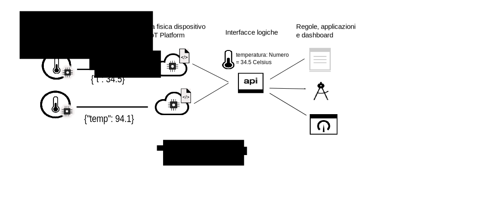

---

copyright:
years: 2016, 2017
lastupdated: "2017-07-20"

---

{:new_window: target="\_blank"}
{:shortdesc: .shortdesc}
{:screen: .screen}
{:codeblock: .codeblock}
{:pre: .pre}

# Introduzione alla gestione dei dati
{: #device_twins}

Nel mondo moderno esiste un numero senza precedenti di dispositivi e sensori. Molti di questi dispositivi forniscono funzionalità simili, ma le variazioni nella fattura, nel modello e nella versione significa che i dati vengono trasmessi in diversi formati. Ad esempio, un sensore della temperatura potrebbe registrare la temperatura in gradi Fahrenheit o Celsius. Non è efficiente codificare le applicazioni per poter utilizzare i dati in tutti questi formati; invece è necessario che i dati vengano normalizzati per creare una sola vista che può essere utilizzata dalle applicazioni.
{: shortdesc}

Utilizza la funzione di gestione dei dati in {{site.data.keyword.iot_full}}, per configurare un tipo di dispositivo gemello per esporre una vista normalizzata dei dati per le tue applicazioni.

Un dispositivo gemello è una rappresentazione grafica nel cloud di un sensore o un dispositivo fisico collegato a {{site.data.keyword.iot_short_notm}}. Un dispositivo gemello crea un modello logico delle proprietà e degli eventi che provengono da un sensore o dispositivo particolare. Dopo la definizione e l'istanziamento, il dispositivo gemello fornisce un modo coerente di interagire con un dispositivo in modo analogo a REST, indipendentemente se il dispositivo è online o offline. Poiché un modello logico può essere condiviso da più dispositivi di differenti fatture e modelli, l'applicazione IoT è ora isolata dalla variabilità e dalla modifica all'interno dell'ecosistema del dispositivo. Le proprietà di un dispositivo, incluse le informazioni sullo stato corrente del dispositivo (stato dispositivo), possono essere richiamate utilizzando una richiesta HTTP o sottoscrivendo un argomento.

I dispositivi gemelli possono aiutarti a:
- Fornire agli sviluppatori di applicazioni delle interfacce congruenti per accedere ai dati dei dispositivi controllati dagli eventi in un modo simile a REST. 
- Normalizzare i dati dai dispositivi di fabbricazioni o modelli diversi che pubblicano i dati in formati differenti. 

Per utilizzare la funzione di gestione dei dati per configurare un dispositivo gemello, devi definire le seguenti informazioni configurando le risorse in {{site.data.keyword.iot_short_notm}}:
- La struttura degli eventi inviati dal tuo dispositivo. La struttura di un evento in entrata viene definita nelle risorse interfaccia fisica, tipo di evento e schema dell'evento. 
- Le proprietà che desideri registrare. Queste proprietà definiscono la struttura dello stato del dispositivo che può essere utilizzata dalle tue applicazioni. Le proprietà sono definite nelle risorse dell'interfaccia logica e dello schema logico.
- Come gli eventi dell'interfaccia fisica sono associati nelle proprietà dell'interfaccia logica. Utilizza le risorse di associazioni per associare gli eventi alle proprietà.

Il seguente diagramma mostra i dati del dispositivo in diversi formati provenienti da {{site.data.keyword.iot_short_notm}} e che stanno venendo trasformati e normalizzati in una sola vista logica che può essere facilmente utilizzata dalle applicazioni di backend.  

Per ulteriori informazioni sulla definizione e configurazione delle risorse e delle informazioni chiave, consulta [Informazioni sulla gestione dei dati](ga_im_definitions.html). Puoi creare il tuo proprio dispositivo gemello in {{site.data.keyword.iot_short_notm}} completando i passi descritti in [Introduzione alla gestione dei dati](ga_im_example.html). Per informazioni più dettagliate su ognuno dei passi descritti nella guida, consulta lo scenario di esempio illustrato in [Manuale passo dopo passo: un esempio dettagliato su come utilizzare i dispositivi tramite un'interfaccia comune](ga_im_index_scenario.html#scenario). 
