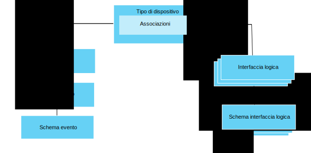

---

copyright:
years: 2016, 2017
lastupdated: "2017-07-21"

---

{:new_window: target="\_blank"}
{:shortdesc: .shortdesc}
{:screen: .screen}
{:codeblock: .codeblock}
{:pre: .pre}

# Introduzione alla gestione dei dati
{: #im_example}

Utilizza la seguente procedura come supporto per la configurazione delle risorse di cui hai bisogno per iniziare a utilizzare la funzione di gestione dei dati. 

Per i dettagli sull'API, consulta la documentazione [{{site.data.keyword.iot_full}} HTTP REST API ](https://docs.internetofthings.ibmcloud.com/apis/swagger/v0002/state-mgmt.html){:new_window}.

**Suggerimento:** per informazioni più dettagliate su ciascuno dei passi, vedi gli scenari di esempio oppure utilizza i link per andare direttamente a uno specifico passo nel manuale passo dopo passo. [Manuale passo dopo passo: un esempio dettagliato su come utilizzare i dispositivi tramite un'interfaccia comune](ga_im_index_scenario.html#scenario) ti guida nella procedura per creare un'interfaccia logica del tipo di dispositivo per i dispositivi termometro eterogenei.

## Prima di cominciare
Per iniziare ad utilizzare la funzione di gestione dei dati, devi avere almeno un [dispositivo registrato con](ga_im_index_scenario.html#step14) e inviare i dati a {{site.data.keyword.iot_short_notm}}.  

Il seguente diagramma illustra una vista logica di come le risorse che devi configurare si adattano tra loro:

## Passi

1. 	Definisci le proprietà di stato in entrata.  
Definisci le proprietà di stato in entrata che vuoi che la tua interfaccia logica renda disponibile alle tue applicazioni.  
<dl>
<dd>
<ol>
<li>[Crea un file dello schema dell'evento di bozza](ga_im_index_scenario.html#step1). Il file dello schema evento è un file .JSON locale che definisce la struttura e il formato di un evento in entrata.
<li>[Crea una risorsa dello schema evento di bozza per il tuo tipo evento](ga_im_index_scenario.html#step2). La risorsa dello schema evento è n costrutto programmatico utilizzato da {{site.data.keyword.iot_short_notm}}.
<li>[Crea un tipo evento di bozza che fa riferimento allo schema evento](ga_im_index_scenario.html#step3). Il tipo evento viene utilizzato da {{site.data.keyword.iot_short_notm}} per associare una o più risorse dello schema evento a un'interfaccia fisica.
<li>[Crea un'interfaccia fisica di bozza](ga_im_index_scenario.html#step7).
<li>[Aggiungi il tipo evento all'interfaccia fisica di bozza](ga_im_index_scenario.html#step8).
<li>[Aggiorna il tipo di dispositivo di bozza per collegarsi all'interfaccia fisica di bozza](ga_im_index_scenario.html#step9).
</ol>
</dd>
</dl>
4. 	Crea l'interfaccia fisica di bozza.
 1. 	[Crea un file dello schema dell'interfaccia logica di bozza](ga_im_index_scenario.html#step4) per il tipo di dispositivo di bozza.  
Un file dello schema dell'interfaccia logica è un file .JSON locale che definisce lo stato del dispositivo reso disponibile alle tue applicazioni. 
 2. [Crea una risorsa dello schema dell'interfaccia logica di bozza](ga_im_index_scenario.html#step5) per il tipo di dispositivo di bozza.
 3.	[Crea un'interfaccia logica di bozza](ga_im_index_scenario.html#step6) per il tipo di dispositivo di bozza.
 4.	[Aggiungi l'interfaccia logica di bozza al tipo di dispositivo di bozza](ga_im_index_scenario.html#step10).
5. 	[Definisci le associazioni di bozza](ga_im_index_scenario.html#step11) per il tipo di dispositivo di bozza.   
Le associazioni vengono utilizzate per associare le proprietà in entrata alle proprietà nell'interfaccia logica. 
6. 	[Convalida e attiva la configurazione](ga_im_index_scenario.html#step15) associata al tipo di dispositivo di bozza.
7. 	[Richiama lo stato del dispositivo attivo](ga_im_index_scenario.html#step13).  
Verifica che le tue sottoscrizioni mostrino i dati dispositivo aggiornati oppure che siano restituiti i dati dispositivo aggiornai utilizzando una chiamata REST o sottoscrivendo un argomento. 
