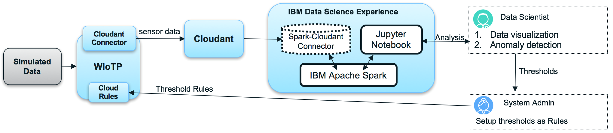
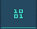

---

copyright:
  years: 2017, 2018
lastupdated: "2018-05-01"
---

---

{:new_window: target="blank"}
{:shortdesc: .shortdesc}
{:screen: .screen}
{:codeblock: .codeblock}
{:pre: .pre}


# Analisi dei dati utilizzando Data Science Experience
{: #DSX_integration}

Puoi utilizzare {{site.data.keyword.iot_full}} con Data Science Experience (DSX) per visualizzare e avere informazioni sui dati inviati dai dispositivi collegati alla piattaforma.
{: shortdesc}

## Panoramica e obiettivi

Questa sezione ti guida, passo dopo passo, nel processo di visualizzazione dei dati di evento del dispositivo {{site.data.keyword.iot_short_notm}} utilizzando DSX come strumento di analisi.

DSX fornisce un ambiente interattivo, collaborativo, basato sul cloud in cui puoi utilizzare più strumenti per attivare le rispettive informazioni approfondite. Utilizza Jupyter Notebook, disponibile in IBM DSX, per caricare i dati {{site.data.keyword.iot_short_notm}} cronologici e utilizzarli per creare visualizzazioni come ausilio nell'analisi dei dati e nell'identificazione di anomalie. Puoi ricavare il valori di soglia dai dati cronologici e utilizzarli per creare regole cloud in {{site.data.keyword.iot_short_notm}}. Le regole cloud avvisano gli utenti quando un dispositivo IoT associato a una regola pubblica una lettura al di fuori dei limiti di soglia configurati.

I dati del dispositivo inviati a {{site.data.keyword.iot_short_notm}} possono essere raccolti e archiviati in {{site.data.keyword.Bluemix}} utilizzando il servizio {{site.data.keyword.cloudantfull}} NoSQL DB. Per raccogliere i dati, devi prima collegare {{site.data.keyword.iot_short_notm}} al servizio {{site.data.keyword.cloudant_short_notm}}. I dati del dispositivo sono archiviati nei database {{site.data.keyword.cloudant_short_notm}} giornalmente, settimanalmente o mensilmente a seconda dell'intervallo bucket configurato.




Come parte di questa guida imparerai:

 - Come configurare l'archivio dei dati della piattaforma in modo che venga utilizzato Cloudant NoSQL DB come servizio storico.
 - Come utilizzare il simulatore Weather Sensors per generare i dati che vengono utilizzati dalla piattaforma.
 - Come esportare i dati e quindi importarli in DSX per analizzarli.
 - Come visualizzare i dati IoT, individuare le anomalie e configurare gli avvisi.


## Prerequisiti

Per completare questa procedura devi disporre dell'accesso a [{{site.data.keyword.iot_short_notm}} ](https://console.bluemix.net/catalog/services/internet-of-things-platform){: new_window} con [Cloudant NoSQL DB ](https://console.bluemix.net/catalog/services/cloudant-nosql-db
){: new_window}, l'accesso al servizio [Apache Spark ](https://console.bluemix.net/catalog/services/apache-spark){:new_window} e l'accesso a un [account DSX ](https://datascience.ibm.com/docs/content/getting-started/get-started-wdp.html){: new_window}.


## Passo 1. Configura il simulatore
{:#DSX_sensor_data}

Per poter condurre un'analisi significativa, devi avere dati significativi. Puoi simulare i dati del sensore reali per imparare come i dati del dispositivo Watson IoT Platform possono essere analizzati utilizzando DSX. Questo passo fornisce le istruzioni per:
 - [Configurare il simulatore con un'**istanza esistente di {{site.data.keyword.iot_short_notm}}**](#sim_existing_platorm)
 - [Configurare il simulatore con una **nuova istanza di {{site.data.keyword.iot_short_notm}}**](#sim_new_platform)


### Configura il simulatore Weather Sensors con un'istanza esistente di {{site.data.keyword.iot_short_notm}}
{: #sim_existing_platform}

Per simulare i dati del sensore reali nelle tue organizzazioni utilizzando il simulatore Weather Sensors, devi prima configurarlo. Questi passi presuppongono che tu abbia già un'istanza di {{site.data.keyword.iot_short_notm}} attiva e in esecuzione.

1. [Genera la chiave api e il token necessari ad eseguire il simulatore. ](https://console.bluemix.net/docs/services/IoT/platform_authorization.html#api-key){: new_window}
2. [Distribuisci l'applicazione web del simulatore Weather Sensors ](https://bluemix.net/deploy?repository=https://github.com/ibm-watson-iot/guide-weathersensors-simulator){: new_window} e segui le istruzioni dettagliate.

   Per ulteriori informazioni su Weather Sensors, consulta [the Weather Sensors simulator guide ](https://github.com/ibm-watson-iot/guide-weathersensors-simulator){: new_window}.
3. Procedi al [Passo 2. Configura il connettore al database](#DSX_config_db).


### Configura il simulatore Weather Sensors con una nuova istanza di {{site.data.keyword.iot_short_notm}}
{: #sim_new_platform}

Per simulare i dati del sensore reali nelle tue organizzazioni utilizzando il simulatore Weather Sensors, devi prima configurarlo. Questi passi includono le istruzioni per la creazione di un'istanza {{site.data.keyword.iot_short_notm}} insieme al simulatore.

1. [Distribuisci l'applicazione web del simulatore Weather Sensors con un'istanza di {{site.data.keyword.iot_short_notm}} ](https://bluemix.net/deploy?repository=https://github.com/ibm-watson-iot/guide-weathersensors-simulator&branch=bindwiotp){: new_window} e segui le istruzioni dettagliate.

   Per ulteriori informazioni su Weather Sensors, consulta [the Weather Sensors simulator guide ](https://github.com/ibm-watson-iot/guide-weathersensors-simulator){: new_window}.
2. Attendi il completamento della distribuzione e quindi accedi al dashboard di IBM Cloud.
3. Avvia il servizio {{site.data.keyword.iot_short_notm}} "wiotp-for-weather-sensors-simulator" che è stato creato dal processo di distribuzione.
4. Procedi al [Passo 2. Configura il connettore al database](#DSX_config_db).


## Passo 2. Configura il connettore al database
{: #DSX_config_db}

I dati del dispositivo possono essere archiviati nei database Cloudant giornalmente, settimanalmente o mensilmente, a seconda dell'opzione di intervallo di bucket selezionata. I dati raccolti da tutti i dispositivi nello stesso intervallo di bucket (giorno, settimana o mese) vengono archiviati nello stesso database.

Indipendentemente dalla configurazione dell'intervallo di bucket, vengono automaticamente creati tre database dal connettore. Un database viene creato per l'intervallo bucket corrente, uno per l'intervallo in entrata e un database per la configurazione. Quando viene raggiunto il termine di un intervallo, i dati del dispositivo vengono archiviati nel database bucket per il nuovo intervallo e viene creato un nuovo database per il bucket successivo.

Per utilizzare {{site.data.keyword.cloudant_short_notm}} con DSX, devi configurare l'archivio dei dati della piattaforma in modo che venga utilizzato Cloudant NoSQL DB come servizio storico.

1. Nel dashboard {{site.data.keyword.cloudant_short_notm}}, fai clic su **Extensions** nella barra di navigazione.
2. In **Historical Data Storage**, fai clic su **Setup**. La sezione **Configure Historical Data Storage** elenca tutti i servizi Cloudant NoSQL DB disponibili nello stesso spazio IBM Cloud di {{site.data.keyword.cloudant_short_notm}}.
3. Seleziona il servizio Cloudant NoSQL DB che desideri collegare.
4. Specifica le seguenti opzioni di configurazione Cloudant NoSQL DB:
  - Intervallo bucket = Day
  - Fuso orario zone = UTC
  - Nome database = default
5. Fai clic su **Done** e conferma l'autorizzazione alla connessione al servizio Cloudant. Assicurati di aver abilitato i popup nel tuo browser per poter avere accesso alla finestra di conferma. Dopo aver correttamente configurato Cloudant NoSQL DB, lo stato di Spazio di archiviazione dei dati cronologici viene modificato in Configurato e i dati del dispositivo vengono archiviati in {{site.data.keyword.cloudant_short_notm}} NoSQL DB.
6. Procedi al [Passo 3. Esegui il simulatore](#run_simulator).


## Passo 3. Esegui il simulatore
{: #run_simulator}

Il simulatore pubblica i dati dei sensori meteo reali, da 17 stazioni meteo ubicate nell'area Haifa, nella tua organizzazione {{site.data.keyword.iot_short_notm}}.

1. Passa al simulatore.
2. Se hai distribuito il simulatore con un'istanza {{site.data.keyword.iot_short_notm}} associata, procedi al passo 3. Se hai distribuito una versione autonoma del simulatore, immetti i seguenti dettagli:
   - Organizzazione Watson IoT Platform
   - Chiave API
   - token di autenticazione

3. Fai clic su **Run Simulator**. Potrebbero essere necessari alcuni minuti per la generazione.
4. Passa a Watson IoT Platform mentre il simulatore è in esecuzione e verifica che i dispositivi vengano creati e che gli eventi vengano inviati a questi dispositivi.
5. Procedi al [Passo 4. Configura DSX e visualizza i dati](#DSX_visualize_data).


## Passo 4. Configura DSX e visualizza i dati
{: #DSX_visualize_data}

Per configurare DSX e avviare la visualizzazione dei dati:

1. [Configura un notebook Jupyter pre-configurato](#setup_jupyter_notebook) per ottenere le informazioni approfondite sui tuoi dati e per individuare le anomalie.
2. [Esegui l'analisi.](#run_analysis)
<!--3. [Configure alerts on sensor anomalies](#config_alerts).-->


### 1. Configura un notebook Jupyter pre-configurato
{: #setup_jupyter_notebook}

Il notebook Jupyter è un'applicazione web che consente di creare e condividere i documenti che contengono il codice eseguibile, le formule matematiche, i grafici/visualizzazione (matplotlib) e il testo esplicativo.

Per configurare un notebook Jupyter pre-configurato per ottenere le informazioni approfondite e per individuare le anomalie:
1. Utilizza un browser supportato per accedere a [DSX ](https://datascience.ibm.com/){: new_window} con il tuo ID IBM Cloud.
2. Fai clic su **+ New project** per creare un nuovo progetto e seleziona il tile **Jupyter Notebooks**. I progetti creano spazi per raccogliere e condividere i notebook, il collegamento alle origini dati, creare pipeline e aggiungere dataset.
3. Fai clic sull'elenco a discesa **+ Add to project** e seleziona **Connection**. Dall'elenco dei servizi, seleziona **Cloudant** e quindi immetti l'URL, il nome utente e la password Cloudant trovati nella scheda Service credentials della pagina del servizio {{site.data.keyword.cloudant_short_notm}} e inseriscili nei campi mostrati. Specifica un nome per la connessione e fai clic su **Create**.
4. Verifica che la connessione sia disponibile nella sezione Data assets del dashboard.
5. Fai clic su **+ New notebook** per creare un nuovo notebook Jupyter.
6. Dall'elenco a discesa Select runtime, sotto Services, seleziona **spark-iw**. Se questo non è presente, significa che il provisioning del servizio Apache Spark non è stato eseguito correttamente. Verifica che sia presente sul dashboard IBM Cloud e, in caso contrario, visita la pagina del servizio per eseguirne il provisioning.
7. Imposta Language su **Python 2** e la versione Spark su **2.1**.
8. Seleziona **From URL** per caricare un notebook esistente, quindi specifica un nome descrittivo per il notebook e immetti il seguente URL per aprire il notebook di esempio:
```
https://github.com/ibm-watson-iot/analytics-integration-samples/blob/master/dsx/notebooks/witop_dsx_weather_sensors_sim_notebook.ipynb
```

9. Fai clic su **Create Notebook**. Controlla che il notebook sia stato creato con metadati e codice.
10. Seleziona la cella che inizia con '!pip install --upgrade pixiedust, ,' e fai quindi clic su **Run** per eseguire il codice.
11. Al termine dell'installazione, riavvia il kernel Spark facendo clic sull'icona **Restart Kernel** o selezionando **Restart** dal menu Kernel.
12. Attendi circa 10 secondi per il riavvio del kernel e fai clic sulla cella del codice vuoto con il commento per selezionarlo.
13. Importa le tue credenziali Cloudant in tale cella completando la seguente procedura:

    1. Fai clic su .
    2. Seleziona la scheda **Connections**.
    3. Fai clic su **Insert to code**.
Viene creato un dizionario denominato credentials_1" con le tue credenziali Cloudant. Se il nome non viene specificato come "credentials_1", ridenomina la directory in "credentials_1" perché questo è il nome necessario all'esecuzione del codice del notebook.
14. Nella cella con il nome del database (dbname) immetti il nome del database Cloudant che è l'origine dati, ad esempio, `iotp_yourWIoTPorgId_default_Year-month-day`.
15. Salva il notebook. Il notebook è pronto per essere eseguito.


### 2. Esegui le analisi
{: #run_analysis}

1.	Seleziona la cella che contiene le tue credenziali Cloudant.
2.	Fai clic su **Play** per eseguire il codice della cella.
3.	Controlla i risultati dell'esecuzione e analizza il codice python utilizzato in ogni cella.
4.	Ripeti i passi 2 e 3 per ogni cella. Per le celle con **User input required** specificato, devi fornire nuovi valori di input alla variabile definita nella cella di codice successiva prima di eseguirla.

**Nota:** alcune cella eseguono in background lavori Spark e potrebbero impiegare più tempo per l'esecuzione. Quando l'esecuzione del codice all'interno di una cella viene completata, l'asterisco `*` diventa un numero, ad esempio, In `[*]` diventa In `[1]`. Dopo il completamento di questi passi, puoi creare regole cloud in {{site.data.keyword.iot_short_notm}} per generare automaticamente gli avvisi quando vengono individuate le anomalie.


<!-- ### 3. Configure alerts on sensor anomalies
{: #config_alerts}


You can create cloud rules in the {{site.data.keyword.iot_short_notm}}. These rules can generate alerts if anomalies are detected when published events cross the threshold values that you derived in the notebook.

In this example, we use Nitrogen Dioxide (NO2) and the upper/lower thresholds for one specific device. We are creating an email action, so that an email is sent to a specified email address whenever the NO2 value crosses the threshold values that we set.

To create cloud rules:

1. Create a schema:
    1. In the **Devices** tab of your {{site.data.keyword.iot_short_notm}} dashboard, select the **Manage Schemas** tab.
    2. Click **Add Schema**.
    3. Select the DeviceType WS for which the schema is created and click **Next**.
    4. Click **Add a property** to add the data point from the connected devices.
    5. From the **Manual** tab, set the data type field to `Float` and the property field to `NO2`.
    6. Click **OK**.
    7. Click **Finish**.

2. Create an action:
    1. Select the **Rules** tab in the {{site.data.keyword.iot_short_notm}} dashboard.
    2. Select the **Actions** tab.
    3. Click **+Create an Action**.
    4. In the **Create New Action** screen, enter a name and select "Send email" as the action type.
    5. Click **Next**.
    6. In the **Edit Action** screen, turn on the **Include Data** toggle.
    7. Click **Finish**.
    8. From the **Rules** tab, select the **Browse** tab.
    9. Click **+Create Cloud Rule**.
    10. In the **Add New Cloud Rule** screen, enter a name for your rule and select your schema name in the **Applies to** field. In this example, the schema name is "WS".
    11. Click **Next**.

3. Set the condition - The threshold values that you use in these steps are found in the last code chunk that is executed in the notebook, next to the NO2 chart:
    1. Click New Condition and set the first condition:
    - In the **Property** field enter `Nitrogen Dioxide`.
    - In the **Operator** field select greater than icon `>`.
    - In the **Value** field enter the upper threshold value.
    - Click **OK**.
    2. Select OR and then add the second condition:
    - In the **Property** field enter `Nitrogen Dioxide`.
    - In the **Operator** field select less than icon `<`.
    - In the **Value** field enter the lower threshold value.
    - Click **OK**. The conditions to trigger the rule are now set.
4. Set the action to "Send email" and click **OK** to activate the rule. An email alert is generated whenever the value of the Nitrogen Dioxide reading that is published by a device crosses either of the threshold values. You can run the simulator to see the alert emails. -->


## Operazioni successive

Per ulteriori informazioni su DSX, consulta le seguenti risorse:

<!-- - [WIoTP Cloud Rules ](https://console.bluemix.net/docs/services/IoT/cloud_analytics.html#cloud_analytics){: new_window} -->
 - [DSX Community Notebooks and Tutorials ](https://idaas.iam.ibm.com/idaas/mtfim/sps/authsvc?PolicyId=urn:ibm:security:authentication:asf:basicldapuser){: new_window} seguendo i link per ulteriori informazioni sui notebook Jupyter.
 - [Analytics recipes in the Watson IoT Platform cookbook ](https://developer.ibm.com/iotplatform/resources/watson-iot-analytics-cookbook/)
