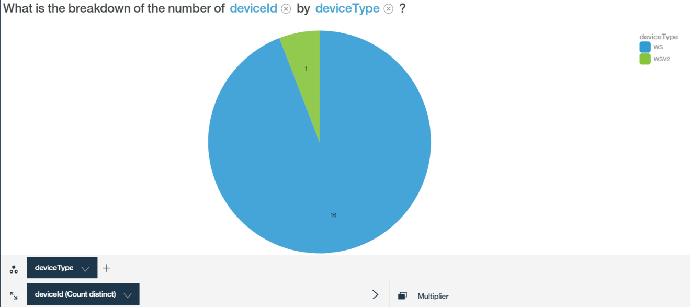
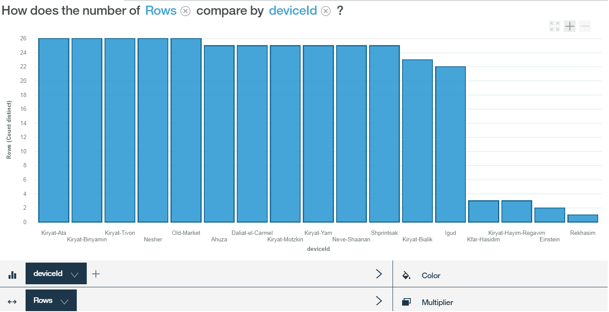
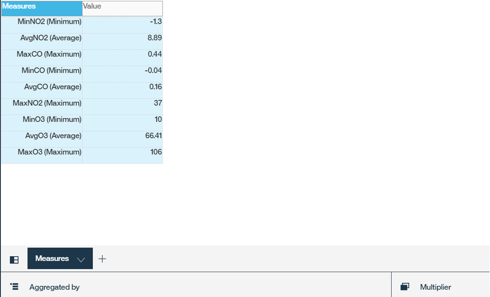
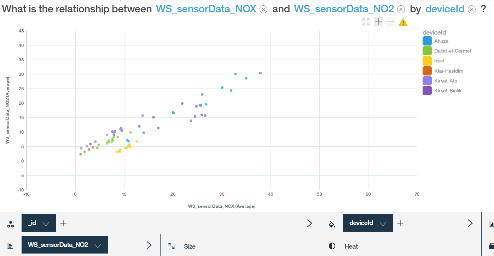
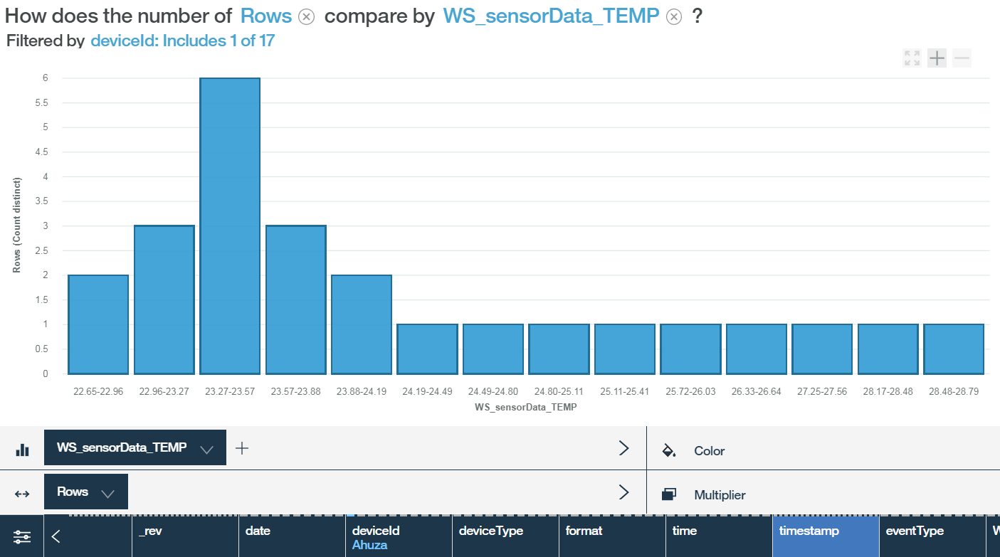
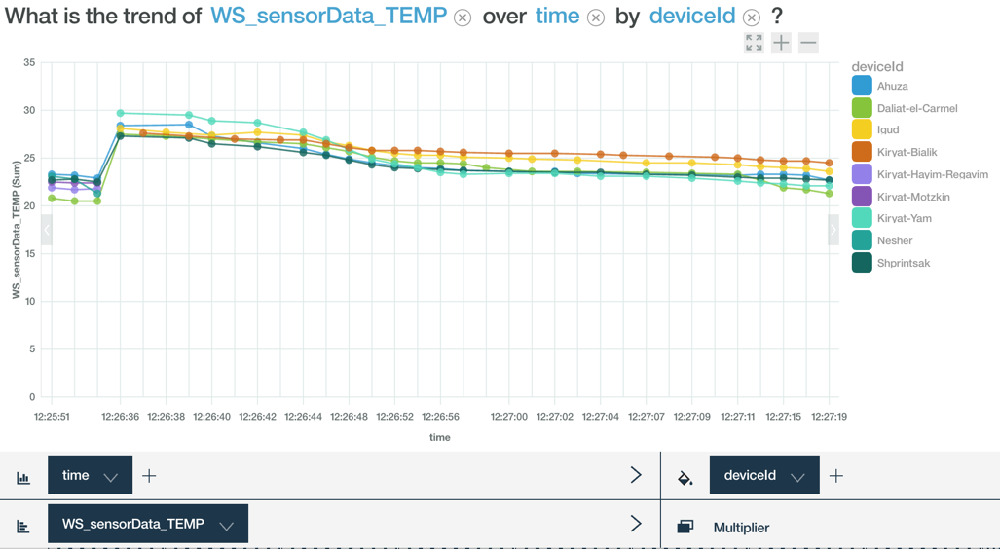
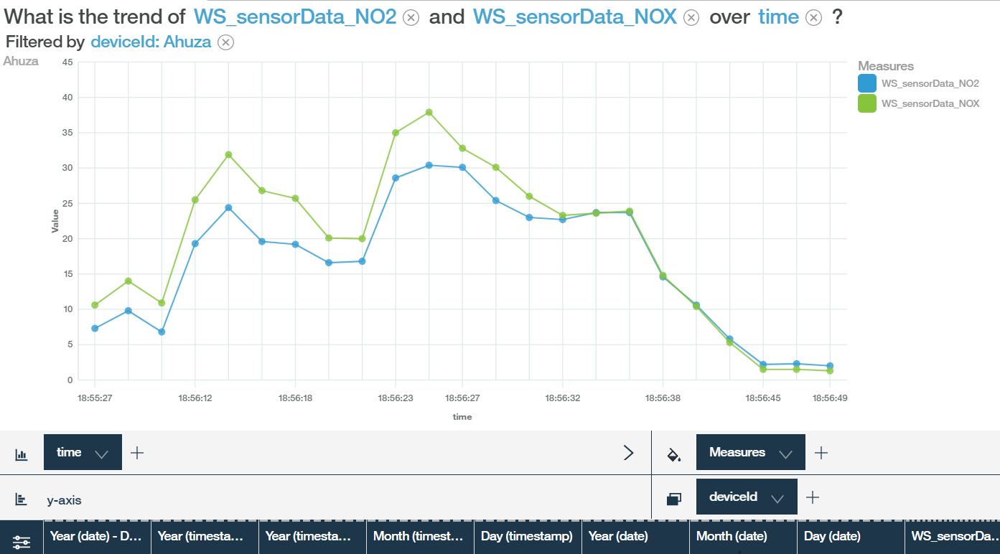

---

copyright:
  years: 2017, 2018
lastupdated: "2017-09-18"
---

---

{:new_window: target="blank"}
{:shortdesc: .shortdesc}
{:screen: .screen}
{:codeblock: .codeblock}
{:pre: .pre}


# Analisi dei dati utilizzando Watson Analytics
{: #WA_integration}  

Puoi utilizzare {{site.data.keyword.iot_full}} con Watson Analytics (WA) per visualizzare e avere informazioni sui dati inviati dai dispositivi collegati alla piattaforma.
{: shortdesc}

## Panoramica e obiettivi

Questa sezione ti guida, passo dopo passo, nel processo di visualizzazione dei dati di evento del dispositivo {{site.data.keyword.iot_short_notm}} utilizzando Watson Analytics (WA) come strumento di analisi.

I dati del dispositivo inviati a {{site.data.keyword.iot_short_notm}} possono essere raccolti e archiviati in {{site.data.keyword.Bluemix}} utilizzando il servizio {{site.data.keyword.cloudantfull}} NoSQL DB. Per raccogliere i dati, devi prima collegare {{site.data.keyword.iot_short_notm}} al servizio {{site.data.keyword.cloudant_short_notm}}. Dopo aver raccolto i dati, esportali in un file CSV. Carica questo file in WA dove puoi visualizzare e analizzare i dati del dispositivo. I dati del dispositivo sono archiviati nei database {{site.data.keyword.cloudant_short_notm}} giornalmente, settimanalmente o mensilmente a seconda dell'intervallo bucket configurato.


Come parte di questa guida imparerai:

 - Come configurare l'archivio dei dati della piattaforma in modo che venga utilizzato Cloudant NoSQL DB come servizio storico.
 - Come utilizzare il simulatore Weather Sensors per generare i dati che vengono utilizzati dalla piattaforma.
 - Come esportare i dati e quindi importarli in WA per analizzarli.


## Prerequisiti

Per completare questa procedura devi disporre dell'accesso a [{{site.data.keyword.iot_short_notm}} ](https://console.bluemix.net/catalog/services/internet-of-things-platform){: new_window} con [Cloudant NoSQL DB ](https://console.bluemix.net/catalog/services/cloudant-nosql-db
){: new_window}e l'accesso a [Watson Analytics ](https://www.ibm.com/watson-analytics){: new_window}.


## Passo 1. Configura il simulatore
{: #WA_sensor_data}


Per poter condurre un'analisi significativa, devi avere dati significativi. Puoi simulare i dati del sensore reali per imparare come i dati del dispositivo Watson IoT Platform possono essere analizzati utilizzando Wastson Analytic. Questo passo fornisce le istruzioni per:
 - [Configurare il simulatore con un'**istanza esistente di {{site.data.keyword.iot_short_notm}}**](#sim_existing_platorm)
 - [Configurare il simulatore con una **nuova istanza di {{site.data.keyword.iot_short_notm}}**](#sim_new_platform)
 - [Scaricare un file di esempio CSV già pronto con i dati](#WA_sensor_premade), se non vuoi utilizzare il simulatore.


### Configura il simulatore Weather Sensors con un'istanza esistente di {{site.data.keyword.iot_short_notm}}
{: #sim_existing_platform}

Per simulare i dati del sensore reali nelle tue organizzazioni utilizzando il simulatore Weather Sensors, devi prima configurarlo. Questi passi presuppongono che tu abbia già un'istanza di {{site.data.keyword.iot_short_notm}} attiva e in esecuzione.

1. [Genera la chiave api e il token necessari ad eseguire il simulatore. ](https://console.bluemix.net/docs/services/IoT/platform_authorization.html#api-key){: new_window}
2. [Distribuisci l'applicazione web del simulatore Weather Sensors ](https://bluemix.net/deploy?repository=https://github.com/ibm-watson-iot/guide-weathersensors-simulator){: new_window} e segui le istruzioni dettagliate.

   Per ulteriori informazioni su Weather Sensors, consulta [the Weather Sensors simulator guide ](https://github.com/ibm-watson-iot/guide-weathersensors-simulator){: new_window}.
3. Procedi al [Passo 2. Configura il connettore al database](#WA_config_db).


### Configura il simulatore Weather Sensors con una nuova istanza di {{site.data.keyword.iot_short_notm}}
{: #sim_new_platform}

Per simulare i dati del sensore reali nelle tue organizzazioni utilizzando il simulatore Weather Sensors, devi prima configurarlo. Questi passi includono le istruzioni per la creazione di un'istanza {{site.data.keyword.iot_short_notm}} insieme al simulatore.

1. [Distribuisci l'applicazione web del simulatore Weather Sensors con un'istanza di {{site.data.keyword.iot_short_notm}} ](https://bluemix.net/deploy?repository=https://github.com/ibm-watson-iot/guide-weathersensors-simulator&branch=bindwiotp){: new_window} e segui le istruzioni dettagliate.

   Per ulteriori informazioni su Weather Sensors, consulta [the Weather Sensors simulator guide ](https://github.com/ibm-watson-iot/guide-weathersensors-simulator){: new_window}.
2. Attendi il completamento della distribuzione e quindi accedi al dashboard di IBM Cloud.
3. Avvia il servizio {{site.data.keyword.iot_short_notm}} "wiotp-for-weather-sensors-simulator" che è stato creato dal processo di distribuzione.
4. Procedi al [Passo 2. Configura il connettore al database](#WA_config_db).


### Utilizzo dei dati del sensore da un file CSV di esempio già pronto
{: #WA_sensor_premade}

Per simulare i dati del sensore reali nelle tue organizzazioni utilizzando un file CSV di esempio già pronto:

1. [Download the Cloudant CSV file ](https://github.com/ibm-watson-iot/guide-weathersensors-simulator/releases/download/v1.0/cloudant.csv){: new_window}.
2. Procedi al [Passo 5. Configura WA e visualizza i dati](#WA_import_data).


## Passo 2. Configura il connettore al database
{: #WA_config_db}

Per utilizzare {{site.data.keyword.cloudant_short_notm}} con Watson Analytics, devi configurare l'archivio dei dati della piattaforma in modo che venga utilizzato Cloudant NoSQL DB come servizio storico.

1. Nel dashboard {{site.data.keyword.cloudant_short_notm}}, fai clic su **Extensions** nella barra di navigazione.
2. In **Historical Data Storage**, fai clic su **Setup**. La sezione **Configure Historical Data Storage** elenca tutti i servizi Cloudant NoSQL DB disponibili nello stesso spazio IBM Cloud di {{site.data.keyword.cloudant_short_notm}}.
3. Seleziona il servizio Cloudant NoSQL DB che desideri collegare.
4. Specifica le seguenti opzioni di configurazione Cloudant NoSQL DB:
  - Intervallo bucket = Day
  - Fuso orario zone = UTC
  - Nome database = default
5. Fai clic su **Done** e conferma l'autorizzazione alla connessione al servizio Cloudant. Assicurati di aver abilitato i popup nel tuo browser per poter avere accesso alla finestra di conferma. Dopo aver correttamente configurato Cloudant NoSQL DB, lo stato di Spazio di archiviazione dei dati cronologici viene modificato in Configurato e i dati del dispositivo vengono archiviati in {{site.data.keyword.cloudant_short_notm}} NoSQL DB.
6. Procedi al [Passo 3. Esegui il simulatore](#run_simulator).


## Passo 3. Esegui il simulatore
{: #run_simulator}

Il simulatore pubblica i dati dei sensori meteo reali, da 17 stazioni meteo ubicate nell'area Haifa, nella tua organizzazione {{site.data.keyword.iot_short_notm}}.

1. Passa al simulatore.
2. Immetti i seguenti dettagli:
   - Organizzazione Watson IoT Platform
   - Chiave API
   - token di autenticazione

3. Fai clic su **Run Simulator**. Potrebbero essere necessari alcuni minuti per la generazione.
4. Passa a Watson IoT Platform mentre il simulatore è in esecuzione e verifica che i dispositivi vengano creati e che gli eventi vengano inviati a questi dispositivi. 
5. Procedi al [Passo 4. Esporta il database Cloudant](#WA_export_csv).


## Passo 4. Esporta il database Cloudant
{: #WA_export_csv}

Quando configuri un {{site.data.keyword.cloudant_short_notm}} NoSQL DB per archiviare i dati del dispositivo, vengono automaticamente creati tre database dal connettore. Un database viene creato per l'intervallo bucket corrente, uno per l'intervallo in entrata e un database per la configurazione. Quando viene raggiunto il termine di un intervallo, i dati del dispositivo vengono archiviati nel database bucket per il nuovo intervallo e viene creato un nuovo database per il bucket successivo.

La funzione di estensione Spazio di archiviazione dei dati cronologici  in {{site.data.keyword.cloudant_short_notm}} crea un documento di progettazione in Cloudant denominato “iotp”. Questo documento ha un funzione “list” denominata “csv” che può essere utilizzata per esportare gli eventi del dispositivo, archiviati come documenti in Cloudant, nel formato CSV. Solo gli eventi nel formato JSON vengono inviati al file CSV. Il documento di progettazione viene trasmesso automaticamente ad ogni nuovo database nei prossimi intervalli bucket.

Il file CSV contiene le informazioni sui metadati di evento del dispositivo e i relativi payload. Il seguente elenco visualizza gli esempi dei metadati di evento:
 -	DeviceId
 -	DeviceType
 - 	EventType
 - 	Timestamp nel formato ISO 8601

La funzione list csv divide la data/ora originale in due nuovi campi ora e data separati. In aggiunta ai metadati, la funzione list CSV include gli attributi di dati del payload del dispositivo. Questo payload viene visualizzato nel documento Cloudant nella chiave “data”. I documenti generati dal simulatore Weather Sensors hanno una struttura simile al seguente esempio:

```
{"deviceType": "WS",
  "deviceId": "Old-Market",
  "eventType": "sensorData",
  "format": "json",
  "timestamp": "2017-08-09T16:28:14.666Z",
  "data": { "NO2": 3.2, … }}
```

Nel file CSV risultante, tutti gli attributi del payload sono rappresentati come colonne e sono preceduti da:

```
<deviceType>_<eventType>_  
```

Nel precedente esempio, viene aggiunta una colonna denominata WS_sensorData_NO2 al file CSV.

Per esportare il database Cloudant nel formato CSV:  

1. Accedi a Cloudant NoSQL DB.
2. Seleziona un database da esportare.
3. Apri il database selezionato.
4. Apri una nuova scheda nel tuo browser e immetti il seguente URL:
   ```
   https://{cloudant service id}-bluemix.cloudant.com/{dbName}/_design/iotp/_list/csv/by-date?include_docs=true
```
   Il dbName e l'ID del servizio Cloudant devono essere modificati in base al tuo ID del servizio Cloudant e la nome del database selezionato. L'ID del servizio Cloudant può essere copiato dall'URL del dashboard di gestione Cloudant.

   **Esempio:**
   ```
   https://ccf73725-b617-4f3e-8a7e-f5fb09569af4-bluemix.cloudant.com/iotp_115ccv_default_2017-08-23/_design/iotp/_list/csv/by-date?include_docs=true
   ```

   In questo esempio, i dati saranno ordinati per data/ora se viene utilizzata la vista per data per richiamare la funzione list. Puoi anche filtrare i dati utilizzando la funzione di filtro nativa delle viste Cloudant modificando la vista utilizzata nell'URL e applicando gli attributi startkey e endkey.

   **Esempio:**
   ```
   https://{cloudant service id}-bluemix.cloudant.com/{dbName}/_design/iotp/_list/csv/by-deviceType?include_docs=true&startkey='WS'&endkey='WS'
   ```
   In questo esempio, la vista deviceType viene utilizzata per generare il CSV e solo i documenti con deviceType=WS vengono inclusi nel file scaricato. Per selezionare i documenti all'interno di un intervallo di tempo specifico, utilizza la vista per data e il seguente URL di query (sostituendo le date/ore con l'intervallo desiderato):
   ```
   https://{cloudant service id}-bluemix.cloudant.com/{dbName}/_design/iotp/_list/csv/by-date?statkey="2017-08-29T12:25:50.995Z"&endkey="2017-08-29T12:25:51.514Z"
   ```
5. Fornisci le credenziali Cloudant se necessario e scarica il file CSV. Il nome del file viene generato in base alla vista definita nell'URL. Ad esempio, il nome del file potrebbe essere by-date.csv o by-deviceType.csv.
6. Procedi al [Passo 5. Configura WA e visualizza i dati](#WA_import_data).


## Passo 5. Configura WA e visualizza i dati
{: #WA_import_data}

Per configurare WA e avviare la visualizzazione dei dati:

1. Accedi a WA all'indirizzo: https://watson.analytics.ibmcloud.com.
2. Nella homepage di WA, seleziona **Data**.
3. Fai clic su **Local File** per importare il tuo file CSV locale. Il nome del file CSV si basa sulla vista che hai utilizzato per esportare i dati (ad esempio, by-deviceType o by-date.)
4. Seleziona l'asset di dati CSV che hai caricato.
5. Nel campo **Ask a question about your data**, fai una domanda utilizzando il linguaggio naturale.
5. Apri il suggerimento di visualizzazione che meglio corrisponde alla tua domanda. Puoi modificare manualmente il suggerimento.
7. Salva la visualizzazione.


## Esempi di visualizzazione dei dati utilizzando WA
{: #WA_visualize}

Questa sezione illustra gli esempi di analisi dei dati utilizzando WA come strumento di analisi.

**Nota:** questi esempi sono pensati per darti un'idea di cosa aspettarti quando esegui le tue proprie visualizzazioni. I risultati negli esempi qui illustrati potrebbero essere diversi dai risultati che visualizzi quando esegui queste visualizzazioni con i dati di esempio, a causa, ad esempio, di dati ottenuti in diverse date e ore.

### Visualizzazione dell'integrità del dispositivo

In questa sezione impariamo come popolare i dispositivi IoT e rispondiamo a domande come:

1. Quanti dispositivi sono stati riportati?
2. Quale è la suddivisione dei dispositivi per tipo di dispositivo?
3. Quanti report ha un dispositivo?
4. Quanti report sono stati inviati ad ogni dispositivo?

**Quanti dispositivi sono stati riportati? **

In questo esempio, contiamo il numero di dispositivi riportati durante l'intervallo specificato per individuare se i dispositivi sono stati riportati come previsto. Per completare questa analisi, copia e incolla o digita la seguente domanda in WA:

*"How many deviceId are there?"*

Questo è il risultato che mostra che ci sono 17 dispositivi:


**Quale è la suddivisione dei dispositivi per tipo di dispositivo?**

In questo esempio confrontiamo il numero di dispositivi per tipo di dispositivo riportato durante l'intervallo per determinare se i dispositivi da tutti i tipi di dispositivo sono stati riportati come previsto. Per completare questa analisi, copia e incolla o digita la seguente domanda in WA:

*"How does the number of deviceId compare by deviceType?"*

Questo è il risultato che mostra la suddivisione dei dispositivi per tipo di dispositivo:


Per visualizzare questi dati in grafico a torta, fai clic su **Visualization** a sinistra e seleziona **Pie**.




**Quanti report ha un dispositivo?**

In questo esempio, contiamo il numero di report effettuati da un dispositivo per individuare le condizioni della rete e altri problemi correlati al dispositivo. Per completare questa analisi, copia e incolla o digita la seguente domanda in WA:

*"How many rows are there? filtered by deviceId: Ahuza"*

**Nota:** non hai bisogno di digitare i nomi campo completi. WA tenta di indovinare il nome del campo completo, ma i valori di filtro (ad es. "Ahuza") devono essere scritti in modo completo e correttamente. Se non visualizzi un suggerimento corretto con il filtro, fai clic sul link **Show Next** o prova la domanda *"How many rows are there?"*. Quindi, apri il diagramma, fai clic sulla casella **Multiplier** sotto il diagramma e seleziona il parametro deviceId dall'elenco. Deseleziona tutti i deviceId non pertinenti.

Questo è il risultato che mostra che ci sono 25 righe o report effettuati dal dispositivo Ahuza:


**Quanti report ha ognuno dei diversi dispositivi?**

In questo esempio confrontiamo il livello di attività dei dispositivi in base al numero di report che ogni dispositivo ha inviato durante l'intervallo ispezionato. Per completare questa analisi, copia e incolla o digita la seguente domanda in WA:

*"How does the number of Rows compare by deviceId?"*

Questo è il risultato che mostra un grafico a barre con l'attività del dispositivo per diversi dispositivi:




### Visualizzazione dei dati del sensore del tipo di dispositivo

In questa sezione impariamo come riepilogare i dati del sensore riportati da tutti i dispositivi di un tipo di dispositivo, rispondendo a domande come:

1. Quali sono i valori Medio/Min/Mas di tutti i valori del sensore riportati?
2. Posso visualizzare un istogramma di un output del sensore?  
3. Quale è la correlazione tra due sensori?


**Quali sono i valori Medio/Min/Mas di tutti i valori del sensore riportati?**

In questo esempio, riepiloghiamo i parametri numerici riportati da tutti i dispositivi in un tipo di dispositivo in una tabella. Da questa tabella, possiamo imparare come l'intervallo di valori viene percepito nell'ambiente e ottenere un'ampia prospettiva dei dati percepiti.

Questa visualizzazione deve essere integrata manualmente, utilizzando la seguente procedura:

1.	Nella sezione **Create your own visualization**, seleziona **Table**.
2.	Fai clic sul pulsante con il segno più "create new column" e seleziona **Calculation**.
3.	Denomina la nuova colonna, selezionala per questo calcolo dall'elenco a discesa **Columns** e fai clic su **Done** per duplicarla. La nuova colonna viene aggiunta alla fine del lato destro della barra dei dati.
4.	Fai clic con il tasto destro sul titolo della nuova colonna, seleziona un tipo di aggregazione (min, max o average) e chiudi la finestra delle proprietà.
6.	Ripeti il processo per aggiungere più di una colonna e nascondi la barra dei dati.
7.	Fai clic su **Columns** e seleziona **Measures** alla fine dell'elenco.
8.	Fai clic su **Aggregated by** e seleziona tutti i calcoli che hai aggiunto.
9.	Fai clic su **Done**.
10.	Salva la visualizzazione.

Questo è il risultato che mostra l'intervallo di valori:




**Posso visualizzare un istogramma di un output del sensore di un dispositivo?**

In questo esempio valutiamo il comportamento di un sensore in tutti i dispositivi in un tipo di dispositivo, identificando la distribuzione dei valori percepiti nell'ambiente. Possiamo utilizzare questa visualizzazione per imparare come l'ambiente viene percepito dai sensori così come le limitazioni nei sensori. Per completare questa analisi, copia e incolla o digita la seguente domanda in WA:

*"How does the number of Rows compare by TEMP?"*

Questo è il risultato che mostra il confronto del numero di righe:


**Quale è la correlazione tra due sensori?**

In questo esempio impariamo come avvengono le correlazioni nell'ambiente confrontando le misurazioni da due sensori del dispositivo in tutti i dispositivi del tipo di dispositivo. Per completare questa analisi, copia e incolla o digita una delle seguenti domande in WA:

*"What is the relationship between NO2 and NOX?"* o *"How are the values of NO2 and NOX associated?"*

Questo è il risultato che mostra la correlazione tra i due sensori:


Puoi anche visualizzare i dati del sensore utilizzando i punti colorati per ID del dispositivo. Per fare questo, seleziona deviceID nella casella **Color**.

Questo è il risultato che mostra un sottoinsieme limitato di dispositivi:




### Visualizzazione dei dettagli del sensore (approfondita)

In questa sezione studiamo i parametri specifici riportati da un dispositivo specifico, rispondendo alle seguenti domande:

1.	Quale è il valore Medio/Min/Mas riportato?
2.	Posso visualizzare un istogramma di un output del sensore di un dispositivo?
3.	Come si modifica nel tempo un valore del sensore del dispositivo specifico?
4.	Come si confrontano nel tempo i valori del sensore di due dispositivi?
5.	Come si confrontano nel tempo i valori del sensore dello stesso dispositivo?
6.	Quale è la correlazione tra due sensori di un dispositivo?


**Quale è il valore Medio/Min/Mas riportato?**

In questo esempio, riepiloghiamo i parametri numerici riportati da un dispositivo specifico in una tabella per imparare, ad esempio, come l'intervallo di valori viene percepito nell'ambiente o come si verificano i malfunzionamenti del sensore.

Questa visualizzazione deve essere integrata manualmente, utilizzando la seguente procedura:

1)	Nella sezione **Create your own visualization**, seleziona **Table**.
2)	Fai clic sul pulsante con il segno più "create new column" e seleziona **Calculation**.
3)	Denomina la nuova colonna, selezionala per questo calcolo dall'elenco a discesa **Columns** e fai clic su **Done** per duplicarla. La nuova colonna viene aggiunta alla fine del lato destro della barra dei dati.
4)	Fai clic con il tasto destro sul titolo della nuova colonna, seleziona un tipo di aggregazione (min, max o average) e chiudi la finestra **Properties**.
6)	Ripeti il processo per aggiungere più di una colonna e nascondi la barra dei dati.
7)	Fai clic su **Columns** e seleziona **Measures**.
8)	Fai clic su **Aggregated by** e seleziona tutti i calcoli che hai aggiunto.
9)	Fai clic su **Done**.
10)	Nella casella del moltiplicatore, seleziona il parametro deviceId e i dispositivi rilevanti da visualizzare.
11)	Salva la visualizzazione.

Questo è il risultato che mostra i valori specificati:


**Posso visualizzare un istogramma di un output del sensore di un dispositivo? **

In questo esempio valutiamo il comportamento di un sensore del dispositivo specifico, identificando la distribuzione dei valori percepiti nell'ambiente. Possiamo utilizzare questa visualizzazione per imparare come l'ambiente viene percepito dal sensore così come i malfunzionamenti nel sensore. Per completare questa analisi, copia e incolla o digita una delle seguenti domande in WA:

*"What is the distribution of TEMP? filtered by deviceId: Ahuza"* o *"How does the number of Rows compare by TEMP? filtered by deviceId: Ahuza"*

Questo è il risultato che mostra i dati del sensore del dispositivo nell'istogramma:




**Come si modifica nel tempo un valore del sensore del dispositivo specifico?**

In questo esempio, impariamo come le letture di un sensore specifico di un dispositivo specifico si modificano, rispecchiando le modifiche nell'ambiente nel tempo. Questo può aiutare durante la pianificazione e il rilevamento del problema. Per completare questa analisi, copia e incolla o digita la seguente domanda in WA:

*"What is the trend of TEMP over time? filtered by deviceId: Ahuza".*

Questo è il risultato che mostra la tendenza dei dati del sensore nel tempo:


**Come si confrontano nel tempo i valori del sensore di due dispositivi?**

In questo esempio, confrontiamo le tendenze delle letture del sensore di diversi dispositivi, identificando le correlazioni tra i dispositivi per individuare le anomalie, i malfunzionamenti del dispositivo e così via. Per completare questa analisi, copia e incolla o digita una delle seguenti domande in WA:

*"What is the trend of TEMP over time by deviceId?"* o *"What is the trend of TEMP over time by deviceId?  filtered by deviceId: Ahuza, Igud"*

Questo è il risultato che mostra il confronto dei valori del sensore nel tempo:



Puoi anche visualizzare queste informazioni facendo clic sul nome del parametro alla fine del grafico. Sono tracciate più righe (una per deviceId). I deviceId rilevanti possono essere selezionati dall'elenco.


Puoi utilizzare la casella **Multiplier** sotto il grafico e scegliere di presentare i grafici l'uno accanto all'altro.


**Come si confrontano nel tempo i valori del sensore dello stesso dispositivo? **

In questo esempio visualizziamo reciprocamente la tendenza di due sensori del dispositivo per ottenere ulteriori informazioni approfondite sulle modifiche dell'ambiente nel tempo. Per completare questa analisi, copia e incolla o digita la seguente domanda in WA:

*"What is the trend of NO2 and NOX over time by deviceId?  filtered by deviceId: Ahuza"*

Questo è il risultato che mostra la tendenza di due sensori del dispositivo nel tempo:




**Quale è la correlazione tra due sensori di un dispositivo? **

In questo esempio impariamo come avvengono le correlazioni nell'ambiente confrontando le misurazioni da due sensori del dispositivo. Per completare questa analisi, copia e incolla o digita una delle seguenti domande in WA:

*"What is the relationship between NO2 and NOX? filtered by deviceId: Ahuza"* o *"How are the values of NO2 and NOX associated? filtered by deviceId: Ahuza"*

Questo è il risultato che mostra la correlazione tra due sensori di un dispositivo:


## Operazioni successive

Per ulteriori informazioni su WA, consulta le seguenti risorse:
- [Watson Analytics Developer Center ](https://developer.ibm.com/watson-analytics/){: new_window}
- [Watson Analytics community ](https://www.ibm.com/communities/analytics/watson-analytics/){: new_window}
- [Watson Analytics forum ](https://community.watsonanalytics.com/discussions/spaces/15/view.html){: new_window}
