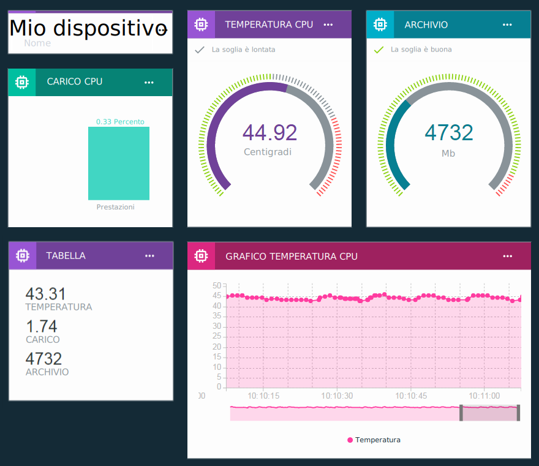

---

copyright:
  years: 2016, 2017
lastupdated: "2017-05-08"

---

{:new_window: target="\_blank"}
{:shortdesc: .shortdesc}
{:screen: .screen}
{:codeblock: .codeblock}
{:pre: .pre}
{:tip: .tip}

# Visualizzazione dei dati in tempo reale utilizzando le tabelle e le schede
{: #boards_and_cards}

Crea le tabelle e le schede per creare e condividere i tuoi propri dashboard che visualizzano i tuoi dati del dispositivo in tempo reale.
{:shortdesc}

Utilizzando le schede e le tabelle, puoi visualizzare i valori dei dataset graficamente da uno o più dispositivi per avere una veloce panoramica e una migliore comprensione dei dati. Crea tabelle e aggiungi schede che visualizzano i dati come numeri non elaborati, grafici in tempo reale, misuratori e altro. Aggiungi membri alle tue tabelle per condividerle con altri utenti nella tua organizzazione. Ordina le schede e aggiungi divisori di testo esplicativi per ottimizzare la tua presentazione.  

Puoi anche espandere la serie predefinita di schede [creando le tue proprie schede personalizzate](custom_cards/custom-cards.html).

## Tabelle predefinite
{: #default_boards}
Il dashboard {{site.data.keyword.iot_full}} dispone delle seguenti tabelle predefinite:

|Nome tabella | Descrizione | Schede incluse
|:---|:---|:---|  
|Panoramica dell'utilizzo  | Le statistiche di utilizzo per la tua organizzazione. Elenca i tipi di dispositivo e i dati utilizzati. | <ul><li>Tipi di dispositivo<li>Dati trasferiti</ul>
|Analisi incentrata sulla regola | Le regole per la tua organizzazione. Ulteriori schede elencano gli avvisi attivati, i dispositivi associati, le proprietà del dispositivo e le informazione sull'avviso. | <ul><li>Regole da me gestite<li>Avvisi regola<li>Informazioni avviso regola<li>Dispositivi associati<li>Informazioni sul dispositivo<li>Proprietà del dispositivo</ul>  
|Analisi incentrata sul dispositivo | I dispositivi connessi alla tua organizzazione. Ulteriori schede mostrano gli avvisi e le informazioni per un dispositivo selezionato, le proprietà del dispositivo e le informazioni sull'avviso. | <ul><li>Dispositivi a cui presto attenzione<li>Informazioni sul dispositivo<li>Avvisi regola per tale dispositivo<li>Informazioni avviso regola<li>Proprietà del dispositivo</ul>
|Panoramica della sicurezza e del rischio (Beta) | Lo stato della sicurezza globale della tua organizzazione. Gli operatori di sistema e gli analisti della sicurezza possono visualizzare i dettagli di conformità, lo stato della connessione dei dispositivi, le cause dei problemi di connessione e i dispositivi bloccati o consentiti da una whitelist o una blacklist.  Dalla scheda di conformità della connessione, gli utenti possono eseguire il drilldown a un report dettagliato sui dispositivi non conformi e possono esportare il report in Excel. | <ul><li>Conformità alla politica<li>Sicurezza della connessione<li>Conformità a blacklist/whitelist</ul>

Puoi aggiornare queste tabelle aggiungendo, aggiornando e rimuovendo schede.

Per reimpostare una tabella predefinita al suo stato iniziale puoi eliminarla. La tabella viene quindi ricreata con le schede originali.
{: tip}

## Creazione di tabelle e schede
{: #visualizing_data}

{{site.data.keyword.iot_short_notm}} fornisce un dashboard integrato che puoi utilizzare per visualizzare i dati in tempo reale restituiti dal tuo dispositivo. Per impostazione predefinita, la pagina della panoramica visualizza le informazioni sull'utilizzo relative alla tua organizzazione {{site.data.keyword.iot_short_notm}}, come i dati e lo spazio di archiviazione utilizzati. Per visualizzare i dati del dispositivo in tempo reale come arrivano, aggiungi le schede specifiche per il dispositivo in questa pagina.

Per una "ricetta" (recipe) di istruzioni dettagliate su come visualizzare i dati del dispositivo in tempo reale, consulta la ricetta [Configuring Boards & Cards in the new Watson IoT Dashboard ](https://developer.ibm.com/recipes/tutorials/configuring-the-cards-in-the-new-watson-iot-dashboard/){: new_window}.
{: tip}

Per creare una tabella e aggiungere una scheda a tale tabella:
1. Nel dashboard {{site.data.keyword.iot_short_notm}}, seleziona **Boards**.
2. Seleziona una tabella per cui disponi dei diritti di modifica o crea una nuova tabella.
3. Nella tabella, fai clic su **Add New Card**.
3. Seleziona un tipo di scheda.  
**Suggerimento:** se non sei sicuro di quale visualizzazione scegliere per una scheda di tipo di dispositivi, seleziona **Visualizzazione generica**. Puoi modificare il tipo di scheda successivamente.
<dl>
<dt>Dispositivi</dt>
<dd><table>
<thead>
<tr>
<th>Tipo</th>
<th>Dati visualizzati</th>
</tr>
</thead>
<tbody>
<tr>
<td>Visualizzazione generica</td>
<td>Il valore di uno o più dataset. **Suggerimento:** per visualizzare fino a tre valori di punto dati in una piccola tabella, scegli la dimensione del widget grande.  </td>
</tr>
<tr>
<td>Grafico a linee</td>
<td>Uno o più dataset in un grafico a scorrimento in tempo reale. Utilizza il menu delle impostazioni per impostare l'intervallo e la conservazione dei dati, l'aspetto dei grafici e altro. </td>
<tr>
<td>Grafico a barre</td>
<td>I valori dei dataset nelle barre etichettate. Utilizza il menu delle impostazioni per cambiare la direzione della barra, verticale o orizzontale.</td>
</tr>
<tr>
<td>Grafico ad anello</td>
<td>Due o più dataset in una rappresentazione circolare.</td>
</tr>
<tr>
<td>Valore</td>
<td>Il valore non elaborato di uno o più dataset.</td>
</tr>
<tr>
<td>Misuratore</td>
<td>Il valore del dataset visualizzato come un misuratore. Utilizza il menu delle impostazioni per facoltativamente impostare le soglie del misuratore per gli intervalli di dati inferiore, medio e superiore.  </td>
</tr>
<tr>
<td>Proprietà del dispositivo</td>
<td>Proprietà specifiche per uno o più dispositivi.</td>
</tr>
<tr>
<td>Tutte le proprietà del dispositivo</td>
<td>Tutte le proprietà per uno o più dispositivi.</td>
</tr>
<tr>
<td>Elenco dispositivi</td>
<td>Un elenco per monitorare più dispositivi. Un elenco può essere utilizzato come un'origine dati per altre schede.  Puoi filtrare gli elenchi in base all'ID e al tipo del dispositivo nelle impostazioni della scheda. Gli elenchi di dispositivi di taglia L o più grandi possono anche essere filtrati in modo interattivo facendo clic sull'icona di filtro nella scheda. Le voci di filtro possono essere aggiunte come singole voci, intervalli (x-y) o separate da virgole.  Per impostazione predefinita, un elenco visualizza ID e tipo di dispositivo. Puoi configurare le impostazioni della scheda di elenco per fare in modo che la scheda visualizzi anche altri metadati dei dispositivi. </td>
</tr>
<tr>
<td>Informazioni dispositivo</td>
<td>Informazioni di base per un solo dispositivo.</td>
<tr>
<td>Associazione dispositivo</td>
<td>L'ubicazione dei dispositivi in un elenco di dispositivi.</td>
</tr>
</tbody>
</table>
</dd>
<dt>Analytics</dt>
<dd>
<table>
<thead>
<tr>
<th>Tipo</th>
<th>Dati visualizzati</th>
</tr>
</thead>
<tbody>
<tr>
<td>Regole</td>
<td>Un elenco di regole che dispongono di avvisi.</td>
</tr>
<tr>
<td>Avvisi regola</td>
<td>Un elenco di avvisi per un dispositivo.</td>
</tr>
<tr>
<td>Informazioni avviso</td>
<td>Informazioni di base per un solo avviso.</td>
</tr>
</tbody>
</table>
</dd>
<dt>Risk Management (Beta)</dt>
<dd>Disponibile solo con le organizzazioni [Sicurezza avanzata](reference/security/RM_security.html).
<table>
<thead>
<tr>
<th>Tipo</th>
<th>Dati visualizzati</th>
</tr>
</thead>
<tbody>
<tr>
<td>Conformità alla politica</td>
<td>Una panoramica della sicurezza della connessione e dei dispositivi inseriti in blacklist e whitelist.</td>
</tr>
<tr>
<td>Conformità a blacklist/whitelist</td>
<td>Il numero di dispositivi in blacklist o whitelist.</td>
</tr>
<tr>
<td>Sicurezza della connessione</td>
<td>Il numero di dispositivi che non ha superato il controllo della sicurezza della connessione.</td>
</tr>
</tbody>
</table>
</dd>
<dt>Utilizzo</dt>
<dd>
<table>
<thead>
<tr>
<th>Tipo</th>
<th>Dati visualizzati</th>
</tr>
</thead>
<tbody>
<tr>
<td>Tipi di dispositivo</td>
<td>Un grafico a torta che visualizza il numero di dispositivi registrati per tipo di dispositivo per la tua organizzazione.</td>
</tr><tr>
<td>Dati trasferiti</td>
<td>Le statistiche di utilizzo per i dati trasferiti per la tua organizzazione.</td>
</tr>
</tbody>
</table>
</dd>
<dt>Di base</dt>
<dd>
<table>
<thead>
<tr>
<th>Tipo</th>
<th>Dati visualizzati</th>
</tr>
</thead>
<tbody>
<tr>
<td>Separatore</td>
<td>Un separatore orizzontale per organizzare e raggruppare le schede nella tabella</td>
</tr>
</tbody>
</table>
</dd>
</dl>

4.	Seleziona L'origine di dati della scheda.  
Seleziona una o più origini di dati della scheda e fai quindi clic su **Next**.  
Le origini di dati possono essere singoli dispositivi registrati oppure altre schede. Per utilizzare un'origine di dati della scheda, sulla tabella deve esistere una scheda di mappa o di elenco.  
5. Aggiungi uno o più dataset per ciascuna delle tue origini dati.
 - Dispositivi
    2. Seleziona un evento che include il punto dati che desideri visualizzare.
    3.	Seleziona la proprietà che rappresenta il punto dati.
    1.	Fornisci al dataset un nome di identificazione.
    4.	Imposta i valori tipo, unità, precisione e minimo e massimo per il punto dati.  
    Quando hai finito, puoi fare clic su **New Data Set** per aggiungere altri dataset o fare clic su **Next**.
 - Elenchi
    2. Seleziona un tipo di dispositivo oppure seleziona **Any device type**.
    2. Seleziona un evento che include il punto dati che desideri visualizzare.
    3.	Seleziona la proprietà che rappresenta il punto dati.
    1.	Fornisci al dataset un nome di identificazione.
    4.	Imposta i valori tipo, unità, precisione e minimo e massimo per il punto dati.  
    Quando hai finito, puoi fare clic su **New Data Set** per aggiungere altri dataset o fare clic su **Next**.
5.	Personalizza la visualizzazione della scheda nell'anteprima della scheda.  
 7. Seleziona la dimensione di presentazione.  
Oltre a impostare la dimensione della scheda sulla tua tabella, l'impostazione della dimensione della scheda controlla anche altre variabili di presentazione, quali il numero di dispositivi elencato, i metadati di grafico visualizzati e così via.   
**Suggerimento:** fai clic sulle diverse etichette di dimensione per visualizzare delle anteprime delle schede alle diverse dimensioni.
 8. Configura eventuali impostazioni aggiuntive.  
Se la scheda lo supporta, fai clic su **Settings** per visualizzare le impostazioni aggiuntive che puoi configurare, quali gli intervalli di dati per le schede di tipo misuratore e le opzioni di filtro per le schede di elenco dispositivi.
6. Aggiornare le informazioni sulla scheda.  
 1. Fornisci un titolo e una descrizione per la scheda e, facoltativamente, seleziona uno schema di colori.   
 2. Fai clic su **Submit** per creare la scheda.
7.	Posiziona la nuova scheda sulla tua tabella trascinandola in una ubicazione valida.  
