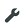

---

copyright:
  years: 2017, 2018
lastupdated: "2018-05-07"
---

---

{:new_window: target="blank"}
{:shortdesc: .shortdesc}
{:screen: .screen}
{:codeblock: .codeblock}
{:pre: .pre}
{:tip: .tip}

# Simulazione dei dati del dispositivo 
{: #sim_device_data}

Utilizzando il simulatore del dispositivo {{site.data.keyword.iot_full}}, puoi configurare gli eventi simulati per i dispositivi. Puoi anche utilizzare i dati dell'evento simulato per informazioni, verifica e per dimostrare la funzionalità completa delle funzioni {{site.data.keyword.iot_short_notm}}.
{: shortdesc}

Puoi utilizzare i dispositivi e i tipi di dispositivo esistenti e il simulatore ti abilita a generare nuovi dispositivi per i tipi esistenti. Puoi configurare i dettagli dell'evento di ogni dispositivo o impostare una configurazione predefinita che si applica a tutti i dispositivi. Puoi esportare una configurazione dell'evento simulata in modo che possa essere riutilizzata o condivisa per configurare altre simulazioni.

Per simulare i dati del dispositivo: 

1. Accedi a {{site.data.keyword.iot_short_notm}}.
2. Dal pannello di navigazione principale, seleziona **Settings**.
3. Nella sezione **Experimental Features**, attiva il simulatore del dispositivo.
4. Dal pannello di navigazione principale, seleziona **Devices**. Un messaggio nell'angolo destro in basso della schermata indica che nessun simulatore è in esecuzione.
5. Fa clic sul messaggio "0 Simulations running".
6. Nella finestra a comparsa **Simulations**, fai clic su **Add First Simulation**.
7. Seleziona il tipo di dispositivo di cui desideri simulare i dati.
8. Seleziona una delle seguenti opzioni:
  - Per aggiungere uno o più dispositivi, seleziona la quantità e fai clic su **New Device**. I nuovi dispositivi vengono elencati.
  - Per aggiungere un dispositivo esistente, fai clic su **Use Registered Device** e selezionane uno dall'elenco.
  - Per importare una simulazione esistente, fai clic su **Import/Export**, seleziona la scheda **Import** e importa un file JSON o copia una configurazione precedentemente esportata dagli appunti.
9. Fai clic su  e configura i dettagli della simulazione per un tipo di dispositivo:
   1. Seleziona il tipo di dispositivo dall'elenco e fai clic su **+ Event Type** per aggiungere un tipo di evento al tipo di dispositivo:
   2. Seleziona un tipo di evento dall'elenco e fai clic su **Schedule** per configurare la frequenza dell'evento.
   3. Modifica i dettagli del tipo di evento nel formato JSON e salva il tipo di evento aggiornato.
   
   
 Puoi utilizzare le seguenti due variabili speciali quando configuri gli eventi:  
        - `range`:  questa variabile viene sostituita da un numero casuale compreso tra due valori forniti. Ad esempio: `{ "random": range(300, 100) }`  
        - `$counter`: questa variabile viene sostituita con il numero di dispositivi aggiunti nel simulatore per il tipo corrente. Ad esempio: `{"total": $counter}`

   {: tip}
   
   4. Scegli se utilizzare queste impostazioni come i valori predefiniti per tutti i dispositivi di questo tipo o se utilizzare variabili personalizzate per dispositivi individuali. 
   5. Ripeti la procedura di configurazione per ogni dispositivo a cui desideri applicare le impostazioni personalizzate. Il messaggio in basso a destra nella schermata mostra il numero di simulazioni attive.
10. **Facoltativo:** dopo aver configurato le simulazioni dei dispositivi, esportane i dettagli in modo che possano essere riutilizzati o condivisi:
    1. Nella finestra a comparsa **Simulations**, fai clic su **Import/Export**.
    2. Seleziona la scheda **Export**.
    3. Copia i dettagli della simulazione negli appunti o scaricali in un file JSON.
11. Nella pagina **Devices**, scegli uno dei dispositivi simulati e seleziona la scheda **Recent Events** per verificare che gli eventi simulati funzionino.
