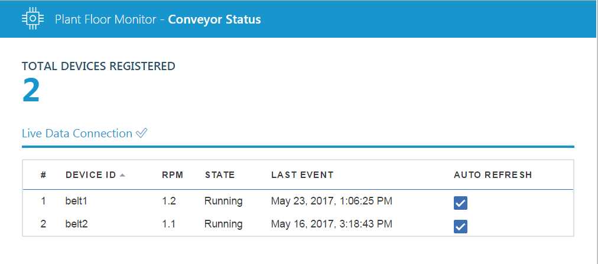

---

copyright:
  years: 2017, 2018
lastupdated: "2018-05-17"

---

{:shortdesc: .shortdesc}
{:new_window: target="_blank"}
{:codeblock: .codeblock}
{:pre: .pre}
{:screen: .screen}
{:tip: .tip}

# Guida 2: Monitoraggio dei dati del tuo dispositivo 
Ora che disponi di uno o più dispositivi collegati, è ora di iniziare a monitorare i dati del dispositivo in tempo reale.
{:shortdesc}

## Panoramica e obiettivi
{: #overview}  

In questa guida, distribuirai un'applicazione di monitoraggio in {{site.data.keyword.Bluemix}} per visualizzare i dati dai tuoi dispositivi.

Come nella guida 1, puoi seguire uno o entrambi i seguenti percorsi:
- Percorso A: [Passo 1A - Distribuisci e collega l'applicazione web di monitoraggio](#deploy_app)  
Con il seguente percorso, A distribuirai un'applicazione già pronta che monitora i dispositivi nastro trasportatore che sono in esecuzione nella tua organizzazione.
- Percorso B: [Passo 1B - Crea un'interfaccia utente di monitoraggio utilizzando la libreria widget](#widget-library)
Il leggermente più complesso percorso B, introduce la libreria widget e ti conduce attraverso la creazione dell'interfaccia utente di base.

## Prerequisiti
{: #prereqs}  
Prima di iniziare, assicurati che siano soddisfatti i seguenti requisiti.

### Ambiente locale
- [Node.js ](https://nodejs.org){: new_window} versione 6.x o successiva.
- Percorso A: [Angular CLI ](https://github.com/angular/angular-cli){: new_window} versione 1.x o successiva.  
- [Cloud Foundry CLI ](https://github.com/cloudfoundry/cli#downloads){: new_window}  
Utilizza la CLI cf per distribuire le applicazioni e i servizi a {{site.data.keyword.Bluemix_notm}}. Per ulteriori informazioni, consulta [Cloud Foundry CLI documentation](https://docs.cloudfoundry.org/cf-cli/){: new_window}  
- Facoltativo: [Git ](https://git-scm.com/downloads){: new_window}  
Se scegli di utilizzare Git per scaricare gli esempi di codice devi inoltre avere un account [GitHub.com ](https://github.com){: new_window}. Puoi anche scaricare il codice come un file compresso senza un account GitHub.com.

### Altri requisiti
Devi anche disporre di un dispositivo collegato del tipo `iot-conveyor-belt` che invia gli eventi con il nome evento `sensorData` con un payload del messaggio che include le seguenti proprietà:
```
{
	"d": {
		"id": "belt1",
		"ts": 1494946276931,
		"ay": "0.00",
		"running": true,
		"rpm": "1.0"
		}
}
```
Per ulteriori informazioni sugli eventi del dispositivo e sul formato di messaggistica, consulta [Pubblicazione eventi](/docs/services/IoT/devices/mqtt.html#publishing_events).  
Se hai completato [Guida 1: Introduzione a {{site.data.keyword.iot_short_notm}} e al nastro trasportatore simulato](getting-started-iot-conveyor.html), sono già tutti configurati.  
{: tip}

## Passo 1A - Distribuisci e collega l'applicazione web di monitoraggio
{: #deploy_app}

L'applicazione di esempio Plant Floor Monitoring elenca tutti i dispositivi del tipo iot-conveyor-belt collegati alla tua organizzazione {{site.data.keyword.iot_full}} insieme a un sottoinsieme di dati evento come RPM, ultimo aggiornamento e ID dispositivo.

L'applicazione di esempio è stata creata utilizzando le librerie client Node.js all'indirizzo: [https://github.com/ibm-watson-iot/iot-nodejs ](https://github.com/ibm-watson-iot/iot-nodejs){: new_window}



Come parte di questo passo eseguirai queste azioni:
- Distribuire un'applicazione web di monitoraggio di esempio originata da GitHub utilizzando Cloud Foundry.
- Configurare l'applicazione di esempio per collegarsi a {{site.data.keyword.iot_short_notm}} utilizzando la chiave API e il token di autenticazione.
- Utilizzare l'applicazione web per monitorare i tuoi dispositivi nastro trasportatore collegati.  

### Procedura dettagliata per la distribuzione e la connessione dell'applicazione web di monitoraggio
La seguente procedura ti guiderà attraverso la creazione e la distribuzione dell'applicazione in {{site.data.keyword.Bluemix_notm}}. Per informazioni sull'esecuzione della applicazione localmente, vedere il file README in GitHub.
1. Clona il repository GitHub dell'applicazione di esempio *Plant Floor Monitoring*Node.js.  
Utilizza il tuo strumento git preferito per clonare il seguente repository:  
https://github.com/ibm-watson-iot/guide-conveyor-ui-angular
Nella shell Git, utilizza il seguente comando:
  ```bash
git clone https://github.com/ibm-watson-iot/guide-conveyor-ui-angular
  ```
2. Crea una combinazione chiave API e token di autenticazione per la tua applicazione.  
Ne avrai bisogno quando configuri l'applicazione per collegarsi alla tua organizzazione. Per ulteriori informazioni sulla registrazione dei dispositivi, consulta [Connessione alle applicazioni](/docs/services/IoT/platform_authorization.html).  
 1. Apri il dashboard {{site.data.keyword.iot_short_notm}}.
 2. Seleziona **Apps**.
 3. Fai clic su **Generate API Key**
 4. Copia i valori della chiave API e del token di autenticazione che vengono elencati.
 5. Seleziona **Visualization Application** come ruolo API.  
**Suggerimento:** se aggiungi più funzioni all'applicazione, dovrai elevarlo a un ruolo superiore.
 6. Aggiungi un commento in modo da identificare più facilmente questa combinazione di chiave API e token di autenticazione.
 7. Fai clic su **Generate**.
3. Configura la tua applicazione per collegarsi a {{site.data.keyword.Bluemix_notm}}.
Passa alla root del repository *guide-conveyor-ui-angular* e crea un file `basicConfig.json` con il seguente contenuto:
  ```
{
  "org": "your orgID",
  "apiKey": "your API key",
  "apiToken": "your Authentication Token"
}
  ```
Sostituisci i valori del parametro con i valori corrispondenti della tua organizzazione {{site.data.keyword.Bluemix_notm}}: orgID, chiave API key e token di autenticazione che hai appena creato.  
Esempio:
```
 {   
  "org": "3v5whr",    
  "apiKey": "a-3v5whr-jhkmsghlqv",  
  "apiToken": "-q0MkPN2cNYB6+?ISk"  
}
```
4. Accedi al tuo account {{site.data.keyword.Bluemix_notm}} utilizzando la CLI cloudfoundry.  
Per ulteriori informazioni, consulta [Cloud Foundry CLI documentation](https://docs.cloudfoundry.org/cf-cli/){: new_window}  
Dalla riga di comando, immetti il seguente comando:  
  ```
cf login
  ```
Se richiesto, seleziona l'organizzazione e lo spazio in cui desideri distribuire l'applicazione web di monitoraggio.
5. Se necessario, configura il tuo endpoint API seguendo il comando cf api.   
Sostituisci i valore `API-ENDPOINT` con l'endpoint API della tua regione.
  ```
cf api API-ENDPOINT
  ```
Esempio: `cf api https://api.ng.bluemix.net`
<table>
<tr>
<th>Regione</th>
<th>Endpoint API</th>
</tr>
<tr>
<td>Stati Uniti Sud</td>
<td>https://api.ng.bluemix.net</td>
</tr>
<tr>
<td>Regno Unito</td>
<td>https://api.eu-gb.bluemix.net</td>
</tr>
<!--<tr>
<td>Germany</td>
<td>https://api.eu-de.bluemix.net</td>
</tr>-->
</table>
6. Modifica la directory con quella in cui è ubicata l'applicazione di esempio.  
  ```
cd guide-conveyor-ui-angular
  ```
7. Esegui `npm install -g @angular/cli` per installare la CLI Angular.
8. Esegui `npm install`.
9. Esegui `npm run push` per creare il progetto e trasmettilo alla tua organizzazione.  
La tua applicazione web di esempio è stata distribuita a {{site.data.keyword.Bluemix_notm}}.  
Quando la distribuzione è completa, viene visualizzato un messaggio che indica che la tua applicazione è in esecuzione.   
Esempio:  
  ```
requested state: started
instances: 1/1
usage: 64M x 1 instances
urls: iotmonitoringcontrol-undertided-eng.mybluemix.net
last uploaded: Tue May 16 19:01:13 UTC 2017
stack: cflinuxfs2
buildpack: https://github.com/cloudfoundry/nodejs-buildpack
     state     since                    cpu    memory     disk        details
#0   running   2017-05-16 03:03:05 PM   0.0%   0 of 64M   0 of 256M
  ```
10. Apri l'applicazione web.  
Dal dashboard delle applicazioni {{site.data.keyword.Bluemix_notm}}, fai clic su **Visit App URL** per aprire l'applicazione web.  
Accedi e gestisci l'URL dell'applicazione facendo clic su **Routes**.   
L'URL predefinito è simile a:  
`https://iotmonitoringcontrol-RANDOM-STRING-ENG.mybluemix.net`

## Passo 1B - Crea un'interfaccia utente di monitoraggio utilizzando la libreria widget
{: #widget-library}

L'applicazione di esempio basata sulla libreria widget include un misuratore della velocità del motore, un misuratore dei dati dell'accelerometro e un diagramma della velocità del motore che visualizza i dati dei singoli dispositivi del tipo iot-conveyor-belt collegati alla tua organizzazione {{site.data.keyword.iot_short_notm}}. Puoi utilizzare il codice di esempio per creare un'applicazione di frontend completa per i tuoi dispositivi collegati {{site.data.keyword.iot_short_notm}}.


Come parte di questo passo eseguirai queste azioni:
- Distribuire un'applicazione web di esempio originata da GitHub utilizzando Cloud Foundry.
- Configurare l'applicazione di esempio per collegarsi a {{site.data.keyword.iot_short_notm}} utilizzando la chiave API e il token di autenticazione.
- Configurare tre widget dell'interfaccia utente per visualizzare i dati del dispositivo come misuratori o grafici.
- Utilizzare l'applicazione web per monitorare il tuo dispositivo nastro trasportatore collegato.  

### Procedura dettagliata per la creazione di un'interfaccia utente di monitoraggio utilizzando la libreria widget
La seguente procedura ti guiderà attraverso la creazione e la distribuzione dell'applicazione in {{site.data.keyword.Bluemix_notm}}. Per informazioni sull'esecuzione della applicazione localmente, vedere il file README in GitHub.
1. Clona il repository GitHub dell'applicazione di esempio *Widget Library Monitoring*.  
Utilizza il tuo strumento git preferito per clonare il seguente repository:  
https://github.com/ibm-watson-iot/guide-conveyor-ui-html
Nella shell Git, utilizza il seguente comando:
```
git clone https://github.com/ibm-watson-iot/guide-conveyor-ui-html
```
2. Installa le dipendenze dell'applicazione.  
Passa alla root del repository *guide-conveyor-ui-html* ed immetti il seguente comando:
```
npm install
```
3. Crea l'interfaccia utente.  
Per creare l'interfaccia utente dell'applicazione, devi aggiungere i widget come codice JavaScript nel file index.html dell'applicazione per ogni componente dell'interfaccia utente.  
Ogni widget utilizza i seguenti parametri JavaScript:  
`WIoTPWidget.CreateWIDGET_TYPE("ELEMENT_ID","EVENT_NAME", "DEVICE_TYPE", "DEVICE_ID", "PROPERTY" , {WIDGET_DEFAULT_OVERRIDE}, [WIDGET_SPECIFIC_SETTINGS])`

La seguente tabella fornisce le descrizioni dei parametri:

| Parametro | Descrizione |    
| ----- | ---- |   
| WIDGET_TYPE | Il tipo di widget da creare. Esempio: `Gauge` o `Chart` |
| ELEMENT_ID | L'ID dell'elemento del widget, come sarà visualizzato nell'applicazione. Esempio: `RPM` |
| EVENT_NAME | Il nome dell'evento del dispositivo che include la proprietà da visualizzare. Esempio: `sensorData` |
| DEVICE_TYPE | Il tipo dispositivo. Esempio: `iot-conveyor-belt` |
| DEVICE_ID | L'ID del dispositivo che fornisce i dati da visualizzare. Esempio: `belt1` |
| PROPERTY | La proprietà del payload del messaggio del dispositivo da visualizzare. Esempio: `rpm` |
| WIDGET_DEFAULT_OVERRIDE | Le impostazioni della configurazione del widget da sovrascrivere alle predefinite.|
| WIDGET_SPECIFIC_SETTINGS | Uno o più parametri aggiuntivi per il widget, consulta gli esempi. |

Per i dettagli su ogni tipo di widget, consulta i seguenti esempi e la documentazione in [IoT Widgets GitHub repository ](https://github.com/ibm-watson-iot/iot-widgets){: new_page}.
 1. Aggiungi un misuratore RPM.  
Questo misuratore visualizza il rpm del nastro trasportatore come un misuratore che dispone di un minimo di 0 e un massimo di 5 rpm.
    1. Apri il seguente modello per la modifica: `public/index.html`  
    2. Individua il segnaposto del misuratore rpm: `<!--- place holder for rpm gauge  -->`
    3. Aggiungi il seguente elemento div con un ID univoco come mostrato:
 ```html
 <div id="rpmgauge" ></div>
 ```  
    3. Individua il segnaposto JavaScript: `/// Aggiungi il tuo script qui`
    4. Aggiungi il codice JavaScript rpm.  
Esempio:  
 ```javascript
 WIoTPWidget.CreateGauge("rpmgauge","sensorData", "iot-conveyor-belt", "belt1", "rpm" ,{
            label: {
                format: function(value, ratio) {
                    return value;
                },
                show: true // to turn off the min/max labels.
            },
         min: 0.0, // 0 is default, can handle negative min e.g. vacuum / voltage / current flow / rate of change
         max: 5.0, // 100 is default
         units: 'rpm'
       },['#FF0000', '#F97600', '#F6C600', '#60B044']);
 ```
 2. Aggiungi un misuratore dell'accelerometro.  
Questo misuratore visualizza la lettura dell'accelerometro come un misuratore con letture comprese tra -1 e 1.
    1. Individua il segnaposto del misuratore dell'accelerometro: `<!--- place holder for accelerometer gauge  -->`
    2. Aggiungi il seguente elemento div con un ID univoco come mostrato:
 ```html
 <div id="aygauge" ></div>
 ```  
    3. Individua il segnaposto javascript: `/// Aggiungi il tuo script qui`
    4. Aggiungi il codice JavaScript dell'accelerometro.  
Esempio:   
 ```javascript
 WIoTPWidget.CreateGauge("aygauge","sensorData", "iot-conveyor-belt", "belt1", "ay" ,{
      label: {
          format: function(value, ratio) {
              return value;
          },
          show: true // to turn off the min/max labels.
      },
   min: -1.0, // 0 is default,can handle negative min e.g. vacuum / voltage / current flow / rate of change
   max: 1.0, // 100 is default
   units: 'g'//,
 },['#FF0000', '#F97600', '#F6C600', '#60B044']);
 ```
 3. Aggiungi un grafico di velocità del motore.  
Questo grafico visualizza la velocità del motore come un diagramma a linee.
    1. Individua il segnaposto del misuratore della velocità del motore: `<!--- place holder for motor speed gauge  -->`
    2. Aggiungi il seguente elemento div con un ID univoco come mostrato:
 ```html
 <div id="speedchart" ></div>
 ```  
    3. Individua il segnaposto JavaScript: `/// Aggiungi il tuo script qui`
    4. Aggiungi il codice JavaScript del grafico della velocità.  
Esempio:  
 ```javascript
 WIoTPWidget.CreateChart("speedchart ","sensorData", "iot-conveyor-belt", "belt1",
 ["rpm", "ay"], [["line","rpm"],["line","ay"]],['#2ca02c','#d62728']);
 ```
4. Distribuisci l'applicazione a {{site.data.keyword.Bluemix_notm}}  
 1. Aggiorna il file manifest.yml con il tuo nome del servizio {{site.data.keyword.iot_short_notm}}.  
Ad esempio, se hai distribuito un servizio {{site.data.keyword.iot_short_notm}} come parte della [Guida 1: Connessione di un dispositivo nastro trasportatore](getting-started-iot-monitoring.html) YOUR_PLATFORM_NAME è `iotp-for-conveyor`.
<pre><code>
declared-services:
  YOUR_IOT_PLATFORM_NAME:  </br>
    label: iotf-service  </br>
    plan: iotf-service-free  </br>
applications:  </br>
\- path: .  </br>
  memory: 128M  </br>
  instances: 1  </br>
  domain: mybluemix.net  </br>
  disk_quota: 1024M  </br>
  services:  </br>
  \- YOUR_IOT_PLATFORM_NAME  </br>
</pre></code>
 2. Accedi al tuo account {{site.data.keyword.Bluemix_notm}} utilizzando la CLI cloudfoundry.  
 Per ulteriori informazioni, consulta [Cloud Foundry CLI documentation](https://docs.cloudfoundry.org/cf-cli/){: new_window}  
 Dalla riga di comando, immetti il seguente comando:  
   ```
 cf login
   ```
 Se richiesto, seleziona l'organizzazione e lo spazio in cui desideri distribuire l'applicazione web di monitoraggio.
 5. Se necessario, configura il tuo endpoint API seguendo il comando cf api.   
 Sostituisci i valore `API-ENDPOINT` con l'endpoint API della tua regione.
   ```
 cf api API-ENDPOINT
   ```
 Esempio: `cf api https://api.ng.bluemix.net`
 <table>
 <tr>
 <th>Regione</th>
 <th>Endpoint API</th>
 </tr>
 <tr>
 <td>Stati Uniti Sud</td>
 <td>https://api.ng.bluemix.net</td>
 </tr>
 <tr>
 <td>Regno Unito</td>
 <td>https://api.eu-gb.bluemix.net</td>
 </tr>
 <!--<tr>
 <td>Germany</td>
 <td>https://api.eu-de.bluemix.net</td>
 </tr>-->
 </table>
 6. Modifica la directory con quella in cui è ubicata l'applicazione di esempio.  
   ```
 cd guide-conveyor-ui-html
   ```
 2. Esegui il comando cf push per passare l'applicazione a {{site.data.keyword.Bluemix_notm}}:  
Fornisci alla tua applicazione un nome univoco.
```
cf push YOUR_APP_NAME
```
5. Apri l'applicazione web basata sulla libreria widget.  
Dal dashboard delle applicazioni {{site.data.keyword.Bluemix_notm}}, fai clic su **Visit App URL** per aprire l'applicazione web.  
Accedi e gestisci l'URL dell'applicazione facendo clic su **Routes**.   
L'URL predefinito è simile a:  
`https://YOUR_APP_NAME.mybluemix.net`

## Passo 2 - Visualizza i tuoi dispositivi collegati.
{: #view_devices}

Ora che la console web è attiva e in esecuzione, puoi visualizzare i tuoi dispositivi nastro trasportatore collegati.
1. Dalla sezione **Devices** della console web, verifica che i tuoi nastri trasportatore siano elencati e che venga visualizzato lo stato RPM and Running corretto.
2. Modifica il valore RPM del tuo dispositivo nastro trasportatore e verifica che venga aggiornato come previsto nell'applicazione di monitoraggio.


## Operazioni successive
{: @whats_next}  
Continua con la prossima guida o passa a un altro argomento di tuo interesse:
- Percorso A: Modifica l'applicazione di monitoraggio per soddisfare i tuoi bisogni.  
Per dettagli tecnici, consulta:
 - [https://github.com/ibm-watson-iot/guide-conveyor-ui-angular/blob/master/README.md ](https://github.com/ibm-watson-iot/guide-conveyor-ui-angular/blob/master/README.md){: new_window}
 - [Librerie client Node.js ](https://github.com/ibm-watson-iot/iot-nodejs){: new_window}
- Percorso B: Modifica l'applicazione della libreria widget per soddisfare i tuoi bisogni.  
Per dettagli tecnici, consulta:
 - [https://github.com/ibm-watson-iot/guide-conveyor-ui-html/blob/master/README.md ](https://github.com/ibm-watson-iot/guide-conveyor-ui-html/blob/master/README.md){: new_window}
- [Guida 3: Simulazione di un grande numero di dispositivi](getting-started-iot-large-scale-simulation.html)  
Espandi la simulazione di base aggiungendo un grande numero di simulatori in esecuzione automatica al tuo ambiente.
- [Ulteriori informazioni su {{site.data.keyword.iot_short_notm}}](/docs/services/IoT/iotplatform_overview.html){:new_window}
- [Ulteriori informazioni sulle API {{site.data.keyword.iot_short_notm}}](/docs/services/IoT/reference/api.html){:new_window}
