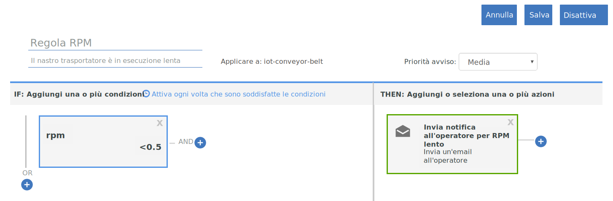

---

copyright:
  years: 2017, 2018
lastupdated: "2018-01-11"

---

{:shortdesc: .shortdesc}
{:new_window: target="_blank"}
{:codeblock: .codeblock}
{:pre: .pre}
{:screen: .screen}
{:tip: .tip}

# Guida 2: Utilizzo delle azioni e delle regole in tempo reale di base
Utilizza le istruzioni in questa guida per configurare una serie di azioni e di regole di base per alcune analisi in tempo reale dei tuoi dati IoT del nastro trasportatore.
{:shortdesc}

## Panoramica e obiettivi
{: #overview}  
Ora che hai correttamente configurato il tuo nastro trasportatore, lo hai collegato a {{site.data.keyword.iot_full}} e inviato alcuni dati, è ora di rendere tali dati utili utilizzando le regole e le azioni.



Come parte di questa guida eseguirai queste azioni:
- Crea una schema di messaggi per i tuoi dati evento del dispositivo nastro trasportatore.
- Crea e attiva una regola.
- Crea un'azione email.

## Prerequisiti
{: #prereqs}  
Devi disporre di un dispositivo collegato del tipo `iot-conveyor-belt` che invia gli eventi con il nome evento `sensorData` con un payload del messaggio che include le seguenti proprietà:
```
{
	"d": {
		"id": "belt1",
		"ts": 1494946276931,
		"ay": "0.00",
		"running": true,
		"rpm": "1.0"
		}
}
```
Per ulteriori informazioni sugli eventi del dispositivo e sul formato di messaggistica, consulta [Pubblicazione eventi](/docs/services/IoT/devices/mqtt.html#publishing_events).  
Se hai completato [Guida 1: Introduzione a {{site.data.keyword.iot_short_notm}} e al nastro trasportatore simulato](getting-started-iot-conveyor.html), sono già tutti configurati.  
{: tip}

## Passo 1 - Crea una schema di messaggi per l'applicazione di esempio
{: #create_schema}

Per utilizzare le proprietà inviate dal tuo dispositivo come trigger per le tue regole, devi prima associare queste proprietà a uno schema di messaggistica in {{site.data.keyword.Bluemix_notm}}. Per ulteriori informazioni, consulta [Crea schemi di tipo di dispositivi](/docs/services/IoT/im_schemas.html#iotrtinsights_task).
1. Nel dashboard {{site.data.keyword.iot_short_notm}}, vai a **Devices** e seleziona **Manage Schemas**.
2. Fai clic su **Add Schema**.
3. Seleziona il tipo di dispositivo **iot-conveyor-belt** e fai clic su **Next**.
4. Aggiungi le proprietà allo schema.
 1. Fai clic su **Add property**.
 2. Seleziona **From Connected**.
 3. Invia un punto di dati del nastro trasportatore modificando il valore rpm.
Nell'applicazione web nastro trasportatore, fai clic su **Stop** o **Start** per pubblicare un messaggio.  
L'elenco delle proprietà viene popolato con le proprietà inviate dal dispositivo.
 4. Seleziona tutte le proprietà e fai clic su **OK**.
5. Fai clic su **Finish** per creare lo schema.  

Lo schema è stato creato e il tipo di dati rpm è impostato come mobile.

## Passo 2 - Crea una regola semplice per la proprietà rpm
{: #create_rule}  
Il motore della regola {{site.data.keyword.Bluemix_notm}} confronta i punti dati della proprietà inviati dal tuo dispositivo ai valori di soglia statici configurati nella regola e attiva la regola quando vengono riscontrate le condizioni. Per ulteriori informazioni sulle regole, consulta [Cloud Analytics](/docs/services/IoT/cloud_analytics.html#rules).
Per creare una regola che viene attivata quando il valore rpm del nastro trasportatore è inferiore a 0,5:
1. Modifica il tipo di proprietà rpm con Float.  
Quando creiamo una regola, desideriamo confrontare il valore rpm numerico con una soglia. Per far ciò, la proprietà deve essere riconosciuta come un numero intero o mobile.
 1. Nel dashboard {{site.data.keyword.iot_short_notm}}, vai a **Devices** e seleziona **Manage Schemas**.
 1. Fai clic sul nuovo schema che hai appena creato e seleziona **Properties**.
 2. Fai clic sull'icona di modifica per modificare lo schema.
 3. Fai clic sull'icona di modifica accanto alla proprietà `rpm`.
 4. Modifica il tipo di dati con `Float`.  
 5. Fai clic su **OK**.
 6. Fai clic su **Finish** per aggiornare lo schema.  
2. Crea la regola.
 1. Nel dashboard, passa a **Rules**.
 2. Fai clic su **Create Cloud Rule**.
 3. Immetti `RPM rule` per il nome.
 4. Imposta la regola in modo che venga applicata allo schema **iot-conveyor-belt**.
 5. Fai clic su **Avanti**.
 6. Aggiungi una condizione della regola.
    6. Fai clic sul tile **New condition** per aggiungere una condizione alla regola.
    7. Seleziona la proprietà **rpm**.
    8. Seleziona l'operatore inferiore a (`<`).
    9. Immetti `0.5` per il valore e fai clic su **OK**.
    10. Fai clic su **Save** e su **Close**.
 11. Fai clic su **Close**.  
La nuova regola è elencata con lo stato "Deactivated".
12. Fai clic sullo stato per attivare la regola.
Lo stato è ora elencato come "Activated".

## Passo 3 - Attiva la regola
{: #trigger_rule}
Per ridurre il rpm, puoi simulare dei problemi con il nastro trasportatore che possono richiedere l'intervento di un operatore. Quando viene raggiunto il valore di soglia per rpm, viene visualizzato un avviso nel dashboard.
1. Nel dashboard {{site.data.keyword.iot_short_notm}}, seleziona **Boards**.
3. Seleziona la tabella **Rule-Centric Analytics**.
4. Nell'applicazione web nastro trasportatore, riduci il valore rpm al di sotto di 0,5 rpm.
Il dispositivo invia i dati a {{site.data.keyword.iot_short_notm}} quando vengono modificate le letture del sensore. Puoi simulare questo invio di dati, arrestando, avviando o modificando la velocità del nastro trasportatore.  
5. Verifica che venga visualizzato `RPM rule` nella scheda Rules with Alerts.
6. Seleziona il nuovo avviso nella scheda Rule Alerts e visualizza i punti dati che hanno attivato la regola nella scheda Rule Alert Info.  
Per visualizzare ulteriori informazioni sull'avviso, visualizza i dettagli del dispositivo nelle schede Associated Devices, Device Info e Device Properties.  
{: tip}

## Passo 4 - Crea un'azione da eseguire quando viene attivata la regola RPM.
{: #create_action}
In aggiunta alla visualizzazione di un avviso nel dashboard {{site.data.keyword.iot_short_notm}}, puoi creare le azioni da eseguire quando una regola viene attivata, ad esempio, l'invio di un'email all'operatore per controllare il nastro trasportatore se rpm è troppo basso. Per ulteriori informazioni, consulta [Cloud Analytics](/docs/services/IoT/cloud_analytics.html#shared).
Per creare un'azione email:
1. Nel dashboard {{site.data.keyword.iot_short}}, passa a **Rules**.
2. Fai clic su **RPM rule**.
3. Fai clic sul tile **New action**.
4. Crea un'azione.
 1. Fai clic su **Add action**.
 2. Immetti il nome dell'azione `Notify operator about low RPM`.
 3. Immetti la descrizione `Send an email to the operator.`.
 4. Seleziona il tipo **Send email**.
 5. Fai clic su **Avanti**.
 6. Nella riga dell'oggetto, immetti: `Low RPM alert.`
 7. Nel campo A, seleziona **Specific people** e immetti `operator@company.com`.  
Sostituisci l'indirizzo email con il tuo.
 8. Seleziona **Include Data** per includere i dati del dispositivo nell'email.
 9. Fai clic su **Finish** per salvare l'azione.  
5. Seleziona l'azione nell'elenco e fai clic su **OK** per configurarla.
6. Fai clic su **Save** per abilitare l'azione con la regola.
7. Verifica la nuova azione.
 4. Nell'applicazione web nastro trasportatore, riduci il valore rpm al di sotto di 0,5 rpm.
 5. Verifica di aver ricevuto l'email di avviso.  
Il corpo del messaggio potrebbe essere simile a qualcosa di simile:
> **Regola:** RPM rule  
> **Dispositivo:** 3m5wxr:iot-conveyor-belt:belt1  
> **Data:** 2017-05-09T18:21:21.567Z  
> **Condizione:**  
> iot_conveyor_belt.d.rpm<0.5  
> **Messaggio in entrata:**  
> {"d":{"id":"belt1","ts":1494354089837,"ay":"0.00","rpm":"0.4","running":true},"ruleContent":{"jobID":"sdIyBfdu","contextSchemas":[],"ruleDescription":"","severity":4,"messageSchemas":["iot_conveyor_belt"],"disabled":false,"ruleCondition":"iot_conveyor_belt.d.rpm<0.5","transforms":[],"name":"RPM rule","actions":["pziIRovt"],"id":"ncKK4N7k","updated":"9 May 2017 18:20:25 GMT","created":"9 May 2017 17:41:38 GMT","version":7}}  
> Questa è un'email generata automaticamente. Non rispondere. Per domande su questo avviso, contatta il tuo amministratore di sistema.

## Operazioni successive
{: #whats_next}  
Continua con la prossima guida o passa a un altro argomento di tuo interesse:
- [Guida 3: Monitoraggio dei tuoi dati del dispositivo](getting-started-iot-monitoring.html)  
Ora che hai collegato uno o più dispositivi a iniziato a fare buon uso dei dati del dispositivo, è ora di iniziare a monitorare una raccolta di dispositivi e i dati in tempo reale che stanno inviando.
- [Guida 4: Simulazione di un grande numero di dispositivi](getting-started-iot-large-scale-simulation.html)  
L'applicazione di esempio nastro trasportatore nel percorso A ti consente di simulare manualmente uno o alcuni dispositivi nastro trasportatore. Questa guida ti permette di configurare un ambiente simulato con un gran numero di dispositivi.
- [Collega altri dispositivi IoT a {{site.data.keyword.iot_short_notm}}](/docs/services/IoT/iotplatform_task.html)
- [Ulteriori informazioni su {{site.data.keyword.iot_short_notm}}](/docs/services/IoT/iotplatform_overview.html)
- [Ulteriori informazioni sulle API {{site.data.keyword.iot_short_notm}}](/docs/services/IoT/reference/api.html)
