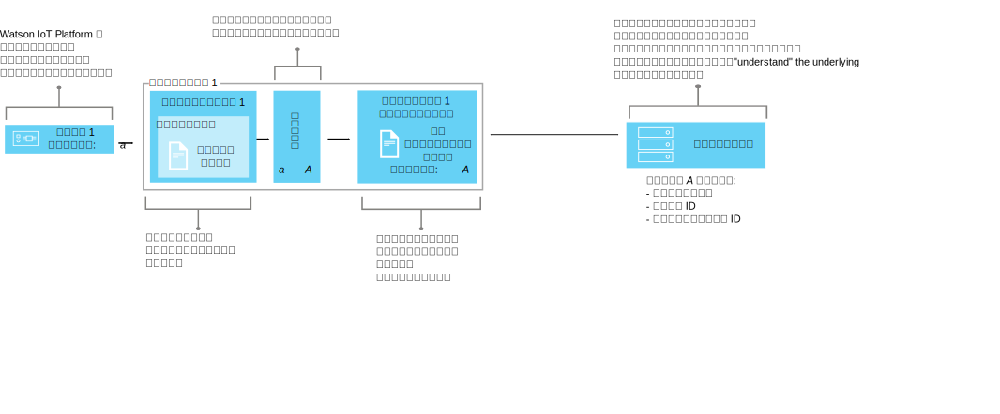

---

copyright:
  years: 2016, 2017
lastupdated: "2017-10-09"

---

{:new_window: target="\_blank"}
{:shortdesc: .shortdesc}
{:screen: .screen}
{:codeblock: .codeblock}
{:pre: .pre}


# データ管理の解説
{: #definitions_resources}
さまざまな形式でデータをパブリッシュする多種多様なデバイスがあり、それらのデバイスを {{site.data.keyword.iot_full}} に接続しようと考えているとします。データ管理フィーチャーを利用すると、各デバイスから出力されたデータの正規化と変換を実行して、単一の論理ビューにまとめることができます。このビューは、アプリケーションで容易にコンシュームすることができます。単一の論理ビューを使用するなら、各デバイスから出力される、さまざまなデータ形式を認識できるようにアプリケーションをコーディングしなくてもよくなります。
{: shortdesc}

## 概説

データ管理フィーチャーを使用すると、抽象化したデバイス (デバイス・ツイン) を共有して、再利用性や保守性を高めることができます。また、アプリケーションをデータ変更から切り離して、複雑な IoT エコシステムを管理できます。 

アプリケーションは、HTTP API の使用またはトピック・ストリングのサブスクライブによる要求時に、デバイスの現在の状態を取得できます。状態は、論理インターフェースで定義する一連の状態プロパティーで構成されます。{{site.data.keyword.iot_short_notm}} にパブリッシュされたイベントの結果としてデバイスの状態が変更されると、それらのプロパティーの値が更新されて、{{site.data.keyword.iot_short_notm}} に格納されます。

データ管理フィーチャーを使用すると、以下の利点があります。
- 状態プロパティーをイベント・メッセージ・データにマップする
- 必要なデータ構造を定義する
- デバイス状態の表現方法や表示方法を複数定義する
- デバイス状態をサブスクライブする。または時間を問わず HTTP API を使用してデバイス状態を照会する

データ管理フィーチャーを実装する、一般的なユース・ケースを以下にいくつか示します。
- アプリケーション開発者に、REST のような方法でイベント・ドリブンのデバイス・データにアクセスできる統一インターフェースを提供する
- さまざまなメーカーやモデルのデバイスからさまざまな形式でパブリッシュされるデータを正規化する
- アプリケーション・モデルに合わせてデータ形式を変更したり変換したりする

## 例: 種類の異なる複数の温度センサーを 1 つの論理インターフェースにマップする
{: #device-type-example}
データ管理フィーチャーの使用を開始するには、以下のセクションで説明されているように、いくつかのリソースを定義する必要があります。 

以下の例では、デバイス・イベント・メッセージのペイロード形式がどのようなものであっても、それらのリソースが組み合わされて、各アプリケーションが同種の温度状態データに 1 つの形式でアクセスできるようになる仕組みを示します。TemperatureSensor1 は、`{ "t" : 34.5 }` という摂氏温度の読み取り値を {{site.data.keyword.iot_short_notm}} にパブリッシュします。TemperatureSensor2 は、`{ "temp" : 72.55 }` という華氏温度の読み取り値をパブリッシュします。それぞれの温度センサーは、独自の[デバイス・タイプ](../reference/device_model.html#id_and_device_types)に関連付けられます。これらの温度の読み取り値は、別々のイベントとしてパブリッシュされます。

{{site.data.keyword.iot_short_notm}} のデータ管理フィーチャーを使用すると、デバイス・データの正規化と変換を実行することによってこのソリューションを構成することができます。 


データ・フローの一環として、着信データに対する計算を実行し、読み取り値を統一形式に正規化して、処理できるようにします。つまり、温度の目盛りの違いを認識したり変換したりするアプリケーションを作成する必要はありません。アプリケーションは、正規化された 1 つの状態を受け取り、デバイス固有の **t** プロパティーと **temp** プロパティーの代わりに **temperature** という状態プロパティーを使用します。

 このソリューションを構成するには、以下の情報を定義する必要があります。

-	各デバイス・タイプからのインバウンド温度イベント「t」と「temp」の構造。  
-	記録するプロパティー「temperature」。「temperature」プロパティーは、アプリケーションでコンシューム可能なデバイス状態の論理構造を定義します。
-	インバウンド・イベントのプロパティー「t」と「temp」をプロパティー「temperature」にマップする方法。

必要な情報を定義するには、{{site.data.keyword.iot_short_notm}} 内に存在する以下のリソースを構成します。

-	物理インターフェース、イベント・タイプ、イベント・スキーマ・リソース。これらは、インバウンド・イベント「t」と「temp」の構造を定義します。
-	論理インターフェースと論理スキーマ・リソース。これらは、生成するデバイス状態「temperature」の論理構造を定義します。
-	マッピング・リソース。これは、プロパティー「t」と「temp」をプロパティー「temperature」にマップする方法を定義します。

この例について詳細に説明したエンドツーエンドのシナリオについては、[ステップバイステップ・ガイド: 共通インターフェースによってデバイスを処理する方法を詳細に示す例](ga_im_index_scenario.html)を参照してください。

これらのリソースについて詳しくは、『リソースの定義』セクションで説明します。


## リソースの定義
{: #definitions_resources}

以下の図では、データ管理フィーチャーを使用する場合に、{{site.data.keyword.iot_short_notm}} でデバイスとアプリケーションを対応付ける論理マッピングを示します。



### 概念
{: #concepts}
以下の表では、上記の図で言及されているイベント、プロパティー、状態の概念について説明します。

概念| 説明

------------- | ------------- | -------------  
イベント| イベントとは、デバイスが {{site.data.keyword.iot_short_notm}} にデータをパブリッシュするためのメカニズムのことです。デバイスはイベントの内容を制御し、送信するイベントごとに名前を割り当てます。
プロパティー| デバイス・イベント・ペイロードのデータが含まれる部分。

状態| 物理デバイスの最新の状態を表現したものです。これには、複数のインバウンド・イベントからマップされたすべてのプロパティーを含めることができます。

### データ管理リソース
{: #resources}

REST API を使用してリソースを管理することができます。REST API の詳細については、[{{site.data.keyword.iot_short_notm}} HTTP REST API](https://docs.internetofthings.ibmcloud.com/apis/swagger/v0002/state-mgmt.html) の資料を参照してください。


タイプ・リソース| 説明

------------- | ------------- | -------------  
イベント・タイプ| イベント・タイプ・リソースを使用すると、デバイスによってパブリッシュされるイベントをモデル化できます。イベント・タイプは、イベント・スキーマ・リソースを参照する必要があります。スキーマ・リソースは、パブリッシュされるイベントの構造を定義したものです。</br>**重要:** 論理インターフェースで使用されるインバウンド・イベントは、JSON 形式でなければなりません。
デバイス・タイプ|  デバイス・タイプ・リソースを使用して、特性または動作が共通するデバイスをグループ化できます。データ管理では、デバイス・タイプを拡張して、あるデバイスに対する 1 つの物理インターフェースと、デバイス状態を取得するために使用する 1 つ以上の論理インターフェースを組み込むことができます。</br>詳細については、[デバイス・モデル](../reference/device_model.html#id_and_device_types)のトピックの「ID とデバイス・タイプ」の項を参照してください。
スキーマのリソース|  スキーマ・リソースを使用して、イベントまたはデバイス状態の構造を定義できます。次の [JSON スキーマ ](http://json-schema.org/){:new_window} が使用されます。
<ul><li>イベント・タイプに関連付けられたスキーマ。このスキーマを使用すると、デバイスによって {{site.data.keyword.iot_short_notm}} にパブリッシュされるイベントの構造を定義できます。こうしたスキーマは、イベント・スキーマと呼ばれます。<li>論理インターフェースに関連付けられたスキーマ。このスキーマを使用すると、{{site.data.keyword.iot_short_notm}} で格納されるデバイス状態の構造を定義できます。こうしたスキーマは、論理インターフェース・スキーマと呼ばれます。</ul>.  

インターフェース・リソース| 説明

------------- | ------------- | -------------  
論理インターフェース | アプリケーションがデバイスの状態を参照するために接続またはサブスクライブできる、プログラマチックな構成体。論理インターフェースを使用すると、{{site.data.keyword.iot_short_notm}} におけるデバイス状態に関する正規化されたビューを定義できます。論理インターフェースは、論理インターフェース・スキーマに関連付ける必要があります。この状態は、インバウンド・デバイス・イベントに応じて更新されます。
物理インターフェース| 物理インターフェースを使用して、物理デバイスと {{site.data.keyword.iot_short_notm}} の間のインターフェースをモデル化できます。イベント・タイプを物理インターフェースに関連付けることができます。

インスタンス・リソース| 説明

------------- | ------------- | -------------  
デバイス| デバイスは、{{site.data.keyword.iot_short_notm}} に登録されているアセット、システム、またはコンポーネントを表しており、IoT データをイベントの形式で送信します。

サポート・リソース| 説明

------------- | ------------- | -------------  
マッピング| インバウンド・イベントに関連付けられたプロパティーを論理インターフェースで定義されたプロパティーに対応付ける方法を、マッピングを使用して定義します。</br>**重要:** マッピングを定義する前に、デバイス・タイプに少なくとも 1 つの論理インターフェースを関連付ける必要があります。


## リソースの命名上の制約
{: #naming_restrictions}
スキーマ、イベント・タイプ、論理インターフェース、物理インターフェースの命名上の制約を以下に示します。
- 名前は 1 から 128 文字でなければなりません 
- 名前は Unicode 文字でなければなりません 
- 有効な特殊文字はスペース、ハイフン ( - )、下線 ( _ )、ピリオド ( . ) です
- 名前はスペースだけにすることはできません

## リソースの作成、更新、アクティブ化、非アクティブ化
{: #draft_active_resources}

リソースには、ドラフト・バージョンとアクティブ・バージョンという 2 つのバージョンがあります。リソースを作成すると、そのリソースはドラフト・バージョンとして作成されます。
{: shortdesc}

ドラフト・バージョンは、API を使用して照会、更新、削除を直接実行できる、リソースの作業用コピーです。ドラフト・リソースのアクティブ・バージョンを作成するには、ドラフト・デバイス・タイプまたはドラフト論理インターフェースをアクティブ化します。アクティブ化できるのは、ドラフト・デバイス・タイプまたはドラフト論理インターフェースのリソースのみです。他のリソース (スキーマなど) をアクティブ化するには、アクティブ化する対象のリソースを参照している、ドラフト・デバイス・タイプまたはドラフト論理インターフェースをアクティブ化する必要があります。

REST API を使用するときにドラフト・リソースとアクティブ・リソースを区別するには、接頭部 *draft/* を使用してドラフト状態のリソースを識別します。

以下の例では、指定された ID を使用してドラフト・スキーマ定義のメタデータを取得します。

```
GET /api/v0002/draft/schemas/{schemaId}
```
以下の例では、指定された ID を使用してアクティブ・スキーマ定義のメタデータを取得します。
```
GET /api/v0002/schemas/{schemaId}
```
*注:* いずれのリソースのドラフト・バージョンとアクティブ・バージョンにおいても、ID は同じです。


- リソースのアクティブ化
{: #activate_resources}  

**activate-configuration** 操作を使用すると、特定のデバイス・タイプに関連付けられた構成を検証してアクティブ化できます。この構成には、ドラフト・スキーマ、イベント・タイプ、物理インターフェース、論理インターフェース、マッピングが含まれています。**activate-configuration** 操作は、論理インターフェースまたはデバイス・タイプのドラフト・バージョンに対して実行する必要があります。

以下の例では、デバイス・タイプのドラフト・バージョンに対して **activate-configuration** 操作を実行する PATCH 要求を示します。
```
PATCH /api/v0002/draft/device/types/TemperatureSensor
```
PATCH 本文のペイロードの内容は以下のとおりです。
```
  {
    "operation" : "activate-configuration"
          }
```
- 相違点のリスト表示
{: #list_differences}  

**list-differences** 操作を使用すると、論理インターフェースまたはデバイス・タイプのリソースのアクティブ構成とドラフト構成の相違点を示すリストが返されます。**list-differences** 操作は、論理インターフェースまたはデバイス・タイプのドラフト・バージョンに対して実行する必要があります。以下の例では、デバイス・タイプのドラフト・バージョンに対して **list-differences** 操作を実行する PATCH 要求を示します。
```
PATCH /api/v0002/draft/device/types/TemperatureSensor
```
PATCH 本文のペイロードの内容は以下のとおりです。
```
  {
    "operation": "list-differences"
  }
```


- リソースの非アクティブ化  
{: #deactivate_resources}  

**deactivate-configuration** 操作を使用すると、特定のリソースに関連付けられたアクティブ構成を削除できます。deactivate-configuration 操作は、論理インターフェースとデバイス・タイプのアクティブ・バージョンに対してのみ実行できます。以下の例では、デバイス・タイプのアクティブ・バージョンに対して **deactivate-configuration** 操作を実行する PATCH 要求を示します。
```
PATCH /api/v0002/device/types/TemperatureSensor
```
PATCH 本文のペイロードの内容は以下のとおりです。
```
  {
    "operation": "deactivate-configuration"
  }
```
*注:*
- アクティブ・リソースは読み取り専用です。照会パラメーターを使用して、ドラフト・リソースとアクティブ・リソースのフィルタリングとソートを実行できます。
- あるデバイス・タイプにデバイス・インスタンスが関連付けられている場合は、そのデバイス・タイプを削除できません。デバイス・インスタンスが削除されると、デバイスの状態はクリアされます。 
- API を使用して直接アクティブ化できるのは、論理インターフェースとデバイス・タイプのみです。スキーマ、物理インターフェース、イベント・タイプなどといった他のリソースについては、アクティブになっている論理インターフェースまたはデバイス・タイプによって参照されると、アクティブ化されます。  
- **activate-configuration** 操作は、特定のデバイス・タイプに関連付けられている論理インターフェースのドラフト・バージョンに対してか、またはそのデバイス・タイプ自体に対して実行する必要があります。**activate-configuration** 操作は、リソース構成が有効であることを検査してから、リソースをアクティブ化します。アクティブ化が正常に完了すると、そのデバイス・タイプのデバイス・インスタンスごとに状態が生成されます。

## 構成のトラブルシューティング
{: #troubleshooting}
アクティブ化に失敗した場合は、対象のデバイス・タイプに必要な構成がすべて設定されていることを確認します。以下の構成を設定し、特定のデバイス・タイプに関連付ける必要があります。
  - 少なくとも 1 つのイベントに関連付けられた物理インターフェース
  - 少なくとも 1 つの論理インターフェース
  - 関連付けられた論理インターフェース 1 つ以上に対するマッピング

デバイス・タイプまたは論理インターフェースのリソースのドラフト・バージョンに対して **validate-configuration** 操作を実行することで、関連付けられたメタデータが有効であることを確認することもできます。メタデータが無効な場合、応答の本文で問題のリストが返されます。  

以下の例では、「TemperatureSensor」というデバイス・タイプのドラフト・バージョンに対して **validate-configuration** 操作を実行する PATCH 要求を示します。  
```
PATCH /api/v0002/draft/device/types/TemperatureSensor
```
PATCH 本文のペイロードの内容は以下のとおりです。
```
  {
    "operation": "validate-configuration"
  }
```  
以下の例では、PATCH 要求に対する失敗の応答を示します。  
```
{
"message": "CUDIM0303I: State update configuration for Device Type 'TemperatureSensor' is not valid.",
"details": {
  "id": "CUDIM0303I",
  "properties": [
    "Device Type",
    "TemperatureSensor"
  ]
},
"failures": [
  {
    "message": "CUDVS0301E: The device type 'TemperatureSensor' does not have any mappings defined for it",
    "details": {
      "id": "CUDVS0301E",
      "properties": [
        "TemperatureSensor"
      ]
    }
  }
]
}
```  
以下の例では、PATCH 要求に対する成功の応答を示します。  
```  
{
"message": "CUDIM0303I: State update configuration for Device Type 'TemperatureSensor' is valid.",
"details": {
  "id": "CUDIM0303I",
  "properties": [
    "Device Type",
    "TemperatureSensor"
  ]
},
"failures": []
}
```  
必要なすべてのリソースを特定のデバイス・タイプに関連付けたら、プロパティー・マッピングが有効であることを確認します。以下の例で、発生する可能性があるエラーを示します。

  - イベント・スキーマで定義されていないイベントのプロパティーを式で参照している
  - 論理インターフェース・スキーマで定義されていない状態のプロパティーを式で参照している
  - 論理インターフェース・スキーマで定義されていないプロパティーのマッピングを定義している


以下のエラー・ログを参照すると、ランタイム・エラーの診断に役立ちます。
```
iot-2/type/${typeId}/id/${devieId}/err/data
```
### リソースの制限

以下の表に、プラン・タイプに基づいて構成可能なリソースの最大数を示します。 

リソース                   |標準プラン                  | ライト・プラン
------------- | ------------- | ------------- 
論理インターフェース | 1000 | 10
物理インターフェース           | 1000 | 5
イベント・タイプ | 1000 | 10
スキーマ|2000 | 20
論理インターフェース参照 (1 つのデバイス・タイプからマップできる論理インターフェースの数)  |20| 5
イベント・タイプ参照 (物理インターフェースで保持できる、イベント ID とイベント・タイプの関連付けの数)| 40 | 10
