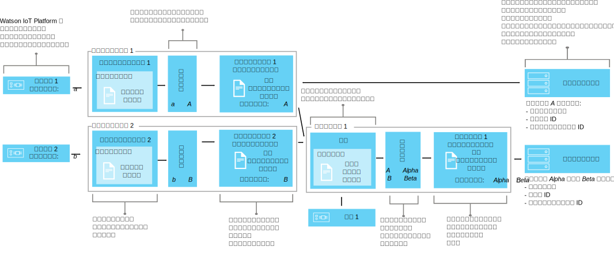

---

copyright:
years: 2016, 2018
lastupdated: "2018-03-22"

---

{:new_window: target="\_blank"}
{:shortdesc: .shortdesc}
{:screen: .screen}
{:codeblock: .codeblock}
{:pre: .pre}

# データ管理の解説
{: #definitions_resources}
さまざまな形式でデータをパブリッシュする多種多様なデバイスまたはモノがあり、それらのデバイスまたはモノを {{site.data.keyword.iot_full}} に接続しようと考えているとします。 データ管理コンポーネントのデバイス・ツイン機能およびアセット・ツイン機能を使用すると、デバイスおよびモノから出力されたデータを正規化して、単一の論理ビューに変換できます。このビューは、アプリケーションで容易にコンシュームできます。単一の論理ビューを使用することで、各デバイスまたはモノから出力される、さまざまなデータ形式を認識できるようにアプリケーションを構成する必要がなくなります。その後、複数のデバイスまたはモノを集約して、{{site.data.keyword.iot_short_notm}} で新しいモノを定義できます。モノを使用すると、一定範囲の入力から {{site.data.keyword.iot_short_notm}} に着信するデータを編成および分析するのに役立ちます。 

{: shortdesc}

## 概説
{: #overview}

デバイス・ツイン機能を使用してデバイスの論理モデルを作成してから、アセット・ツイン機能を使用してこれらの論理モデルを集約し、新しいモノを定義します。これらの論理モデルは、コードの再利用性や保守性を向上させ、アプリケーションをデータ変更から切り離して複雑な IoT エコシステムを管理するのに役立ちます。 

アプリケーションは、HTTP API の使用または IoT トピック・ストリングのサブスクライブによる要求時に、デバイスまたはモノの現在の状態を取得できます。 状態は、論理インターフェースで定義する一連の状態プロパティーで構成されます。 {{site.data.keyword.iot_short_notm}} にパブリッシュされたイベントの結果としてデバイスまたはモノの状態が変更されると、それらのプロパティーの値が更新されて、{{site.data.keyword.iot_short_notm}} に格納されます。

デバイス・ツイン機能およびアセット・ツイン機能を使用すると、以下の利点があります。
- 状態プロパティーをイベント・メッセージ・データにマップする。
- 複数のデバイスまたはモノを集約して、新しいモノを定義する。
- 必要なデータ構造を定義する。
- デバイスまたはモノの状態の表現方法や表示方法を複数定義する。
- デバイスまたはモノの状態をサブスクライブする。または時間を問わず HTTP API を使用してデバイス状態を照会する。

デバイス・ツイン機能およびアセット・ツイン機能を実装する、一般的なユース・ケースを以下にいくつか示します。
- アプリケーション開発者に、REST のような方法でイベント・ドリブンのデバイス・データにアクセスできる統一インターフェースを提供する。
- さまざまなメーカーやモデルのデバイスからさまざまな形式でパブリッシュされるデータを正規化する。
- アプリケーション・モデルに合わせてデータ形式を変更したり変換したりする。
- 障害の予測、保守のスケジュール、アセットの追跡、および操作効率の向上に役立つように、一定範囲のデバイスまたはモノからのビッグデータを最も効率的な方法で分析および表示できるようフォーマット設定する。

## 例
{: #examples}
以下の例で、想定される 2 つのソリューションについて説明します。 例 1 はデバイス・ツイン機能の使用方法を示し、例 2 はアセット・ツイン機能の使用方法を示しています。 

### 例 1: 種類の異なる複数の温度センサーを 1 つの論理インターフェースにマップする
{: #device-type-example}
この例では、実際のデバイス・イベント・メッセージのペイロード形式にかかわらず、1 つの形式で同種の温度状態データを提供する論理インターフェースを作成します。 *tSensor* デバイスは、`{ "t" : 34.5 }` という摂氏温度の読み取り値を {{site.data.keyword.iot_short_notm}} にパブリッシュします。 *tempSensor* デバイスは、`{ "temp" : 72.55 }` という華氏温度の読み取り値をパブリッシュします。 これらの温度の読み取り値は、別々のイベントとしてパブリッシュされます。

この例について詳細に説明したエンドツーエンドのシナリオについては、[ステップバイステップ・ガイド 1](ga_im_index_scenario.html) を参照してください。


論理インターフェースのデータ・フローの一部として、着信データに対する計算を実行し、読み取り値を統一形式に正規化して、処理できるようにします。 つまり、温度の目盛りの違いを認識したり変換したりするアプリケーションを作成する必要はありません。 アプリケーションは、正規化された 1 つの状態を受け取り、デバイス固有の **t** プロパティーと **temp** プロパティーの代わりに **temperature** という状態プロパティーを使用します。

### 例 2: 複数の環境デバイスを 1 つのモノ・タイプの論理インターフェースにマップする
{: #thing-type-example}  
この例では、上記のデバイス・タイプの例をさらに広げて、別の湿度計デバイスという形式で一連の湿度センサーを追加します。 モノ・タイプの論理インターフェースを使用して、さまざまなデバイス・タイプからのデータを、1 つの部屋のすべてのデバイスとセンサーを表わす 1 つの論理インターフェースにシームレスにマージすることができます。 アプリケーションは、「RoomType」モノ・タイプに関連付けられる論理インターフェースに接続し、収集された部屋の環境データを取得できるようになります。以下の図は、会議室 1 の構成を示しています。

この例について詳細に説明したエンドツーエンドのシナリオについては、[ステップバイステップ・ガイド 2](../information_management/im_index_scenario_thing.html) を参照してください。


*tSensor* と呼ばれる温度デバイスと *humiditySensor1* と呼ばれる湿度デバイスが、*Meeting Room 1* という部屋で収集された環境データをパブリッシュします。温度と湿度のセンサー・データは、2 つのデバイス・タイプの論理インターフェースに別々にマップされます。1 つは温度計デバイス・タイプで、もう 1 つは湿度計デバイス・タイプです。これで、*RoomType* と呼ばれるモノ・タイプを作成し、*Meeting Room 1* と呼ばれる部屋のモノ・インスタンスをインスタンス化できます。

2 番目の会議室では、*tempSensor* と呼ばれる温度デバイスと *humiditySensor2* と呼ばれる湿度デバイスが、*Meeting Room 2* という部屋で収集された環境データをパブリッシュします。*RoomType* モノ・タイプに基づいて、*Meeting Room 2* と呼ばれる別の部屋のモノ・インスタンスが作成されます。

これで、温度計と湿度計の論理インターフェースを含む構成をセットアップしてから、適切な環境センサーを各部屋のインスタンスにマップできます。例えば、*tSensor* および *humiditySensor1* を *Meeting Room 1* にマップし、*tempSensor* と *humiditySensor2* を *Meeting Room 2* にマップします。

これで、基礎的なデバイス・インフラストラクチャーを知らなくても、エンド・ユーザー・アプリケーションは特定の部屋というモノの ID の状態を要求して、その部屋の温度と湿度の状態を取得できます。

## 定義とリソース
{: #resources}

論理インターフェースを使用する場合にデバイスと {{site.data.keyword.iot_short_notm}} 上のアプリケーションを対応付ける論理マッピングについて、以下の図で説明します。



### 概念

概念                        | 説明       
------------- | ------------- | -------------  
イベント | イベントとは、デバイスが {{site.data.keyword.iot_short_notm}} にデータをパブリッシュするためのメカニズムのことです。 デバイスはイベントの内容を制御し、送信するイベントごとに名前を割り当てます。
プロパティー | デバイス・イベント・ペイロードのデータが含まれる部分。
状態 | 物理デバイスの最新の状態を表現したものです。これには、複数のインバウンド・イベントからマップされたすべてのプロパティーを含めることができます。
構成                         | モノ・タイプと関連付ける論理インターフェースを定義する論理構成。 この構成は、モノ・タイプのスキーマで指定します。   

### データ管理リソース
REST API を使用してリソースを管理することができます。 REST API の詳細については、[{{site.data.keyword.iot_short_notm}} HTTP REST API](https://docs.internetofthings.ibmcloud.com/apis/swagger/v0002/state-mgmt.html) の資料を参照してください。 

タイプ・リソース                        | 説明       
------------- | ------------- | -------------  
イベント・タイプ                         | イベント・タイプ・リソースを使用すると、デバイスによってパブリッシュされるイベントをモデル化できます。 イベント・タイプは、イベント・スキーマ・リソースを参照する必要があります。 スキーマ・リソースは、パブリッシュされるイベントの構造を定義したものです。 </br>**重要:** 論理インターフェースで使用されるインバウンド・イベントは、JSON 形式でなければなりません。    
デバイス・タイプ                         |  デバイス・タイプ・リソースを使用して、特性または動作が共通するデバイスをグループ化できます。 データ管理では、デバイス・タイプを拡張して、あるデバイスに対する 1 つの物理インターフェースと、デバイス状態を取得するために使用する 1 つ以上の論理インターフェースを組み込むことができます。 </br>詳細については、[デバイス・モデル](../reference/device_model.html#id_and_device_types)のトピックの「ID とデバイス・タイプ」の項を参照してください。
モノのタイプ                         | 1 つ以上の異なるデバイス・タイプ、モノ・タイプ、またはその両方の集合を表わすプログラムの構成要素。 </br>**重要:** ベータ版では、モノ・タイプの論理インターフェースについて 10 レベルのネストがサポートされます。
スキーマのリソース                         |  スキーマ・リソースを使用して、イベント、デバイスまたはモノの状態の構造を定義できます。 次の [JSON スキーマ ](http://json-schema.org/){:new_window} が使用されます。 <ul><li>イベント・タイプに関連付けられたスキーマ。 このスキーマを使用すると、デバイスによって {{site.data.keyword.iot_short_notm}} にパブリッシュされるイベントの構造を定義できます。 こうしたスキーマは、イベント・スキーマと呼ばれます。 <li>論理インターフェースに関連付けられたスキーマ。 このスキーマを使用すると、{{site.data.keyword.iot_short_notm}} で格納されるデバイスまたはモノの状態の構造を定義できます。 こうしたスキーマは、論理インターフェース・スキーマと呼ばれます。</ul>.</ul>

インターフェース・リソース                        | 説明       
------------- | ------------- | -------------  
論理インターフェース | アプリケーションがデバイスの状態を参照するために接続またはサブスクライブできる、プログラマチックな構成体。 論理インターフェースを使用すると、{{site.data.keyword.iot_short_notm}} におけるデバイス状態に関する正規化されたビューを定義できます。 論理インターフェースは、論理インターフェース・スキーマに関連付ける必要があります。 この状態は、インバウンド・デバイス・イベントに応じて更新されます。 **注:** オプションで、論理インターフェースに対して意味のある別名を指定することができます。別名は、自動生成される論理インターフェース ID を使用する代わりに、デバイスの状態を取得するために使用する API 呼び出しやトピック・ストリング・サブスクリプション内で参照できます。
物理インターフェース                         | 物理インターフェースを使用して、物理デバイスと {{site.data.keyword.iot_short_notm}} の間のインターフェースをモデル化できます。 イベント・タイプを物理インターフェースに関連付けることができます。  

インスタンス・リソース                        | 説明       
------------- | ------------- | -------------  
デバイス                         | デバイスは、{{site.data.keyword.iot_short_notm}} に登録されているアセット、システム、またはコンポーネントを表しており、IoT データをイベントの形式で送信します。  
モノ                         | モノ・タイプの固有のインスタンスを論理的に表わすプログラムの構成要素。 モノのインスタンスは、デバイス・タイプの登録済みデバイスと同じ役割を果たします。


サポート・リソース                        | 説明       
------------- | -------------   
マッピング       |インバウンド・イベントに関連付けられたプロパティーを論理インターフェースで定義されたプロパティーに対応付ける方法を、マッピングを使用して定義します。 </br>**重要:** マッピングを定義する前に、デバイス・タイプまたはモノ・タイプに少なくとも 1 つの論理インターフェースを関連付ける必要があります。

## リソースの命名上の制約
{: #naming_restrictions}
スキーマ、イベント・タイプ、論理インターフェース、物理インターフェースの命名上の制約を以下に示します。
- 名前は 1 から 128 文字でなければなりません 
- 名前は Unicode 文字でなければなりません 
- 有効な特殊文字はスペース、ハイフン ( - )、下線 ( _ )、ピリオド ( . ) です
- 名前はスペースだけにすることはできません

## リソースの作成、更新、アクティブ化、非アクティブ化
{: #draft_active_resources}

リソースには、ドラフト・バージョンとアクティブ・バージョンという 2 つのバージョンがあります。 リソースを作成すると、そのリソースはドラフト・バージョンとして作成されます。 
{: shortdesc}

ドラフト・バージョンは、API を使用して照会、更新、削除を直接実行できる、リソースの作業用コピーです。 ドラフト・リソースのアクティブ・バージョンを作成するには、ドラフト・デバイス・タイプ、ドラフト・モノ・タイプ、またはドラフト論理インターフェースをアクティブ化します。他のリソース (スキーマなど) をアクティブ化するには、アクティブ化する対象のリソースを参照しているドラフト・デバイス・タイプ、ドラフト・モノ・タイプ、またはドラフト論理インターフェースをアクティブ化する必要があります。

REST API を使用するときにドラフト・リソースとアクティブ・リソースを区別するには、接頭部 *draft/* を使用してドラフト状態のリソースを識別します。

以下の例では、指定された ID を使用してドラフト・スキーマ定義のメタデータを取得します。

```
GET /api/v0002/draft/schemas/{schemaId}
```
以下の例では、指定された ID を使用してアクティブ・スキーマ定義のメタデータを取得します。
```
GET /api/v0002/schemas/{schemaId}
```
*注:* いずれのリソースのドラフト・バージョンとアクティブ・バージョンにおいても、ID は同じです。


- リソースのアクティブ化
{: #activate_resources}  

**activate-configuration** 操作を使用すると、特定のデバイス・タイプまたはモノ・タイプに関連付けられた構成を検証してアクティブ化できます。 この構成には、ドラフト・スキーマ、イベント・タイプ、物理インターフェース、論理インターフェース、マッピングが含まれています。 **activate-configuration** 操作は、論理インターフェース、デバイス・タイプまたはモノ・タイプのドラフト・バージョンに対して実行する必要があります。

以下の例では、デバイス・タイプのドラフト・バージョンに対して **activate-configuration** 操作を実行する PATCH 要求を示します。
```
PATCH /api/v0002/draft/device/types/TSensor
```
PATCH 本文のペイロードの内容は以下のとおりです。
```
  {
    "operation" : "activate-configuration"
  }   
```
ドラフト・バージョンのモノ・タイプをアクティブ化するには、以下の PATCH メソッドを使用します。
```
PATCH /api/v0002/draft/thing/types/RoomType
```

- 相違点のリスト表示
{: #list_differences}  

**list-differences** 操作を使用すると、論理インターフェース、デバイス・タイプ、またはモノ・タイプのリソースのアクティブ構成とドラフト構成の相違点を示すリストが返されます。**list-differences** 操作は、論理インターフェース、デバイス・タイプまたはモノ・タイプのドラフト・バージョンに対して実行する必要があります。 以下の例では、デバイス・タイプのドラフト・バージョンに対して **list-differences** 操作を実行する PATCH 要求を示します。
```
PATCH /api/v0002/draft/device/types/TSensor
```
PATCH 本文のペイロードの内容は以下のとおりです。
```
  {
    "operation": "list-differences"
  }
```
モノ・タイプのリソースのアクティブ構成とドラフト構成の相違点を示すリストを返すには、以下の PATCH メソッドを使用します。
```
PATCH /api/v0002/draft/thing/types/meetingroom1
```

- リソースの非アクティブ化  
{: #deactivate_resources}  

**deactivate-configuration** 操作を使用すると、特定のリソースに関連付けられたアクティブ構成を削除できます。 deactivate-configuration 操作は、論理インターフェース、デバイス・タイプまたはモノ・タイプのアクティブ・バージョンに対してのみ実行できます。 以下の例では、デバイス・タイプのアクティブ・バージョンに対して **deactivate-configuration** 操作を実行する PATCH 要求を示します。
```
PATCH /api/v0002/device/types/TSensor
```
PATCH 本文のペイロードの内容は以下のとおりです。
```
  {
    "operation": "deactivate-configuration"
  }
```
モノ・タイプを非アクティブ化するには、以下の PATCH メソッドを使用します。
```
PATCH /api/v0002/thing/types/RoomType
```

*注:*
- アクティブ・リソースは読み取り専用です。 照会パラメーターを使用して、ドラフト・リソースとアクティブ・リソースのフィルタリングとソートを実行できます。
- あるデバイス・タイプにデバイス・インスタンスが関連付けられている場合は、そのデバイス・タイプを削除できません。 デバイス・インスタンスが削除されると、デバイスの状態はクリアされます。 
- あるモノ・タイプにデバイス・インスタンスまたはモノ・インスタンスが関連付けられている場合は、そのモノ・タイプを削除できません。 デバイス・インスタンスまたはモノ・インスタンスが削除されると、モノの状態はクリアされます。 
- API を使用して直接アクティブ化できるのは、論理インターフェース、デバイス・タイプおよびモノ・タイプのみです。 スキーマ、物理インターフェース、モノ・タイプ・インターフェース、イベント・タイプなどといった他のリソースについては、アクティブになっている論理インターフェース、デバイス・タイプ、またはモノ・タイプによって参照されると、アクティブ化されます。  
- **activate-configuration** 操作は、特定のデバイス・タイプまたはモノ・タイプに関連付けられている論理インターフェースのドラフト・バージョンに対してか、またはそのデバイス・タイプまたはモノ・タイプ自体に対して実行する必要があります。 **activate-configuration** 操作は、リソース構成が有効であることを検査してから、リソースをアクティブ化します。 アクティブ化が正常に完了すると、そのデバイス・タイプまたはモノ・タイプのデバイス・インスタンスまたはモノ・インスタンスごとに状態が生成されます。

## 構成のトラブルシューティング
{: #troubleshooting}
アクティブ化に失敗した場合は、対象のデバイス・タイプまたはモノ・タイプに必要な構成がすべて設定されていることを確認します。 

以下の構成を設定し、特定のデバイス・タイプに関連付ける必要があります。
  - 少なくとも 1 つのイベントに関連付けられた物理インターフェース
  - 少なくとも 1 つの論理インターフェース
  - 関連付けられた論理インターフェース 1 つ以上に対するマッピング
  
以下の構成を設定し、特定のモノ・タイプに関連付ける必要があります。
  - 少なくとも 1 つのデバイス・タイプまたはモノ・タイプに関連付けられたモノ・インターフェース
  - 少なくとも 1 つの論理インターフェース
  - 関連付けられた論理インターフェース 1 つ以上に対するマッピング  

デバイス・タイプ、モノ・タイプまたは論理インターフェースのリソースのドラフト・バージョンに対して **validate-configuration** 操作を実行することで、関連付けられたメタデータが有効であることを確認することもできます。 メタデータが無効な場合、応答の本文で問題のリストが返されます。  

以下の例では、「TSensor」というデバイス・タイプのドラフト・バージョンに対して **validate-configuration** 操作を実行する PATCH 要求を示します。  
```
PATCH /api/v0002/draft/device/types/TSensor
```
PATCH 本文のペイロードの内容は以下のとおりです。
```
  {
    "operation": "validate-configuration"
  }
```  
以下の例では、PATCH 要求に対する失敗の応答を示します。  
```
{
"message": "CUDIM0303I: State update configuration for Device Type 'TSensor' is not valid.",
"details": {
  "id": "CUDIM0303I",
  "properties": [
    "Device Type",
    "Sensor"
  ]
},
"failures": [
  {
    "message": "CUDVS0301E: The device type 'TSensor' does not have any mappings defined for it",
    "details": {
      "id": "CUDVS0301E",
      "properties": [
        "TSensor"
      ]
    }
  }
]
}
```  
以下の例では、PATCH 要求に対する成功の応答を示します。  
```  
{
"message": "CUDIM0303I: State update configuration for Device Type 'TSensor' is valid.",
"details": {
  "id": "CUDIM0303I",
  "properties": [
    "Device Type",
    "TSensor"
  ]
},
"failures": []
}
```  
必要なすべてのリソースを特定のデバイス・タイプまたはモノ・タイプに関連付けたら、プロパティー・マッピングが有効であることを確認します。 以下の例で、発生する可能性があるエラーを示します。

  - イベント・スキーマで定義されていないイベントのプロパティーを式で参照している
  - 論理インターフェース・スキーマで定義されていない状態のプロパティーを式で参照している
  - 論理インターフェース・スキーマで定義されていないプロパティーのマッピングを定義している


以下のエラー・ログを参照すると、デバイス・タイプのランタイム・エラーを診断するのに役立ちます。
```
iot-2/type/${typeId}/id/${deviceId}/err/data
```
以下のエラー・ログを参照すると、モノ・タイプのランタイム・エラーを診断するのに役立ちます。
```
iot-2/type/${typeId}/id/${thingId}/err/data
```

### リソースの制限

以下の表に、プラン・タイプに基づいて構成可能なリソースの最大数を示します。 

リソース                   |標準プラン                  | ライト・プラン 
------------- | ------------- | ------------- 
論理インターフェース | 1000 | 10
物理インターフェース           | 1000 | 5
イベント・タイプ | 1000 | 10
スキーマ |2000 | 20
論理インターフェース参照 (1 つのデバイス・タイプからマップできる論理インターフェースの数)  |20 | 5
イベント・タイプ参照 (物理インターフェースで保持できる、イベント ID とイベント・タイプの関連付けの数)| 40 | 10


