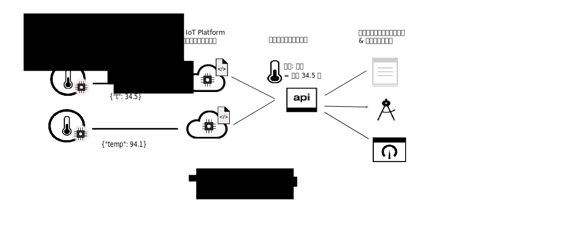

---

copyright:
  years: 2016, 2017
lastupdated: "2017-07-20"

---

{:new_window: target="\_blank"}
{:shortdesc: .shortdesc}
{:screen: .screen}
{:codeblock: .codeblock}
{:pre: .pre}

# データ管理の概要
{: #device_twins}

現代社会には、かつてないほどの数のデバイスやセンサーが存在します。そうしたデバイスの多くは、機能が似通っていますが、メーカー、モデル、バージョンはまちまちであるため、さまざまな形式でデータが出力されます。例えば、温度センサーには、温度を華氏で記録するものや、摂氏で記録するものがあることでしょう。そうしたすべての形式でデータをコンシュームできるようにアプリケーションをコーディングするのは効率的ではありません。その代わりに、データを正規化して単一の論理ビューを作成し、それをアプリケーションで使用できるようにする必要があります。
{: shortdesc}

{{site.data.keyword.iot_full}} のデータ管理フィーチャーを使用すれば、デバイス・ツインを構成して、正規化されたデータのビューをアプリケーションに対して公開できます。

デバイス・ツインは、{{site.data.keyword.iot_short_notm}} に接続される一群の物理デバイスまたはセンサーを示すデジタル表現です。デバイス・ツインによって、特定のセンサーまたはデバイスから得られるプロパティーとイベントの論理モデルが作成されます。デバイス・ツインを定義してインスタンス化すると、デバイスがオンラインかオフラインかにかかわらず、REST のような方法でデバイスとやり取りする一貫性のある手段を備えることができます。さまざまなメーカーやモデルの複数のデバイス間で 1 つの論理モデルを共有できるため、デバイス・エコシステム内の多様性と変化から IoT アプリケーションを分離できるようになります。デバイスの現在の状態 (デバイス状態) に関する情報を含む、デバイスのプロパティーは、HTTP 要求を使用するか、またはトピックをサブスクライブすることで取得できます。

デバイス・ツインは以下の点で役立ちます。
- REST のような方法でイベント・ドリブンのデバイス・データにアクセスできる統一インターフェースをアプリケーション開発者に提供する。
- さまざまなメーカーやモデルのデバイスからさまざまな形式でパブリッシュされるデータを正規化する。

データ管理フィーチャーを使用してデバイス・ツインを構成するには、{{site.data.keyword.iot_short_notm}} でリソースを構成して以下の情報を定義する必要があります。
- デバイスによって送信されるイベントの構造。インバウンド・イベントの構造は、物理インターフェース、イベント・タイプ、イベント・スキーマのリソースで定義します。 
- 記録する必要があるプロパティー。これらのプロパティーは、アプリケーションでコンシューム可能なデバイス状態の論理構造を定義します。これらのプロパティーは、論理インターフェースと論理スキーマのリソースで定義します。
- 物理インターフェース・イベントを論理インターフェース・プロパティーにマップする方法。マッピング・リソースを使用して、イベントをプロパティーにマップします。

以下の図は、さまざまな形式のデバイス・データが {{site.data.keyword.iot_short_notm}} に入り、変換と正規化によって単一の論理ビューになり、バックエンド・アプリケーションで容易にコンシュームできるようになる流れを示しています。  

主要な情報とリソースの定義と構成について詳しくは、[データ管理の解説](ga_im_definitions.html)を参照してください。{{site.data.keyword.iot_short_notm}} で独自のデバイス・ツインを作成することができます。これを行うには、[データ管理の概説](ga_im_example.html)に略述されている手順に従ってください。そのガイドに略述されている手順の各ステップについてさらに詳しくは、[ステップバイステップ・ガイド: 共通インターフェースによってデバイスを処理する方法を詳細に示す例](ga_im_index_scenario.html#scenario)に示されているサンプル・シナリオを参照してください。 
