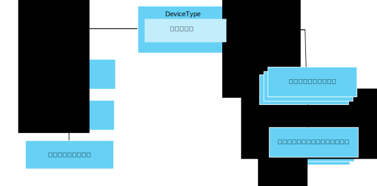

---

copyright:
years: 2016, 2017
lastupdated: "2017-07-21"

---

{:new_window: target="\_blank"}
{:shortdesc: .shortdesc}
{:screen: .screen}
{:codeblock: .codeblock}
{:pre: .pre}

# データ管理の概説
{: #im_example}

以下の手順を使用して、データ管理フィーチャーを使用して開始する必要があるリソースを構成します。

API についての詳細は、[{{site.data.keyword.iot_full}} HTTP REST API ](https://docs.internetofthings.ibmcloud.com/apis/swagger/v0002/state-mgmt.html){:new_window} の資料を参照してください。

**ヒント:** 各手順の詳細については、サンプル・シナリオを参照するか、ステップバイステップ・ガイド内の特定の手順に直接移動するためのリンクを使用してください。[ステップバイステップ・ガイド: 共通インターフェースによってデバイスを処理する方法を詳細に示す例](ga_im_index_scenario.html#scenario)では、種類の異なる複数の温度計デバイスに対応したデバイス・タイプ論理インターフェースを作成するための一連の手順について説明しています。

## 始めに
データ管理フィーチャーの使用を開始するには、{{site.data.keyword.iot_short_notm}} に[登録された](ga_im_index_scenario.html#step14)、そこにデータを送信しているデバイスが 1 つ以上必要です。  

以下の図は、構成する必要があるリソースをどのように組み合わせるのかを示した論理ビューを示しています。

## 手順

1. 	着信状態プロパティーを定義します。  
論理インターフェースからアプリケーションに提供する、着信状態プロパティーを定義します。  
<dl>
<dd>
<ol>
<li>[ドラフト・イベント・スキーマ・ファイルを作成します](ga_im_index_scenario.html#step1)。イベント・スキーマ・ファイルは、インバウンド・イベントの構造と形式を定義したローカルの .JSON ファイルです。<li>[使用するイベント・タイプ用のドラフト・イベント・スキーマ・リソースを作成します](ga_im_index_scenario.html#step2)。イベント・スキーマ・リソースは、{{site.data.keyword.iot_short_notm}} で使用されるプログラムの構成要素です。
<li>[このイベント・スキーマを参照するドラフト・イベント・タイプを作成します](ga_im_index_scenario.html#step3)。{{site.data.keyword.iot_short_notm}} はそのイベント・タイプを使用して、1 つ以上のイベント・スキーマ・リソースを物理インターフェースにマップします。
<li>[ドラフト物理インターフェースを作成します](ga_im_index_scenario.html#step7)。
<li>[ドラフト物理インターフェースにイベント・タイプを追加します](ga_im_index_scenario.html#step8)。
<li>[デバイス・タイプを更新してドラフト物理インターフェースに接続します](ga_im_index_scenario.html#step9)。
</ol>
</dd>
</dl>
4. 	ドラフト論理インターフェースを作成します。
 1. 	ドラフト・デバイス・タイプ用の[ドラフト論理インターフェース・スキーマ・ファイルを作成します](ga_im_index_scenario.html#step4)。  
論理インターフェース・スキーマ・ファイルは、アプリケーションに提供するデバイス状態を定義した、ローカルの .JSON ファイルです。
 2. ドラフト・デバイス・タイプ用の[ドラフト論理インターフェース・スキーマ・リソースを作成します](ga_im_index_scenario.html#step5)。
 3.	ドラフト・デバイス・タイプ用の[ドラフト論理インターフェースを作成します](ga_im_index_scenario.html#step6)。
 4.	[ドラフト論理インターフェースをドラフト・デバイス・タイプに追加します](ga_im_index_scenario.html#step10)。
5. 	ドラフト・デバイス・タイプ用の[ドラフト・マッピングを定義します](ga_im_index_scenario.html#step11)。   
マッピングを使用して、インバウンド・プロパティーを論理インターフェースのプロパティーにマップします。
6. 	ドラフト・デバイス・タイプに関連付けられた[構成を検証してアクティブ化します](ga_im_index_scenario.html#step15)。
7. 	[アクティブ・デバイスの状態を取得します](ga_im_index_scenario.html#step13)。  
REST 呼び出しを使用するか、またはトピックをサブスクライブすることにより、更新されたデバイス・データがサブスクリプションで示されること、または更新されたデバイス・データが返されることを確認します。
