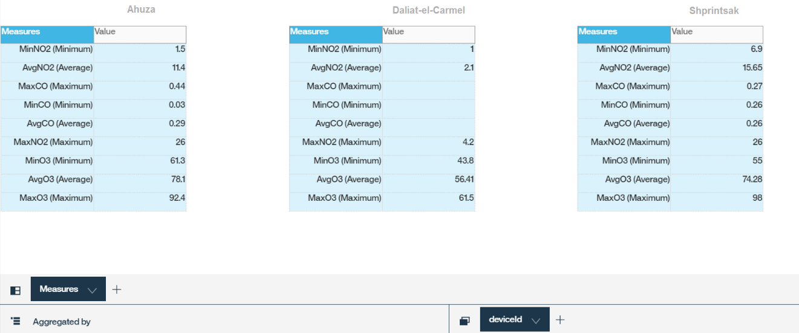

---

copyright:
  years: 2017
lastupdated: "2017-09-18"
---

---

{:new_window: target="blank"}
{:shortdesc: .shortdesc}
{:screen: .screen}
{:codeblock: .codeblock}
{:pre: .pre}


# Watson Analytics を使用したデータの分析
{: #WA_integration}  

{{site.data.keyword.iot_full}} を Watson Analytics (WA) と併用することで、プラットフォームに接続されているデバイスから送信されるデータを視覚化して把握することができます。
{: shortdesc}

## 概要と目的

このガイドは、分析ツールとして Watson Analytics (WA) を使用して {{site.data.keyword.iot_short_notm}} デバイスのイベント・データを視覚化する一連のプロセスを段階的に記載しています。

{{site.data.keyword.iot_short_notm}} に送信されるデバイス・データは、{{site.data.keyword.cloudantfull}} NoSQL DB サービスを使用して収集し、{{site.data.keyword.Bluemix}} に保管することができます。データを収集するには、まず {{site.data.keyword.iot_short_notm}} を {{site.data.keyword.cloudant_short_notm}} サービスに接続する必要があります。データが収集されたら、データを CSV ファイルにエクスポートします。このファイルを WA にアップロードすることによって、デバイス・データを視覚化して分析することができます。デバイス・データは、構成されたバケット間隔に従って、{{site.data.keyword.cloudant_short_notm}} の日次、週次、または月次データベースに保管されます。


このガイドの一環として、次のことを学習します。

 - Cloudant NoSQL DB をヒストリアン・サービスとして使用するようにプラットフォーム・データ・ストレージを構成する方法。
 - Weather Sensors シミュレーターを使用してプラットフォームが使用するデータを生成する方法。
 - データをエクスポートしてから WA にインポートしてデータを分析する方法。


## 前提条件

これらの手順を実行するには、[Cloudant NoSQL DB ](https://console.bluemix.net/catalog/services/cloudant-nosql-db
){: new_window} を使用した [{{site.data.keyword.iot_short_notm}} ](https://console.bluemix.net/catalog/services/internet-of-things-platform){: new_window} へのアクセス権限、および [Watson Analytics ](https://www.ibm.com/watson-analytics){: new_window} へのアクセス権限が必要です。


## 手順 1: シミュレーターをセットアップする
{: #WA_sensor_data}


意味のある分析を行うためには、意味のあるデータが必要です。実際のセンサー・データをシミュレートして、Wastson Analytic で Watson IoT Platform デバイス・データを分析する方法を学ぶことができます。ここでは、以下の手順について説明します。
 - [**{{site.data.keyword.iot_short_notm}} の既存インスタンス**を使用したシミュレーターのセットアップ](#sim_existing_platorm)
 - [**{{site.data.keyword.iot_short_notm}} の新規インスタンス**を使用したシミュレーターのセットアップ](#sim_new_platform)
 - [データが事前作成された CSV サンプル・ファイルのダウンロード](#WA_sensor_premade) (シミュレーターを使用しない場合)


### {{site.data.keyword.iot_short_notm}} の既存インスタンスを使用した Weather Sensors シミュレーターのセットアップ
{: #sim_existing_platform}

Weather Sensors シミュレーターを使用して組織における実際のセンサー・データ・イベントをシミュレートするには、まずシミュレーターをセットアップする必要があります。以下の手順は、既に {{site.data.keyword.iot_short_notm}} のインスタンスが稼働中であることが前提になっています。

1. [シミュレーターの実行に必要な API キーとトークンを生成します。](https://console.bluemix.net/docs/services/IoT/platform_authorization.html#api-key){: new_window}
2. [Weather Sensors シミュレーター Web アプリをデプロイし ](https://bluemix.net/deploy?repository=https://github.com/ibm-watson-iot/guide-weathersensors-simulator){: new_window}、詳細な説明に従います。

   Weather Sensors について詳しくは、[Weather Sensors シミュレーターのガイド ](https://github.com/ibm-watson-iot/guide-weathersensors-simulator){: new_window} を参照してください。
3. [手順 2. データベース・コネクターを構成する](#WA_config_db)に進みます。


### {{site.data.keyword.iot_short_notm}} の新規インスタンスを使用した Weather Sensors シミュレーターのセットアップ
{: #sim_new_platform}

Weather Sensors シミュレーターを使用して組織における実際のセンサー・データ・イベントをシミュレートするには、まずシミュレーターをセットアップする必要があります。以下の手順には、シミュレーターとともに {{site.data.keyword.iot_short_notm}} インスタンスを作成するための説明も含まれています。

1. [Weather Sensors シミュレーター Web アプリと {{site.data.keyword.iot_short_notm}} のインスタンスをデプロイし ](https://bluemix.net/deploy?repository=https://github.com/ibm-watson-iot/guide-weathersensors-simulator&branch=bindwiotp){: new_window}、詳細な手順に従います。

   Weather Sensors について詳しくは、[Weather Sensors シミュレーターのガイド ](https://github.com/ibm-watson-iot/guide-weathersensors-simulator){: new_window} を参照してください。
2. デプロイメントの完了を待ってから、Bluemix ダッシュボードにナビゲートします。
3. デプロイメント・プロセスで作成された {{site.data.keyword.iot_short_notm}} サービス「wiotp-for-weather-sensors-simulator」を起動します。
4. [手順 2. データベース・コネクターを構成する](#WA_config_db)に進みます。


### 事前作成サンプル CSV ファイルのセンサー・データの使用
{: #WA_sensor_premade}

事前作成 CSV ファイルを使用して、組織における実際のセンサー・データ・イベントをシミュレートするには、以下のようにします。

1. [Cloudant CSV ファイルをダウンロードします ](https://github.com/ibm-watson-iot/guide-weathersensors-simulator/releases/download/v1.0/cloudant.csv){: new_window}。
2. [手順 5. WA をセットアップしてデータを視覚化する](#WA_import_data)に進みます。


## 手順 2. データベース・コネクターを構成する
{: #WA_config_db}

{{site.data.keyword.cloudant_short_notm}} と Watson Analytics を併用するには、Cloudant NoSQL DB をヒストリアン・サービスとして使用するようにプラットフォーム・データ・ストレージを構成する必要があります。

1. {{site.data.keyword.cloudant_short_notm}} ダッシュボードで、ナビゲーション・バーの**「拡張」**をクリックします。
2. **「履歴データ・ストレージ」**で、**「セットアップ」**をクリックします。**「履歴データ・ストレージの構成」**セクションに、{{site.data.keyword.cloudant_short_notm}} と同じ Bluemix スペース内で使用できるすべての Cloudant NoSQL DB サービスがリストされます。
3. 接続する Cloudant NoSQL DB サービスを選択します。
4. 次の Cloudant NoSQL DB 構成オプションを指定します。
  - バケット間隔 = 日
  - タイム・ゾーン = UTC
  - データベース名 = デフォルト
5. **「完了」**をクリックして、Cloudant サービスへの接続の許可を確認します。確認ウィンドウにアクセスできるように、ブラウザーでポップアップを有効にしてください。Cloudant NoSQL DB が正常に構成されると、「履歴データ・ストレージ」の状況が構成済みに変わり、デバイス・データが {{site.data.keyword.cloudant_short_notm}} NoSQL DB に保管されます。
6. [手順 3: シミュレーターを実行する](#run_simulator)に進みます。


## 手順 3: シミュレーターを実行する
{: #run_simulator}

シミュレーターが、Haifa 領域にある 17 個の気象ステーションから実際の気象センサー・データを {{site.data.keyword.iot_short_notm}} 組織にパブリッシュします。

1. シミュレーターにナビゲートします。
2. 以下の詳細を入力します。
   - Watson IoT Platform 組織
   - API キー
   - 認証トークン

3. **「シミュレーターの実行 (Run Simulator)」**をクリックします。データの生成には数分かかる場合があります。
4. シミュレーターの稼働中に Watson IoT Platform にアクセスし、デバイスが作成されたこと、およびこれらのデバイスにイベントが送信されることを確認します。 
5. [手順 4. Cloudant データベースをエクスポートする](#WA_export_csv)に進みます。


## 手順 4. Cloudant データベースをエクスポートする
{: #WA_export_csv}

デバイス・データを保管するように {{site.data.keyword.cloudant_short_notm}} NoSQL DB を構成すると、コネクターによって 3 つのデータベースが自動的に作成されます。1 つのデータベースは現在のバケット間隔に対して作成され、1 つのデータベースは後続の間隔に対して作成され、もう 1 つは構成データベースに対して作成されます。間隔の終わりに到達すると、新しい間隔に対してデバイス・データがバケット・データベースに保管され、後続のバケットに対して新規データベースが作成されます。

{{site.data.keyword.cloudant_short_notm}} の履歴データ・ストレージ拡張フィーチャーによって、Cloudant に「iotp」という設計文書が作成されます。この文書には「csv」という「list」機能があります。この機能は Cloudant で文書として保管されるデバイス・イベントを CSV 形式でエクスポートするために使用できます。JSON 形式のイベントのみが CSV ファイルに送信されます。この設計文書は、次回以降のバケット間隔のすべての新規データベースに自動的に伝搬されます。

CSV ファイルには、デバイス・イベント・メタデータおよびそのペイロードに関する情報が含まれています。以下のリストに、イベント・メタデータの例を示します。
 -	DeviceId
 -	DeviceType
 - 	EventType
 - 	ISO 8601 形式でのタイム・スタンプ

csv list 機能によって、元のタイム・スタンプが時刻と日付の 2 つの別々の新規フィールドに分割されます。メタデータに加えて、CSV list 機能にはデバイス・ペイロードのデータ属性が含まれます。このペイロードは Cloudant 文書の「data」キーの下に表示されます。Weather Sensors シミュレーターによって生成される文書は、以下の例のような構造をしています。

```
{"deviceType": "WS",
  "deviceId": "Old-Market",
  "eventType": "sensorData",
  "format": "json",
  "timestamp": "2017-08-09T16:28:14.666Z",
  "data": { "NO2": 3.2, … }}
```

生成される CSV ファイルでは、すべてのペイロード属性は列として表現され、次の接頭部が追加されます。

```
<deviceType>_<eventType>_  
```

上記の例では、WS_sensorData_NO2 という列が CSV ファイルに追加されます。

Cloudant データベースを CSV 形式にエクスポートするには、以下のようにします。  

1. Cloudant NoSQL DB にログインします。
2. エクスポートするデータベースを選択します。
3. 選択したデータベースを開きます。
4. ブラウザーで新しいタブを開き、以下の URL を入力します。
   ```
   https://{cloudant service id}-bluemix.cloudant.com/{dbName}/_design/iotp/_list/csv/by-date?include_docs=true
```
   Cloudant サービス ID と dbName は、ご使用の Cloudant サービス ID と選択したデータベース名に従って変更してください。Cloudant サービス ID は Cloudant 管理ダッシュボード URL からコピーすることができます。

   **例:**
   ```
   https://ccf73725-b617-4f3e-8a7e-f5fb09569af4-bluemix.cloudant.com/iotp_115ccv_default_2017-08-23/_design/iotp/_list/csv/by-date?include_docs=true
   ```

   この例では、by-date ビューを使用して list 機能を呼び出したので、データはタイム・スタンプでソートされます。また、この URL で使用するビューを変更し、startkey 属性と endkey 属性を適用することによって、Cloudant ビューのネイティブ・フィルター・フィーチャーを使用してデータをフィルタリングすることもできます。

   **例:**
   ```
   https://{cloudant service id}-bluemix.cloudant.com/{dbName}/_design/iotp/_list/csv/by-deviceType?include_docs=true&startkey='WS'&endkey='WS'
   ```
   この例では、deviceType ビューを使用して csv を生成し、deviceType=WS である文書のみがダウンロード・ファイルに含まれます。特定の時間フレームに属する文書を選択するには、by-date ビューを使用し、以下の照会 URL を使用します (タイム・スタンプは希望の範囲に置き換えます)。
   ```
   https://{cloudant service id}-bluemix.cloudant.com/{dbName}/_design/iotp/_list/csv/by-date?statkey="2017-08-29T12:25:50.995Z"&endkey="2017-08-29T12:25:51.514Z"
   ```
5. 必要に応じて Cloudant 資格情報を指定し、CSV ファイルをダウンロードします。ファイル名は、URL 内で定義されているビューに従って生成されます。例えば、by-date.csv や by-deviceType.csv というファイル名になります。
6. [手順 5. WA をセットアップしてデータを視覚化する](#WA_import_data)に進みます。


## 手順 5. WA をセットアップしてデータを視覚化する
{: #WA_import_data}

WA をセットアップしてデータの視覚化を開始するには、以下のようにします。

1. WA にログインします (https://watson.analytics.ibmcloud.com)。
2. WA のホーム・ページで、**「データ (Data)」**を選択します。
3. **「ローカル・ファイル (Local File)」**をクリックして、ローカル CSV ファイルをインポートします。CSV ファイル名は、データのエクスポートに使用したビュー (例えば by-deviceType または by-date) によって異なります。
4. アップロードした CSV データ・アセットを選択します。
5. **「データに関する質問をする (Ask a question about your data)」**フィールドで、自然言語を使用して質問をします。
5. 質問に最も合う視覚化の提案を開きます。提案は手動で修正できます。
7. 視覚化を保存します。


## WA を使用したデータ視覚化の例
{: #WA_visualize}

このセクションでは、分析ツールとして WA を使用したデータ分析の例を示します。

**注:** これらの例は、ユーザーが視覚化を実行したときに得られる結果の一例を示すことを意図しています。ここに示された例の結果は、データが異なる日時に収集されたなどの理由で、サンプル・データでこれらの視覚化を実行したときに得られる結果とは異なる場合があります。

### デバイス正常性の視覚化

このセクションでは、IoT デバイスの集団について把握し、以下のような質問に答えます。

1. 何個のデバイスが報告されたか?
2. デバイス・タイプごとのデバイスの詳細はどのようなものか?
3. 1 つのデバイスにレポートはいくつあったか?
4. 各デバイスから送信されたレポートはいくつか?

**何個のデバイスが報告されたか?**

この例では、指定された間隔内で報告されたデバイス数をカウントし、予期したとおりにデバイスが報告されたかどうかを検出します。この分析を実行するには、以下の質問を WA に入力するか、コピー・アンド・ペーストします。

*「How many deviceId are there?」*

以下のように、結果として 17 個のデバイスあることが示されます。


**デバイス・タイプごとのデバイスの詳細はどのようなものか?**

この例では、この間隔内で報告されたデバイス・タイプごとのデバイス数を比較し、すべてのデバイス・タイプのデバイスが予期したとおりに報告されたかどうかを判別します。この分析を実行するには、以下の質問を WA に入力するか、コピー・アンド・ペーストします。

*「How does the number of deviceId compare by deviceType?」*

以下のように、結果としてデバイス・タイプごとのデバイスの詳細が示されます。


このデータを円グラフで表示するには、左側の**「視覚化 (Visualization)」**をクリックして**「円グラフ (Pie)」**を選択します。


**1 つのデバイスにレポートはいくつあったか?**

この例では、デバイスによって作成されたレポート数をカウントし、ネットワーク状態やその他のデバイス関連の問題を検出します。この分析を実行するには、以下の質問を WA に入力するか、コピー・アンド・ペーストします。

*「How many rows are there? filtered by deviceId: Ahuza」*

**注:** フィールド名は完全に入力する必要はありません。WA は完全なフィールド名を推測しようとしますが、フィルター値 (例えば「Ahuza」) は完全に正確に入力する必要があります。フィルターで正確な提案が表示されない場合は、**「次を表示 (Show Next)」**リンクをクリックするか、質問*「How many rows are there?」*を試してください。次に、図を開き、図の下の**「乗数 (Multiplier)」**ボックスをクリックして、リストから deviceId パラメーターを選択します。無関係な deviceId をすべてチェック解除します。

以下のように、結果としてデバイス Ahuza によって 25 個の行、つまりレポートが作成されたことが示されます。


**それぞれの異なるデバイスにレポートがいくつあったか?**

この例では、検査間隔内に各デバイスが送信したレポート数に基づいて、デバイスのアクティビティー・レベルを比較します。この分析を実行するには、以下の質問を WA に入力するか、コピー・アンド・ペーストします。

*「How does the number of Rows compare by deviceId?」*

以下のように、結果としてそれぞれのデバイスのデバイス・アクティビティーを示す棒グラフが示されます。


### デバイス・タイプのセンサー・データの視覚化

このセクションでは、1 つのデバイス・タイプに属するすべてのデバイスによって報告された集計センサー・データについて調べ、以下のような質問に答えます。

1. 報告されたすべてのセンサー値の平均/最小/最大はいくつか?
2. センサーの出力のヒストグラムを見ることができるか?  
3. 2 つのセンサー間の相関はどのようになっているか?


**報告されたすべてのセンサー値の平均/最小/最大はいくつか?**

この例では、1 つのデバイス・タイプに属するすべてのデバイスによって報告された数値パラメーターをまとめて、表に示します。この表から、特定の環境で感知された値の範囲について調べ、感知されたデータの広範な全体像を把握することができます。

この視覚化は、以下の手順で手動で作成する必要があります。

1.	**「視覚化を作成する (Create your own visualization)」**セクションで、**「表 (Table)」 **を選択します。
2.	「列の新規作成 (create new column)」の正符号ボタンをクリックし、**「計算 (Calculation)」**を選択します。
3.	新しい列に名前を付け、この計算用の列を**「列 (Columns)」**ドロップダウン・リストから選択し、**「完了 (Done)」**をクリックして列を複写します。データ・トレイの右端に新しい列が追加されます。
4.	新しい列のタイトルを右クリックし、集約タイプ (最小、最大、または平均) を選択してから、プロパティー・ウィンドウを閉じます。
6.	さらに列を追加する場合はこのプロセスを繰り返し、次にデータ・トレイを非表示にします。
7.	**「列 (Columns)」**をクリックし、リストの下部にある**「測定 (Measures)」**を選択します。
8.	**「集約基準 (Aggregated by)」**をクリックして、追加した計算をすべて選択します。
9.	**「完了」**をクリックします。
10.	視覚化を保存します。

以下のように、結果として値の範囲が示されます。


**デバイス・センサーの出力のヒストグラムを表示することができるか?**

この例では、1 つのデバイス・タイプに属するすべてのデバイスにおけるセンサーの動作を評価し、この環境で感知された値の分布を調べます。この視覚化を使用することで、センサーが感知する環境や、センサーの制限について知ることができます。この分析を実行するには、以下の質問を WA に入力するか、コピー・アンド・ペーストします。

*「How does the number of Rows compare by TEMP?」*

以下のように、結果として行数の比較が示されます。


**2 つのセンサー間の相関はどのようになっているか?**

この例では、このデバイス・タイプのすべてのデバイスにおいて 2 つのデバイス・センサーからの測定値を比較することによって、この環境での相関について確認します。この分析を完了するには、以下のいずれかの質問を WA に入力するか、コピー・アンド・ペーストします。

*「What is the relationship between NO2 and NOX?」*または*「How are the values of NO2 and NOX associated?」*

以下のように、結果として 2 つのセンサー間の関係が示されます。


また、デバイス ID ごとに色分けしたドットを使用してセンサー・データを表示することもできます。これを行うには、**「色 (Color)」**ボックスで deviceID を選択します。

以下のように、結果としてデバイスを限定したサブセットが示されます。


### センサー詳細の視覚化 (詳細)

このセクションでは、特定のデバイスで報告された特定のパラメーターについて知り、以下の質問に答えます。

1.	報告された値の平均/最小/最大はいくつか?
2.	デバイス・センサーの出力のヒストグラムを見ることができるか?
3.	特定のデバイス・センサー値が時間の経過とともにどのように変化するか?
4.	2 つのデバイスのセンサー値を比較すると時間の経過とともにどのようになるか?
5.	同じデバイスのセンサー値を比較すると時間の経過とともにどのようになるか?
6.	デバイスの 2 つのセンサー間の相関はどのようになっているか?


**報告された値の平均/最小/最大はいくつか?**

この例では、特定のデバイスによって報告された数値パラメーターをまとめて表に示し、この環境で感知された値の範囲やセンサーの誤動作などについて確認します。

この視覚化は、以下の手順を使用して手動で作成する必要があります。

1)	**「視覚化を作成する (Create your own visualization)」**セクションで、**「表 (Table)」 **を選択します。
2)	「列の新規作成 (create new column)」の正符号ボタンをクリックし、**「計算 (Calculation)」**を選択します。
3)	新しい列に名前を付け、この計算用の列を**「列 (Columns)」**ドロップダウン・リストから選択し、**「完了 (Done)」**をクリックして列を複写します。データ・トレイの右端に新しい列が追加されます。
4)	新しい列のタイトルを右クリックし、集約タイプ (最小、最大、または平均) を選択してから、**「プロパティー (Properties)」**ウィンドウを閉じます。
6)	さらに列を追加する場合はこのプロセスを繰り返し、次にデータ・トレイを非表示にします。
7)	**「列 (Columns)」**をクリックして**「測定 (Measures)」**を選択します。
8)	**「集約基準 (Aggregated by)」**をクリックして、追加した計算をすべて選択します。
9)	**「完了」**をクリックします。
10)	乗数ボックスで deviceId パラメーターを選択し、表示する関連デバイスを選択します。
11)	視覚化を保存します。

以下のように、結果として指定された値が示されます。




**デバイス・センサーの出力のヒストグラムを見ることができるか?**

この例では、特定のデバイス・センサーの動作を評価し、この環境で感知された値の分布を調べます。この視覚化を使用することで、センサーが感知する環境や、センサーの潜在的な誤動作について知ることができます。この分析を完了するには、以下のいずれかの質問を WA に入力するか、コピー・アンド・ペーストします。

*「What is the distribution of TEMP? filtered by deviceId: Ahuza」*または*「How does the number of Rows compare by TEMP? filtered by deviceId: Ahuza」*

以下のように、結果としてヒストグラムにデバイス・センサーの出力データが示されます。


**特定のデバイス・センサー値が時間の経過とともにどのように変化するか?**

この例では、特定のデバイスの特定のセンサーの読み取り値が、時間の経過とともに環境の変化を反映してどのように変化するのかを調べます。これは、計画や問題検出に役立ちます。この分析を実行するには、以下の質問を WA に入力するか、コピー・アンド・ペーストします。

*「What is the trend of TEMP over time? filtered by deviceId: Ahuza.」*

以下のように、結果として時間の経過に伴うセンサーのデータ傾向が示されます。


**2 つのデバイスのセンサー値を比較すると時間の経過とともにどのようになるか?**

この例では、さまざまなデバイスのセンサー読み取り値の傾向を比較し、デバイス間の関係を識別して、異常やデバイス誤動作などを検出します。この分析を完了するには、以下のいずれかの質問を WA に入力するか、コピー・アンド・ペーストします。

*「What is the trend of TEMP over time by deviceId?」*または*「What is the trend of TEMP over time by deviceId? filtered by deviceId: Ahuza, Igud」*

以下のように、結果として時間の経過に伴うセンサー値の比較が示されます。


この情報は、グラフ下部のパラメーター名をクリックして表示することもできます。複数のラインが描画されます (deviceId ごとに 1 つ)。関連する deviceId をリストから選択できます。


グラフの下の**「乗数 (Multiplier)」**ボックスを使用して deviceId を選択すると、グラフを横並びに表示できます。


**同じデバイスのセンサー値を比較すると時間の経過とともにどのようになるか?**

この例では、2 つのデバイス・センサーの傾向を相互に視覚化して、時間の経過に伴う環境の変化に対するより多くの洞察を得ます。この分析を実行するには、以下の質問を WA に入力するか、コピー・アンド・ペーストします。

*「What is the trend of NO2 and NOX over time by deviceId? filtered by deviceId: Ahuza」*

以下のように、結果として時間の経過に伴う 2 つのデバイス・センサーの傾向が示されます。


**デバイスの 2 つのセンサー間の相関はどのようになっているか?**

この例では、2 つのデバイス・センサーからの測定値を比較することによって、この環境での相関について確認します。この分析を完了するには、以下のいずれかの質問を WA に入力するか、コピー・アンド・ペーストします。

*「What is the relationship between NO2 and NOX? filtered by deviceId: Ahuza」*または*「How are the values of NO2 and NOX associated? filtered by deviceId: Ahuza」*

以下のように、結果としてデバイスの 2 つのセンサー間の相関が示されます。


## 次の作業

WA について詳しくは、以下のリソースを参照してください。
- [Watson Analytics Developer Center ](https://developer.ibm.com/watson-analytics/){: new_window}
- [Watson Analytics コミュニティー ](https://www.ibm.com/communities/analytics/watson-analytics/){: new_window}
- [Watson Analytics フォーラム ](https://community.watsonanalytics.com/discussions/spaces/15/view.html){: new_window}
