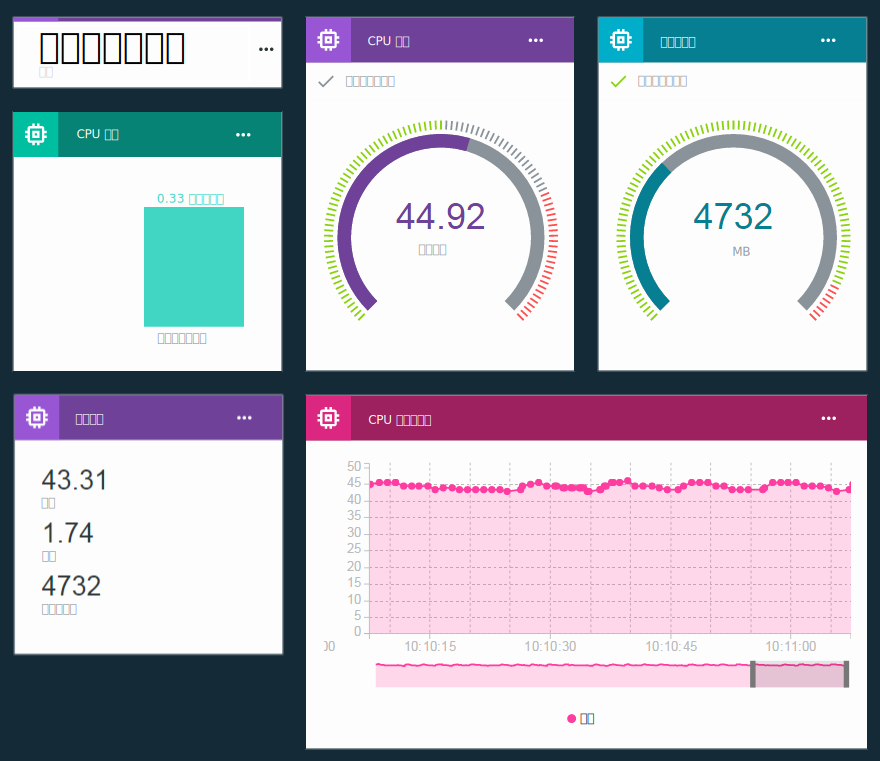

---

copyright:
  years: 2016, 2018
lastupdated: "2018-03-13"

---

{:new_window: target="\_blank"}
{:shortdesc: .shortdesc}
{:screen: .screen}
{:codeblock: .codeblock}
{:pre: .pre}
{:tip: .tip}

# ボードとカードを使用したリアルタイム・データの視覚化
{: #boards_and_cards}

**重要:** IBM は、IoT デバイス・データに対するルールを新しい方法で定義できるベータ版の提供を開始しました。このベータ版は、{{site.data.keyword.iot_full}} のルールとアクションの使用方法を向上させるためのプログラム変更に含まれる一部です。

詳しくは、ブログ記事 [An alternative approach to defining Rules on IoT data ](https://developer.ibm.com/iotplatform/2018/03/01/alternative-approach-defining-rules-iot-data/){: new_window} を参照してください。

独自のルールの定義を開始するには、[組み込みルールの作成 (ベータ)](information_management/im_rules.html) 資料を参照してください。

## ボードとカードについて

デバイス・データをリアルタイムで視覚化する独自のダッシュボードを作成して共有するには、ボードとカードを作成します。

ボードとカードを使用することによって、1 つ以上のデバイスからのデータ・セット値をグラフィカルに視覚化し、素早く概要を参照してデータへの理解を深めることができます。 データを未加工の数字、リアルタイムのグラフ、ゲージなどで表示するボードを作成し、カードを追加します。 メンバーをボードに追加して、組織内の他のユーザーとそれらを共有します。 カードを調整し、説明テキスト区切りを追加してプレゼンテーションを細かく調整します。  

また、[独自のカスタム・カードを作成する](custom_cards/custom-cards.html)ことによって、一連のデフォルトのカードを拡張することもできます。

## デフォルトのボード
{: #default_boards}
{{site.data.keyword.iot_short_notm}} ダッシュボードのデフォルトのボードは次のとおりです。

|ボード名 | 説明 | 含まれているカード
|:---|:---|:---|  
|使用状況の概要  | 組織の使用状況統計。 消費されるデバイス・タイプやデータをリストします。 | <ul><li>デバイス・タイプ<li>転送されたデータ</ul>
|ルール中心型の分析 | 組織のルール。 追加のカードに、トリガーされたアラート、関連デバイス、デバイス・プロパティー、アラート情報がリスト表示されます。 | <ul><li>管理するルール<li>規則アラート<li>規則アラート情報<li>関連デバイス<li>デバイス情報<li>デバイス・プロパティー</ul>  
|デバイス中心型の分析 | 組織に接続されているデバイス。 追加のカードに、選択されたデバイスのアラート、選択されたデバイスの情報、デバイス・プロパティー、アラート情報がリスト表示されます。 | <ul><li>観察しているデバイス<li>デバイス情報<li>対象のデバイスに関する規則アラート<li>規則アラート情報<li>デバイス・プロパティー</ul>
|リスクとセキュリティーの概要 (ベータ) | 組織の全体的なセキュリティー状況。 システム・オペレーターやセキュリティー・アナリストは、コンプライアンス、デバイスの接続状況、接続が失敗した原因、ブラックリストやホワイトリストを介してブロックされたり許可されたりしたデバイスに関する詳細情報を確認できます。  ユーザーは、接続のコンプライアンスのカードを使用して、コンプライアンスを満たしていないデバイスに関する詳細レポートにドリルダウンしたり、そのレポートを Excel にエクスポートしたりできます。 | <ul><li>ポリシー・コンプライアンス (Policy Compliance)<li>接続セキュリティー (Connection Security)<li>ブラックリスト/ホワイトリスト・コンプライアンス (Blacklist/Whitelist Compliance)</ul>

カードを追加、更新、削除することによってこれらのボードを更新できます。

デフォルトのボードを元の状態にリセットする場合は、ボードを削除します。 これで、ボードは元のカードで再作成されます。
{: tip}

## ボードとカードの作成
{: #visualizing_data}

{{site.data.keyword.iot_short_notm}} は、デバイスによって返されるリアルタイム・データを表示するために使用できる組み込みダッシュボードを提供します。 デフォルトで、「概要」ページは、{{site.data.keyword.iot_short_notm}} 組織に関する使用情報 (消費されるデータやストレージ・スペースなど) を表示します。 リアルタイムのデバイス・データが流れてきたときに表示するには、このページにデバイス固有のカードを追加します。

リアルタイム・デバイス・データを表示するためのステップバイステップの手順については、[Configuring Boards & Cards in the new Watson IoT Dashboard ](https://developer.ibm.com/recipes/tutorials/configuring-the-cards-in-the-new-watson-iot-dashboard/){: new_window} レシピを参照してください。
{: tip}

ボードを作成してそのボードにカードを追加するには、以下のようにします。
1. {{site.data.keyword.iot_short_notm}} ダッシュボードで、**「ボード (Boards)」**を選択します。
2. 編集権限を持つボードを選択するか、新規のボードを作成します。
3. ボードで、**「新しいカードの追加」**をクリックします。
3. カード・タイプを選択します。  
**ヒント:** デバイス・タイプ・カードに対してどの視覚化を選択するかが不明な場合は、**汎用視覚化**を選択します。 カードのタイプは、後で変更することもできます。
<dl>
<dt>デバイス</dt>
<dd><table>
<thead>
<tr>
<th>タイプ</th>
<th>表示されるデータ</th>
</tr>
</thead>
<tbody>
<tr>
<td>汎用視覚化</td>
<td>1 つ以上のデータ・セットの値。  **ヒント:** 最大 3 つのデータ・ポイント値を小さなテーブルに表示するには、大きなウィジェット・サイズを選択します。 </td>
</tr>
<tr>
<td>折れ線グラフ</td>
<td>リアルタイム・スクロール・グラフの 1 つ以上のデータ・セット。 「設定」メニューを使用して、データ範囲、保存、グラフの外観などを設定します。 </td>
<tr>
<td>棒グラフ</td>
<td>ラベル化されたバーのデータ・セット値。 水平または垂直バーの方向を切り替えるには「設定」メニューを使用します。</td>
</tr>
<tr>
<td>ドーナツ・グラフ</td>
<td>円形表記の 2 つ以上のデータ・セット。</td>
</tr>
<tr>
<td>値</td>
<td>1 つ以上のデータ・セットの未加工値。</td>
</tr>
<tr>
<td>ゲージ</td>
<td>ゲージで表示されるデータ・セットの値。 オプションで低、中、上のデータ範囲にゲージしきい値を設定するには、「設定」メニューを使用します。  </td>
</tr>
<tr>
<td>デバイス・プロパティー</td>
<td>1 つ以上のデバイスの特定のプロパティー。</td>
</tr>
<tr>
<td>すべてのデバイス・プロパティー</td>
<td>1 つ以上のデバイスのすべてのプロパティー。</td>
</tr>
<tr>
<td>デバイス・リスト</td>
<td>複数のデバイスをモニターするためのリスト。 リストは、他のカードのデータ・ソースとして使用することができます。  カード設定のデバイス ID やタイプによってリストをフィルタリングできます。 サイズ L、つまり、より大きいサイズのデバイス・リストも、カードのフィルター・アイコンをクリックすることによって、対話式にフィルタリングすることができます。 フィルターのエントリーは、単一エントリーとして追加したり、範囲 (x-y) として、またはコンマ区切りで追加することができます。  デフォルトでは、リストにはデバイス ID とタイプが表示されます。 リスト・カードの設定は、カードに他のデバイスのメタデータも表示されるように構成できます。  </td>
</tr>
<tr>
<td>デバイス情報</td>
<td>単一デバイスの基本情報。</td>
<tr>
<td>デバイス・マップ</td>
<td>デバイス・リスト内のデバイスの場所。</td>
</tr>
</tbody>
</table>
</dd>
<dt>分析</dt>
<dd>
<table>
<thead>
<tr>
<th>タイプ</th>
<th>表示されるデータ</th>
</tr>
</thead>
<tbody>
<tr>
<td>ルール</td>
<td>アラートを含むルールのリスト。</td>
</tr>
<tr>
<td>規則アラート</td>
<td>デバイスのアラートのリスト。</td>
</tr>
<tr>
<td>アラート情報</td>
<td>単一アラートの基本情報。</td>
</tr>
</tbody>
</table>
</dd>
<dt>リスク管理 (ベータ)</dt>
<dd>[拡張セキュリティー](reference/security/RM_security.html)組織でのみ使用可能です。
<table>
<thead>
<tr>
<th>タイプ</th>
<th>表示されるデータ</th>
</tr>
</thead>
<tbody>
<tr>
<td>ポリシー・コンプライアンス (Policy Compliance)</td>
<td>接続セキュリティーと、ブラックリスト/ホワイトリストに載っているデバイスの概要。</td>
</tr>
<tr>
<td>ブラックリスト/ホワイトリスト・コンプライアンス (Blacklist/Whitelist Compliance)</td>
<td>ブラックリスト/ホワイトリストに載っているデバイスの数。</td>
</tr>
<tr>
<td>接続セキュリティー (Connection Security)</td>
<td>接続セキュリティー検査に失敗したデバイスの数。</td>
</tr>
</tbody>
</table>
</dd>
<dt>使用法</dt>
<dd>
<table>
<thead>
<tr>
<th>タイプ</th>
<th>表示されるデータ</th>
</tr>
</thead>
<tbody>
<tr>
<td>デバイス・タイプ</td>
<td>組織における登録されたデバイスの数をデバイス・タイプごとに表示する円グラフ。</td>
</tr><tr>
<td>転送されたデータ</td>
<td>組織の転送データの使用統計。</td>
</tr>
</tbody>
</table>
</dd>
<dt>基本</dt>
<dd>
<table>
<thead>
<tr>
<th>タイプ</th>
<th>表示されるデータ</th>
</tr>
</thead>
<tbody>
<tr>
<td>セパレーター</td>
<td>ボード上でカードを構造化およびグループ化する水平セパレーター。</td>
</tr>
</tbody>
</table>
</dd>
</dl>

4.	カード・ソース・データを選択します。  
1 つ以上のカード・データ・ソースを選択し、**「次へ」**をクリックします。  
データ・ソースは単一の登録されたデバイスか、他のカードにすることができます。 カード・データ・ソースを使用するには、マップ・カードのリストがボード上に存在する必要があります。  
5. それぞれのデータ・ソースに、1 つ以上のデータ・セットを追加します。
 - デバイス
    2. 表示するデータ・ポイントを含めるイベントを選択します。
    3.	データ・ポイントを表すプロパティーを選択します。
    1.	データ・セットに識別名を指定します。
    4.	データ・ポイントのタイプ、単位、精度、最小値と最大値を設定します。  
    完了後、**「新規データ・セット」**をクリックしてさらにデータ・セットを追加するか、**「次へ」**をクリックします。
 - リスト
    2. デバイス・タイプを選択するか、**「任意のデバイス・タイプ」**を選択します。
    2. 表示するデータ・ポイントを含めるイベントを選択します。
    3.	データ・ポイントを表すプロパティーを選択します。
    1.	データ・セットに識別名を指定します。
    4.	データ・ポイントのタイプ、単位、精度、最小値と最大値を設定します。  
    完了後、**「新規データ・セット」**をクリックしてさらにデータ・セットを追加するか、**「次へ」**をクリックします。
5.	カード・プレビューでのカードの視覚化をカスタマイズします。  
 7. 表示サイズを選択します。  
ボード上でのカードのサイズの設定に加え、リストされるデバイスの数や、表示されるグラフ・メタデータなどの他のプレゼンテーション変数も、カード・サイズの設定によって制御されます。   
**ヒント:** 異なるサイズ・ラベルをクリックすると、異なるサイズでのカードのプレビューが表示されます。
 8. 任意の追加設定を構成します。  
カードでサポートされている場合は、**「設定」**をクリックすると、ゲージ・タイプのデータ範囲やデバイス・リスト・カードのフィルタリング・オプションなどの、構成できる追加設定が表示されます。
6. カード情報を更新します。  
 1. カードのタイトルと説明を入力し、オプションで、カラー・スキームを選択します。   
 2. **「送信」**をクリックすると、カードが作成されます。
7.	カードを適切な場所にドラッグして、ボードに新しいカードを配置します。  
