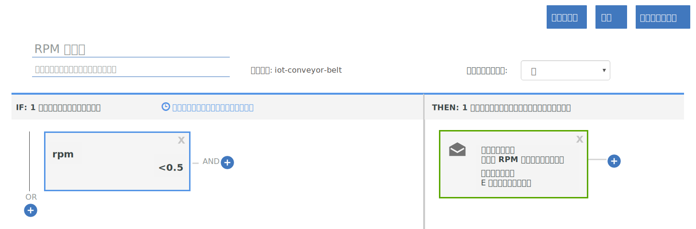

---

copyright:
  years: 2017
lastupdated: "2017-06-16"

---

{:shortdesc: .shortdesc}
{:new_window: target="_blank"}
{:codeblock: .codeblock}
{:pre: .pre}
{:screen: .screen}
{:tip: .tip}

# ガイド 2: リアルタイムの基本的なルールとアクションの使用
このガイドの説明に基づいて、コンベヤー・ベルト IoT データのリアルタイム分析で使用する基本的なルールとアクションのセットを構成します。
{:shortdesc}

## 概説と目標
{: #overview}  
コンベヤー・ベルトのセットアップ、{{site.data.keyword.iot_short_notm}} への接続、データの送信まで成功したので、ルールとアクションによってそのデータを活用します。



このガイドの一環として、次のことを行います。
- コンベヤー・ベルト・デバイスのイベント・データのメッセージ・スキーマを作成します。
- ルールを作成して起動します。
- E メール・アクションを作成します。

## 前提条件
{: #prereqs}  
接続したデバイスが必要です。そのデバイスでイベントを送信します。デバイス・タイプは `iot-conveyor-belt`、イベント名は `sensorData` です。メッセージ・ペイロードのプロパティーは以下のとおりです。
```
{
	"d": {
		"id": "belt1",
		"ts": 1494946276931,
		"ay": "0.00",
		"running": true,
		"rpm": "1.0"
		}
}
```
デバイス・イベントとメッセージ形式の詳細については、[イベントのパブリッシュ](/docs/services/IoT/devices/mqtt.html#publishing_events)を参照してください。  
[ガイド 1 で {{site.data.keyword.iot_short_notm}} の概要とコンベヤー・ベルトのシミュレート](getting-started-iot-conveyor.html)の学習を完了していれば、すべての準備が整っています。  
{: tip}

## 手順 1 - サンプル・アプリケーションのメッセージ・スキーマを作成する
{: #create_schema}

デバイスから送信されてくるプロパティーをルールのトリガーとして使用するために、まずそのプロパティーを {{site.data.keyword.Bluemix_notm}} のメッセージ・スキーマにマップする必要があります。詳しくは、[デバイス・タイプ・スキーマの作成](/docs/services/IoT/im_schemas.html#iotrtinsights_task)を参照してください。
1. {{site.data.keyword.iot_short_notm}} ダッシュボードで、**「デバイス」**に移動し、**「スキーマの管理」**を選択します。
2. **「スキーマの追加」**をクリックします。
3. **iot-conveyor-belt** デバイス・タイプを選択して、**「次へ」**をクリックします。
4. スキーマにプロパティーを追加します。
 1. **「プロパティーの追加」**をクリックします。
 2. **「接続先から (From Connected)」**を選択します。
 3. rpm 値を変更して、コンベヤー・ベルトのデータ・ポイントを送信します。
コンベヤー・ベルト Web アプリケーションで**「停止」**や**「開始」**をクリックして、メッセージをパブリッシュします。  
デバイスから送信されたプロパティーがプロパティー・リストに取り込まれます。
 4. すべてのプロパティーを選択して、**「OK」**をクリックします。
5. **「完了」**をクリックして、スキーマを作成します。  

スキーマが作成され、rpm のデータ・タイプが浮動小数点数に設定されます。

## 手順 2 - rpm プロパティーのシンプルなルールを作成する
{: #create_rule}  
{{site.data.keyword.Bluemix_notm}} のルール・エンジンは、デバイスから送信されてくるプロパティーのデータ・ポイントとルールで設定されている静的なしきい値を比較し、ルールの条件に適合している場合にそのルールを起動します。ルールの詳細については、[クラウド分析](/docs/services/IoT/cloud_analytics.html#rules)を参照してください。
コンベヤー・ベルトの rpm 値が 0.5 未満だった場合に起動するルールを作成するには、以下のようにします。
1. rpm プロパティーのタイプを浮動小数点数に変更します。  
この場合は、ルールを作成して、rpm の数値としきい値を比較します。そのためには、そのプロパティーが浮動小数点数か整数として認識されるようにしなければなりません。
 1. {{site.data.keyword.iot_short_notm}} ダッシュボードで、**「デバイス」**に移動し、**「スキーマの管理」**を選択します。
 1. 作成した新しいスキーマをクリックして、**「プロパティー」**を選択します。
 2. 編集アイコンをクリックして、スキーマを編集します。
 3. `rpm` プロパティーの横にある編集アイコンをクリックします。
 4. データ・タイプを`浮動小数点数`に変更します。  
 5. **「OK」**をクリックします。
 6. **「完了」**をクリックして、スキーマを更新します。  
2. ルールを作成します。
 1. ダッシュボードで、**「ルール」**に移動します。
 2. **「クラウド規則の作成」**をクリックします。
 3. `「RPM rule」`という名前を入力します。
 4. そのルールの適用先を **iot-conveyor-belt** スキーマに設定します。
 5. **「次へ」**をクリックします。
 6. ルールの条件を追加します。
    6. **「新規条件」**タイルをクリックして、ルールの条件を追加します。
    7. **rpm** プロパティーを選択します。
    8. 「より小さい」の演算子 (`<`) を選択します。
    9. 値として `0.5` を入力し、**「OK」**をクリックします。
    10. **「保存」**をクリックし、**「閉じる」**をクリックします。
 11. **「閉じる」**をクリックします。  
新しいルールが「非アクティブ化」の状態でリストに表示されます。
12. 状態のスイッチをクリックしてルールをアクティブ化します。
状態の表示が「アクティブ化」になります。

## 手順 3 - ルールを起動する
{: #trigger_rule}
rpm を下げることによって、コンベヤー・ベルトでオペレーターの介入が必要な問題が発生した状況をシミュレートできます。rpm のしきい値に達すると、ダッシュボードにアラートが表示されます。
1. {{site.data.keyword.iot_short_notm}} ダッシュボードで、**「ボード」**を選択します。
3. **「規則中心型の分析」**ボードを選択します。
4. コンベヤー・ベルト Web アプリケーションで、rpm 値を 0.5 rpm 未満に下げます。
センサーの読み取り値が変わると、デバイスがデータを {{site.data.keyword.iot_short_notm}} に送信します。コンベヤー・ベルトを停止/開始したりスピードを変更したりして、このデータ送信をシミュレートできます。  
5. 「アラート付き規則」カードに`「RPM rule」`が表示されます。
6. 「規則アラート」カードで新しいアラートを選択し、このルールを起動したデータ・ポイントを「規則アラート情報」カードに表示します。  
アラートの詳細を確認したい場合は、「関連デバイス」、「デバイス情報」、「デバイス・プロパティー」の各カードでデバイスの詳細情報を調べてください。  
{: tip}

## 手順 4 - RPM ルール起動時のアクションを作成する
{: #create_action}
{{site.data.keyword.iot_short_notm}} ダッシュボードにアラートを表示するだけでなく、ルール起動時のアクションを作成することもできます。例えば、rpm が下がりすぎた場合は、オペレーターに E メールを送信してコンベヤー・ベルトを確認してもらう、といったアクションです。詳細については、[クラウド分析](/docs/services/IoT/cloud_analytics.html#shared)を参照してください。
E メール・アクションを作成するには、以下のようにします。
1. {{site.data.keyword.iot_short}} ダッシュボードで、**「ルール」**に移動します。
2. **「RPM rule」**をクリックします。
3. **「新規アクション」**タイルをクリックします。
4. アクションを作成します。
 1. **「アクションの追加」**をクリックします。
 2. `「Notify operator about low RPM」`というアクション名を入力します。
 3. `「Send an email to the operator」`という説明を入力します。
 4. **「E メールの送信」**というタイプを選択します。
 5. **「次へ」**をクリックします。
 6. 件名の行に`「Low RPM alert」`と入力します。
 7. 「宛先」フィールドで、**「指定したユーザーのみ」**を選択し、`operator@company.com` などのアドレスを入力します。  
E メール・アドレスは、ユーザーの実際のアドレスに置き換えてください。
 8. **「データを含める (Include Data)」**を選択して、E メールにデバイス・データを含めます。
 9. **「完了」**をクリックして、アクションを保存します。  
5. リストからアクションを選択し、**「OK」**をクリックしてそのアクションを設定します。
6. **「保存」**をクリックして、そのルールのアクションを有効にします。
7. 新しいアクションをテストします。
 4. コンベヤー・ベルト Web アプリケーションで、rpm 値を 0.5 rpm 未満に下げます。

 5. アラートの E メールを受信したことを確認します。  
メッセージ本体の例を以下に挙げます。
> **Rule:** RPM rule  
> **Device:** 3m5wxr:iot-conveyor-belt:belt1  
> **Date:** 2017-05-09T18:21:21.567Z  
> **Condition:**  
> iot_conveyor_belt.d.rpm<0.5  
> **Incoming Message:**  
> {"d":{"id":"belt1","ts":1494354089837,"ay":"0.00","rpm":"0.4","running":true},"ruleContent":{"jobID":"sdIyBfdu","contextSchemas":[],"ruleDescription":"","severity":4,"messageSchemas":["iot_conveyor_belt"],"disabled":false,"ruleCondition":"iot_conveyor_belt.d.rpm<0.5","transforms":[],"name":"RPM rule","actions":["pziIRovt"],"id":"ncKK4N7k","updated":"9 May 2017 18:20:25 GMT","created":"9 May 2017 17:41:38 GMT","version":7}}  
> This is an automatically generated email. Do not reply. For questions regarding this alert, contact your system administrator.

## 次の作業
{: #whats_next}  
次のガイドに進むか、興味のある別のトピックにジャンプします。
- [ガイド 3: デバイス・データのモニター](getting-started-iot-monitoring.html)  
1 つ以上のデバイスを接続してデバイス・データを活用するところまで完了したので、一連のデバイスと各デバイスから送信されるリアルタイム・データのモニターを開始します。
- [ガイド 4: 多数のデバイスのシミュレート](getting-started-iot-large-scale-simulation.html)  
パス A のコンベヤー・ベルト・サンプル・アプリケーションを使用すれば、1 つか少数のコンベヤー・ベルト・デバイスを手動でシミュレートできます。このガイドでは、多数のデバイスをシミュレートするための環境をセットアップします。

- [他の IoT デバイスを {{site.data.keyword.iot_short_notm}}](/docs/services/IoT/iotplatform_task.html) に接続してください。
- [{{site.data.keyword.iot_short_notm}} の詳細を確認してください。](/docs/services/IoT/iotplatform_overview.html)
- [{{site.data.keyword.iot_short_notm}} API の詳細を確認してください。](/docs/services/IoT/reference/api.html)
