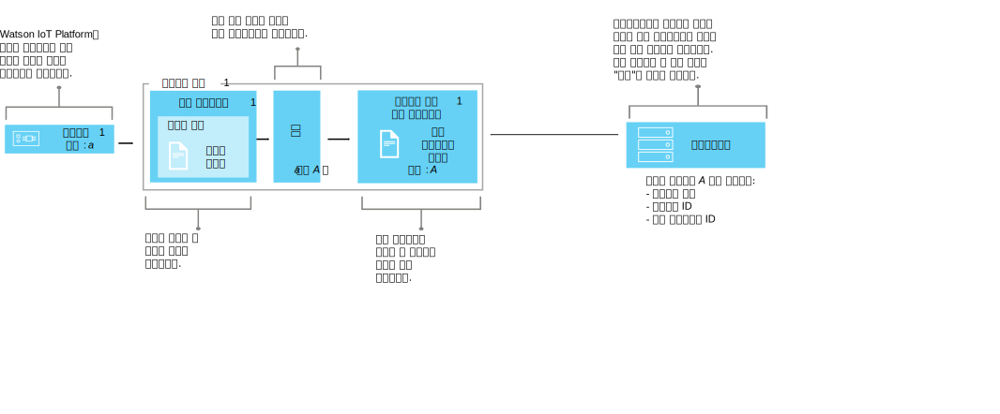

---

copyright:
  years: 2016, 2017
lastupdated: "2017-10-09"

---

{:new_window: target="\_blank"}
{:shortdesc: .shortdesc}
{:screen: .screen}
{:codeblock: .codeblock}
{:pre: .pre}


# 데이터 관리 이해
{: #definitions_resources}
{{site.data.keyword.iot_full}}에 연결할 디바이스가 여러 개 있을 수 있고, 이러한 디바이스는 서로 다른 형식의 데이터를 공개할 수 있습니다. 데이터 관리 기능을 사용하여 디바이스의 데이터 출력을 정규화하고 애플리케이션에서 쉽게 이용할 수 있는 단일 논리 보기로 변환할 수 있습니다. 단일 논리 보기를 사용하면, 각 디바이스에서 출력되는 서로 다른 데이터 형식을 알기 위해 애플리케이션을 코드화할 필요가 없습니다.
{: shortdesc}

## 개요

데이터 관리 기능을 사용하여 디바이스(쌍둥이 디바이스)의 공유된 추상화를 구축하면 데이터가 변경되어도 애플리케이션을 이와 격리시킴으로써 재활용도와 유지보수를 개선하고 복잡한 IoT 에코시스템을 관리할 수 있습니다. 

애플리케이션은 HTTP API를 사용하거나 주제 문자열을 구독하여 요청 시 디바이스의 현재 상태에 액세스할 수 있습니다. 상태는 논리 인터페이스에서 정의하는 상태 특성 세트로 구성됩니다. 디바이스 상태가 {{site.data.keyword.iot_short_notm}}에 공개된 이벤트의 결과로 변경되는 경우, 이러한 특성의 값은 {{site.data.keyword.iot_short_notm}}에서 업데이트되고 저장됩니다.

데이터 관리 기능을 사용하여 다음 이점을 얻을 수 있습니다.
- 상태 특성을 이벤트 메시지 데이터에 맵핑
- 선호하는 데이터 구조 정의
- 디바이스 상태에 대해 둘 이상의 표현이나 보기 정의
- 디바이스 상태를 구독하거나 이를 HTTP API를 통해 언제든지 조회

데이터 관리 기능 구현을 위한 몇 가지 공통 유스 케이스는 다음과 같습니다.
- REST와 유사한 방식으로 이벤트 구동 디바이스 데이터에 액세스할 수 있도록 애플리케이션 개발자에게 일관된 인터페이스 제공
- 서로 다른 형식의 데이터를 공개하는 여러 제조업체나 모델의 디바이스에서 가져온 데이터 정규화
- 애플리케이션 모델에 맞게 데이터 형식 수정 및 변환

## 예제: 이기종 온도 센서를 논리 인터페이스에 맵핑
{: #device-type-example}
데이터 관리 기능 사용을 시작하려면 다음 절에서 설명된 리소스의 수를 정의해야 합니다. 

다음 예제는 디바이스 이벤트 메시지 페이로드 형식에 관계없이 애플리케이션이 단일 형식의 이기종 온도 상태 데이터에 액세스할 수 있도록 이러한 리소스를 적절하게 맞추는 방법을 표시합니다. TemperatureSensor1은 `{ "t" : 34.5 }`의 섭씨 온도 측정값을 {{site.data.keyword.iot_short_notm}}에 공개합니다. TemperatureSensor2는 `{ "temp" : 72.55 }`의 화씨 온도 측정값을 공개합니다. 각 온도 센서는 고유 [디바이스 유형](../reference/device_model.html#id_and_device_types)과 연관됩니다. 온도 측정값은 개별 이벤트로서 공개됩니다. 

{{site.data.keyword.iot_short_notm}} 데이터 관리 기능을 사용하면 디바이스 데이터를 정규화하고 변환하여 이 솔루션을 구성할 수 있습니다. 


데이터 플로우의 일부로 수신 데이터에 대한 계산을 수행하여 처리를 위한 일관된 양식으로 이러한 측정값을 정규화할 수 있습니다. 따라서 사용자는 서로 다른 온도 스케일을 파악하고 이를 변환하는 애플리케이션을 작성할 필요가 없습니다. 애플리케이션은 하나의 정규화된 상태를 수신하며 디바이스 특정 **t** 및 **temp** 특성이 아닌 **temperature** 상태 특성을 사용합니다. 

 이 솔루션을 구성하려면 다음 정보를 정의해야 합니다.

-	각 디바이스 유형의 인바운드 온도 이벤트("t" 및 "temp") 구조.  
-	기록할 "temperature" 특성. "temperature" 특성은 애플리케이션에서 이용할 수 있는 디바이스 상태의 논리 구조를 정의합니다.
-	"temperature" 특성에 인바운드 이벤트의 "t" 및 "temp" 특성을 맵핑하는 방법.

{{site.data.keyword.iot_short_notm}} 내에 있는 다음 리소스를 구성하여 필수 정보를 정의할 수 있습니다.

-	실제 인터페이스, 이벤트 유형 및 이벤트 스키마 리소스. 인바운드 이벤트 "t" 및 "temp"의 구조를 정의합니다.
-	논리 인터페이스 및 논리 스키마 리소스. 생성할 디바이스 상태 "temperature"의 논리 구조를 정의합니다.
-	맵핑 리소스. "temperature" 특성에 "t" 및 "temp" 특성을 맵핑하는 방법을 정의합니다.

이 예제를 설명하는 자세한 엔드-투-엔드 시나리오는 [단계별 안내서: 공통 인터페이스를 통한 디바이스 작업 방법에 대한 자세한 예제](ga_im_index_scenario.html)를 참조하십시오.

이러한 리소스에 대한 자세한 정보는 "리소스 정의" 절에 제공됩니다.


## 리소스 정의
{: #definitions_resources}

다음 다이어그램은 데이터 관리 기능을 사용할 때 {{site.data.keyword.iot_short_notm}}에서 디바이스와 애플리케이션 간 논리 맵핑을 보여줍니다.



### 개념
{: #concepts}
다음 표에는 이전 다이어그램에서 참조되는 이벤트, 특성 및 상태에 대한 개념이 설명되어 있습니다.

개념                        | 설명       
------------- | ------------- | -------------  
이벤트| 이벤트는 디바이스가 {{site.data.keyword.iot_short_notm}}에 데이터를 공개하는 메커니즘입니다. 디바이스에서 이벤트의 컨텐츠를 제어하고 전송하는 각 이벤트의 이름을 지정합니다. 
특성 | 디바이스 이벤트 페이로드의 데이터 이동 파트입니다.
시/도| 실제 디바이스 상태의 최신 표시. 여러 인바운드 이벤트에서 맵핑된 모든 특성을 포함할 수 있습니다.

### 데이터 관리 리소스
{: #resources}

REST API를 사용하여 리소스를 관리할 수 있습니다. REST API에 대한 정보는 [{{site.data.keyword.iot_short_notm}} HTTP REST API](https://docs.internetofthings.ibmcloud.com/apis/swagger/v0002/state-mgmt.html) 문서를 참조하십시오. 

유형 리소스                        | 설명       
------------- | ------------- | -------------  
이벤트 유형| 이벤트 유형 리소스를 사용하여 디바이스에서 공개한 이벤트를 모델링합니다. 이벤트 유형은 이벤트 스키마 리소스를 참조해야 합니다. 스키마 리소스는 공개된 이벤트의 구조를 정의합니다. </br>**중요:** 논리 인터페이스에서 사용되는 인바운드 이벤트는 JSON 형식이어야 합니다. 
디바이스 유형|  디바이스 유형 리소스를 사용하여 특성 또는 동작을 공유하는 디바이스를 그룹화합니다. 데이터 관리에서 디바이스 유형은 디바이스 상태의 검색에 사용되는 하나 이상의 논리 인터페이스와 디바이스에 대한 하나의 실제 인터페이스를 포함하도록 확장됩니다. </br>자세한 정보는 [디바이스 모델](../reference/device_model.html#id_and_device_types) 주제의 "ID 및 디바이스 유형" 절을 참조하십시오.
스키마 리소스|  스키마 리소스를 사용하여 이벤트 또는 디바이스 상태의 구조를 정의합니다. 다음의 [JSON 스키마 ](http://json-schema.org/){:new_window}가 사용됩니다. <ul><li>이벤트 유형과 연관된 스키마입니다. 이 스키마는 디바이스에 의해 {{site.data.keyword.iot_short_notm}}에 공개되는 이벤트의 구조를 정의하는 데 사용됩니다. 이러한 스키마는 이벤트 스키마라고 합니다. <li>논리 인터페이스와 연관된 스키마입니다. 이 스키마는 {{site.data.keyword.iot_short_notm}}에 저장된 디바이스 상태의 구조를 정의하는 데 사용됩니다. 이러한 스키마는 논리 인터페이스 스키마라고 합니다</ul>.  

인터페이스 리소스                        | 설명       
------------- | ------------- | -------------  
논리 인터페이스 | 디바이스의 상태를 보기 위해 애플리케이션이 연결하거나 구독할 수 있는 프로그래밍 방식의 구성입니다. 논리 인터페이스는 {{site.data.keyword.iot_short_notm}}에서 디바이스 상태에 대한 정규화된 보기를 정의하는 데 사용됩니다. 논리 인터페이스는 논리 인터페이스 스키마와 연관시켜야 합니다. 상태는 인바운드 디바이스 이벤트에 대한 응답으로 업데이트됩니다. 
실제 인터페이스| 실제 인터페이스는 실제 디바이스와 {{site.data.keyword.iot_short_notm}} 간 인터페이스를 모델링하는 데 사용됩니다. 이벤트 유형은 실제 인터페이스와 연관시킬 수 있습니다. 

인스턴스 리소스                        | 설명       
------------- | ------------- | -------------  
디바이스| 디바이스는 {{site.data.keyword.iot_short_notm}}에 등록된 자산, 시스템 또는 컴포넌트를 표시하며 이벤트 양식으로 IoT 데이터를 전송합니다. 

지원 리소스                        | 설명       
------------- | ------------- | -------------  
맵핑| 맵핑을 사용하여 인바운드 이벤트와 연관된 특성을 논리 인터페이스에 정의된 특성에 맵핑되는 방법을 정의합니다. </br>**중요:** 맵핑을 정의하려면 하나 이상의 논리 인터페이스를 디바이스 유형과 연관시켜야 합니다.


## 리소스에 대한 이름 지정 제한사항
{: #naming_restrictions}
스키마, 이벤트 유형 및 논리 인터페이스와 실제 인터페이스에는 다음 이름 지정 제한사항이 있습니다.
- 이름이 1 - 128자여야 함 
- 이름이 유니코드 문자로 구성되어야 함 
- 올바른 특수 문자는 공백, 하이픈( - ), 밑줄( _ ), 마침표( . )임
- 이름이 공백으로만 구성될 수 없음

## 리소스 작성, 업데이트, 활성화 및 비활성화
{: #draft_active_resources}

두 개의 리소스 버전(드래프트 버전 및 활성 버전)이 있습니다. 리소스를 작성할 때 이 리소스는 드래프트 버전으로 작성됩니다.
{: shortdesc}

드래프트 버전은 API를 사용하여 직접 조회하고 업데이트하고 삭제할 수 있는 리소스의 작업 사본입니다. 드래프트 디바이스 유형 또는 드래프트 논리 인터페이스를 활성화하여 드래프트 리소스의 활성 버전을 작성하십시오. 드래프트 디바이스 유형 또는 드래프트 논리 인터페이스 리소스만 활성화할 수 있습니다. 기타 리소스(예: 스키마)를 활성화하려면 활성화할 리소스를 참조하는 드래프트 디바이스 유형 또는 드래프트 논리 인터페이스를 활성화해야 합니다.

REST API를 사용할 때 드래프트 리소스와 활성 리소스를 구분하려면 접두부 *draft/*를 사용하여 드래프트 상태의 리소스를 식별합니다.

다음 예제는 지정된 ID를 사용하여 드래프트 스키마 정의의 메타데이터를 검색합니다.

```
GET /api/v0002/draft/schemas/{schemaId}
```
다음 예제는 지정된 ID를 사용하여 활성 스키마 정의의 메타데이터를 검색합니다.
```
GET /api/v0002/schemas/{schemaId}
```
*참고:* ID는 지정된 리소스의 드래프트 및 활성 버전에 대해 동일합니다.


- 리소스 활성화
{: #activate_resources}  

디바이스 유형과 연관된 구성을 유효성 검증하고 활성화하려면 **activate-configuration** 오퍼레이션을 사용하십시오. 이 구성에는 드래프트 스키마, 이벤트 유형, 실제 인터페이스, 논리 인터페이스 및 맵핑이 포함됩니다. **activate-configuration** 오퍼레이션은 논리 인터페이스 또는 디바이스 유형의 드래프트 버전에서 수행해야 합니다.

다음 예제는 **activate-configuration** 오퍼레이션이 디바이스 유형의 드래프트 버전에서 수행되는 PATCH 요청을 표시합니다.
```
PATCH /api/v0002/draft/device/types/TemperatureSensor
```
여기서 PATCH 본문의 페이로드에 다음 컨텐츠가 포함됩니다.
```
  {
    "operation": "activate-configuration"
  }
```
- 차이점 나열
{: #list_differences}  

논리 인터페이스 또는 디바이스 유형 리소스의 활성 구성과 드래프트 구성 간의 차이점 목록을 리턴하려면 **list-differences** 오퍼레이션을 사용하십시오. **list-differences** 오퍼레이션은 논리 인터페이스 또는 디바이스 유형의 드래프트 버전에서 수행해야 합니다. 다음 예제는 **list-differences** 오퍼레이션이 디바이스 유형의 드래프트 버전에서 수행되는 PATCH 요청을 표시합니다.
```
PATCH /api/v0002/draft/device/types/TemperatureSensor
```
여기서 PATCH 본문의 페이로드에 다음 컨텐츠가 포함됩니다.
```
  {
    "operation": "list-differences"
  }
```


- 리소스 비활성화  
{: #deactivate_resources}  

리소스와 연관된 활성 구성을 제거하려면 **deactivate-configuration** 오퍼레이션을 사용하십시오. deactivate-configuration 오퍼레이션은 논리 인터페이스와 디바이스 유형의 활성 버전에서만 수행할 수 있습니다. 다음 예제는 **deactivate-configuration** 오퍼레이션이 디바이스 유형의 활성 버전에서 수행되는 PATCH 요청을 표시합니다.
```
PATCH /api/v0002/device/types/TemperatureSensor
```
여기서 PATCH 본문의 페이로드에 다음 컨텐츠가 포함됩니다.
```
  {
    "operation": "deactivate-configuration"
  }
```
*참고:*
- 활성 리소스는 읽기 전용입니다. 조회 매개변수를 사용하여 드래프트 및 활성 리소스를 필터링하고 정렬할 수 있습니다.
- 디바이스 유형과 연관된 디바이스 인스턴스가 있는 경우 디바이스 유형을 삭제할 수 없습니다. 디바이스 인스턴스가 삭제되면 디바이스 상태도 지워집니다. 
- API를 사용하여 직접 논리 인터페이스 및 디바이스 유형만 활성화할 수 있습니다. 기타 리소스(예: 스키마, 실제 인터페이스 및 이벤트 유형)는 활성 상태가 된 논리 인터페이스 또는 디바이스에서 참조되는 경우에 활성화됩니다.  
- **activate-configuration** 오퍼레이션은 디바이스 유형과 연관된 논리 인터페이스의 드래프트 버전 또는 디바이스 유형 자체에서 수행되어야 합니다. **activate-configuration** 오퍼레이션은 리소스 활성화 전에 리소스 구성이 올바른지 확인합니다. 활성화가 완료되면 디바이스 유형의 각 디바이스 인스턴스에 대해 상태가 생성됩니다.

## 구성 문제점 해결
{: #troubleshooting}
활성화에 실패하면 지정된 디바이스 유형에 필요한 모든 구성이 제공되었는지 확인하십시오. 다음 구성을 제공하고 디바이스 유형과 연관시켜야 합니다.
  - 하나 이상의 이벤트와 연관된 실제 인터페이스
  - 하나 이상의 논리 인터페이스
  - 하나 이상의 연관된 논리 인터페이스에 대한 맵핑

또한 디바이스 유형 또는 논리 인터페이스 리소스의 드래프트 버전에서 **validate-configuration** 오퍼레이션을 수행하여 연관된 메타데이터가 올바른지 확인할 수 있습니다. 메타데이터가 올바르지 않은 경우 문제의 목록이 응답의 본문에 리턴됩니다.  

다음 예제는 **validate-configuration** 오퍼레이션이 "TemperatureSensor"라고 하는 디바이스 유형의 드래프트 버전에서 수행되는 PATCH 요청을 표시합니다.  
```
PATCH /api/v0002/draft/device/types/TemperatureSensor
```
여기서 PATCH 본문의 페이로드에 다음 컨텐츠가 포함됩니다.
```
  {
    "operation": "validate-configuration"
  }
```  
다음 예제는 PATCH 요청에 대한 실패한 응답을 표시합니다.  
```
{
"message": "CUDIM0303I: State update configuration for Device Type 'TemperatureSensor' is not valid.",
"details": {
  "id": "CUDIM0303I",
  "properties": [
    "Device Type",
    "TemperatureSensor"
  ]
},
"failures": [
  {
    "message": "CUDVS0301E: The device type 'TemperatureSensor' does not have any mappings defined for it",
    "details": {
      "id": "CUDVS0301E",
      "properties": [
        "TemperatureSensor"
      ]
    }
  }
]
}
```  
다음 예제는 PATCH 요청에 대한 성공한 응답을 표시합니다.  
```  
{
"message": "CUDIM0303I: State update configuration for Device Type 'TemperatureSensor' is valid.",
"details": {
  "id": "CUDIM0303I",
  "properties": [
    "Device Type",
    "TemperatureSensor"
  ]
},
 "failures": []
}
```  
필요한 모든 리소스가 디바이스 유형과 연관되어 있는 경우 특성 맵핑이 올바른지 확인하십시오. 다음 예제는 발생할 수 있는 가능한 오류를 표시합니다.

  - 표현식은 이벤트 스키마에서 정의되지 않은 이벤트의 특성 참조
  - 표현식은 논리 인터페이스 스키마에서 정의되지 않은 상태의 특성 참조
  - 맵핑은 논리 인터페이스 스키마에서 정의되지 않은 특성에 대해 정의됨


다음 오류 로그를 참조하여 런타임 오류를 진단할 수 있습니다.
```
iot-2/type/${typeId}/id/${devieId}/err/data
```
### 리소스 한계

다음 표에서는 플랜 유형을 기반으로 구성할 수 있는 최대 리소스 수를 표시합니다. 

리소스                     |표준 플랜                     | 라이트 플랜 
------------- | ------------- | ------------- 
논리 인터페이스 | 1000 | 10
실제 인터페이스           | 1000 | 5
이벤트 유형 | 1000 | 10
스키마|2000 | 20
논리 인터페이스 참조(디바이스 유형이 맵핑할 수 있는 논리 인터페이스의 수)  |20 | 5
이벤트 유형 참조(실제 인터페이스가 가질 수 있는 이벤트 유형 연관에 대한 이벤트 ID 수)| 40 | 10
