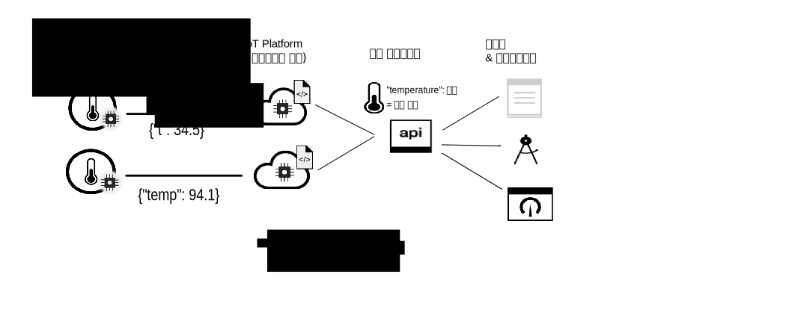

---

copyright:
years: 2017, 2018
lastupdated: "2018-08-28"

---

{:new_window: target="\_blank"}
{:shortdesc: .shortdesc}
{:screen: .screen}
{:codeblock: .codeblock}
{:pre: .pre}

# 데이터 관리 소개
{: #device_twins}

<!--An unprecedented number of devices and sensors exist in the modern world. Connected devices generate vast amounts of digital data at extraordinary speeds. Such volumes of data represent great opportunities but also challenges, in terms of how big data can be processed, analyzed and presented to help to deliver insights and drive transformation.-->

디바이스는 유사한 데이터 출력을 제공하지만 제조업체, 모델 및 버전이 다양하며 서로 다른 형식의 데이터를 출력할 수 있습니다. 예를 들어, 사무실에서 온도 센서가 있는 디바이스는 화씨 또는 섭씨 온도를 보고할 수 있습니다. 이러한 모든 형식의 데이터를 이용할 수 있도록 애플리케이션을 코딩하는 것은 효율적이지 않습니다. 그 대신에 애플리케이션이 동일한 방법으로 서로 다른 디바이스와 상호작용할 수 있도록 데이터를 수집하고 변환하며 정규화하여 단일 논리 모델을 작성해야 합니다.  

{{site.data.keyword.iot_short_notm}}의 데이터 관리 컴포넌트에는 쌍둥이 디바이스 기능과 쌍둥이 자산 기능이 포함되어 있습니다. 쌍둥이 디바이스 기능을 사용하면 단일 논리 모델로 형식이 서로 다른 디바이스 데이터의 수집, 변환 및 정규화를 활용할 수 있습니다. 쌍둥이 자산 기능을 사용하면 서로 다른 디바이스를 함께 그룹화하여 보다 높은 가치의 자산 기반 데이터 구조인 사물을 작성할 수 있습니다. 사물을 함께 그룹화하여 새로운 사물을 작성할 수도 있습니다. 애플리케이션은 개별 디바이스 또는 사물에서 사용하는 데이터 형식과는 무관하게 논리 모델과 상호작용할 수 있습니다.  

예를 들어, 일군의 온도, 습도 및 주변 조명 보고 디바이스를 "룸" 사물로 집계하여 특정 사무실 내의 쾌적함 레벨을 제시할 수 있습니다. 다수의 "룸" 사물을 "층" 사물로 집계하여 특정 레벨의 모든 사무실을 표시할 수 있으며, 다수의 "층" 사물을 "건물" 사물로 집계할 수 있습니다. 사물 추상화를 사용하면 디바이스가 연결되는 방법, 디바이스가 이벤트 데이터를 공개하는 형식 및 데이터가 결합되는 방법의 세부사항으로부터 애플리케이션이 분리됩니다.
{: shortdesc}

## 쌍둥이 디바이스

쌍둥이 디바이스는 {{site.data.keyword.iot_short_notm}}에 연결된 실제 디바이스의 클라우드 기반 디지털 표현입니다. 쌍둥이 디바이스는 디바이스에서 공개하는 이벤트의 논리 모델을 표시합니다. 정의되고 인스턴스화된 쌍둥이 디바이스는 디바이스가 온라인인지 아니면 오프라인인지에 관계없이 REST와 같은 방식으로 디바이스와 상호작용하는 일관된 방법을 제공합니다. 디바이스의 현재 상태(디바이스 상태)에 대한 정보를 포함한 디바이스의 특성은 HTTP 요청으로 또는 IoT 주제를 구독하여 검색될 수 있습니다. 

쌍둥이 디바이스를 사용하면 다음을 수행하는 데 도움이 될 수 있습니다.
- REST 같은 방식으로 이벤트 구동 디바이스 데이터에 액세스하기 위한 일관된 인터페이스를 애플리케이션 개발자에게 제공합니다. 
- 디바이스 상태에 액세스합니다. 
- 서로 다른 형식의 데이터를 공개하는 여러 제조업체나 모델의 디바이스에서 가져온 데이터를 정규화합니다.
- 불필요한 데이터를 필터링으로 제거합니다. 

쌍둥이 디바이스를 작성하려면 {{site.data.keyword.iot_short_notm}}에서 다음 리소스를 정의해야 합니다. 
- 디바이스에서 전송된 이벤트의 구조.  
인바운드 이벤트의 구조는 실제 인터페이스, 이벤트 유형 및 이벤트 스키마 리소스에서 정의됩니다. 
- 기록할 특성.  
이러한 특성은 애플리케이션에서 이용할 수 있는 디바이스 상태의 논리 구조를 정의합니다. 특성은 논리 인터페이스 및 논리 스키마 리소스에 정의됩니다.  
- 논리 인터페이스 특성으로 실제 인터페이스 이벤트의 맵핑.   
특성에 이벤트를 맵핑하려면 맵핑 리소스를 사용하십시오.

다음 다이어그램은 별도의 위치에서 두 개의 서로 다른 온도 디바이스를 보여줍니다. 하나의 디바이스는 섭씨 온도로 디바이스 데이터를 보고하고 다른 디바이스는 화씨 온도로 데이터를 보고합니다. 데이터는 "t" 및 "temp" 온도 형식으로 {{site.data.keyword.iot_short_notm}}에 전송됩니다. {{site.data.keyword.iot_short_notm}}은 화씨 온도를 섭씨 온도로 자동으로 변환합니다. "t" 및 "temp" 온도 형식은 "temperature" 논리 형식으로 정규화됩니다. 애플리케이션은 "temperature" 매개변수의 값에 액세스하여 각 디바이스의 상태를 조회할 수 있습니다. 

## 쌍둥이 자산(사물)

쌍둥이 자산을 이용하면 쌍둥이 디바이스의 개념보다 한 단계 더 나아갈 수 있습니다. 쌍둥이 자산을 사용하면 사물이라고 하는 단일 엔티티로 디바이스의 집계가 가능합니다. 사물 또는 쌍둥이 자산은 쌍둥이 디바이스와 유사한 개념이지만, 쌍둥이 자산은 디바이스 그룹을 단일 논리 모델로 표시합니다. 사물을 집계하여 보다 상위 레벨의 추상화를 구성할 수도 있습니다. 예를 들어, "룸" 사물은 다음 디바이스를 집계할 수 있습니다. 

- 온도 센서가 있는 디바이스(온도계)
- 습도 센서가 있는 디바이스(습도계)

그리고 "층" 사물은 다수의 "룸" 사물을 집계할 수 있습니다.  

사물의 구조는 JSON-스키마를 사용하여 정의됩니다. 스키마는 집계된 디바이스 또는 사물의 논리 인터페이스를 참조합니다. 사물의 현재 상태에 대한 정보를 포함하여 사물의 특성은 HTTP 요청을 사용하거나 IoT 주제를 구독하여 검색될 수 있습니다. 

쌍둥이 자산을 사용하면 다음을 수행하는 데 도움이 될 수 있습니다. 
 
- 다수의 쌍둥이 디바이스 또는 사물을 집계하여 새 사물을 정의합니다. 
- 사물의 상태에 액세스합니다. 
- 자산의 개별 인스트루먼테이션에 노출되지 않고 자산을 관리합니다.
- 불필요한 데이터를 필터링으로 제거합니다. 
- 사물 인터페이스를 정규화하여 특정 사물이 구성된 방식의 복잡함으로부터 애플리케이션을 분리합니다. 

쌍둥이 자산을 작성하려면 {{site.data.keyword.iot_short_notm}}에서 다음 리소스를 정의해야 합니다. 

- 사물의 구조.   
사물의 구조는 집계된 디바이스 또는 사물을 지정하는 사물 스키마에 의해 정의됩니다. 
- 기록하고자 하는 특성으로 구성된 원하는 사물 상태의 구조.   
이러한 특성은 애플리케이션이 이용할 수 있는 사물 상태의 논리 구조를 정의합니다. 특성은 논리 인터페이스 및 논리 스키마 리소스에 정의됩니다.  
- 사물 인터페이스를 논리 인터페이스 특성으로 맵핑하는 방법.   
특성에 이벤트를 맵핑하려면 맵핑 리소스를 사용하십시오.

다음 다이어그램은 온도 및 습도 이벤트 데이터를 {{site.data.keyword.iot_short_notm}}에 공개하는 서로 다른 디바이스의 온도 및 습도 센서를 표시합니다. 2개의 쌍둥이 디바이스(각각 실제 디바이스를 표시함)에는 연관된 논리 인터페이스가 있으며, 이는 {{site.data.keyword.iot_short_notm}}에서 작성됩니다. 온도 디바이스에서 공개되는 데이터는 "IThermometer" 논리 인터페이스에 맵핑됩니다. 습도 디바이스에서 공개되는 데이터는 "IHygrometer" 논리 인터페이스에 맵핑됩니다. 이러한 논리 인터페이스는 "IRoom" 논리 인터페이스와 함께 *Room* 사물 유형으로 집계됩니다. "IRoom" 논리 인터페이스는 온도 및 습도 특성을 정의하며, 사용자는 이를 사용하여 애플리케이션이 상호작용할 수 있는 단일 사물로 디바이스를 집계하여 고유 논리 모델을 작성할 수 있습니다.   

**중요:** {{site.data.keyword.iot_short_notm}} 사물 기능은 제한된 베타 프로그램의 일부로서만 사용 가능합니다. 향후 업데이트에는 이 기능의 현재 버전과 호환 가능한 변경사항이 포함될 수 있습니다. 시도해 보고 [의견을 보내주십시오. ](https://developer.ibm.com/answers/smart-spaces/17/internet-of-things.html){: new_window}

키 정보 및 리소스 정의와 구성에 대한 자세한 정보는 [데이터 관리 이해](ga_im_definitions.html)를 참조하십시오. 

## 다음 단계

- {{site.data.keyword.iot_short_notm}}에서 자체 쌍둥이 디바이스를 작성하십시오. 자세한 정보는 [웹 인터페이스를 사용하여 데이터 관리 시작하기](im_ui_flow.html) 문서를 참조하십시오.  
- REST API를 사용하여 쌍둥이 디바이스 및 쌍둥이 자산을 작성하십시오. 자세한 정보는 [데이터 관리 시작하기](../information_management/getting_started_things.html) 문서를 참조하십시오.   
- 지정된 조건 또는 조건 세트와 일치하는 이벤트 데이터를 {{site.data.keyword.iot_short_notm}}에서 수신할 때 트리거되는 규칙을 작성하십시오. 자세한 정보는 [임베디드 규칙](../information_management/im_rules.html) 베타 문서를 참조하십시오. 

*데이터 관리 시작하기* 문서에서 간략하게 설명된 각 단계에 대한 자세한 정보는 다음 주제에서 설명된 예제 시나리오를 참조하십시오.  

- [단계별 안내서 1: 공통 인터페이스를 통한 디바이스 관련 작업 방법에 대한 자세한 예제](ga_im_index_scenario.html#scenario) 
- [단계별 안내서 2: 공통 인터페이스를 통한 사물 관련 작업 방법에 대한 자세한 예제](../information_management/im_index_scenario_thing.html#scenario) 

