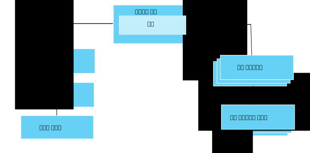

---

copyright:
years: 2016, 2017
lastupdated: "2017-07-21"

---

{:new_window: target="\_blank"}
{:shortdesc: .shortdesc}
{:screen: .screen}
{:codeblock: .codeblock}
{:pre: .pre}

# 데이터 관리 시작하기
{: #im_example}

데이터 관리 기능 사용을 시작하는 데 필요한 리소스를 구성하려면 다음 단계를 사용하십시오.

API에 대한 세부사항은 [{{site.data.keyword.iot_full}} HTTP REST API ](https://docs.internetofthings.ibmcloud.com/apis/swagger/v0002/state-mgmt.html){:new_window} 문서를 참조하십시오. 

**팁:** 각 단계에 대한 자세한 정보를 보려면 예제 시나리오를 참조하거나 링크를 사용하여 단계별 안내서의 특정 단계로 직접 이동하십시오. [단계별 안내서: 공통 인터페이스를 통한 디바이스 작업 방법에 대한 자세한 예제](ga_im_index_scenario.html#scenario)를 참조하여 이기종 온도계 디바이스에 대한 디바이스 유형 논리 인터페이스를 작성할 수 있습니다.

## 시작하기 전에
데이터 관리 기능 사용을 시작하려면 하나 이상의 [디바이스가 등록되어](ga_im_index_scenario.html#step14) 있고 데이터를 {{site.data.keyword.iot_short_notm}}에 전송해야 합니다.  

다음 다이어그램은 구성해야 하는 리소스를 적절하게 맞추는 방법에 대한 논리 보기를 표시합니다.

## 단계

1. 	수신 상태 특성을 정의하십시오.   
논리 인터페이스가 애플리케이션에서 사용 가능하도록 할 수신 상태 특성을 정의하십시오.  
<dl>
<dd>
<ol>
<li>[드래프트 이벤트 스키마 파일을 작성](ga_im_index_scenario.html#step1)하십시오. 이벤트 스키마 파일은 인바운드 이벤트의 구조와 형식을 정의하는 로컬 .JSON 파일입니다.
<li>[이벤트 유형의 드래프트 이벤트 스키마 리소스를 작성](ga_im_index_scenario.html#step2)하십시오. 이벤트 스키마 리소스는 {{site.data.keyword.iot_short_notm}}에서 사용하는 프로그램 방식의 구성입니다.
<li>[이벤트 스키마를 참조하는 드래프트 이벤트 유형을 작성](ga_im_index_scenario.html#step3)하십시오. 이벤트 유형은 하나 이상의 이벤트 스키마 리소스를 실제 인터페이스에 맵핑하기 위해 {{site.data.keyword.iot_short_notm}}에 의해 사용됩니다.
<li>[드래프트 실제 인터페이스를 작성](ga_im_index_scenario.html#step7)하십시오.
<li>[이벤트 유형을 드래프트 실제 인터페이스에 추가](ga_im_index_scenario.html#step8)하십시오.
<li>[드래프트 디바이스 유형을 업데이트하여 드래프트 실제 인터페이스를 연결](ga_im_index_scenario.html#step9)하십시오.
</ol>
</dd>
</dl>
4. 	드래프트 논리 인터페이스를 작성하십시오.
 1. 	드래프트 디바이스 유형에 대한 [드래프트 논리 인터페이스 스키마 파일을 작성](ga_im_index_scenario.html#step4)하십시오.  
논리 인터페이스 스키마 파일은 애플리케이션에서 사용 가능한 디바이스 상태를 정의하는 로컬 .JSON 파일입니다.
 2. 드래프트 디바이스 유형에 대해 [드래프트 논리 인터페이스 스키마 리소스를 작성](ga_im_index_scenario.html#step5)하십시오.
 3.	드래프트 디바이스 유형에 대해 [드래프트 논리 인터페이스를 작성](ga_im_index_scenario.html#step6)하십시오.
 4.	[드래프트 디바이스 유형에 드래프트 논리 인터페이스를 추가](ga_im_index_scenario.html#step10)하십시오.
5. 	드래프트 디바이스 유형에 대해 [드래프트 맵핑을 정의](ga_im_index_scenario.html#step11)하십시오.   
맵핑은 논리 인터페이스의 특성에 인바운드 특성을 맵핑하는 데 사용됩니다.
6. 	드래프트 디바이스 유형과 연관된 [구성을 유효성 검증하고 활성화](ga_im_index_scenario.html#step15)하십시오.
7. 	[활성 디바이스의 상태를 검색](ga_im_index_scenario.html#step13)하십시오.  
구독이 업데이트된 디바이스 데이터를 표시하거나 업데이트된 디바이스 데이터가 REST 호출을 사용하거나 주제를 구독하여 리턴되는지 확인하십시오.
