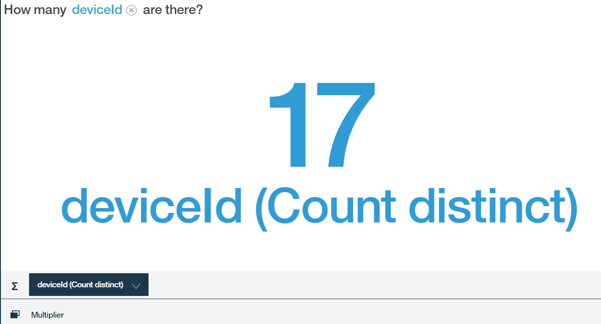
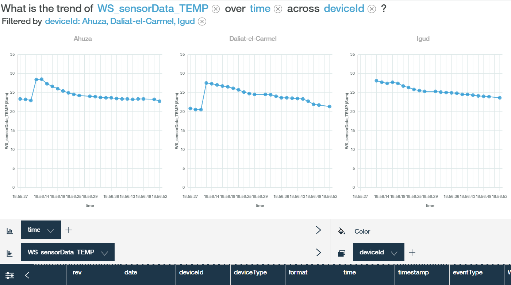

---

copyright:
  years: 2017
lastupdated: "2017-09-18"
---

---

{:new_window: target="blank"}
{:shortdesc: .shortdesc}
{:screen: .screen}
{:codeblock: .codeblock}
{:pre: .pre}


# Watson Analytics를 사용하여 데이터 분석
{: #WA_integration}  

{{site.data.keyword.iot_full}}을 Watson Analytics(WA)와 함께 사용하여 플랫폼에 연결된 디바이스에서 전송된 데이터를 시각화하고 이에 대해 알아볼 수 있습니다.
{: shortdesc}

## 개요 및 목표

이 안내서를 통해 Watson Analytics(WA)를 분석 도구로 사용하여 {{site.data.keyword.iot_short_notm}} 디바이스 이벤트 데이터를 시각화하는 프로세스를 단계별로 수행할 수 있습니다.

{{site.data.keyword.iot_short_notm}}으로 전송된 디바이스 데이터는 {{site.data.keyword.cloudantfull}} NoSQL DB 서비스를 사용하여 수집되고 {{site.data.keyword.Bluemix}}에 저장될 수 있습니다. 데이터를 수집하려면 먼저 {{site.data.keyword.iot_short_notm}}을 {{site.data.keyword.cloudant_short_notm}} 서비스에 연결해야 합니다. 데이터를 수집한 후, CSV 파일로 데이터를 내보내십시오. 디바이스 데이터를 시각화하고 분석할 수 있는 WA에 이 파일을 업로드하십시오. 디바이스 데이터는 구성된 버킷 간격에 따라 {{site.data.keyword.cloudant_short_notm}}의 일간, 주간 또는 월간 데이터베이스에 저장됩니다.


이 안내서의 일부로 다음을 학습합니다.

 - Cloudant NoSQL DB가 히스토리언 서비스로 사용되도록 플랫폼 데이터 스토리지를 구성하는 방법.
 - 날씨 센서 시뮬레이터를 사용하여 플랫폼에서 사용할 데이터를 생성하는 방법.
 - 데이터를 내보낸 후 WA에 가져와 데이터를 분석하는 방법.


## 전제조건

다음 단계를 완료하려면 [{{site.data.keyword.iot_short_notm}}()](https://console.bluemix.net/catalog/services/internet-of-things-platform){: new_window} 및 [Cloudant NoSQL DB ](https://console.bluemix.net/catalog/services/cloudant-nosql-db
){: new_window}에 대한 액세스 권한 및 [Watson Analytics()](https://www.ibm.com/watson-analytics){: new_window}에 대한 액세스 권한이 있어야 합니다.


## 1단계. 시뮬레이터 설정
{: #WA_sensor_data}


의미 있는 분석을 수행하려면 의미 있는 데이터가 있어야 합니다. 실제 센서 데이터를 시뮬레이션하여 Watson IoT Platform 디바이스 데이터를 Wastson Analytic을 사용하여 분석하는 방법에 대해 학습할 수 있습니다. 이 단계는 다음에 대한 지시사항을 제공합니다.
 - [**{{site.data.keyword.iot_short_notm}}의 기존 인스턴스**로 시뮬레이터 설정](#sim_existing_platorm)
 - [**{{site.data.keyword.iot_short_notm}}의 새 인스턴스**로 시뮬레이터 설정](#sim_new_platform)
 - [데이터와 함께 미리 작성된 CSV 샘플 파일 다운로드](#WA_sensor_premade)(시뮬레이터를 사용하지 않으려는 경우)


### {{site.data.keyword.iot_short_notm}}의 기존 인스턴스로 날씨 센서 시뮬레이터 설정
{: #sim_existing_platform}

날씨 센서 시뮬레이터를 사용하여 조직에 대해 실제 센서 데이터 이벤트를 시뮬레이션하려면 먼저 시뮬레이터를 설정해야 합니다. 이러한 단계에서는 {{site.data.keyword.iot_short_notm}}의 인스턴스를 이미 시작하고 실행한다고 가정합니다.

1. [시뮬레이터를 실행하는 데 필요한 apikey 및 토큰을 생성하십시오. ](https://console.bluemix.net/docs/services/IoT/platform_authorization.html#api-key){: new_window}
2. [날씨 센서 시뮬레이터 웹 앱 배치()](https://bluemix.net/deploy?repository=https://github.com/ibm-watson-iot/guide-weathersensors-simulator){: new_window}를 수행하고 자세한 지시사항을 따르십시오.

   날씨 센서에 대한 자세한 정보는 [날씨 센서 시뮬레이터 안내서()](https://github.com/ibm-watson-iot/guide-weathersensors-simulator){: new_window}를 참조하십시오.
3. [2단계. 데이터베이스 커넥터 구성](#WA_config_db)을 진행하십시오.


### {{site.data.keyword.iot_short_notm}}의 새 인스턴스로 날씨 센서 시뮬레이터 설정
{: #sim_new_platform}

날씨 센서 시뮬레이터를 사용하여 조직에 대해 실제 센서 데이터 이벤트를 시뮬레이션하려면 먼저 시뮬레이터를 설정해야 합니다. 이러한 단계에는 시뮬레이터와 함께 {{site.data.keyword.iot_short_notm}} 인스턴스를 작성하는 데 대한 지시사항이 포함됩니다.

1. [{{site.data.keyword.iot_short_notm}}의 인스턴스로 날씨 센서 시뮬레이터 웹 앱 배치()](https://bluemix.net/deploy?repository=https://github.com/ibm-watson-iot/guide-weathersensors-simulator&branch=bindwiotp){: new_window}를 수행하고 세부 단계를 수행하십시오.

   날씨 센서에 대한 자세한 정보는 [날씨 센서 시뮬레이터 안내서()](https://github.com/ibm-watson-iot/guide-weathersensors-simulator){: new_window}를 참조하십시오.
2. 배치가 완료되기를 기다린 다음 Bluemix 대시보드로 이동하십시오.
3. 배치 프로세스를 통해 작성된 {{site.data.keyword.iot_short_notm}} 서비스 "wiotp-for-weather-sensors-simulator"를 실행하십시오.
4. [2단계. 데이터베이스 커넥터 구성](#WA_config_db)을 진행하십시오.


### 미리 작성된 샘플 CSV 파일의 센서 데이터 사용
{: #WA_sensor_premade}

미리 작성된 CSV 파일을 사용하여 조직에 대해 실제 센서 데이터 이벤트를 시뮬레이션하려면 다음을 수행하십시오.

1. [Cloudant CSV 파일 다운로드 ](https://github.com/ibm-watson-iot/guide-weathersensors-simulator/releases/download/v1.0/cloudant.csv){: new_window}.
2. [5단계. WA 설정 및 데이터 시각화](#WA_import_data)를 진행하십시오.


## 2단계. 데이터베이스 커넥터 구성
{: #WA_config_db}

Watson Analytics와 함께 {{site.data.keyword.cloudant_short_notm}}를 사용하려면 Cloudant NoSQL DB가 히스토리언 서비스로 사용되도록 플랫폼 데이터 스토리지를 구성해야 합니다.

1. {{site.data.keyword.cloudant_short_notm}} 대시보드의 탐색줄에서 **확장**을 클릭하십시오.
2. **히스토리 데이터 스토리지**에서 **설정**을 클릭하십시오. **히스토리 데이터 스토리지 구성** 섹션에는 {{site.data.keyword.cloudant_short_notm}}와 동일한 Bluemix 영역 내에서 사용 가능한 Cloudant NoSQL DB 서비스가 모두 나열됩니다.
3. 연결할 Cloudant NoSQL DB 서비스를 선택하십시오.
4. 다음 Cloudant NoSQL DB 구성 옵션을 지정하십시오.
  - 버킷 간격 = 일
  - 시간대 = UTC
  - 데이터베이스 이름 = 기본값
5. **완료**를 클릭하고 Cloudant 서비스 연결을 위한 권한을 확인하십시오. 확인 창에 액세스하려면 브라우저에서 팝업이 사용 가능한지 확인하십시오. Cloudant NoSQL DB를 구성하면 히스토리 데이터 스토리지 상태가 구성됨 상태로 변경되고 디바이스 데이터가 {{site.data.keyword.cloudant_short_notm}} NoSQL DB에 저장됩니다.
6. [3단계. 시뮬레이터 실행](#run_simulator)을 진행하십시오.


## 3단계. 시뮬레이터 실행
{: #run_simulator}

시뮬레이터는 하이파 지역에 있는 17개 기상 관측소의 실제 날씨 센서 데이터를 {{site.data.keyword.iot_short_notm}} 조직에 공개합니다.

1. 시뮬레이터로 이동하십시오.
2. 다음 세부사항을 입력하십시오.
   - Watson IoT Platform 조직
   - API 키
   - 인증 토큰

3. **시뮬레이터 실행**을 클릭하십시오. 데이터 생성에는 몇 분이 소요됩니다.
4. 시뮬레이터가 실행되는 동안 Watson IoT Platform으로 이동하고 디바이스가 작성되었고 이벤트가 이러한 디바이스로 제공되는지 확인하십시오. 
5. [4단계. Cloudant 데이터베이스 내보내기](#WA_export_csv)를 진행하십시오.


## 4단계. Cloudant 데이터베이스 내보내기
{: #WA_export_csv}

디바이스 데이터를 저장하도록 {{site.data.keyword.cloudant_short_notm}} NoSQL DB를 구성한 경우 세 개의 데이터베이스가 커넥터를 통해 자동으로 작성됩니다. 현재 버킷 간격에 대해 하나의 데이터베이스가 작성되고, 향후 간격에 대해 하나, 구성 데이터베이스에 대해 하나가 작성됩니다. 간격의 끝에 도달한 경우, 디바이스 데이터는 새 간격의 버킷 데이터베이스에 저장되며 후속 버킷에 대해 새 데이터베이스가 작성됩니다.

{{site.data.keyword.cloudant_short_notm}}의 히스토리 데이터 스토리지 확장 기능은 Cloudant “iotp”에 디자인 문서를 작성합니다. 이 문서에는 Cloudant에 문서로 저장된 디바이스 이벤트를 CSV 형식으로 내보내는 데 사용할 수 있는 “csv”라고 하는  “list” 함수가 있습니다. JSON 형식의 이벤트만 CSV 파일로 전송됩니다. 이 디자인 문서는 향후 버킷 간격에서 모든 새 데이터베이스에 자동으로 전파됩니다.

CSV 파일에는 디바이스 이벤트 메타데이터 및 해당 페이로드에 대한 정보가 포함됩니다. 다음 목록은 이벤트 메타데이터의 예를 표시합니다.
 -	DeviceId
 -	DeviceType
 - 	EventType
 - 	Timestamp(ISO 8601 형식)

csv list 함수는 원래 시간소인을 새로운 시간 필드와 날짜 필드 둘로 나눕니다. 메타데이터 외에 CSV list 함수에는 디바이스 페이로드의 데이터 속성이 포함됩니다. 이 페이로드는 “data” 키 아래 Cloudant 문서에 표시됩니다. 날씨 센서 시뮬레이터에서 생성된 문서에는 다음 예제와 비슷한 구조가 있습니다.

```
{"deviceType": "WS",
  "deviceId": "Old-Market",
  "eventType": "sensorData",
  "format": "json",
  "timestamp": "2017-08-09T16:28:14.666Z",
  "data": { "NO2": 3.2, … }}
```

결과 CSV 파일에서 모든 페이로드 속성은 열로 표시되고 다음 접두부가 추가됩니다.

```
<deviceType>_<eventType>_  
```

위의 예에서 열 WS_sensorData_NO2가 CSV 파일에 추가됩니다.

CSV 형식으로 Cloudant 데이터베이스를 내보내려면 다음을 수행하십시오.  

1. Cloudant NoSQL DB에 로그인하십시오.
2. 내보낼 데이터베이스를 선택하십시오.
3. 선택된 데이터베이스를 여십시오.
4. 브라우저에서 새 탭을 열고 다음 URL 을 입력하십시오.
   ```
   https://{cloudant service id}-bluemix.cloudant.com/{dbName}/_design/iotp/_list/csv/by-date?include_docs=true
```
   Cloudant 서비스 ID 및 dbName을 사용자의 Cloudant 서비스 ID 및 선택한 데이터베이스 이름에 따라 변경해야 합니다. Cloudant 서비스 ID는 Cloudant 관리 대시보드 URL에서 복사할 수 있습니다.

   **예:**
   ```
   https://ccf73725-b617-4f3e-8a7e-f5fb09569af4-bluemix.cloudant.com/iotp_115ccv_default_2017-08-23/_design/iotp/_list/csv/by-date?include_docs=true
   ```

   이 예제에서는 날짜별 보기가 list 함수를 호출하는 데 사용되면 데이터는 시간소인을 기준으로 정렬됩니다. 또한 URL에 사용되는 보기를 변경하고 startkey 및 endkey 속성을 적용하여 Cloudant 보기의 기본 필터 기능을 통해 데이터를 필터링할 수 있습니다.

   **예:**
   ```
   https://{cloudant service id}-bluemix.cloudant.com/{dbName}/_design/iotp/_list/csv/by-deviceType?include_docs=true&startkey='WS'&endkey='WS'
   ```
   이 예제에서는 deviceType 보기가 CSV를 생성하는 데 사용되며 deviceType=WS의 문서만 다운로드된 파일에 포함됩니다. 특정 시간 범위 내의 문서를 선택하려면 날짜별 보기를 사용하고 다음 조회 URL을 사용하십시오(원하는 범위로 시간소인 바꾸기).
   ```
   https://{cloudant service id}-bluemix.cloudant.com/{dbName}/_design/iotp/_list/csv/by-date?statkey="2017-08-29T12:25:50.995Z"&endkey="2017-08-29T12:25:51.514Z"
   ```
5. 필요한 경우 Cloudant 신임 정보를 제공하고 CSV 파일을 다운로드하십시오. 파일 이름은 URL에 정의된 보기에 따라 생성됩니다. 예를 들어, 파일 이름은 by-date.csv 또는 by-deviceType.csv일 수 있습니다.
6. [5단계. WA 설정 및 데이터 시각화](#WA_import_data)를 진행하십시오.


## 5단계. WA 설정 및 데이터 시각화
{: #WA_import_data}

WA를 설정하고 데이터 시각화를 시작하려면 다음을 수행하십시오.

1. WA(https://watson.analytics.ibmcloud.com)에 로그인하십시오.
2. WA 홈 페이지에서 **데이터**를 선택하십시오.
3. **로컬 파일**을 클릭하고 로컬 CSV 파일을 가져오십시오. CSV 파일 이름은 데이터를 내보내는 데 사용한 보기에 따라 다릅니다(예: by-deviceType 또는 by-date).
4. 업로드한 CSV 데이터 자산을 선택하십시오.
5. **데이터에 대해 질문** 필드에서 자연어를 사용하여 질문하십시오.
5. 질문에 가장 잘 맞는 시각화 제안을 여십시오. 제안을 수동으로 수정할 수 있습니다.
7. 시각화를 저장하십시오.


## WA를 사용한 데이터 시각화 예제
{: #WA_visualize}

이 절에서는 WA를 분석 도구로 사용하여 데이터를 분석하는 예제를 표시합니다.

**참고:** 이러한 예제는 고유 시각화를 수행할 때 예상되는 상황을 이해하는 데 도움이 됩니다. 예를 들어, 서로 다른 날짜와 시간에 데이터가 수집되었으므로, 여기에 표시되는 예제의 결과가 샘플 데이터를 사용해 이러한 시각화를 수행할 때 표시되는 결과와 다를 수 있습니다.

### 디바이스 상태 시각화

이 절에서는 IoT 디바이스 모집단에 대해 학습하고 다음과 같은 질문에 응답합니다.

1. 보고한 디바이스의 수는 몇 개입니까?
2. 디바이스 유형당 디바이스의 분석 결과는 무엇입니까?
3. 하나의 디바이스에 몇 개의 보고서가 있습니까?
4. 각 디바이스에서 보낸 보고서의 수는 몇 개입니까?

**보고한 디바이스의 수는 몇 개입니까?**

이 예제에서는 지정된 간격 동안 보고한 디바이스의 수를 세어 디바이스가 예상대로 보고했는지 여부를 발견합니다. 이 분석을 완료하려면 다음 질문을 복사하여 붙여넣거나 WA에 입력하십시오.

*"How many deviceId are there?"*

다음은 17개의 디바이스가 있음을 표시하는 결과입니다.



**디바이스 유형당 디바이스의 분석 결과는 무엇입니까?**

이 예제에서는 간격 동안 보고한 디바이스 유형당 디바이스 수를 비교하여 모든 디바이스 유형의 디바이스가 예상대로 보고했는지 판별합니다. 이 분석을 완료하려면 다음 질문을 복사하여 붙여넣거나 WA에 입력하십시오.

*"How does the number of deviceId compare by deviceType?"*

다음은 디바이스 유형당 디바이스의 분석 결과입니다.


이 데이터를 원형 차트로 보려면 왼쪽에 있는 **시각화**를 클릭하고 **원형**을 선택하십시오.


**하나의 디바이스에 몇 개의 보고서가 있습니까?**

이 예제에서는 디바이스에서 작성된 보고서의 수를 세어 네트워크 조건 및 기타 디바이스 관련 문제를 발견합니다. 이 분석을 완료하려면 다음 질문을 복사하여 붙여넣거나 WA에 입력하십시오.

*"How many rows are there? filtered by deviceId: Ahuza"*

**참고:** 전체 필드 이름을 입력하지 않아도 됩니다. WA가 전체 필드 이름을 추측하려고 하지만 필터 값(예: "Ahuza")이 완전하고 올바르게 제공되어야 합니다. 필터에 대한 올바른 제안이 표시되지 않으면 **다음에 표시** 링크를 클릭하거나 *"How many rows are there?"*라고 질문하십시오. 그런 다음 다이어그램을 열고 다이어그램 아래의 **승수**란을 클릭하고 목록에서 deviceId 매개변수를 선택하십시오. 관련 없는 모든 deviceId는 선택 취소하십시오.

다음은 디바이스 Ahuza에서 작성된 25행 이상의 보고서가 있음을 표시하는 결과입니다.


**서로 다른 각 디바이스에 몇 개의 보고서가 있습니까?**

이 예제에서는 검사된 간격 중에 각 디바이스가 보낸 보고서의 수를 기준으로 디바이스의 활동 레벨을 비교합니다. 이 분석을 완료하려면 다음 질문을 복사하여 붙여넣거나 WA에 입력하십시오.

*"How does the number of Rows compare by deviceId?"*

다음은 여러 디바이스의 디바이스 활동에 대한 막대 그래프를 표시한 결과입니다.


### 디바이스 유형 센서 데이터 시각화

이 절에서는 단일 디바이스 유형의 모든 디바이스에서 보고된 센서 데이터 요약에 대해 학습하고 다음과 같은 질문에 응답합니다.

1. 보고된 모든 센서 값의 평균값/최소값/최대값은 얼마입니까?
2. 센서 출력의 히스토그램을 볼 수 있습니까?  
3. 두 센서 간 상관 관계는 무엇입니까?


**보고된 모든 센서 값의 평균값/최소값/최대값은 얼마입니까?**

이 예제에서는 단일 디바이스 유형의 모든 디바이스에서 보고된 숫자 매개변수를 하나의 테이블로 요약합니다. 이 테이블을 통해 환경에서 감지된 값의 범위를 알고 감지된 데이터에 대한 폭넓은 관점을 가질 수 있습니다.

다음 단계를 사용하여 이 시각화를 수동으로 빌드해야 합니다.

1.	**고유 시각화 작성** 섹션에서 **테이블**을 선택하십시오.
2.	"열 새로 작성" 더하기 부호 단추를 클릭하고 **계산**을 선택하십시오.
3.	새 열의 이름을 지정하고 **열** 드롭 다운 목록에서 이 계산을 위한 열을 선택하고 **완료**를 클릭하여 열을 복제하십시오. 새 열이 데이터 트레이의 오른쪽 끝에 추가됩니다.
4.	새 열의 제목을 마우스 오른쪽 단추로 클릭하고 집계 유형(최소, 최대 또는 평균)을 선택한 다음 특성 창을 닫으십시오.
6.	프로세스를 반복하여 열을 추가한 다음 데이터 트레이를 숨기십시오.
7.	**열**을 클릭하고 목록의 맨 아래에서 **측정**을 선택하십시오.
8.	**집계 기준**을 클릭하고 추가한 계산을 모두 선택하십시오.
9.	**완료**를 클릭하십시오.
10.	시각화를 저장하십시오.

다음은 값의 범위를 표시한 결과입니다.


**디바이스 센서 출력의 히스토그램을 볼 수 있습니까?**

이 예제에서는 단일 디바이스 유형의 모든 디바이스에서 센서 동작을 평가하며, 환경에서 감지된 값의 분포를 식별합니다. 이 시각화를 사용하여 센서에서 감지된 환경 및 센서의 제한사항에 대해 알아볼 수 있습니다. 이 분석을 완료하려면 다음 질문을 복사하여 붙여넣거나 WA에 입력하십시오.

*"How does the number of Rows compare by TEMP?"*

다음은 행 수의 비교를 표시한 결과입니다.


**두 센서 간 상관 관계는 무엇입니까?**

이 예제에서는 디바이스 유형의 모든 디바이스에서 두 디바이스 센서의 측정치를 비교하여 환경에서의 상관 관계에 대해 알아봅니다. 이 분석을 완료하려면 다음 질문 중 하나를 복사하여 붙여넣거나 WA에 입력하십시오.

*"What is the relationship between NO2 and NOX?"* 또는 *"How are the values of NO2 and NOX associated?"*

다음은 두 개의 센서 간 관계를 표시한 결과입니다.


또한 디바이스 ID마다 색상 있는 점을 사용하여 센서 데이터를 볼 수도 있습니다. 이렇게 하려면 **색상**란에서 deviceID를 선택하십시오.

다음은 디바이스의 제한된 서브세트를 표시한 결과입니다.


### 센서 세부사항 시각화(심층 분석)

이 절에서는 특정 디바이스에서 보고된 특정 매개변수에 대해 알아보고 다음 질문에 응답합니다.

1.	평균/최소/최대 보고 값은 얼마입니까?
2.	디바이스 센서 출력의 히스토그램을 볼 수 있습니까?
3.	특정 디바이스 센서 값은 시간에 따라 어떻게 변화합니까?
4.	시간에 따른 두 디바이스의 센서 값을 어떻게 비교합니까?
5.	시간에 따른 동일한 디바이스의 센서 값을 어떻게 비교합니까?
6.	디바이스의 두 센서 간 상관 관계는 무엇입니까?


**평균/최소/최대 보고 값은 얼마입니까?**

이 예제에서는 특정 디바이스에서 보고된 숫자 매개변수를 하나의 테이블로 요약하여 예를 들어, 환경에서 감지된 값의 범위 또는 센서 오작동에 대해 알아봅니다.

다음 단계를 사용하여 이 시각화를 수동으로 빌드해야 합니다.

1)	**고유 시각화 작성** 섹션에서 **테이블**을 선택하십시오.
2)	"열 새로 작성" 더하기 부호 단추를 클릭하고 **계산**을 선택하십시오.
3)	새 열의 이름을 지정하고 **열** 드롭 다운 목록에서 이 계산을 위한 열을 선택하고 **완료**를 클릭하여 열을 복제하십시오. 새 열이 데이터 트레이의 오른쪽 끝에 추가됩니다.
4)	새 열의 제목을 마우스 오른쪽 단추로 클릭하고 집계 유형(최소, 최대 또는 평균)을 선택한 다음 **특성** 창을 닫으십시오.
6)	프로세스를 반복하여 열을 추가한 다음 데이터 트레이를 숨기십시오.
7)	**열**을 클릭하고 **측정**을 선택하십시오.
8)	**집계 기준**을 클릭하고 추가한 계산을 모두 선택하십시오.
9)	**완료**를 클릭하십시오.
10)	승수란에서 deviceId 매개변수를 선택하고 표시할 관련 디바이스를 선택하십시오.
11)	시각화를 저장하십시오.

다음은 지정된 값을 표시한 결과입니다.


**디바이스 센서 출력의 히스토그램을 볼 수 있습니까?**

이 예제에서는 특정 디바이스 센서의 동작을 평가하며, 환경에서 감지된 값의 분포를 식별합니다. 이 시각화를 사용하여 센서에서 감지된 환경 및 센서의 잠재적 오작동에 대해 알아볼 수 있습니다. 이 분석을 완료하려면 다음 질문 중 하나를 복사하여 붙여넣거나 WA에 입력하십시오.

*"What is the distribution of TEMP? filtered by deviceId: Ahuza"* 또는 *"How does the number of Rows compare by TEMP? filtered by deviceId: Ahuza"*

다음은 히스토그램으로 디바이스 센서 출력 데이터를 표시한 결과입니다.


**특정 디바이스 센서 값은 시간에 따라 어떻게 변화합니까?**

이 예제에서는 시간에 따른 환경에서의 변화를 반영한, 특정 디바이스의 특정 센서 측정값의 변화를 알아봅니다. 이는 플랜 및 문제점 발견에 도움이 될 수 있습니다. 이 분석을 완료하려면 다음 질문을 복사하여 붙여넣거나 WA에 입력하십시오.

*"What is the trend of TEMP over time? filtered by deviceId: Ahuza".*

다음은 시간에 따른 센서 데이터 동향을 표시한 결과입니다.


**시간에 따른 두 디바이스의 센서 값을 어떻게 비교합니까?**

이 예제에서는 서로 다른 디바이스의 센서 측정값의 동향을 비교하며, 디바이스 간 관계를 식별하여 이상 항목, 디바이스 오작동 등을 발견합니다. 이 분석을 완료하려면 다음 질문 중 하나를 복사하여 붙여넣거나 WA에 입력하십시오.

*"What is the trend of TEMP over time by deviceId?"* 또는 *"What is the trend of TEMP over time by deviceId?  filtered by deviceId: Ahuza, Igud"*

다음은 시간에 따른 센서 값 비교를 표시한 결과입니다.


또한 차트의 맨 아래에 있는 매개변수 이름을 클릭하여 이 정보를 볼 수 있습니다. 여러 개의 선이 그려집니다(deviceId당 하나). 관련 deviceId는 목록에서 선택할 수 있습니다.


차트 아래 **승수**란을 사용하고 deviceId를 선택하여 차트를 나란히 표시할 수 있습니다.




**시간에 따른 동일한 디바이스의 센서 값을 어떻게 비교합니까?**

이 예제에서는 두 디바이스 센서의 동향을 수동으로 시각화하여 시간에 따른 환경 변화에 대한 통찰을 얻게 됩니다. 이 분석을 완료하려면 다음 질문을 복사하여 붙여넣거나 WA에 입력하십시오.

*"What is the trend of NO2 and NOX over time by deviceId?  filtered by deviceId: Ahuza"*

다음은 시간에 따른 두 디바이스 센서의 동향을 표시한 결과입니다.


**디바이스의 두 센서 간 상관 관계는 무엇입니까?**

이 예제에서는 두 디바이스 센서의 측정치를 비교하여 환경에서의 상관 관계에 대해 알아봅니다. 이 분석을 완료하려면 다음 질문 중 하나를 복사하여 붙여넣거나 WA에 입력하십시오.

*"What is the relationship between NO2 and NOX? filtered by deviceId: Ahuza"* 또는 *"How are the values of NO2 and NOX associated? filtered by deviceId: Ahuza"*

다음은 단일 디바이스의 두 센서 간 상관 관계를 표시한 결과입니다.


## 다음 항목

WA에 대한 자세한 정보는 다음 리소스를 참조하십시오.
- [Watson Analytics Developer Center ](https://developer.ibm.com/watson-analytics/){: new_window}
- [Watson Analytics 커뮤니티 ](https://www.ibm.com/communities/analytics/watson-analytics/){: new_window}
- [Watson Analytics 포럼 ](https://community.watsonanalytics.com/discussions/spaces/15/view.html){: new_window}
