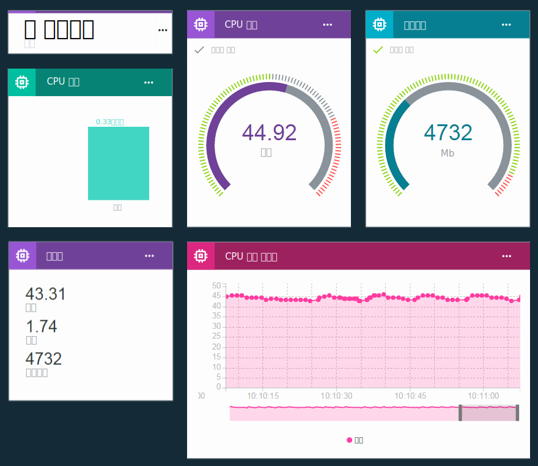

---

copyright:
  years: 2016, 2018
lastupdated: "2018-03-13"

---

{:new_window: target="\_blank"}
{:shortdesc: .shortdesc}
{:screen: .screen}
{:codeblock: .codeblock}
{:pre: .pre}
{:tip: .tip}

# 보드 및 카드를 사용하여 실시간 데이터 시각화
{: #boards_and_cards}

**중요:** {{site.data.keyword.iot_full}}이 규칙과 조치를 제공하는 방식을 향상하기 위해 폭넓은 프로그램 개선의 일부로 사용자의 IoT 디바이스에서 규칙을 정의하는 새로운 방식에 관한 베타를 출시합니다.

더 자세히 알아보려면 [IoT 데이터에서 규칙 정의를 위한 다른 접근 방법 ](https://developer.ibm.com/iotplatform/2018/03/01/alternative-approach-defining-rules-iot-data/){: new_window} 블로그 게시물을 확인하십시오.

자체 규칙 정의를 시작하려면 [임베디드 규칙 작성(베타)](information_management/im_rules.html) 문서를 참조하십시오.

## 보드 및 카드 정보

보드 및 카드를 작성하여 실시간으로 디바이스 데이터를 시각화하는 자체 대시보드를 작성하고 공유할 수 있습니다.

보드 및 카드를 사용하면 빠른 개요를 제공하고 데이터 이해도를 개선할 수 있도록 하나 이상의 디바이스에서 데이터 세트 값을 그래픽 방식으로 시각화할 수 있습니다. 보드를 작성하고 데이터를 원시 값, 실시간 그래프, 게이지 등으로 표시하는 카드를 추가하십시오. 구성원을 보드에 추가하여 이를 조직의 기타 사용자와 공유하십시오. 카드를 배열하고 설명용 텍스트 디바이더를 추가하여 사용자 프리젠테이션을 미세 조정하십시오.  

[고유 사용자 정의 카드를 작성](custom_cards/custom-cards.html)하여 기본 카드 세트를 확장할 수도 있습니다.

## 기본 보드
{: #default_boards}
{{site.data.keyword.iot_short_notm}} 대시보드에는 다음의 기본 보드가 있습니다.

|보드 이름 |설명 |포함된 카드
|:---|:---|:---|  
|사용량 개요  |조직의 사용량 통계입니다. 디바이스 유형 및 이용된 데이터를 나열합니다. | <ul><li>디바이스 유형<li>전송된 데이터</ul>
|규칙 중심 분석 |조직의 규칙입니다. 추가 카드에는 트리거된 경보, 연관된 디바이스, 디바이스 특성 및 경보 정보가 나열되어 있습니다. | <ul><li>규칙 I 관리<li>규칙 경보<li>규칙 경보 정보<li>연관된 디바이스<li>디바이스 정보<li>디바이스 특성</ul>  
|디바이스 중심 분석 |조직에 연결된 디바이스입니다. 추가 카드에는 선택된 디바이스에 대한 경보, 선택된 디바이스에 대한 정보, 디바이스 특성 및 경보 정보가 표시되어 있습니다. | <ul><li>디바이스 I 관리<li>디바이스 정보<li>해당 디바이스에 대한 규칙 경보<li>규칙 경보 정보<li>디바이스 특성</ul>
|위험성 및 보안 개요(베타) |조직의 전체 보안 상태입니다. 시스템 운영자 및 보안 분석가는 규제 준수 세부사항, 디바이스의 연결 상태, 연결 실패의 원인 및 블랙리스트 또는 화이트리스트를 통해 차단되거나 허용되는 디바이스를 볼 수 있습니다.  연결 규제 준수 카드에서 사용자는 규제 비준수 디바이스에 대한 자세한 보고서로 드릴 다운할 수 있으며 보고서를 Excel로 내보낼 수 있습니다. | <ul><li>정책 준수<li>연결 보안<li>블랙리스트/화이트리스트 준수</ul>

카드를 추가하고 업데이트하며 제거하여 이러한 보드를 업데이트할 수 있습니다.

기본 보드를 그 원래 상태로 재설정하기 위해 이를 삭제할 수 있습니다. 그리고 보드는 원래 카드로 재작성됩니다.
{: tip}

## 보드 및 카드 작성
{: #visualizing_data}

{{site.data.keyword.iot_short_notm}}은 디바이스가 리턴 중인 실시간 데이터를 표시하는 데 사용할 수 있는 기본 제공 대시보드를 제공합니다. 기본적으로, 개요 페이지는 {{site.data.keyword.iot_short_notm}} 조직에 대한 사용량 정보(예: 데이터 및 이용된 스토리지 영역)를 표시합니다. 유입되는 실시간 디바이스 데이터를 보려면 디바이스 특정 카드를 이 페이지에 추가하십시오.

실시간 디바이스 데이터를 표시하는 방법에 대한 단계별 지시사항의 레시피는 [새 Watson IoT 대시보드에서 보드 & 카드 구성 ](https://developer.ibm.com/recipes/tutorials/configuring-the-cards-in-the-new-watson-iot-dashboard/){: new_window} 레시피를 참조하십시오.
{: tip}

보드를 작성하고 그 보드에 카드를 추가하려면 다음을 수행하십시오.
1. {{site.data.keyword.iot_short_notm}} 대시보드에서 **보드**를 선택하십시오.
2. 해당 권한을 편집 중인 보드를 선택하거나 새 보드를 작성하십시오.
3. 보드에서 **새 카드 추가**를 클릭하십시오.
3. 카드 유형을 선택하십시오.  
**팁:** 디바이스 유형 카드에 어떤 시각화를 선택해야 할지 확실하지 않은 경우, **일반 시각화**를 선택하십시오. 나중에 카드 유형을 변경할 수 있습니다.
<dl>
<dt>디바이스</dt>
<dd><table>
<thead>
<tr>
<th>유형</th>
<th>표시되는 데이터</th>
</tr>
</thead>
<tbody>
<tr>
<td>일반 시각화</td>
<td>하나 이상의 데이터 세트의 값입니다.  **팁:** 소형 테이블에서 최대 세 개의 데이터 점 값을 보려면 대형 위젯 크기를 선택하십시오. </td>
</tr>
<tr>
<td>선형 차트</td>
<td>실시간 화면 이동 차트에서 하나 이상의 데이터 세트입니다. 설정 메뉴를 사용하여 데이터 범위 및 보관, 그래프의 룩앤필 등을 설정할 수 있습니다. </td>
<tr>
<td>막대형 차트</td>
<td>레이블 지정된 막대의 데이터 세트 값입니다. 설정 메뉴를 사용하여 가로 또는 세로 막대 방향을 토글할 수 있습니다.</td>
</tr>
<tr>
<td>도넛형 차트</td>
<td>원형으로 표시된 둘 이상의 데이터 세트입니다.</td>
</tr>
<tr>
<td>값</td>
<td>하나 이상의 데이터 세트의 원시 값입니다.</td>
</tr>
<tr>
<td>게이지</td>
<td>게이지로 표시된 데이터 세트 값입니다. 설정 메뉴를 사용하여 하단, 중간 및 상단 데이터 범위에 대한 게이지 임계값을 선택사항으로 설정할 수 있습니다.  </td>
</tr>
<tr>
<td>디바이스 특성</td>
<td>하나 이상의 디바이스에 대한 특정 특성입니다.</td>
</tr>
<tr>
<td>모든 디바이스 특성</td>
<td>하나 이상의 디바이스에 대한 모든 특성입니다.</td>
</tr>
<tr>
<td>디바이스 목록</td>
<td>여러 디바이스를 모니터하기 위한 목록입니다. 목록은 다른 카드에 대한 데이터 소스로 사용할 수 있습니다.  카드 설정의 디바이스 ID 및 유형으로 목록을 필터링할 수 있습니다. 크기 L 이상의 디바이스 목록도 카드에서 필터 아이콘을 클릭하여 상호적으로 필터링할 수 있습니다. 필터 항목은 단일 항목, 범위(x-y) 또는 쉼표로 구분해서 추가할 수 있습니다.  기본적으로 목록에 디바이스 ID 및 유형이 표시됩니다. 카드에 다른 디바이스 메타데이터도 표시하도록 목록 카드 설정을 구성할 수 있습니다.  </td>
</tr>
<tr>
<td>디바이스 정보</td>
<td>단일 디바이스에 대한 기본 정보입니다.</td>
<tr>
<td>디바이스 맵</td>
<td>디바이스 목록에서 디바이스의 위치입니다.</td>
</tr>
</tbody>
</table>
</dd>
<dt>분석</dt>
<dd>
<table>
<thead>
<tr>
<th>유형</th>
<th>표시되는 데이터</th>
</tr>
</thead>
<tbody>
<tr>
<td>규칙</td>
<td>경보가 있는 규칙의 목록입니다.</td>
</tr>
<tr>
<td>규칙 경보</td>
<td>디바이스에 대한 경보의 목록입니다.</td>
</tr>
<tr>
<td>경보 정보</td>
<td>단일 경보에 대한 기본 정보입니다.</td>
</tr>
</tbody>
</table>
</dd>
<dt>위험성 관리(베타)</dt>
<dd>[고급 보안](reference/security/RM_security.html) 조직과 함께만 사용 가능합니다.
<table>
<thead>
<tr>
<th>유형</th>
<th>표시되는 데이터</th>
</tr>
</thead>
<tbody>
<tr>
<td>정책 준수</td>
<td>연결 보안의 개요 및 블랙리스트와 화이트리스트가 있는 디바이스의 개요입니다.</td>
</tr>
<tr>
<td>블랙리스트/화이트리스트 준수</td>
<td>블랙리스트 또는 화이트리스트가 있는 디바이스의 수입니다.</td>
</tr>
<tr>
<td>연결 보안</td>
<td>연결 보안 검사에 실패한 디바이스의 수입니다.</td>
</tr>
</tbody>
</table>
</dd>
<dt>사용량</dt>
<dd>
<table>
<thead>
<tr>
<th>유형</th>
<th>표시되는 데이터</th>
</tr>
</thead>
<tbody>
<tr>
<td>디바이스 유형</td>
<td>조직의 디바이스 유형별 등록된 디바이스의 수를 표시하는 원형 차트입니다.</td>
</tr><tr>
<td>전송된 데이터</td>
<td>조직에 대한 전송된 데이터의 사용량 통계입니다.</td>
</tr>
</tbody>
</table>
</dd>
<dt>기본</dt>
<dd>
<table>
<thead>
<tr>
<th>유형</th>
<th>표시되는 데이터</th>
</tr>
</thead>
<tbody>
<tr>
<td>구분 기호</td>
<td>보드에서 카드를 구성하고 그룹화하기 위한 가로 구분 기호입니다.</td>
</tr>
</tbody>
</table>
</dd>
</dl>

4.	카드 소스 데이터를 선택하십시오.  
하나 이상의 카드 데이터 소스를 선택한 후에 **다음**을 클릭하십시오.  
데이터 소스는 등록된 단일 디바이스이거나 다른 카드입니다. 카드 데이터 소스를 사용하려면 목록 또는 맵 카드가 보드에 있어야 합니다.  
5. 각 데이터 소스에 대해 하나 이상의 데이터 세트를 추가하십시오.
 - 디바이스
    2. 표시할 데이터 점이 포함된 이벤트를 선택하십시오.
    3.	데이터 점을 표시하는 특성을 선택하십시오.
    1.	데이터 세트에 식별 이름을 부여하십시오.
    4.	데이터 점에 대한 유형, 단위, 정밀도, 최소 및 최대 값을 설정하십시오.  
    완료되면 **새 데이터 세트**를 클릭하여 데이터 세트를 더 추가하거나 **다음**을 클릭할 수 있습니다.
 - 목록
    2. 하나의 디바이스 유형을 선택하거나 **임의의 디바이스 유형**을 선택하십시오.
    2. 표시할 데이터 점이 포함된 이벤트를 선택하십시오.
    3.	데이터 점을 표시하는 특성을 선택하십시오.
    1.	데이터 세트에 식별 이름을 부여하십시오.
    4.	데이터 점에 대한 유형, 단위, 정밀도, 최소 및 최대 값을 설정하십시오.  
    완료되면 **새 데이터 세트**를 클릭하여 데이터 세트를 더 추가하거나 **다음**을 클릭할 수 있습니다.
5.	카드 미리보기에서 카드 시각화 사용자 정의  
 7. 프리젠테이션 크기를 선택하십시오.  
보드에서 카드의 크기를 설정하는 것 외에도 카드 크기 설정은 나열되는 디바이스의 수, 표시되는 그래프 메타데이터 등과 같은 다른 프리젠테이션 변수를 제어합니다.   
**팁:** 다른 크기의 카드 미리보기를 보려면 다른 크기 레이블을 클릭하십시오.
 8. 추가 설정을 구성하십시오.  
카드가 지원하는 경우, **설정**을 클릭하여 구성할 수 있는 추가 설정(예: 게이지 유형 카드에 대한 데이터 범위 및 디바이스 목록 카드에 대한 필터링 옵션)을 확인하십시오.
6. 카드 정보를 업데이트하십시오.  
 1. 카드의 제목 및 설명을 제공하고 선택사항으로 색상 구성표를 선택하십시오.   
 2. 카드를 작성하려면 **제출**을 클릭하십시오.
7.	알맞은 위치로 끌어와서 보드에서 새 카드의 위치를 지정하십시오.  
