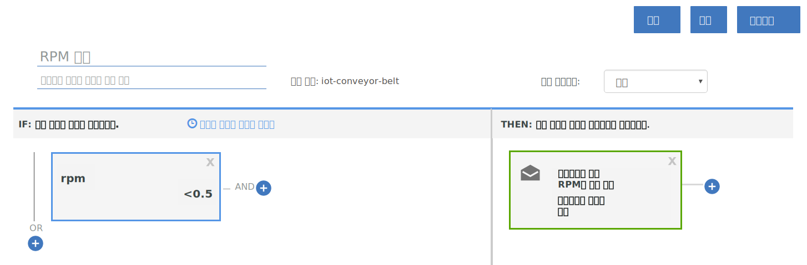

---

copyright:
  years: 2017, 2018
lastupdated: "2018-01-11"

---

{:shortdesc: .shortdesc}
{:new_window: target="_blank"}
{:codeblock: .codeblock}
{:pre: .pre}
{:screen: .screen}
{:tip: .tip}

# 안내서 2: 기본 실시간 규칙 및 조치 사용

**중요:** {{site.data.keyword.iot_full}}이 규칙과 조치를 제공하는 방식을 향상하기 위해 폭넓은 프로그램 개선의 일부로 사용자의 IoT 디바이스에서 규칙을 정의하는 새로운 방식에 관한 베타를 출시합니다.

더 자세히 알아보려면 [IoT 데이터에서 규칙 정의를 위한 다른 접근 방법 ](https://developer.ibm.com/iotplatform/2018/03/01/alternative-approach-defining-rules-iot-data/){: new_window} 블로그 게시물을 확인하십시오.

자체 규칙 정의를 시작하려면 [임베디드 규칙 작성(베타)](../information_management/im_rules.html) 문서를 참조하십시오.

## 개요 및 목표
{: #overview}  

컨베이어 벨트 IoT 데이터의 일부 실시간 분석에 대한 기본 규칙 및 조치 세트를 구성하려면 이 안내서에서 지시사항을 사용하십시오.

컨베이어 벨트를 설정하고 {{site.data.keyword.iot_full}}에 연결하며 일부 데이터를 전송했으므로, 규칙 및 조치를 사용하여 해당 데이터가 작동되도록 합니다.



이 안내서의 일부로 다음을 수행합니다.
- 컨베이어 벨트 디바이스 이벤트 데이터의 메시지 스키마를 작성합니다.
- 규칙을 작성하고 트리거합니다.
- 이메일 조치를 작성합니다.

## 전제조건
{: #prereqs}  
또한 이벤트 이름이 `sensorData`이고 다음 특성이 포함된 메시지 페이로드가 있는 이벤트를 전송하는 디바이스 유형 `iot-conveyor-belt`의 연결된 디바이스가 있어야 합니다.
```
{
	"d": {
		"id": "belt1",
		"ts": 1494946276931,
		"ay": "0.00",
		"running": true,
		"rpm": "1.0"
		}
}
```
디바이스 이벤트 및 메시징 형식에 대한 자세한 정보는 [이벤트 공개](/docs/services/IoT/devices/mqtt.html#publishing_events)를 참조하십시오.  
[안내서 1: {{site.data.keyword.iot_short_notm}} 및 시뮬레이션된 컨베이어 벨트 시작하기](getting-started-iot-conveyor.html)를 완료하면 모든 준비가 된 것입니다.  
{: tip}

## 1단계 - 샘플 앱의 메시지 스키마 작성
{: #create_schema}

디바이스가 규칙의 트리거로 전송한 특성을 사용하려면 먼저 {{site.data.keyword.Bluemix_notm}}의 메시징 스키마에 이러한 특성을 맵핑해야 합니다. 자세한 정보는 [디바이스 유형 스키마 작성](/docs/services/IoT/im_schemas.html#iotrtinsights_task)을 참조하십시오.
1. {{site.data.keyword.iot_short_notm}} 대시보드에서 **디바이스**로 이동하고 **스키마 관리**를 선택하십시오.
2. **스키마 추가**를 클릭하십시오.
3. **iot-conveyor-belt** 디바이스 유형을 선택하고 **다음**을 클릭하십시오.
4. 스키마에 특성을 추가하십시오.
 1. **특성 추가**를 클릭하십시오.
 2. **연결에서**를 선택하십시오.
 3. rpm 값을 변경하여 컨베이어 벨트 데이터 점을 전송하십시오.
컨베이어 벨트 웹 앱에서 **중지** 또는 **시작**을 클릭하여 메시지를 공개하십시오.  
특성 목록은 디바이스가 보낸 특성으로 채워집니다.
 4. 모든 특성을 선택한 후 **확인**을 클릭하십시오.
5. **완료**를 클릭하여 스키마를 작성하십시오.  

스키마가 작성되고 rpm 데이터 유형이 float로 설정됩니다.

## 2단계 - rpm 특성에 대한 단순 규칙 작성
{: #create_rule}  
{{site.data.keyword.Bluemix_notm}} 규칙 엔진은 디바이스가 보낸 특성 데이터 점을 규칙에 설정된 정적 임계값과 비교하며 규칙 조건이 충족되면 규칙을 트리거합니다. 규칙에 대한 자세한 정보는 [클라우드 분석](/docs/services/IoT/cloud_analytics.html#rules)을 참조하십시오.
컨베이어 벨트 rpm 값이 0.5 미만일 때 트리거되는 규칙을 작성하려면 다음을 수행하십시오.
1. rpm 특성 유형을 float로 변경하십시오.  
규칙 작성 시 숫자 rpm 값을 임계값과 비교할 수 있습니다. 이렇게 하려면 특성이 float 또는 정수로 인식되어야 합니다.
 1. {{site.data.keyword.iot_short_notm}} 대시보드에서 **디바이스**로 이동하고 **스키마 관리**를 선택하십시오.
 1. 작성한 새 스키마를 클릭하고 **특성**을 선택하십시오.
 2. 편집 아이콘을 클릭하여 스키마를 편집하십시오.
 3. `rpm` 특성 옆에 있는 편집 아이콘을 클릭하십시오.
 4. 데이터 유형을 `Float`로 변경하십시오.  
 5. **확인**을 클릭하십시오.
 6. **완료**를 클릭하여 스키마를 업데이트하십시오.  
2. 규칙을 작성하십시오.
 1. 대시보드에서 **규칙**으로 이동하십시오.
 2. **클라우드 규칙 작성**을 클릭하십시오.
 3. 이름에 대해 `RPM rule`을 입력하십시오.
 4. **iot-conveyor-belt** 스키마에 적용할 규칙을 설정하십시오.
 5. **다음**을 클릭하십시오.
 6. 규칙 조건을 추가하십시오.
    6. **새 조건** 타일을 클릭하여 규칙의 조건을 추가하십시오.
    7. **rpm** 특성을 선택하십시오.
    8. 미만 연산자(`<`)를 선택하십시오.
    9. 값에 대해 `0.5`를 입력하고 **확인**을 클릭하십시오.
    10. **저장**을 클릭한 다음 **닫기**를 클릭하십시오.
 11. **닫기**를 클릭하십시오.  
새 규칙은 "비활성됨" 상태로 나열됩니다.
12. 상태 스위치를 클릭하여 규칙을 활성화하십시오.
상태는 이제 "활성화됨"으로 나열됩니다.

## 3단계 - 규칙 트리거
{: #trigger_rule}
rpm을 낮춰 운영자의 개입이 필요할 수 있는 컨베이어 벨트에 대한 문제를 시뮬레이션할 수 있습니다. rpm의 임계값에 도달하면 경보가 대시보드에 표시됩니다.
1. {{site.data.keyword.iot_short_notm}} 대시보드에서 **보드**를 선택하십시오.
3. **규칙 중심 분석** 보드를 선택하십시오.
4. 컨베이어 벨트 웹 앱에서는 rpm 값을 0.5초 미만으로 줄이십시오.
센서 측정값이 변경되면 디바이스는 데이터를 {{site.data.keyword.iot_short_notm}}에 전송합니다. 컨베이어 벨트의 속도를 중지, 시작 또는 변경하여 데이터 전송을 시뮬레이션할 수 있습니다.  
5. `RPM rule`이 경보 카드가 있는 규칙에 표시되는지 확인하십시오.
6. 규칙 경보 카드에서 새 경보를 선택하고 규칙 경보 정보 카드에서 규칙을 트리거한 데이터 점을 보십시오.  
경보에 대한 자세한 정보를 보려면 연관된 디바이스, 디바이스 정보 및 디바이스 특성 카드에서 디바이스 세부사항을 참조하십시오.  
{: tip}

## 4단계 - RPM 규칙이 트리거될 때 수행할 조치 작성
{: #create_action}
{{site.data.keyword.iot_short_notm}} 대시보드에 경보를 표시하는 것 외에 규칙이 트리거될 때 수행하는 조치(예: rpm이 너무 낮은 경우 컨베이어 벨트를 검사하도록 운영자에게 이메일 발송)를 작성할 수 있습니다. 자세한 정보는 [클라우드 분석](/docs/services/IoT/cloud_analytics.html#shared)을 참조하십시오.
이메일 조치를 작성하려면 다음을 수행하십시오.
1. {{site.data.keyword.iot_short}} 대시보드에서 **규칙**으로 이동하십시오.
2. **RPM 규칙**을 클릭하십시오.
3. **새 조치** 타일을 클릭하십시오.
4. 조치를 작성하십시오.
 1. **조치 추가**를 클릭하십시오.
 2. 조치 이름 `Notify operator about low RPM`을 입력하십시오.
 3. 설명 `Send an email to the operator`를 입력하십시오.
 4. **이메일 발송** 유형을 선택하십시오.
 5. **다음**을 클릭하십시오.
 6. 제목 행에 `Low RPM alert`를 입력하십시오.
 7. 수신 필드에서 **특정 사용자**를 선택하고 `operator@company.com`을 입력하십시오.  
이메일 주소를 자신의 주소로 대체하십시오.
 8. **데이터 포함**을 선택하여 이메일에 디바이스 데이터를 포함하십시오.
 9. **완료**를 클릭하여 조치를 저장하십시오.  
5. 목록에서 조치를 선택하고 **확인**을 클릭하여 조치를 설정하십시오.
6. **저장**을 클릭하여 규칙이 있는 조치를 사용으로 설정하십시오.
7. 새 조치를 테스트하십시오.
 4. 컨베이어 벨트 웹 앱에서는 rpm 값을 0.5초 미만으로 줄이십시오.
 5. 경보 이메일을 받았는지 확인하십시오.  
메시지 본문은 다음 예제와 비슷합니다.
> **규칙:** RPM 규칙  
> **디바이스:** 3m5wxr:iot-conveyor-belt:belt1  
> **날짜:** 2017-05-09T18:21:21.567Z  
> **조건:**  
> iot_conveyor_belt.d.rpm<0.5  
> **수신 메시지:**  
> {"d":{"id":"belt1","ts":1494354089837,"ay":"0.00","rpm":"0.4","running":true},"ruleContent":{"jobID":"sdIyBfdu","contextSchemas":[],"ruleDescription":"","severity":4,"messageSchemas":["iot_conveyor_belt"],"disabled":false,"ruleCondition":"iot_conveyor_belt.d.rpm<0.5","transforms":[],"name":"RPM rule","actions":["pziIRovt"],"id":"ncKK4N7k","updated":"9 May 2017 18:20:25 GMT","created":"9 May 2017 17:41:38 GMT","version":7}}  
> 이는 자동으로 생성된 이메일입니다. 따라서 회신하지 마십시오. 이 경보에 대한 질문은 시스템 관리자에게 문의하십시오.

## 다음 항목
{: #whats_next}  
다음 안내서를 계속하거나 관심 있는 다른 주제로 건너뛰십시오.
- [안내서 3: 디바이스 데이터 모니터링](getting-started-iot-monitoring.html)  
하나 이상의 디바이스에 연결했고 디바이스 데이터를 잘 이용하기 시작했으므로 전송하는 실시간 데이터 및 디바이스 콜렉션 모니터링을 시작합니다.
- [안내서 4: 많은 디바이스 시뮬레이션](getting-started-iot-large-scale-simulation.html)  
경로 A의 컨베이어 벨트 샘플 앱을 사용하면 하나 이상의 컨베이어 벨트 디바이스를 수동으로 시뮬레이션할 수 있습니다. 이 안내서를 사용하면 디바이스가 많이 있는 시뮬레이션된 환경을 설정할 수 있습니다.
- [다른 IoT 디바이스를 {{site.data.keyword.iot_short_notm}}에 연결](/docs/services/IoT/iotplatform_task.html)
- [{{site.data.keyword.iot_short_notm}}에 대해 자세히 보기](/docs/services/IoT/iotplatform_overview.html)
- [{{site.data.keyword.iot_short_notm}} API에 대해 자세히 보기](/docs/services/IoT/reference/api.html)
