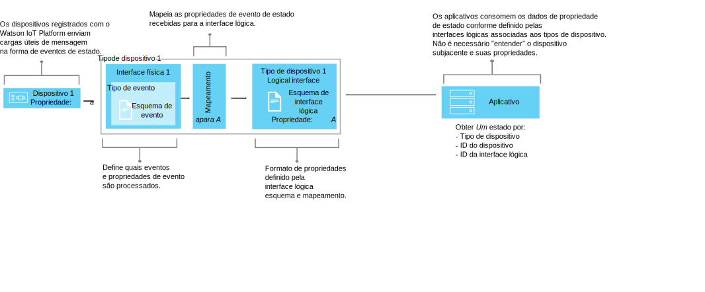

---

copyright:
  years: 2016, 2017
lastupdated: "2017-10-09"

---

{:new_window: target="\_blank"}
{:shortdesc: .shortdesc}
{:screen: .screen}
{:codeblock: .codeblock}
{:pre: .pre}


# Understanding data management
{: #definitions_resources}
Você poderá ter um número de dispositivos diferentes que deseja conectar ao {{site.data.keyword.iot_full}} e esses dispositivos poderão publicar dados em formatos diferentes. Usando o recurso de gerenciamento de dados, é possível normalizar e transformar a saída de dados de seus dispositivos em uma visualização lógica única que pode ser facilmente consumida por seus aplicativos. Usando uma única visualização lógica, você elimina a necessidade de codificar seus aplicativos para entender os diferentes formatos de dados que são exibidos por cada dispositivo.
{: shortdesc}

## Visão geral

Use o recurso de gerenciamento de dados para criar abstrações compartilhadas de dispositivos (gêmeos), para melhorar a reutilização e a manutenção e par gerenciar as complexidades de um ecossistema IoT enquanto mantém o aplicativo isolado de mudança de dados. 

Os aplicativos podem acessar o estado atual de um dispositivo na solicitação usando uma API HTTP ou assinando uma sequência de tópicos. O estado consiste em um conjunto de propriedades de estado que são definidas por uma interface lógica. Se o estado de um dispositivo mudar como resultado de um evento sendo publicadas no {{site.data.keyword.iot_short_notm}}, os valores dessas propriedades serão atualizados e armazenados no {{site.data.keyword.iot_short_notm}}.

Usando o recurso de gerenciamento de dados, você pode obter os benefícios a seguir:
- Mapear propriedades de estado dados da mensagem do evento
- Definir a estrutura de dados que você preferir
- Definir mais de uma representação ou visualização do estado do dispositivo
- Assine estados de dispositivo ou consultá-los a qualquer momento por meio de uma API HTTP

Alguns casos de uso comuns para implementar o recurso de gerenciamento de dados incluem:
- Fornecer aos seus desenvolvedores de aplicativos interfaces consistentes para acessar dados de dispositivo orientados a evento de uma maneira do tipo REST
- Normalizar dados de dispositivos de diferentes marcas ou modelos que publicam dados em formatos diferentes
- Modificar e converter formatos de dados de acordo com seu modelo de aplicativo

## Exemplo: mapeando os sensores de temperatura heterogênea para uma interface lógica
{: #device-type-example}
Para começar a usar o recurso de gerenciamento de dados, você precisa definir vários recursos que são descritos nas seções a seguir. 

O exemplo a seguir mostra como esses recursos podem se ajustar para permitir que os aplicativos acessem dados de estado de temperatura homogêneos em um só formato, independentemente do formato de carga útil da mensagem do evento de dispositivo. TemperatureSensor1 publica uma leitura de temperatura Celsius de `{ "t" : 34.5 }` para o {{site.data.keyword.iot_short_notm}}. TemperatureSensor2 publica uma leitura de temperatura Fahrenheit de `{ "temp" : 72.55 }`. Cada sensor de temperatura está associado a seu próprio [tipo de dispositivo](../reference/device_model.html#id_and_device_types). As leituras de temperatura são publicadas como eventos separados.

Use o recurso de gerenciamento de dados do {{site.data.keyword.iot_short_notm}} para ajudar a configurar essa solução, normalizando e transformando seu dispositivo de dados. 


Como parte do fluxo de dados, você pode executar cálculos em dados recebidos para normalizar essas leituras de uma forma consistente para processamento. Isso significa que não é necessário gravar seu aplicativo para entender ou converter escalas de temperatura diferentes. O aplicativo recebe um estado único e normalizado e usa a propriedade de estado **temperature** em vez das propriedades **t** e **temp** específicas do dispositivo.

 Para configurar essa solução, você precisa definir as informações a seguir:

-	A estrutura do evento de temperatura de entrada, "t" e "temp", de cada tipo de dispositivo.  
-	A propriedade, "temperatura", que você deseja registrar. A propriedade "temperatura" define a estrutura lógica do estado do dispositivo que pode ser consumida por seus aplicativos.
-	Como você deseja mapear as propriedades "t" e "temp" do evento de entrada para a propriedade "temperature".

É possível definir as informações necessárias para configurar os seguintes recursos que existem no {{site.data.keyword.iot_short_notm}}:

-	Interface física, tipo de evento e recurso de esquema de evento, que definem a estrutura dos eventos de entrada "t" e "temp".
-	Interface lógica e recurso de esquema lógico, que definem a estrutura lógica do estado do dispositivo "temperatura" que você deseja gerar.
-	Um recurso de mapeamentos que define como você deseja mapear as propriedades "t" e "temp" para a propriedade "temperatura".

Para um cenário de ponta a ponta detalhado que descreva este exemplo, consulte o [Guia passo a passo: um exemplo detalhado sobre como trabalhar com dispositivos por meio de uma interface comum](ga_im_index_scenario.html).

Informações mais detalhadas sobre esses recursos são fornecidas na seção "Definindo seus recursos".


## Definindo seus recursos
{: #definitions_resources}

O diagrama a seguir ilustra o mapeamento lógico entre dispositivos e aplicativos no {{site.data.keyword.iot_short_notm}} ao usar o recurso de gerenciamento de dados.



### Conceitos
{: #concepts}
A tabela a seguir descreve o conceito de eventos, propriedades e estado, que são referidos no diagrama anterior.

Conceitos                        | Descrição       
------------- | ------------- | -------------  
Event | Eventos são o mecanismo pelo qual os dispositivos publicam dados no {{site.data.keyword.iot_short_notm}}. O dispositivo controla o conteúdo do evento e designa um nome para cada evento que ele envia.
Propriedade | Os dados transportam parte de uma carga útil do evento de dispositivo.
Status | A última representação do estado do dispositivo físico, que pode incluir todas as propriedades que foram mapeadas através de vários eventos de entrada.

### Recursos de gerenciamento de dados
{: #resources}

Você pode gerenciar recursos usando APIs de REST. Para obter informações sobre as APIs de REST, consulte a documentação da [API de REST HTTP do {{site.data.keyword.iot_short_notm}}](https://docs.internetofthings.ibmcloud.com/apis/swagger/v0002/state-mgmt.html) documentação.

Recursos de tipo                        | Descrição       
------------- | ------------- | -------------  
Tipo de evento                         | Use o recurso de tipo de evento para modelar um evento que é publicado por um dispositivo. Um tipo de evento deve referenciar um recurso de esquema de evento. O recurso de esquema define a estrutura do evento que é publicado. </br>**Importante:** eventos de entrada que são usados em uma interface lógica devem estar no formato JSON.   
Tipo de dispositivo                         |  Use o recurso de tipo de dispositivo para agrupar dispositivos que compartilham características ou comportamentos. Em gerenciamento de dados, o tipo de dispositivo é estendido para incluir uma interface física para um dispositivo e uma ou mais interfaces lógicas que são usadas para recuperar o estado do dispositivo. </br>Para obter mais informações, consulte "Identificadores e tipos de dispositivo" no tópico [Modelo do dispositivo](../reference/device_model.html#id_and_device_types).
Recursos do esquema                         |  Use recursos de esquema para definir a estrutura de um estado de evento ou dispositivo. Os [Esquemas JSON ](http://json-schema.org/){:new_window} são usados: <ul><li>Um esquema que está associado a um tipo de evento. Esse esquema é usado para definir a estrutura do evento que é publicado no {{site.data.keyword.iot_short_notm}} por um dispositivo. Esses esquemas são referidos como esquemas de eventos. <li>Um esquema que está associado com uma interface lógica. Esse esquema é usado para definir a estrutura do estado do dispositivo que é armazenado no {{site.data.keyword.iot_short_notm}}. Esses esquemas são referidos como esquemas de interface lógica</ul>.  

Recursos da Interface                        | Descrição       
------------- | ------------- | -------------  
Interface lógica | Uma construção programática à qual seus aplicativos podem se conectar ou assinar para ver o estado de um dispositivo. Uma interface lógica é usada para definir a visualização normalizada do estado do dispositivo no {{site.data.keyword.iot_short_notm}}. Uma interface lógica deve ser associada a um esquema de interface lógica. O estado é atualizado em resposta a eventos de dispositivo de entrada. 
Interface física                         | Uma interface física é usada para modelar a interface entre um dispositivo físico e o {{site.data.keyword.iot_short_notm}}. Os tipos de eventos podem ser associados a interface física.  

Recursos da instância                        | Descrição       
------------- | ------------- | -------------  
Dispositivo                         | Um dispositivo representa um ativo, um sistema ou um componente que está registrado no {{site.data.keyword.iot_short_notm}} e envia dados do IoT na forma de eventos.  

Recursos de suporte                        | Descrição       
------------- | ------------- | -------------  
Mapeamentos                         | Use mapeamentos para definir como as propriedades que estão associadas a eventos de entrada são mapeadas para propriedades que estão definidas em uma interface lógica. </br>**Importante:** Pelo menos uma interface lógica deve estar associada a um tipo de dispositivo para que quaisquer mapeamentos possam ser definidos.


## Restrições de nomenclatura para recursos
{: #naming_restrictions}
Os esquemas, tipos de eventos e interfaces lógicas e físicas têm as seguintes restrições de nomenclatura:
- O nome deve ter entre 1 e 128 caracteres 
- O nome deve consistir em caracteres unicode 
- Os caracteres especiais válidos são espaço, hífen (-), sublinhado (_), ponto (. )
- O nome não pode consistir apenas em espaços

## Criando, atualizando, ativando e desativando seus recursos
{: #draft_active_resources}

Pode haver duas versões de um recurso; uma versão de rascunho e uma versão ativa. Ao criar um recurso, ele é criado como versão de rascunho.
{: shortdesc}

A versão de rascunho é uma cópia funcional de seu recurso que é possível consultar, atualizar e excluir diretamente usando APIs. Crie uma versão ativa de um recurso de rascunho ativando um tipo de dispositivo de rascunho ou uma interface lógica de rascunho. É possível ativar apenas um tipo de dispositivo de rascunho ou um recurso de interface lógica de rascunho. Para ativar outros recursos, por exemplo, esquemas, deve-se ativar um tipo de dispositivo de rascunho ou uma interface lógica de rascunho que faça referência ao recurso que você deseja ativar.

Para diferenciar entre recursos de rascunho e ativos ao usar as APIs de REST, o prefixo *draft/* é usado para identificar recursos que estão em um estado de rascunho.

O exemplo a seguir recupera metadados para uma definição de esquema de rascunho usando um ID especificado:

```
GET /api/v0002/draft/schemas/{schemaId}
```
O exemplo a seguir recupera metadados para uma definição de esquema ativo usando um ID especificado:
```
GET /api/v0002/schemas/{schemaId}
```
*Nota:* O identificador é o mesmo para a versão de rascunho e ativa de um determinado recurso.


- Ativando um recurso
{: #activate_resources}  

Use a operação **ativar-configuração** para validar e ativar a configuração associada a um tipo de dispositivo. Esta configuração inclui seus esquemas de rascunho, tipos de eventos, interfaces físicas, interfaces lógicas e mapeamentos. A operação **ativar-configuração** deve ser executada na versão de rascunho de uma interface lógica ou tipo de dispositivo.

O exemplo a seguir mostra uma solicitação de PATCH em que uma operação **ativar-configuração** é executada em uma versão de rascunho de um tipo de dispositivo:
```
PATCH /api/v0002/draft/device/types/TemperatureSensor
```
em que a carga útil do corpo PATCH possui o conteúdo a seguir:
```
  {
    "operation" : "activate-configuration"
  }
```
- Listar as diferenças
{: #list_differences}  

Use a operação **listar-diferenças** para retornar uma lista de quaisquer diferenças entre a configuração ativa e de rascunho para um recurso de interface lógica ou tipo de dispositivo. A operação **listar-diferenças** deve ser executada na versão de rascunho de uma interface lógica ou tipo de dispositivo. O exemplo a seguir mostra uma solicitação de PATCH em que uma operação **listar-diferenças** é executada em uma versão de rascunho de um tipo de dispositivo:
```
PATCH /api/v0002/draft/device/types/TemperatureSensor
```
em que a carga útil do corpo PATCH possui o conteúdo a seguir:
```
  {
    "operation": "list-differences"
  }
```


- Desativando um recurso  
{: #deactivate_resources}  

Use a operação **desativar-configuração** para remover a configuração ativa que está associada a um recurso. A operação desativar-configuração pode ser executada apenas na versão ativa de uma interface lógica e tipo de dispositivo. O exemplo a seguir mostra uma solicitação de PATCH em que uma operação **desativar-configuração** é executada em uma versão ativa de um tipo de dispositivo:
```
PATCH /api/v0002/device/types/TemperatureSensor
```
em que a carga útil do corpo PATCH possui o conteúdo a seguir:
```
  {
    "operation": "deactivate-configuration"
  }
```
*Notas:*
- Um recurso ativo é somente leitura. É possível filtrar e classificar recursos de rascunho e ativos usando parâmetros de consulta.
- Não será possível excluir um tipo de dispositivo se houver instâncias de dispositivo associadas a esse tipo de dispositivo. O estado do dispositivo é limpo quando a instância de dispositivo é excluída. 
- É possível ativar somente interfaces lógicas e tipos de dispositivo diretamente usando APIs. Outros recursos, por exemplo, esquemas, interfaces físicas e tipos de eventos serão ativados se forem referenciados por uma interface lógica ou um tipo de dispositivo que foi ativado.  
- Q operação **ativar-configuração** deve ser executada na versão de rascunho de uma interface lógica que está associada a um tipo de dispositivo ou no próprio tipo de dispositivo. A operação **ativar-configuração** verifica se a configuração de recursos é válida antes de ativar o recurso. Quando a ativação for concluída com êxito, o estado será gerado para cada instância de dispositivo do tipo de dispositivo.

## Resolução de problemas da sua configuração
{: #troubleshooting}
Se sua ativação falhar, verifique se todas as configurações necessárias para um determinado tipo de dispositivo foram fornecidas. A seguinte configuração deve ser fornecida e associada a um tipo de dispositivo:
  - Uma interface física que está associada a pelo menos um evento
  - Pelo menos uma interface lógica
  - Mapeamentos para pelo menos uma das interfaces lógicas associadas

Você também pode executar uma operação **validar-configuração** em uma versão de rascunho do recurso de tipo de dispositivo ou interface lógica para assegurar que os metadados associados sejam válidos. Se os metadados forem inválidos, uma lista de problemas será retornada no corpo da resposta.  

O exemplo a seguir mostra uma solicitação de PATCH em que uma operação **validar-configuração** é executada em uma versão de rascunho de um tipo de dispositivo chamado "TemperatureSensor":  
```
PATCH /api/v0002/draft/device/types/TemperatureSensor
```
em que a carga útil do corpo PATCH possui o conteúdo a seguir:
```
  {
    "operation": "validate-configuration"
  }
```  
O exemplo a seguir mostra uma resposta malsucedida à solicitação de PATCH:  
```
{
"message": "CUDIM0303I: A configuração de atualização de estado para o tipo de dispositivo 'TemperatureSensor' não é válida.",
"details": {
  "id": "CUDIM0303I",
  "properties": [
    "Device Type",
    "TemperatureSensor"
  ]
},
"failures": [
  {
    "message": "CUDVS0301E: The device type 'TemperatureSensor' does not have any mappings defined for it",
    "details": {
      "id": "CUDVS0301E",
      "properties": [
        "TemperatureSensor"
      ]
    }
  }
]
}
```  
O exemplo a seguir mostra uma resposta bem-sucedida à solicitação de PATCH:  
```  
{
"message": "CUDIM0303I: State update configuration for Device Type 'TemperatureSensor' is valid.",
"details": {
  "id": "CUDIM0303I",
  "properties": [
    "Device Type",
    "TemperatureSensor"
  ]
},
"failures": []
}
```  
Se todos os recursos necessários estiverem associados a um tipo de dispositivo, verifique se os mapeamentos de propriedade são válidos. Os exemplos a seguir mostram possíveis erros que podem ocorrer:

  - Uma expressão referencia uma propriedade em um evento que não está definido pelo esquema de evento
  - Uma expressão referencia uma propriedade no estado que não está definida pelo esquema de interface lógica
  - Um mapeamento é definido para uma propriedade que não está definida pelo esquema de interface lógica


Você pode consultar o log de erro a seguir para ajudar a diagnosticar erros de tempo de execução:
```
iot-2/type/${typeId}/id/${devieId}/err/data
```
### Limites de recursos

A tabela a seguir mostra o número máximo de recursos que podem ser configurados com base no tipo de plano. 

Recurso                   |Plano padrão                  | Plano Lite 
------------- | ------------- | ------------- 
Interfaces lógicas | 1000 | 10
Interfaces físicas           | 1000 | 5
Tipos de eventos | 1000 | 10
Esquemas |2.000 | 20
Referências de interface lógica (número de interfaces lógicas para o qual um tipo de dispositivo pode ser mapeado)  |20 | 5
Referências do tipo de evento (número de ID de evento para associações de tipo de evento que uma interface física pode ter)| 40 | 10
