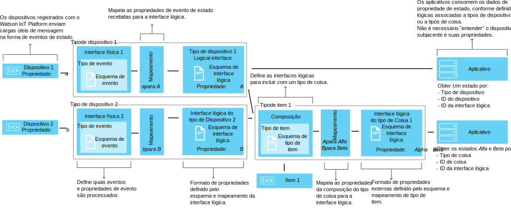

---

copyright:
years: 2016, 2018
lastupdated: "2018-03-22"

---

{:new_window: target="\_blank"}
{:shortdesc: .shortdesc}
{:screen: .screen}
{:codeblock: .codeblock}
{:pre: .pre}

# Understanding data management
{: #definitions_resources}
Você pode ter vários dispositivos diferentes ou Coisas que deseja conectar ao {{site.data.keyword.iot_full}}, e esses dispositivos ou Coisas podem publicar dados em formatos diferentes. Usando os recursos dispositivo gêmeo e ativo gêmeo do componente de gerenciamento de dados, é possível normalizar e transformar a saída de dados de seus dispositivos e de Coisas em uma única visualização lógica que pode ser facilmente consumida por seus aplicativos. Usando uma única visualização lógica, não é necessário configurar seus aplicativos para entender os diferentes formatos de dados que são emitidos por dispositivo ou Coisa. É possível, então, agregar múltiplos dispositivos ou Coisas juntos para definir uma nova Coisa no {{site.data.keyword.iot_short_notm}}. Use a Coisa para ajudá-lo a organizar e analisar dados que estão chegando ao {{site.data.keyword.iot_short_notm}} de um intervalo de entradas. 

{: shortdesc}

## Visão geral
{: #overview}

Use o recurso dispositivo gêmeo para criar um modelo lógico de um dispositivo e, em seguida, use o recurso ativo gêmeo para agregar esses modelos lógicos para definir novas Coisas. Esses modelos lógicos ajudam a melhorar a reutilização e a manutenção do código e a gerenciar as complexidades de um ecossistema IoT, mantendo seus aplicativos isolados da mudança de dados. 

Os aplicativos podem acessar o estado atual de um dispositivo ou Coisa na solicitação usando uma API HTTP ou assinando uma sequência de tópicos do IoT. O estado consiste em um conjunto de propriedades de estado que são definidas por uma interface lógica. Se o estado de um dispositivo ou Coisa for mudado como resultado de um evento que está sendo publicado no {{site.data.keyword.iot_short_notm}}, os valores dessas propriedades serão atualizados e armazenados no {{site.data.keyword.iot_short_notm}}.

Usando os recursos gêmeos de dispositivo e ativo, é possível obter os benefícios a seguir:
- Mapear propriedades de estado para dados da mensagem do evento.
- Agregar múltiplos dispositivos ou Coisas juntos para definir novas Coisas.
- Definir a estrutura de dados que você preferir.
- Definir mais de uma representação ou visualização do estado do dispositivo ou da Coisa.
- Assinar os estados do dispositivo ou da Coisa ou consultá-los a qualquer momento por meio de uma API HTTP.

Alguns casos de uso comum para implementar os recursos gêmeos de dispositivo e ativo incluem:
- Fornecer aos desenvolvedores de aplicativos as interfaces consistentes para acessar dados do dispositivo acionados por eventos de uma maneira semelhante ao REST.
- Normalizar dados de dispositivos de diferentes tipos ou modelos que publicam dados em formatos diferentes.
- Modificar e converter formatos de dados de acordo com seu modelo de aplicativo.
- Formatar big data de um intervalo de dispositivos ou Coisas para que os dados possam ser analisados e apresentados da forma mais eficaz para ajudar a prever falhas, planejar manutenção, rastrear ativos e melhorar a eficiência operacional.

## Exemplos
{: #examples}
Os exemplos a seguir ilustram duas soluções possíveis. O Exemplo 1 ilustra como é possível usar o recurso dispositivo gêmeo e o Exemplo 2 ilustra como é possível usar o recurso ativo gêmeo. 

### Exemplo 1: mapeando sensores de temperatura heterogêneos para uma interface lógica
{: #device-type-example}
Neste exemplo, criamos uma interface lógica que fornece dados homogêneos do estado de temperatura em um formato, não importa em qual formato de carga útil da mensagem do evento de dispositivo real eles estiverem. O dispositivo *tSensor* publica uma leitura de temperatura Celsius de `{ "t" : 34.5 }` para o {{site.data.keyword.iot_short_notm}}. O dispositivo *tempSensor* publica uma leitura de temperatura Fahrenheit de `{ "temp" : 72.55 }`. As leituras de temperatura são publicadas como eventos separados.

Para obter um cenário detalhado de ponta a ponta que descreve esse exemplo, veja [Guia passo a passo 1](ga_im_index_scenario.html).


Como parte do fluxo de dados da interface lógica, é possível executar cálculos em dados recebidos para normalizar essas leituras em um formato consistente para processamento. Isso significa que não é necessário gravar seu aplicativo para entender ou converter escalas de temperatura diferentes. O aplicativo recebe um estado único e normalizado e usa a propriedade de estado **temperature** em vez das propriedades **t** e **temp** específicas do dispositivo.

### Exemplo 2: mapeando múltiplos dispositivos de clima para uma interface lógica do tipo Coisa
{: #thing-type-example}  
Neste exemplo, expandiremos o exemplo de tipo de dispositivo incluindo um conjunto de sensores de umidade na forma de dispositivos de higrômetro separados. Usando uma interface lógica do tipo Coisa, podemos mesclar facilmente os dados de tipos de dispositivos separados em uma interface lógica que representa todos os dispositivos e sensores em uma sala. Um aplicativo pode agora obter os dados climáticos coletados para uma sala conectando-se à interface lógica associada ao tipo de Coisa "RoomType". O diagrama a seguir mostra a configuração para a Sala de Reunião 1.

Para obter um cenário detalhado de ponta a ponta que descreve esse exemplo, veja [Guia passo a passo 2](../information_management/im_index_scenario_thing.html).


Um dispositivo de temperatura chamado *tSensor* e um dispositivo de umidade chamado *humiditySensor1* publicam dados de ambiente que são coletados na sala *Meeting Room 1*. Os dados do sensor de temperatura e de umidade são mapeados separadamente para duas interfaces lógicas de tipo de dispositivo; uma para o tipo de dispositivo de termômetro e uma para o tipo de dispositivo de higrômetro. Agora, criamos um tipo de Coisa chamado *RoomType* e instanciamos uma instância de Coisa de sala que é chamada *Meeting Room 1*.

Em uma segunda sala de reunião, um dispositivo de temperatura chamado *tempSensor* e um dispositivo de umidade chamado *humiditySensor2* publicam dados de ambiente que são coletados na sala *Meeting Room 2*. Outra instância de Coisa de espaço, chamada *Meeting Room 2*, é criada com base no tipo de Coisa *RoomType*.

Agora, é possível configurar uma composição que inclui as interfaces lógicas de termômetro e de higrômetro e, em seguida, mapear os sensores ambientais corretos para cada uma das instâncias de sala, por exemplo, *tSensor* e *humiditySensor1* mapeados para *Meeting Room 1* e *tempSensor* e *humiditySensor2* mapeados para *Meeting Room 2*.

O aplicativo de usuário final pode agora solicitar o estado de um ID de Coisa de sala específico e obter os estados de temperatura e umidade da sala sem ter que saber sobre a infraestrutura do dispositivo subjacente.

## Definições e recursos
{: #resources}

Os diagramas a seguir ilustram o mapeamento lógico entre dispositivos e aplicativos no {{site.data.keyword.iot_short_notm}} ao usar interfaces lógicas.



### Conceitos

Conceitos                        | Descrição       
------------- | ------------- | -------------  
Event | Eventos são o mecanismo pelo qual os dispositivos publicam dados no {{site.data.keyword.iot_short_notm}}. O dispositivo controla o conteúdo do evento e designa um nome para cada evento que ele envia.
Propriedade | Os dados transportam parte de uma carga útil do evento de dispositivo.
Status | A última representação do estado do dispositivo físico, que pode incluir todas as propriedades que foram mapeadas através de vários eventos de entrada.
Composição                         | Uma construção lógica que define as interfaces lógicas que estão associadas a um tipo de Coisa. A composição é especificada por um esquema de tipo de Coisa.   

### Recursos de gerenciamento de dados
É possível gerenciar os recursos usando APIs de REST. Para obter informações sobre as APIs de REST, consulte a documentação da [API de REST HTTP do {{site.data.keyword.iot_short_notm}}](https://docs.internetofthings.ibmcloud.com/apis/swagger/v0002/state-mgmt.html) documentação. 

Recursos de tipo                        | Descrição       
------------- | ------------- | -------------  
Tipo de evento                         | Use o recurso de tipo de evento para modelar um evento que é publicado por um dispositivo. Um tipo de evento deve referenciar um recurso de esquema de evento. O recurso de esquema define a estrutura do evento que é publicado. </br>**Importante:** eventos de entrada que são usados em uma interface lógica devem estar no formato JSON.    
Tipo de dispositivo                         |  Use o recurso de tipo de dispositivo para agrupar dispositivos que compartilham características ou comportamentos. Em gerenciamento de dados, o tipo de dispositivo é estendido para incluir uma interface física para um dispositivo e uma ou mais interfaces lógicas que são usadas para recuperar o estado do dispositivo. </br>Para obter mais informações, consulte "Identificadores e tipos de dispositivo" no tópico [Modelo do dispositivo](../reference/device_model.html#id_and_device_types).
Tipo de item                         | Uma construção programática que representa uma coleção de um ou mais tipos de dispositivo separados, tipos de Coisa ou ambos. </br>**Importante:** o Beta suporta dez níveis de aninhamento para uma interface lógica de tipo de Coisa.
Recursos do esquema                         |  Use os recursos de esquema para definir a estrutura de um estado de evento, dispositivo ou Coisa. Os [Esquemas JSON ](http://json-schema.org/){:new_window} são usados: <ul><li>Um esquema que está associado a um tipo de evento. Esse esquema é usado para definir a estrutura do evento que é publicado no {{site.data.keyword.iot_short_notm}} por um dispositivo. Esses esquemas são referidos como esquemas de eventos. <li>Um esquema que está associado com uma interface lógica. Esse esquema é usado para definir a estrutura do estado de dispositivo ou Coisa que está armazenado no {{site.data.keyword.iot_short_notm}}. Esses esquemas são referidos como esquemas de interface lógica</ul>.</ul>

Recursos da Interface                        | Descrição       
------------- | ------------- | -------------  
Interface lógica | Uma construção programática à qual seus aplicativos podem se conectar ou assinar para ver o estado de um dispositivo. Uma interface lógica é usada para definir a visualização normalizada do estado do dispositivo no {{site.data.keyword.iot_short_notm}}. Uma interface lógica deve ser associada a um esquema de interface lógica. O estado é atualizado em resposta a eventos de dispositivo de entrada. **Nota:** é possível, opcionalmente, especificar um nome de alias significativo para sua interface lógica. O alias pode ser referenciado na chamada API ou na assinatura da sequência de tópicos usada para recuperar o estado de um dispositivo, em vez de usar o identificador de interface lógica gerado automaticamente.  
Interface física                         | Uma interface física é usada para modelar a interface entre um dispositivo físico e o {{site.data.keyword.iot_short_notm}}. Os tipos de eventos podem ser associados a interface física.  

Recursos da instância                        | Descrição       
------------- | ------------- | -------------  
Dispositivo                         | Um dispositivo representa um ativo, um sistema ou um componente que está registrado no {{site.data.keyword.iot_short_notm}} e envia dados do IoT na forma de eventos.  
Coisa                         | Uma construção programática que representa logicamente uma instância exclusiva de um tipo de Coisa. Uma instância de Coisa serve o mesmo propósito de um dispositivo registrado de um tipo de dispositivo.


Recursos de suporte                        | Descrição       
------------- | -------------   
Mapeamentos       |Use mapeamentos para definir como as propriedades que estão associadas a eventos de entrada são mapeadas para propriedades que estão definidas em uma interface lógica. </br>**Importante:** pelo menos uma interface lógica deve ser associada a um tipo de dispositivo ou Coisa antes que qualquer mapeamento possa ser definido.

## Restrições de nomenclatura para recursos
{: #naming_restrictions}
Esquemas, tipos de eventos, interfaces lógicas e físicas têm as restrições de nomenclatura a seguir:
- O nome deve ter entre 1 e 128 caracteres 
- O nome deve consistir em caracteres unicode 
- Os caracteres especiais válidos são espaço, hífen (-), sublinhado (_), ponto (. )
- O nome não pode consistir apenas em espaços

## Criando, atualizando, ativando e desativando seus recursos
{: #draft_active_resources}

Pode haver duas versões de um recurso; uma versão de rascunho e uma versão ativa. Ao criar um recurso, ele é criado como versão de rascunho. 
{: shortdesc}

A versão de rascunho é uma cópia funcional de seu recurso que é possível consultar, atualizar e excluir diretamente usando APIs. Crie uma versão ativa de um recurso de rascunho, ativando um tipo de dispositivo de rascunho, tipo de Coisa de rascunho ou interface lógica de rascunho. Para ativar outros recursos, por exemplo, esquemas, deve-se ativar um tipo de dispositivo de rascunho, tipo de Coisa de rascunho ou interface lógica de rascunho que referencie o recurso que você deseja ativar.

Para diferenciar entre recursos de rascunho e ativos ao usar as APIs de REST, o prefixo *draft/* é usado para identificar recursos que estão em um estado de rascunho.

O exemplo a seguir recupera metadados para uma definição de esquema de rascunho usando um ID especificado:

```
GET /api/v0002/draft/schemas/{schemaId}
```
O exemplo a seguir recupera metadados para uma definição de esquema ativo usando um ID especificado:
```
GET /api/v0002/schemas/{schemaId}
```
*Nota:* O identificador é o mesmo para a versão de rascunho e ativa de um determinado recurso.


- Ativando um recurso
{: #activate_resources}  

Use a operação **activate-configuration** para validar e ativar a configuração que está associada a um tipo de dispositivo ou Coisa. Esta configuração inclui seus esquemas de rascunho, tipos de eventos, interfaces físicas, interfaces lógicas e mapeamentos. A operação **activate-configuration** deve ser executada na versão de rascunho de uma interface lógica, tipo de dispositivo ou tipo de Coisa.

O exemplo a seguir mostra uma solicitação de PATCH em que uma operação **ativar-configuração** é executada em uma versão de rascunho de um tipo de dispositivo:
```
PATCH /api/v0002/draft/device/types/TSensor
```
em que a carga útil do corpo PATCH possui o conteúdo a seguir:
```
  {
    "operation" : "activate-configuration"
  }   
```
Para ativar uma versão de rascunho de um tipo de Coisa, use o método PATCH a seguir:
```
PATCH /api/v0002/draft/thing/types/RoomType
```

- Listar as diferenças
{: #list_differences}  

Use a operação **list-differences** para retornar uma lista de quaisquer diferenças entre a configuração ativa e de rascunho para uma interface lógica, tipo de dispositivo ou recurso de tipo de Coisa. A operação **list-differences** deve ser executada na versão de rascunho de uma interface lógica, dispositivo ou tipo de Coisa. O exemplo a seguir mostra uma solicitação de PATCH em que uma operação **listar-diferenças** é executada em uma versão de rascunho de um tipo de dispositivo:
```
PATCH /api/v0002/draft/device/types/TSensor
```
em que a carga útil do corpo PATCH possui o conteúdo a seguir:
```
  {
    "operation": "list-differences"
  }
```
Para retornar uma lista de quaisquer diferenças entre a configuração ativa e de rascunho para um recurso de tipo de Coisa, use o método PATCH a seguir:
```
PATCH /api/v0002/draft/thing/types/meetingroom1
```

- Desativando um recurso  
{: #deactivate_resources}  

Use a operação **desativar-configuração** para remover a configuração ativa que está associada a um recurso. A operação deactivate-configuration pode ser executada somente na versão ativa de uma interface lógica, tipo de dispositivo ou tipo de Coisa. O exemplo a seguir mostra uma solicitação de PATCH em que uma operação **desativar-configuração** é executada em uma versão ativa de um tipo de dispositivo:
```
PATCH /api/v0002/device/types/TSensor
```
em que a carga útil do corpo PATCH possui o conteúdo a seguir:
```
  {
    "operation": "deactivate-configuration"
  }
```
Para desativar um tipo de Coisa, use o método PATCH a seguir:
```
PATCH /api/v0002/thing/types/RoomType
```

*Notas:*
- Um recurso ativo é somente leitura. É possível filtrar e classificar recursos de rascunho e ativos usando parâmetros de consulta.
- Não será possível excluir um tipo de dispositivo se houver instâncias de dispositivo associadas a esse tipo de dispositivo. O estado do dispositivo é limpo quando a instância de dispositivo é excluída. 
- Não será possível excluir um tipo de Coisa se houver instâncias de dispositivo ou de Coisa associadas a esse tipo de Coisa. O estado da Coisa é limpo quando as instâncias de dispositivo ou de coisa são excluídas. 
- É possível ativar somente interfaces lógicas, tipos de dispositivo e tipos de Coisa diretamente usando APIs. Outros recursos, por exemplo, esquemas, interfaces físicas, interfaces de tipo de Coisa e tipos de eventos, serão ativados se eles forem referenciados por uma interface lógica, tipo de dispositivo ou tipo de Coisa que se tornou ativo.  
- A operação **activate-configuration** deve ser executada em uma versão de rascunho de uma interface lógica que está associada a um tipo de dispositivo ou Coisa ou no próprio tipo de dispositivo ou Coisa. A operação **ativar-configuração** verifica se a configuração de recursos é válida antes de ativar o recurso. Quando a ativação é concluída com êxito, o estado é gerado para cada instância de dispositivo ou Coisa do tipo de dispositivo ou Coisa.

## Resolução de problemas da sua configuração
{: #troubleshooting}
Se a sua ativação falhar, verifique se todas as configurações necessárias para um determinado tipo de dispositivo ou Coisa foram fornecidas. 

A seguinte configuração deve ser fornecida e associada a um tipo de dispositivo:
  - Uma interface física que está associada a pelo menos um evento
  - Pelo menos uma interface lógica
  - Mapeamentos para pelo menos uma das interfaces lógicas associadas
  
A configuração a seguir deve ser fornecida e associada a um tipo de Coisa:
  - Uma interface de Coisa que está associada a pelo menos um tipo de dispositivo ou Coisa
  - Pelo menos uma interface lógica
  - Mapeamentos para pelo menos uma das interfaces lógicas associadas  

Também é possível executar uma operação **validate-configuration** em uma versão de rascunho do tipo de dispositivo, tipo de Coisa ou recurso de interface lógica para assegurar que os metadados associados sejam válidos. Se os metadados forem inválidos, uma lista de problemas será retornada no corpo da resposta.  

O exemplo a seguir mostra uma solicitação PATCH em que uma operação **validate-configuration** é executada em uma versão de rascunho de um tipo de dispositivo chamado "TSensor":  
```
PATCH /api/v0002/draft/device/types/TSensor
```
em que a carga útil do corpo PATCH possui o conteúdo a seguir:
```
  {
    "operation": "validate-configuration"
  }
```  
O exemplo a seguir mostra uma resposta malsucedida à solicitação de PATCH:  
```
{
"message": "CUDIM0303I: State update configuration for Device Type 'TSensor' is not valid.",
"details": {
  "id": "CUDIM0303I",
  "properties": [
    "Device Type",
    "Sensor"
  ]
},
"failures": [
  {
    "message": "CUDVS0301E: The device type 'TSensor' does not have any mappings defined for it",
    "details": {
      "id": "CUDVS0301E",
      "properties": [
        "TSensor"
      ]
    }
  }
]
}
```  
O exemplo a seguir mostra uma resposta bem-sucedida à solicitação de PATCH:  
```  
{
"message": "CUDIM0303I: State update configuration for Device Type 'TSensor' is valid.",
"details": {
  "id": "CUDIM0303I",
  "properties": [
    "Device Type",
    "TSensor"
  ]
},
"failures": []
}
```  
Se todos os recursos necessários estiverem associados ao tipo de dispositivo ou Coisa, verifique se os mapeamentos de propriedade são válidos. Os exemplos a seguir mostram possíveis erros que podem ocorrer:

  - Uma expressão referencia uma propriedade em um evento que não está definido pelo esquema de evento
  - Uma expressão referencia uma propriedade no estado que não está definida pelo esquema de interface lógica
  - Um mapeamento é definido para uma propriedade que não está definida pelo esquema de interface lógica


É possível consultar o log de erro a seguir para ajudá-lo a diagnosticar erros de tempo de execução para os tipos de dispositivo:
```
iot-2/type/ ${ /id/ ${ /err/data
```
É possível consultar o log de erro a seguir para ajudá-lo a diagnosticar erros de tempo de execução para os tipos de Coisa:
```
iot-2/type/ ${ /id/ ${ /err/data
```

### Limites de recursos

A tabela a seguir mostra o número máximo de recursos que podem ser configurados com base no tipo de plano. 

Recurso                   |Plano padrão                  | Plano Lite 
------------- | ------------- | ------------- 
Interfaces lógicas | 1000 | 10
Interfaces físicas           | 1000 | 5
Tipos de eventos | 1000 | 10
Esquemas |2.000 | 20
Referências de interface lógica (número de interfaces lógicas para o qual um tipo de dispositivo pode ser mapeado)  |20 | 5
Referências do tipo de evento (número de ID de evento para associações de tipo de evento que uma interface física pode ter)| 40 | 10


