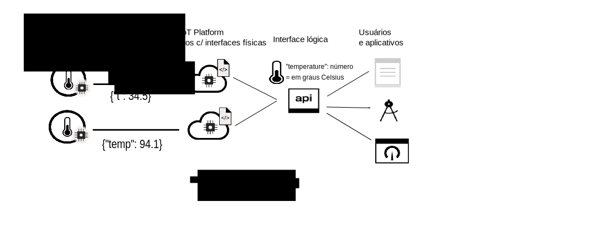

---

copyright:
years: 2017, 2018
lastupdated: "2018-08-28"

---

{:new_window: target="\_blank"}
{:shortdesc: .shortdesc}
{:screen: .screen}
{:codeblock: .codeblock}
{:pre: .pre}

# Introdução ao gerenciamento de dados
{: #device_twins}

<!--An unprecedented number of devices and sensors exist in the modern world. Connected devices generate vast amounts of digital data at extraordinary speeds. Such volumes of data represent great opportunities but also challenges, in terms of how big data can be processed, analyzed and presented to help to deliver insights and drive transformation.-->

Os dispositivos podem fornecer saída de dados semelhante, mas variam em marca, modelo e versão e podem emitir dados em formatos diferentes. Por exemplo, um dispositivo com um sensor de temperatura em um escritório pode relatar a temperatura em graus Fahrenheit ou em graus Celsius. Não é eficiente configurar aplicativos para serem capazes de consumir dados em todos esses formatos; em vez disso, os dados precisam ser coletados, transformados e normalizados para criar um único modelo lógico para que um aplicativo possa interagir com os diferentes dispositivos da mesma maneira. 

O componente de gerenciamento de dados do {{site.data.keyword.iot_short_notm}} inclui um recurso dispositivo gêmeo e um recurso ativo gêmeo. O recurso dispositivo gêmeo permite tirar proveito da coleta, transformação e normalização de diferentes formatos de dados do dispositivo em um único modelo lógico. O recurso ativo gêmeo permite agrupar diferentes dispositivos juntos para criar uma Coisa, que é uma estrutura de dados baseada em ativo com valor mais alto. É possível até agrupar Coisas juntas para criar novas Coisas. Um aplicativo pode interagir com o modelo lógico, independentemente do formato de dados que é usado pelos dispositivos ou Coisas individuais. 

Por exemplo, um grupo de dispositivos de relatório de temperatura, umidade e luz ambiente pode ser agregado em uma Coisa "Sala", para representar o nível de conforto dentro de um escritório específico. Várias Coisas "Sala" podem ser agregadas em uma Coisa "Piso" para representar todos os escritórios em um nível específico e várias Coisas "Piso" podem ser agregadas em uma Coisa "Prédio". Usando uma abstração de Coisa, seu aplicativo é desacoplado das especificações de como os dispositivos são conectados, o formato no qual os dispositivos publicam dados do evento e como os dados são combinados.
{: shortdesc}

## Gêmeos

Um dispositivo gêmeo é uma representação digital baseada em nuvem de um dispositivo físico que está conectado ao {{site.data.keyword.iot_short_notm}}. Um dispositivo gêmeo representa um modelo lógico dos eventos que são publicados por um dispositivo. Quando definido e instanciado, o dispositivo gêmeo fornece um meio consistente de interagir com um dispositivo em um modo REST, independentemente de se o dispositivo está on-line ou off-line. As propriedades de um dispositivo, incluindo informações sobre o estado atual do dispositivo (estado do dispositivo), podem ser recuperadas com uma solicitação de HTTP ou assinando um tópico IoT.

Dispositivos gêmeos podem ajudar a:
- Fornecer aos seus desenvolvedores de aplicativos interfaces consistentes para acessar dados de dispositivo orientados a evento em uma maneira do tipo REST.
- Acesse o estado de um dispositivo.
- Normalizar dados de dispositivos de diferentes marcas ou modelos que publiquem dados em formatos diferentes.
- Filtrar dados desnecessários.

Para criar um dispositivo gêmeo, é necessário definir os recursos a seguir no {{site.data.keyword.iot_short_notm}}:
- A estrutura dos eventos que são enviados por seu dispositivo.  
A estrutura de um evento de entrada é definida nos recursos de interface física, tipo de evento e esquema de evento. 
- As propriedades que você deseja registrar.  
Essas propriedades definem a estrutura lógica do estado do dispositivo que pode ser consumida por seus aplicativos. As propriedades são definidas nos recursos de interface lógica e esquema lógico.  
- O mapeamento de eventos de interface física para as propriedades de interface lógica.  
Use o recurso de mapeamentos para mapear eventos para as propriedades.

O diagrama a seguir mostra dois dispositivos de temperatura diferentes em locais separados. Um dispositivo relata dados do dispositivo em graus Celsius e os outros relatam dados em graus Fahrenheit. Os dados são enviados para o {{site.data.keyword.iot_short_notm}} nos formatos de temperatura "t" e "temp". O {{site.data.keyword.iot_short_notm}} transforma automaticamente os graus Fahrenheit em graus Celsius. Os formatos de temperatura "t" e "temp" são normalizados para o formato lógico "temperatura". O aplicativo pode consultar o estado de qualquer dispositivo acessando o valor para o parâmetro "temperatura". 

## Gêmeos gêmeos (coisas)

Os ativos gêmeos permitem que você leve o conceito de dispositivos gêmeos um passo adiante. Um ativo gêmeo permite a agregação de dispositivos em uma única entidade chamada de Coisa. Uma Coisa, ou ativo gêmeo, é um conceito semelhante ao dispositivo gêmeo, mas o ativo gêmeo representa um grupo de dispositivos como um único modelo lógico. É possível até agregar Coisas para formar níveis mais altos de abstração. Por exemplo, uma Coisa "Sala" pode agregar os dispositivos a seguir:

- Um dispositivo com sensor de temperatura (termômetro)
- Um dispositivo com um sensor de umidade (higrômetro)

Uma Coisa "Piso" pode agregar múltiplas Coisas "Sala". 

A estrutura de uma Cois é definida usando um Esquema JSON. O esquema referencia as interfaces lógicas dos dispositivos ou Coisas agregadas. As propriedades de uma Coisa, incluindo informações sobre o estado atual da Coisa, podem ser recuperadas usando uma solicitação de HTTP ou assinando um tópico do IoT.

Gêmeos de ativo podem ajudá-lo.
 
- Agregar múltiplos dispositivos gêmeos ou Coisas para definir novas Coisas.
- Acesse o estado de um Thing.
- Gerenciar ativos sem ser exposto à instrumentação individual deles.
- Filtrar dados desnecessários.
- Normalizar as interfaces de Coisa para desacoplar seus aplicativos das complexidades de como as Coisas específicas são construídas.

Para criar um ativo gêmeo, é necessário definir os recursos a seguir no {{site.data.keyword.iot_short_notm}}:

- A estrutura da Coisa.  
A estrutura da Coisa é definida pelo esquema de Coisa que especifica os dispositivos ou as Coisas agregadas.
- A estrutura do estado desejado de Coisa que é composta das propriedades que você deseja registrar.  
Essas propriedades definem a estrutura lógica do estado de Coisa que pode ser consumida por seus aplicativos. As propriedades são definidas nos recursos de interface lógica e esquema lógico.  
- Como a interface Coisa é mapeada para as propriedades de interface lógica.  
Use o recurso de mapeamentos para mapear eventos para as propriedades.

O diagrama a seguir mostra sensores de temperatura e umidade em dispositivos diferentes que estão publicando dados do evento de temperatura e umidade para o {{site.data.keyword.iot_short_notm}}. Dois dispositivos gêmeos, cada um representando um dispositivo físico, têm interfaces lógicas associadas e são criados no {{site.data.keyword.iot_short_notm}}. Os dados que são publicados por meio dos dispositivos de temperatura são mapeados para a interface lógica "IThermometer". Os dados que são publicados por meio do dispositivo de umidade são mapeados para a interface lógica "IHygrometer". As interfaces lógicas são agregadas em um tipo de Coisa *Room* com uma interface lógica "IRoom". A interface lógica "IRoom" define propriedades de temperatura e umidade e permite que você crie seu próprio modelo lógico, agregando dispositivos em uma única Coisa com o qual seu aplicativo pode interagir.  

**Importante:** o recurso Coisa do {{site.data.keyword.iot_short_notm}} está disponível somente como parte de um programa beta limitado. Atualizações futuras podem incluir mudanças incompatíveis com a versão atual desse recurso. Experimente e [informe-nos o que acha ](https://developer.ibm.com/answers/smart-spaces/17/internet-of-things.html){: new_window}.

Para obter mais informações sobre como definir e configurar informações e recursos chave, consulte [Entendendo o gerenciamento de dados](ga_im_definitions.html). 

## Próximas etapas

- Crie o seu próprio dispositivo gêmeo no {{site.data.keyword.iot_short_notm}}. Para obter mais informações, veja a documentação [Introdução ao Data Management usando a interface da web](im_ui_flow.html). 
- Crie um dispositivo gêmeo e um ativo gêmeo usando APIs de REST. Para obter mais informações, veja a documentação [Introdução ao gerenciamento de dados](../information_management/getting_started_things.html).  
- Criar regras que são acionadas quando os dados do evento que correspondem a uma condição especificada, ou um conjunto de condições, são recebidos pelo {{site.data.keyword.iot_short_notm}}. Para obter mais informações, veja a documentação beta [Regras integradas](../information_management/im_rules.html).

Para obter informações mais detalhadas sobre cada uma das etapas descritas na documentação *Introdução ao gerenciamento de dados*, veja os cenários de exemplo que estão documentados nos tópicos a seguir: 

- [Guia passo a passo 1: um exemplo detalhado sobre como trabalhar com dispositivos por meio de uma interface comum](ga_im_index_scenario.html#scenario) 
- [Guia passo a passo 2: um exemplo detalhado sobre como trabalhar com Coisas por meio de uma interface comum](../information_management/im_index_scenario_thing.html#scenario) 

